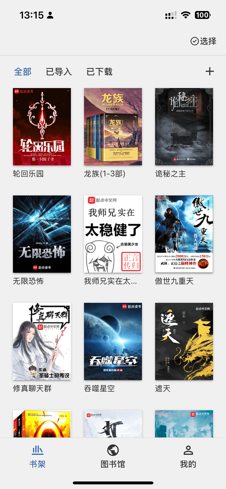
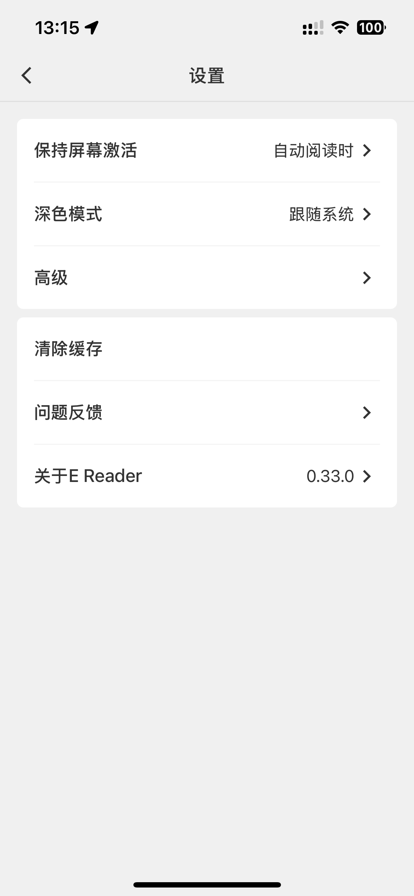
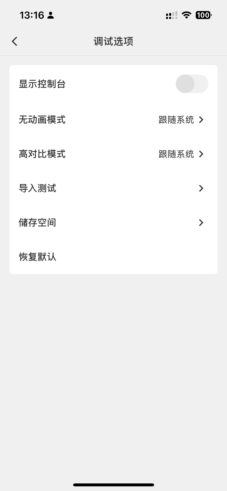
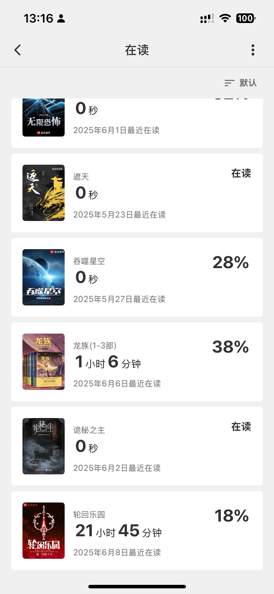

# 易读 E-reader

无须下载、无后台依赖、离线优先的电子书阅读器

[开始使用](https://qwertyyb.github.io/e-reader/)

## 截图









## 特点

1. 无须下载、无须登录、直接访问即可使用。
2. 离线优先，无需网络也可使用。
3. 支持本地导入 txt、epub、mobi 等电子书常用格式。
4. 支持多级目录、自动识别文件目录、手动调整目录识别方案。
5. 支持笔记、阅读进度、阅读时间记录。
6. 支持基于 OPDS 1.2 协议的图书馆。
7. 支持图片形式的分享书籍和笔记。
8. 支持黑暗模式。
9. 支持无动画模式、高对比度模式。(适用于水墨屏阅读器)。
10. 支持导出笔记。
11. 支持竖向滚动翻页、水平滑动翻页。
12. 支持自动翻页及屏幕常亮。
13. 支持多种字体、行首缩进、字体大小调整、行矩调整、字重调整
14. 支持自动朗读。
15. 支持自定义书架。

## 技术亮点

- 基于 vue3 构建
- 基于 PWA 技术实现离线优先
- 基于 Indexeddb 实现书籍、书籍目录、阅读进度、笔记、阅读时间等数据存储
- 使用 Screen Wake Lock API 实现屏幕常亮
- 使用 [Web Share API](https://developer.mozilla.org/en-US/docs/Web/API/Navigator/share) 实现分享
- 自行实现 router-view，实现类似 native 的路由跳转
- 使用 foliate-js 实现 Mobi 等格式的电子书解析

## 开发方式

```sh
pnpm install
```

### Compile and Hot-Reload for Development

```sh
pnpm dev
```

### Type-Check, Compile and Minify for Production

```sh
pnpm build
```

### Lint with [ESLint](https://eslint.org/)

```sh
pnpm lint
```