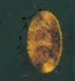
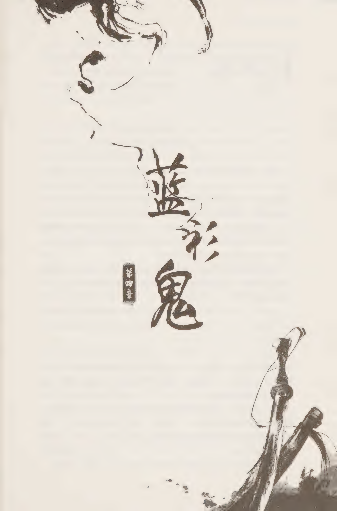
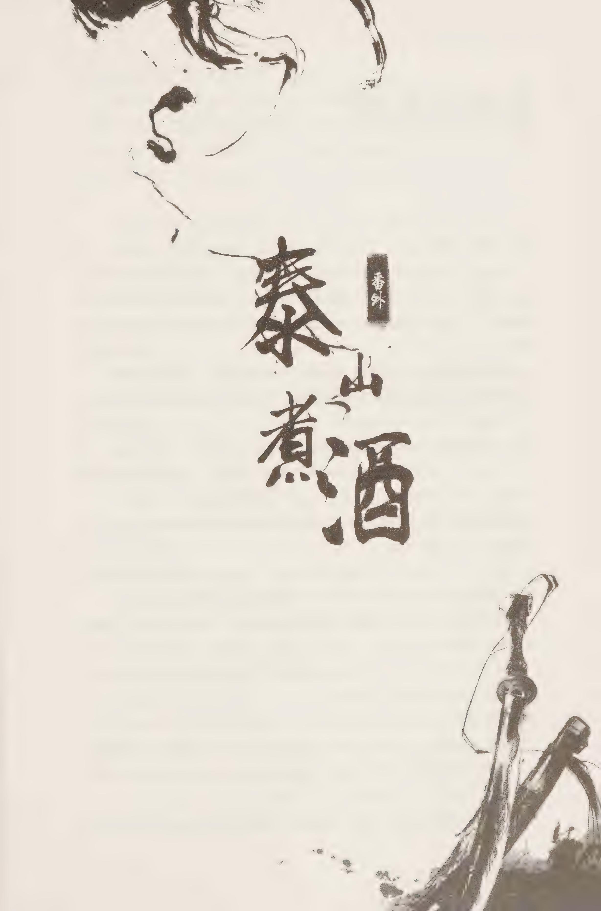
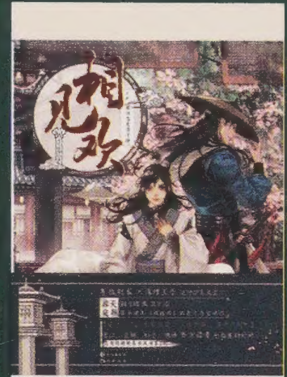
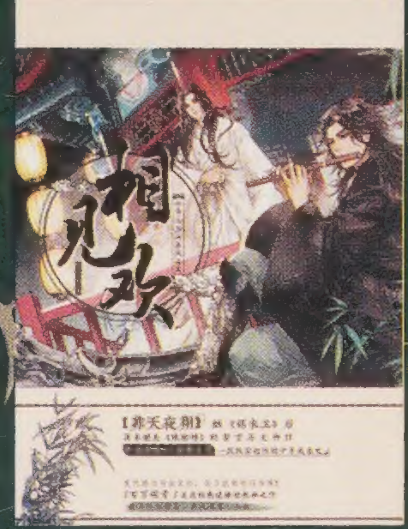
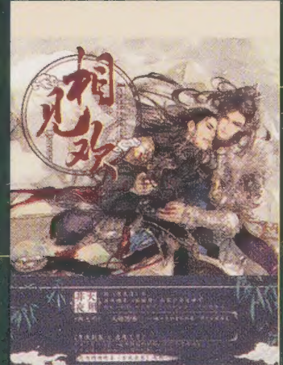
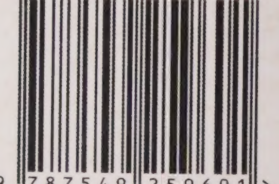

# 卷壹

那些游走在黑白之间的人，其足迹最终都会被冰雪掩盖。

既不是赫于人前，亦不留名于身后，谓之「踏雪者」。

Ta Xue Zhe

### 作者简介

君天，中国作家协会会员，

上海作协签约作家。出生于上海

黄浦江畔。用历史审视过去，用

科幻展望未来。主要作品有《纵横》

《三国兵器谱》《异现场调查科》

《岳家军》《踏雪者》等。

漫娱图书 SINCE BOOKS

名 家 经 典 书 系君天◎著卷壹长江出版社

### 踏雪者

这世上不是只有黑与白，还有灰色。那些游走在灰色地带的人，整日在风雪狂澜中奔走，然无论其去过哪里，做过什么，最终都会被冰雪掩盖。既不显赫于人前，亦不留名于身后，谓之踏雪者。

## 斜睨众生

### 一

“当啷”一声，茶壶掉在地上摔得四分五裂。杜郁非睡眼惺忪地抬头看了看四周，雅座外的茶馆没几个人，他抹了把额头的冷汗，把杯里的凉茶喝了。

有跑堂的进来给他收拾，杜郁非也不多说，丢了块碎银子在桌上，摇摇晃晃地走出茶馆。柜台里的掌柜连忙对他道：“您走好。”

茶馆边有个矮小的老乞丐，懒散地靠墙斜卧着。杜郁非随手丢给他几枚大钱，乞丐抓起铜板然后继续睡觉。

走过街边的商铺，熟悉的商家不断跟杜郁非打着招呼，准备收摊的店家适时递上小物件作为“孝敬”，主事大人的叫声络绎不绝。

杜郁非算是个俊朗的汉子，可能是笑得较多的关系，三十不到眼角就有了笑纹。

作为福建名捕杜佑程的养子，他十四岁入公门，因长于办案，二十岁就升为泉州一等捕头。后在一次抓捕中，拿下了逃逸到此、意图亡命出海的大将军薛永明，被刑部赏银百两，破格录用——赐六品主事官职。而杜郁非也在那一事件里，失去了青梅竹马的爱妻，之后虽然媒婆踏破了门槛，但他并无再娶之心。

多年前的“靖难”，历练了大明南方的百战之师，原本就民风剽悍的福建，军事上变得越发强势。在战后十多年里，朝廷对南方边远地区的钳制，依赖于福王的赤羽甲士。作为大明东南部第一港口，此处商旅来往频繁，不论是东瀛、印度、阿拉伯还是更远的地方，都有商旅到此，实际的常住人口早已超过百万。

杜郁非当然盼着这样的日子能够持续下去，但是从小就熟读史书的他明白，世间少有五十年都不打仗的时候。宁为太平犬，莫为乱世人，只能珍惜当下。

忽然远处传来马嘶声，杜郁非一扬眉，紧接着就听到巨大的碰撞声，他立即朝东面的石桥飞奔。

发出巨大响声的地方叫清源桥，该桥由青石造就，是泉州城中最古老的建筑之一，足以容纳三驾马车同时并行。河岸边种满了刺桐树，花期长达三月，花瓣好似火红蝶翼，故又名赤羽河岸。

杜郁非赶到时，看到桥边最高的刺桐树上有人影离开。他吃惊地看着案发现场——一驾双辕马车歪斜翻倒在路边、车舆四分五裂、拉车的两匹马倒在地上挣扎，驾车的车夫头破血流，被路人救出后，坐在路边惊魂未定。

在马车不远处，另一匹马撞在路边店铺的墙上，脑浆飞溅开来。在马尸边上躺着一具青袍男子的尸体，男子同样头撞在墙上，半个脑袋被掀开，身体横卧在路边，显然是骨架都撞散了。

路人说，是一匹惊马由东面街道疯跑过来，刚过桥的马车无处躲闪被撞个正着。马车失控翻转，而惊马带着车舆朝前冲，直接把车里的人撞飞出去。

杜郁非站在路中央，望着百姓所说惊马来的路线，又看看那尸体。马车上的徽记显示，这车是城南第一大户“李南城”李汉青家的。

李南城的生意遍及福建东部北部，向上结交王侯贵族，向下掌控着泉州府近半的粮食交易。每天这个时候，李南城会由城北的钱庄分号回到城南，面前的死者显然不是李南城，而是李家钱庄的一个管事。

若这不是意外，拥有半壁泉州的李南城都有人敢动……杜郁非摸着胡楂皱起眉头。远处有差役闻讯跑来，见到杜郁非在，躬身听候差遣。杜郁非让他们去查看惊马的来源，不管是谁家的马，必须问明前后原因。然后他走到河岸边那棵最大的刺桐树下，腾身跃上树顶。树梢上的压痕显示这个位置先前确实有人，他借着位置向铁马桥望去，在这能把先前的事故现场尽收眼底。

忽然，杜郁非感觉有人在看自己，他扭头望去，那目光又消失不见了，目光来自道路南面的酒楼。

命人保护好现场，杜郁非进入南面的酒楼，大堂里有不少人，他扫视四周，觉得气氛有些不正常。仔细回想之前在路上曾经看到的景象，杜郁非猛然觉得最近街面上多了许多带兵器的生面孔。

“杜大人。”掌柜老老实实地打招呼。

“你客栈住客是要登记的。”杜郁非道，“我要所有住客的登记名录，另外有惹眼的人你要告诉给我。”“是的，大人。”“上次你说的那个手脚不干净的伙计，弟兄们已帮你处理了吧？”杜郁非问。

“是的，小的很感激。”“你平时很晓事体，他们帮你解决问题是应该的。最近生人不少，城里有没有什么大事是我不知道的？”杜郁非又问。

“小人不知。不过最近新到的江湖人的确不少。”掌柜小声赔笑道，“人多摩擦就多，好在小店还没出现伤人的事。我们打开店门做生意，又不能规定谁能住店谁不能住。您说是不是？”“说得也是。”杜郁非点点头，走出酒楼回到现场。

生人多，麻烦就多，兵器多，就会流血。他重新打量起死者和死马，无论是谁做的这事，一定是个能操控马的人。

“你一定在想，不管是谁做的这事，一定是个控马的高手。”背后一个熟悉声音道。

“那你觉得呢？”杜郁非挪开两步，让出位置给第一时间赶到的仵作。

仵作吴备，是个五十来岁的老男人，头发花白蓄有短须，修剪整齐。他出身名门望族，若非天生爱研究尸体成癖，他不会出任府衙的仵作，“操控马匹未必，能让马受惊则是肯定。而且做得很隐蔽。”他警了眼死者，又道，“至于死者，死之前是中了毒的。”“中毒？”杜郁非问。

吴备道：“没错，就是说他不死于这起所谓的事故，也会死于剧毒。”他指挥身后的徒从把尸体搬开，上前一步认真研究死马，“马被注入了过量的迷幻药剂，且受到外来压力，让其一路狂奔。”

“即便如此，如果道路中间有障碍，这马就撞不上这马车。”杜郁非摇头道，“所以光让马受惊还不够。”

吴备警他一眼，说道：“这是匹好马，短距离冲刺速度极快，而现在正是商铺准备收摊又未收之际，路上行人本就不多。”“这的确是匹好马……”杜郁非叹了口气，“不管是谁干的，目标应该是李南城。那家伙仇人无数，这就复杂了。”

吴备眨眨眼睛，笑道：“我只说尸体，别的事你自己操心。有人要杀有钱人并不是新鲜事，但为何要做得那么麻烦？又是下毒，又是惊马的，显然动手的不止一拨人。”杜郁非拍了拍脑袋，朝调查惊马来历的差役迎去。

惊马来自东面的镖局，没人注意到本该在马厩的马如何跑到街上，又是如何会惊疯的。这个莫名其妙的报告，让杜郁非恨不得每条街道都有双眼睛能用。这时差役来传信，府尹大人命他回衙听命。

泉州府衙位于东城的棋盘大街，作为福建东部第一港口，泉州的府衙品阶和福建城乃至北京帝都的府尹为平级，特例为四品或者从三品。即便如此，府尹始终是个职责很琐碎的官职。

府衙内堂，正位上坐着这一任的泉州府尹罗孝直，他四十岁出头，在任十年，算是一位干臣。除了府尹和师爷外，包括杜郁非在内，府衙里各部主事都到齐了。

师爷把今夜召集议事的目的明确陈述：“近日里有不少外埠江湖人进入泉州城，据说不少都是职业刺客。他们的目标是本城的富户‘李南城’李汉青，花红数目高达十万两白银。”

杜郁非眉头紧锁，这种事向来是由下面上报，上头才慢慢决断调度，这次府尹对李南城的事情反应怎么那么快？

而堂上师爷继续宣布府尹的命令：“李汉青是泉州的重要人物，近期有帝都钦差正在福建，泉州城里绝对不能出事。”等到师爷把大略的布置说完，罗孝直才道：“今日李南城的马车出事时，郁非，你在场？”

杜郁非上前道：“禀大人，确切说，属下是第一时间赶到现场。经过初步调查，推断为有人要刺杀李南城，却误杀了他人。事发突然，调查尚未明朗，凶手身份未知。”

罗孝直道：“这案子既是你先接下的，就交由你去办。先不说凶手，单说有人悬赏花红买李南城人头一事，你要想法核实。”他目光在众部下脸上扫过，“若真有大批刺客在泉州，我们当行霹雳手段。具体条陈由杜主事来拟，其他人尽力配合。”“是。”杜郁非躬身答应。

“郁非你留一下，其他人散了。”罗孝直摆手道。

众人退出后，罗孝直开始不停地咳嗽，眼中的光彩也几乎咳尽。 杜郁非恭敬地站在一边，耐心地等着他咳完，才低声问道：“大人有事吩咐？”

“山雨欲来风满楼。”罗孝直看了眼依然平静的杜郁非，“今晨老福王故去了。外面封锁了消息，一个时辰前，项静之亲口告诉我这个。明早才会对外宣布。”

杜郁非思索片刻，慢慢道：“老福王近年病重，使得皇上决意削藩，一个月前就把赤羽甲上的主力调往贵州，并派庆王坐镇福州，只等福王咽气就行动。如今福王病逝，剩下孤儿寡母，少主只有九岁，福建已无力量阻挠削藩。不过项静之算什么身份？”

罗孝直苦笑道：“庆王作为钦差坐镇福州，同时派项静之为其代表来泉州，他到我们城里有两天了。今日项静之一拍桌子，就把泉州的大员变更了五个，不知何时会落到我头上。”

“大人多虑了。”杜郁非皱眉道。据他的想法，即便削藩开始，也该稳定为先，旧部官员不会那么快变更。这庆王风评向来很好，这次到底想做什么？

“听闻我们的泉州总兵是庆王旧部，庆王到福建第一天就召见了他。他既然不会动，那我的位置就可能要挪一下了。”罗孝直叹了口气，示意杜郁非坐下，话题一转，“花红这事情，北城小宋有跟你说过吗？”

“没有。”杜郁非接过话题，“我也是今日才听说此事，还没和他确认。” 罗孝直低声道：“十年前，我到任之初，并不知道在泉州民间的权力掌握在南城善人手里，几次吃了暗亏。为了把秩序重新拿回衙门手中，我想尽办法。然而李南城有福建将军龙章做靠山，我不能明着动他。七年前你从帝都刑部回来，我和你一起想出制衡的方法，即扶植出宋夜叉这号人物。也多亏了你，作为府衙和宋夜叉之间的联络人，把事情做得面面俱到。”“是。头几年也颇具成效。”杜郁非道。

“只是近两年，北城和南城之间的争夺越演越烈，宋夜叉用着也不如前几年顺手。这家伙心狠手辣，那年的海船事件后，有了个‘夜叉’的绰号。

这里也有你的责任。”罗孝直看了杜郁非一眼。

“大人想要我怎么做？”杜郁非发现罗孝直话里有话。

“项静之跟我说，即便削藩，各府毕竟还是要用些旧人，否则不好过渡。”罗孝直挠了挠白发，“我用一万两银子拿到他这句话，也算值得了，只要留任泉州一切都好说。他说留任一方政绩第一，希望最近泉州都不要有大事发生，并质疑了我们对待海上走私的态度。希望日后对此有所措施。”

“他的意思是希望最近不要有大案。可偏在此时，民间有了十万花红的事情。”杜郁非弄清楚了局面。

“所以一定是有人在暗地里兴风作浪。到底幕后是谁，目的何在，你要给我查清楚。”罗孝直抿了口茶水，“好在泉州府衙还在我的手里。即便查不出幕后是谁，必要时，你给我用霹雳手段。不论是李南城还是宋夜叉，谁闹事谁死。”说到这里，他轻轻拍了拍杜郁非的胳臂，“郁非，你是我最信任的部下，向来能干，莫叫我失望。”“属下领命。”杜郁非深吸口气道。

密谈结束，杜郁非皱眉朝外走，心里盘算着：“上头说用霹雳手段，这个界限又在哪里？由花红引发的事绝对是烫手山芋。几日后，就是李南城的李家船队返港的日子，按传统李南城要亲自去北码头接船队拜天。若这事情处理不好，那天定会有大麻烦。”

这时他最亲信的捕快丁蟹靠拢过来，低声道：“大人，笑忘居两批外地人干了起来，已经有人受伤，苏老板请我们赶紧去！”“备马。叫人。”杜郁非冷笑道。

边上差役赶紧准备马匹，丁蟹又道：“虽然李南城的案子出在我们这边，但那么大的事情怎么就让大人您一个人扛着呢？这个案子不好办，听说是李南城派人给府尹送信，说有人要刺杀他。否则怎么可能府尹比我们先知道消息。但李南城手下有那么多保镖，他那么快把这事情捅出来，一定有问題。这事情如果办得不好，上面怪罪下来……”

丁蟹左眼下有一道疤痕，整个人黝黑精瘦非常干练。很多年前杜郁非把还是少年的他从马匪手里救出，近年来将其视为亲信，才二十出头，丁蟹就已是一等捕头。

### 二

隔着半条街，杜郁非就听到了刀剑碰撞声，他从马上凌空而起，一个盘旋落在街上商铺的青瓦上，如大鸟般越过笑忘居的前庭，进入后院的“一色湖”。

丁蟹指挥着公差分从前门和侧门进入庭院。

“一色湖”是个五亩地大小的人工湖，中间的“彩云亭”边有个十丈见方的戏台，平日彩旗缤纷，此时一老一少两个男子正在场中激斗。场边有人掠阵，湖岸边另有许多人观战。杜郁非扫向戏台面色变寒，因为地上赫然已躺着好几个人。

杜郁非折断一截树枝，分三段抛向湖面，人贴着湖面飘出，足尖点在树枝上，几个起落冲上戏台。

场中胜负已分，那青年人的长剑突破老者防御，刺入对方小腹。

杜郁非食指一弹，一股气劲破空。那青年手腕一麻，长剑脱手。

场边一大汉挥起长刀，雷霆万钧般砍向杜郁非的头颅，刀锋未到刀风已让人窒息。杜郁非翻身避让，长剑连鞘击出，对方被他一剑追开。但也就这么一挡，那青年已退回场边。

场边掠阵的为首男子，国字脸蓄有短须。他看了眼杜郁非的服色，笑道：“阁下在公门中算是好身手。我们走。”说着就向戏台边的小船退去。

“持械行凶，一个都不能走。”杜郁非沉声道，对方尽管在笑，眉目间仍透着阴郁之色，他目光在周围扫过，看到笑忘居的老板苏月夜也在观战的人群中。

那三人并不理他，快步上船。

杜郁非紧追几步，那国字脸回手就是一掌，四面的湖水一同荡漾起来，掌风中带着一层淡淡腥味。杜郁非被他一掌追退两步，胸口一闷。

水中小船灵巧地一转，向外掠出。

这时丁蟹带着差役从四面八方涌入，其中有几个公差已率先驾船下水。

“不要动手……”杜郁非叫声才发出，试图拦截对方的小船就四分五裂，站在船头的公差身首异处，其他人纷纷落水。

逃逸的小舟毫不停顿地向前，在距离岸边还有两三丈的地方三人同时掠上岸去。

杜郁非低骂一声，用力一蹬戏台，飞出三丈，踩着船只的碎片，高速滑过湖面，冲入茫茫夜色中。丁蟹赶忙命几个差役跟着杜郁非，自己则组织人救援落水同伴，并去照看戏台上受伤不起的几个江湖人。

杜郁非追着前方三人到了街面上，泉州的夜晚向来热闹，街上行人还不少。那三人也没有要躲避的意思，直奔青狮子大街。三人的脚程并非一样快，杜郁非逐渐赶了上来。但他觉得对方似乎是故意摆出一个队形，由用大刀的断后，而另两人反而提速了。他们又拐过一个街口来到苏雀大街，迎面来了一个马队。四个锦袍护卫两个开路两个在后，当中护着一个三十岁左右的公子。

他们见前方有人高速奔至，大声喝道：“闪开！”那用剑的青年抬手就是几支袖箭，不打人专打马，国字脸的中年人如蝙蝠般旋起，在空中一转，前方两个护卫的脑袋就被削去。中年人一拳砸向中间的男子，后面的两个护卫不顾一切地冲了上去，但也是一个照面就被击落马下。那中年人冷冷一笑，再次掠向中间的男子。而这时杜郁非终于到了，他长剑蜂鸣着刺向中年人的后背。

就在长剑眼看可以刺中对方的同时，杜郁非突然感到一阵莫名心悸，他断然一个转身，间不容发般让过空中的一道刀风，那层如细丝的钢刃在月色下一闪而过。杜郁非惊出一身冷汗。

那国字脸眼中闪过异色，自语道：“居然是白驹过隙身法……”他打了个响指，同另两人分三路离开。

杜郁非原本要追，却被受伤的护卫叫住：“穷寇莫追，保护大人要紧！”“大人？”“我乃项静之，你已立下大功一件。”只是受了轻伤的男子傲然道。

杜郁非赶忙施礼，一直追赶着杜郁非的公差此时也已赶到，但那三个杀手早不知踪迹。公差们把这条街道封锁起来，遇到晚上出来游玩的百姓，又被无端辱骂。

“他娘的，没有我们日夜当班，哪有这些狗头的快活日子。”公差们阴沉着脸骂道。

反观站在街边的项静之毫无架子，和受伤的护卫说着闲话，即便骤然遇袭身受轻伤，仍淡定得好像坐在深宅大院中喝茶一样。

不多时丁蟹亦带着笑忘居的老板苏月夜赶来。

丁蟹告知杜郁非，先前落水的三个公差一死两重伤。而被那些刺客杀死的江湖人，则是来自宁州宁远镖局的镖师，老头子更是总局三大镖头之一。若没有这种身份，笑忘居他们怕也花费不起。刺客的刀剑上有毒，镖局的人没有一个幸免。而他知道苏老板和杜郁非交往甚密，所以把她也一起带来。

杜郁非派人护送项静之回馆驿，然后转向笑忘居老板苏月夜。

苏月夜是位风韵迷人的美妇，身段高挑，一身紫色的衣裳，披着绛红的斗篷，见惯大场面素来淡定的她居然有些紧张，拉了拉他袖子走到一边。

杜郁非皱眉道：“究竟发生了什么？你们园子的保镖不弱，也没尝试出头解围？”

“刚才三人您也看见了。加上最近市面上的传闻，我怎么敢让自己人出手。”苏月夜小心翼翼道，“就是有人出十万两白银买南城老李人头的事情。”“这和方才三人有什么关系？”杜郁非问。

泉州府衙差官最高的年俸不过十五两银子，十万两白银自然足以引发大乱。

苏月夜苦笑道：“因为我觉得那三人中间那个国字脸的……像是修罗宗……”

修罗宗，天下最强的两大刺客组织之一，据说其前身为魔教的分支。修罗宗的刺客接受任何人雇佣，要价极高，亦极少失手。

“何以见得？”杜郁非面色不变。

“我早年接触过修罗宗的人，熟悉他们的气息。方才那个家伙……就是给我那种感觉。”苏月夜深吸口气，柔声道，“大人您知道，这几天泉州来了那么多刺客。所以修罗宗介入了，也很正常。”

杜郁非沉吟了一下，方才那个人的确也给他不好的感觉，想来方才那最后一击，颇似修罗宗的秘技“修罗刀阵”。

“那笔杀李南城的花红，究竟是谁放出去的？”他问。

苏月夜慢慢道：“传言是宋夜叉。但我觉得他没那么大本事。他和李南城又不是斗了一天两天了，大家有多少斤两我们都知道。我反而觉得李南城很淡定，他不声不响地就化解了一次刺杀，仿佛早就有所准备。”

杜郁非明白苏月夜的意思，江湖上的事不能看表面。也许是李南城放出花红，其实要杀的人是宋夜叉。而以他对宋夜叉的了解，也倾向于宋夜又没有放出花红。

苏月夜秀眉微蹙，压低声音道：“花红已放出好几日，最近城里陌生人越来越多。大人要多加小心。”“我心里有数。”杜郁非笑道。

丁蟹凑近过来，面色阴晴不定道：“大人，刚才那事情有点跷跷，你追的三个人从笑忘居出来在路上绕了一个圈。否则怎么也不该出现在朱雀大街。他们是不是本就计划着要对项大人不利？”

绕圈？乱死了！杜郁非踱了几步，找到纸笔画着先前三个杀手的肖像草图，一面低声又对苏月夜问道：“那些镖师什么来头？”

“那些人应该是陪一位重要人物来的泉州，但不知为何那人没有一起来笑忘居。”苏月夜苦笑道，“我会继续关注着。最近谣言很多，都说老福王去了，还说已经死了好几天……泉州上层人心惶惶的。这李南城和宋夜叉的纠纷，会不会和其他的事情有联系？”

坊间还真是消息灵通……福王的事情不先提，这个乱局当前唯一确认卷进来的就是李南城和宋夜叉，府尹的指令也很明确，泉州必须要太平，而泉州的民间秩序关键就在这两人头上。

杜郁非肚子里这些话却不能明着说出来，他把肖像画好，递给丁蟹道：“全城张贴通缉，另召集兄弟去盯着宋夜叉。这件事涉及镖局，早上的惊马案也涉及镖局，你立即去查一下两者有无关系。我去拜访李南城。”

苏月夜在他身后递来一个小包，杜郁非打开一看里面是几张十两面额的银票。苏月夜低声道：“这些先给弟兄们喝茶，死去兄弟的抚恤金也由我给了。”

杜郁非对她点了点头，低声道：“这几日你也小心。”他把银票递给丁蟹。丁蟹扫了眼银票，叫过几个捕快，麻利地把钱分了出去。

### 三

骑马跑过繁华嘈杂的夜市，杜郁非在一座很长的红墙院落前停了下来。这里是李南城“听泉钱庄”的总部，每个月有十天，他都要在此处理生意事务到亥时，今天当然也正是日子。

李南城大名李汉青，是泉州本地人，曾在京城为官，“靖难”之后辞官回故里经商，对泉州的重建居功甚伟，尤其是泉州南城大半都是他投资重建的，所以人称“南城善人”。李南城二十年间累积起盈城的财富，妻妾成群，却无亲身骨血。收有十三个义子，号称“十三太保”。但市井评价说，这十三个义子中并无真正的英雄，有资格继承他生意的一个也没有。

江湖上说在一帆风顺了十多年后，本来可能从“李南城”变成“李泉州”的南城善人遇到了挑战。“个姓宋的亡命徒来到了泉州，最近五年强势崛起于北城码头。

大风堂依靠走私起家，控制了北城码头近七成的黑货。泉州“南北之争”的态势亦由此形成。只有极少人知道，宋夜又是府尹大人手中的刀，而中间人是杜郁非。李南城背后的大靠山是福建城的大将军龙章，大将军在去年去世。如果宋夜又真准备在此刻掀翻李南城，也许就是这个原因。

杜郁非平日里更多的是和李府总管打交道，轻易不会去见李南城。

年过六十的李南城保养得很好，脸色红润，胡须指甲修剪整齐，丝毫看不出当年也是能冲锋陷阵的人。边上有人给杜郁非上茶，等两边都坐定，李南城才慢慢道：“近来事多心烦，身体不适。原想让总管替我招待杜主事，但主事大人执意要见老夫，怎么也得给你个面子。想来上次见面还是正月的事，请问你的来意是？”

杜郁非道：“只因李老爷你给府尹大人送信，说有人出十万花红买你的人头。这件案子府尹大人很重视，特地交与我来办理。在下为此特来拜见李老爷。”

李南城笑道：“老夫也是听下面的人说的，因为事关人命，才告知了府尹大人。没想到劳动了杜主事。”

杜郁非注视着对方道：“原本我们这些办差的也不确定这是真是假，但今日贵号的执事在铁马桥被人攻击，才让我陡然觉得问题严重了。”

“是。”李南城叹了口气，“我原本也没怎么上心。”

“如今想来，也许江湖上说的有花红买你人头的事是真的了。这几日泉州城里陌生面孔越来越多。我有一件事情要告诉李老爷。”杜郁非忽然冷峻道，“你可知修罗宗来了？”

李南城面色不变，慢慢道：“有刺客的地方就会有修罗宗。有何奇怪？

江湖传言是宋夜叉放出的花红。他要买我的人头，是不是？不知主事有没有查过这个消息。这个价位不仅修罗宗，只怕天机团也能请动吧？”“关于宋夜叉，的确有此传闻。”

“如此，杜主事不该找宋夜叉问清楚么？”杜郁非笑了笑，道：“江湖上说，本次花红是为了买你的人头，而宋夜叉之所以这么做，是为了看泉州究竟归谁。是你李南城还是宋夜叉。”他见李南城似乎想要解释，摆了摆手，“我不在乎泉州地下那点权力。泉州是大明的泉州，不会是宋夜叉的，自然也不会是你南城善人的。我只想告诉你。不管是宋夜叉买你的人头，还是你变相摆了宋夜叉一道。花红摆出几天了，城里的亡命刺客越来越多。这纠纷不解决，时间越久来的高人会越多。”杜郁非拖长了声音，“江湖中人向来听风就是雨，而到了那时，花红反而是次要的，最后完成杀死标靶的家伙会变得非常有名。我怕不管是你还是宋夜叉都罩不住。”

“杜主事的意思，难道是我出花红买自己的人头？我明明是被人买命，你这个玩笑开大了。”李南城冷笑，“说来说去，我更关心这事怎么解决？”

“福州、泉州因福王的过世正处多事之秋。府尹大人希望地方上能保持安定。谁都知道后天你有商队从海外回来，你要去码头拜天接货。这是从三年前你的海外商队出事后开始的老规矩，这次也不可能不去。而你一旦公开亮相，就是给那些刺客们一个活靶子。”杜郁非站起身，淡然道，“所以你最好和老宋谈一下，和气才能生财。若有必要，让我做中间人亦可。”

李南城眉毛挑了挑，冷笑道：“杜大人做中间人当然是在行的。”

杜郁非听出对方的话外之意，冷冷道：“今晚刺客袭击了项大人。如今泉州正处于非常时期，你们两家如果不愿意坐下来谈，到时候我也只能带人清场了。”李南城沉声道：“你带人清场……杜主事你真了得。”“你的钱庄酒楼等正当生意我动不了，但大小赌档三十三家，地下高利贷钱庄九家，以及那些风月场所，我可让他们全部关门。”杜郁非看着对方的眼睛，平静地说道，“我知道你做过京官，手眼通天。但外面不太平，上面会要我的脑袋。逼急了我，我让你关‘天是‘天。每‘天分分刻刻都是银子。”

李南城身边一直不作声的总管上前一步，道：“不管怎样，杜大人也请先问老宋知会了再说见面的事吧？这本是两家的事，我家老爷一个说见面，也不算数是不是？”杜郁非不理总管，看着李南城等他的回答。

李南城抬头看了看天花板，目光重新望回杜郁非时，表情已非常轻松，微笑道：“你杜主事的话就代表府衙，我如何敢说不，恭敬不如从命，只要北城小宋愿意见面，我们就坐下谈谈。地点我不挑，全听杜主事的。”

杜郁非走出钱庄时，丁蟹已在等候，他迎上前道：“老大，我查过镖局的线索，那两拨镖局的人没有什么联系。但惊马街道上那家镖局，几天前有外地人借宿。我正派人跟那条线，相信今夜会有收获。”“很好。你帮我约了宋夜叉吗？”杜郁非问。

“没能约到，我们在宋夜叉那的人居然说已有十日没见他。”丁蟹小声禀告道，“我有不好的预感。”杜郁非带起马的缰绳道：“走，去码头！”罗孝直听说项静之街头遇袭受伤的消息，赶忙前往其下榻馆驿。项静之说很感谢杜郁非的及时保护，明日有空闲让杜郁非来见一下，并递给他一份书函，上面列出了希望他做到的一些事情，以及几个在泉州必须处理的人的姓名。

罗孝直看到其中一个名字，愣了一下，仔细看了看文书上的内容，抬头道：“大人……”

项静之淡然一笑，摆了摆手道：“只需做，不用问。都做到了，你就能继续做府尹。知道太多没好处。”

罗孝直恭恭敬敬地退出馆驿，他坐上了轿子，思索良久，吩咐身边人，“去，叫杜郁非和丁蟹来见我。”他看着轿外黑沉的街道，又自语道，“虽然禁止带刀有法可依，但这种时候行此禁令……真是疯了。只是他为何对杜郁非感兴趣？”

泉州的码头分为南码头和北码头，南码头是军港和造船厂，北码头是贸易区，为各地商船集散地。宋夜叉，原名宋山河，来自辽东。最初到码头时干的是搬运工的活，很快就在身边团结了一批码头上的热血汉子。江湖上对他的评价是天生神力，会一些拳脚，为人义气，仗义疏财。杜郁非最初看重他的也就是这些，而后宋山河成立了大风堂，泉州码头近万苦力都成为他的手下，宋山河变成和李南城分庭抗礼的“宋北城”。

三年前，宋山河开设商会公然同李南城抢海盐生意，却因为经验不足被李南城黑去了两船海盐和一船的精铁，一起打天下的手足死了五个。宋山河忍耐了半年，派人在远海洗劫了李家从海外回来的贸易船队，杀死对方十条船的水手超过三百人。“夜叉”之名不胫而走，更确立了在泉州码头的霸权。

就是从那以后，凡是船队从其他州做好生意回来，李南城都要亲自去码头接，并且拜天谢神。

也就是为了宋山河屠船的事情，杜郁非一度和宋夜叉翻脸，尽管后来在罗孝直的调解下和好，却也从最初的无话不谈，变成了除非有大事轻易不见面的单纯利用关系。

杜郁并非并不想严惩宋夜叉，但一是苦于并无证据，二来宋夜叉的保护全是罗孝直，让人投鼠忌器。

大风堂的总堂设在火尾街的风灵馆，杜郁非一般在街尾的火镜茶楼顶层雅间和对方见面。通常不论有多忙，只要杜郁非坐在那个雅间里，“个时辰内宋夜叉必定会到。但是这次并没有。

推门进来的是个身材娇小，眼神迷离的红衣美妇。杜郁非知道她叫鸿晔，是宋夜叉的女人，也是商会的主管之一，最近两年老宋和他疏远后才加入的组织。一个出身贫寒的男人在成功后，很容易相信亲近他的美女，而世家子弟则不会如此。

“老宋人呢？”杜郁非皱眉，鸿晔这次是独自前来。

鸿晔面色也不好看，她冷着脸道：“杜老大，你倒问起我来了。我可也有好多天没有见过当家的了。方才为了找他来见你，我把所有人都问遍了。你知道得到什么回答吗？上一次见他的人，不是我也不是大风堂的哪个弟兄，而是你！”

“我？”杜郁非愣了下，“那已经是十一，不，十二天前的事了。”“那天晚上他是从我家出发到的这里。”女人说道。

杜郁非想了想道：“他当时说，准备去福州城处理一些事情，会有五六天不在泉州。”“但没有人看到他出城！这十多天，也没有弟兄见过他！”鸿眸提高了嗓门。

“你嚷什么！”杜郁非冷峻地逼视对方，“你知道最近街面上发生了什么？你以为我为何来找他？”

鸿眸被杜郁非一呵斥，皱眉又有些无辜地摇头嘟囔道：“那天很多人听到你们两个在里面争吵，吵得很大声。你们又是一起离开这里的。”

“但离开这里后，我就和他分开了。”杜郁非沉声道，“那最近几天泉州来了许多外地的刺客你总知道吧？江湖上说有人出十万花红，买李南城的人头。还有很多人说，这个出花红的人就是老宋。你现在明白我为何要来找他。”

“可是……可是他没有出过什么花红啊。他要这么做的话，我不可能不知道！”鸿眸禁不住嗓门又提高了。

“所以我们必须找到他，我没想到他会失踪……”杜郁非脑海中理着头绪，低声道，“我记得那天分手时，他的确说要去福州城。但是他说出城之前，要去一次南码头。他是要带什么贵重物品去福州城么？南码头货场应该是他藏重要东西的地方。”

“我不知道，我只负责海运贸易，他这次去福州城听说是为了见一个北面来的大商人，别的我不清楚。”女人抓了抓头，忽然道，“对了，他提过要去旧货仓庚字号仓拿样东西。对，你说他要去南码头，我就想起来了。”杜郁非愣了一下，低声道：“南码头没有庚字号仓。”

“但……”鸿眸满脸地困惑，“我明明记得。”杜郁非起身道：“总之，我们一定要找到他。但是他失踪的事情，暂时不能声张。”鸿眸点头说是，杜郁非皱眉走出火镜茶楼。

他走出火镜茶楼的最后一刻，扭头对鸿眸道：“这几天外面风声会很紧。找到老宋之前，约束兄弟少出来惹事。免得伤及无辜。”“是。”女人温柔一笑道。

### 四

次日清晨，各大城门和繁华路口悬起了告示，那是一则《禁刀令》，为向逝去的福王朱勉表示哀思，即日起十日内除了官府公人，任何人不许带武器上街。外来人员需及时向官府登记身份和来泉州的目的。若违反禁刀令，轻则没收武器，赶出泉州；重则当场抓捕，关入大牢。

《禁刀令》旁贴了有三十多人的通缉令，以及一个有着五十人名录的驱逐令。告示一经贴出引得泉州坊间一片哗然，有胆小怕事的第一时间离开了泉州，但更多的江湖人持观望状态，想看这则数十年难得一见的禁令如何实施。要知道，街面上平民不得携带兵器原是府衙旧规，但是只要不是明目张胆地持械行凶，通常是睁一只眼闭一只眼。

杜郁非坐在南门茶楼上，把街面上人群看完告示的反应尽收眼底。昨晚深夜他还被罗孝直召回府衙，就是为了这条《禁刀令》的实施。在讨论《禁刀令》之后，罗孝直告诉他抽时间去拜见项静之，然后询问了关于宋夜叉的事情。杜郁非表示宋夜叉莫名地失踪了。

“一点线索都没有？”罗孝直问。

“他失踪前提过要去南码头旧货仓庚字号仓拿样东西。但我不知道那是哪里，南码头没有这个地方。”

“这事你要上心，必要时亲自去南码头一次。任何线索都不要放过。”罗孝直如此道，“另外，旧的地名和关于码头的卷宗泉州书院应该有馆藏。”

禁刀令、花红、宋夜叉失踪……每一件都是麻烦事。这次项静之借故处理了泉州的轻骑都尉，加上泉州总兵本是庆王旧部，这么一来，这座城的防务就已落在庆王掌中。

楼梯口丁蟹急匆匆走来道：“大人，也就半天的时间，街上械斗已不下十起，我们又有一个弟兄死了。我看正午过后，那些亡命之徒喝多了会有更多人闹事。现在夜明楼聚集着很多江湖人，都公然携带着兵器。”

杜郁非霍然站起，大步向楼下走。丁蟹跟在他身后，悄声道：“宋夜叉仍然没消息，他手下人已开始怀疑他失踪了，他的女人恐怕罩不住。另外，李南城那个掌柜被马车撞死的案子，是来自北方的刺客做的，我昨晚连夜审了，是冲着花红来的。那个掌柜之前有挪用账目的事情，所以很可能是李南城自己下毒借机除掉他。”

“只是这证据就不好找了。”杜郁非看了眼满眼血丝的丁蟹，“没睡好？听说你昨晚住在衙门的？人家娶妻娶德，你呢却是为财。新媳妇不贤惠，也不至于不回家吧？”丁蟹笑道：“回家怕吵到他们，何况今天注定很忙，索性就住在衙门了。”

“那么好的日子，他们真不想活了吗？”杜郁非走出茶楼，看了看天上太阳，拍了拍腰间佩剑，是使用霹雳手段的时候了。

夜明楼位于明月桥边，是泉州北城最大的酒楼。

酒楼大堂前，配着武器的江湖人因为《禁刀令》居然不管黑道白道，同仇敌忾地一起与公差对峙。上下三层的酒楼里里外外站满了看热闹的百姓，公差中有两人负伤，地上的鲜血就是他们的。

杜郁非不紧不慢地走到场中，对那群豪客道，“我是泉州刑部主事杜郁非。”他目光落在最前方两个大汉的短斧上，问道，“是你们伤了公差？闽江双雄，你们来泉州做什么？”

那两个被称为闽江双雄的大汉是亲兄弟，常年在闽江沿岸打家劫舍杀人越货。老大冷笑道：“关你屁事？”“禁刀令知道么？”杜郁非笑了起来。

“福王死了，你们就要禁刀？这里是福建，我们不会有这种狗屁规矩。当年老子打仗的时候你在哪里？”闽江双雄的老二吐了口口水在地上。

突然，剑光一闪！闽江双雄老二就觉得右手手腕一麻，然后就看到地上一只手掌滚落，钻心的疼痛骤起。“这……”他大声吼叫着，跪倒在地上，“啊！”“天啊！”周围围观的百姓也同时发出一片惊呼……“你们打过仗？少唬我。”杜郁非笑容不变，“你们俩三十岁不到，穿开裆裤打仗么？但我知道你们打家劫舍的本事倒是不小。”

“混蛋！”闽江双雄老大怒吼着挥动板斧冲向杜郁非，杜郁非并不后退，长剑后发而先至。剑锋掠过，闽江双雄的老大一双手掌同时落在地上。这双兄弟一起跪在地上杀猪般的叫了起来。

“下半辈子你们不能打劫了，改要饭吧！立即给我滚出泉州！”长剑剑锋鲜血笔直流下，杜郁非望向四周的江湖客，高声道，“不愿意交出兵器的，就交出你们的手。不想惹事的都给我滚，泉州是有规矩的地方。”

“是你的规矩，还是府衙的规矩？”一个沙哑的声音响起来，人群自动分开，走出一身着黑色武士服的虬髯武者。

杜郁非逼视着对方，笑道：“你是哪位？”“江南苏定言。”虬髯武者冷笑道，“你们为了应付十万花红买李南城脑袋的事，就出禁刀令。视江湖人为无物，鹰犬！泉州本身并无《禁刀令》，放眼福州，放眼整个福建何曾有《禁刀令》？”

“苏定言。你很有骨气。我也听说过你在江南的威名，算是那数得着的用刀高手。”杜郁非沉声道，“但这里是泉州，这里我说了算。”

“你算个屁！不然如何？你是觉得也能废了我的手？”苏定言从背后摘下金背大环刀，傲然道，“杜郁非，我来泉州之前，也听说过你。据说你辣手杀人，号称冷血神捕，是个硬茬。但别人不敢碰你，我却不怕！”

周围的百姓有听说过他的，不由议论纷纷，那些江湖豪客则大声叫好，毕竟金刀苏定言确实在江南非常有名。

“江南人把你宠坏了，苏先生。朝廷的官，不论大小你都怠慢不得。”杜郁非笑着长剑斜指亮起架势。

苏定言冷笑探身向前，金背大环刀化作大小线路的光影卷向杜郁非，而那长有三尺的刀锋居然举重若轻，仿若灵动的毒蛇。

杜郁非安静站在原地，对方刀锋每一个变化都看得清清楚楚，长剑歪斜地刺出，却正刺入苏定言不得不回刀自救的方位，扑面而来的刀影被他一剑击散。

苏定言愤怒地长啸一声，他内功醇厚，啸声令全场震动。功力浅薄的纷纷后退，即便外围观战的百姓也掩住耳朵退出十来步。大刀高举半空，闪起灿烂的刀芒。杜郁非长剑贴着刀锋，掠向苏定言的手腕，苏定言半侧身，刀交左手刀锋转动，斩向杜郁非的肋部，竟然一副拼命的打法。

杜郁非冷哼一声，长剑凝滞，在刀锋中身形稳定斜跨一步，正退入苏定言攻击不到的地方，而剑锋则做刀势，点在苏定言的喉咙上。

突然，远空中传来一声弓弦拨动之声！杜郁非面色微变，身子以匪夷所思的方式扭动弹起，堪堪避过那直奔他后心的一箭。苏定言趁势反攻，大刀奔着杜郁非的脖子砍来。杜郁非脸上杀气一现，长剑陡然加速，后发而先至，刺入苏定言的胸口。

在场所有人一片哗然：“云霄奇箭！是天机团的人！”杜郁非站定，望向弓箭来处，夜明楼的楼宇间并无任何刺客的踪迹。他从容望着正被徒从救护的苏定言，“你的命本不值钱，但念在罪不至死，今天就当给个教训。泉州是有王法的地方。”他转而面对那些江湖豪客，高声道，“不知死活的人向来不少，还有谁要出头？”

身后的丁蟹有些出神地看着这个场面，幻想着扬名立万的人是自己。但他很快又回过神来，手扶剑柄望着四周。

威震江南的苏定言居然只三招就受重创，即便是天机团的偷袭也能避过。那些江湖人再没一人敢出头，纷纷作鸟兽散。甚至有人言道，杜郁非的武功远远超过了他目前有的名声。但杜郁非忙碌的一天并没有结束，他在泉州城各地来回奔波，又打断数人腿脚，关押了三四十人，直到黄昏过后才算告一段落。他马不停蹄地去馆驿拜见了项静之，然后回到府衙，所幸的是那个天机团刺客没有再跟过来。

夜晚，衙门捕房里因为《禁刀令》加了几班巡查的工作，比平时热闹上许多。众人都在讨论着日间杜郁非的威风事迹，拍马的、赞许的，添油加醋的围成好几个圈子。

回到府衙的杜郁非在自己独立的小间里，外面的热闹并没给他什么安慰。

这次得罪的人可太多了，他苦笑着喝下一杯酒，翻看着差役送来的公函文书。其中一份比较特别，是笑忘居苏月夜的密信。信里提及两个消息，第一，昨日让她留意的与镖师有关的客人已经找到，来人名叫宋云兆，身份特殊；第二，连日来，项静之在泉州官员富户手里大肆敛财。

杜郁非将苏月夜的信件焚毁，给自己倒了杯水酒定定神，那么多公文里边，最想看的其实是关于项静之的资料。

项静之三十五岁，进士出身，在庆王府做过三年幕僚，被推荐外放海外做了-任观察使，后升迁到江南做过几年刺史，近两年被调回帝都做了工部尚书。他为地方官时颇有政绩，风评为青年干臣。但同时也风传他为政-方的时候，多用酷吏整肃风气，故成效虽高却很是违和。另有一封密件中提到，项静之会武艺，且水平不低。

杜郁非走上阁楼，窗户的暗格里有一只信鸽。他取下鸽子脚环上的书信，皱眉看完，认真回了一张纸条将鸽子放出。

下楼之时，屋子门帘一挑，从书院回来的丁蟹兴冲冲地走近他身边。

“有收获？”杜郁非眼睛亮了。

丁蟹点头道：“老大，我查了很久都没线索。但你猜怎么着，书院值班的老苍头，当年是在海上讨生活。他告诉我，庚字号仓其实不是货仓，而是一条废弃的战船‘中翔’，因为那条船的最后一任船长叫袁庚，而且是泉州码头上一代的走私大佬，所以这船又叫庚字号仓。老头子说，这船现在还停在南码头的废船泊区里，并不难找。”

“干得好！”杜郁非拍了拍丁蟹的肩膀，提剑出门，一边走一边道，“非常好！”

几乎在同时，泉州馆驿中项静之正悠闲摆着一盘棋。帘门外一条人影恭敬地跪倒施礼。

“今晚的事，都安排好了。不知大人的意思是？”人影低声道。

“杜郁非这个人，你怎么看？”项静之反问道。

“能干有气量，但长期窝在泉州，局限了，眼界窄了。”人影简短评价道。

“你觉得他用的真是白驹过隙身法？”“第一感觉是，但白驹过隙身法，自当年魔教陆天冥之后就再没人会。”人影迟疑了一下。

“宁可杀错，不可放过……”项静之闭上满是怨毒之色的眼睛，他略微回神，又道，“替我约见李南城，今晚就要见他。”

泉州南码头作为军港，比起北码头要冷清许多，尤其是在晚上，并没有太多的灯火。杜郁非并不想惊动任何人，他小心翼翼地绕过岗哨，独自进入黑沉的旧船群。要从那么多条废船中找到中翔号并不容易，他大约用了一个时辰，才确认了中翔号的位置。

这条船是百人级别的，若自己是宋夜叉会把东西放在哪里？杜郁非上船后借着月光观察起这条旧船。每个人小时候独自走夜路，都有过背后有眼睛在看着自己的奇怪念头，杜郁非现在就有这种感觉：“有人在不远的地方看着他。”这种感觉让他加快了脚步，整条船都已经被改建成了货场，原先的所有房间都被打通利用起来。船舱里有潮湿腐败的味道，隐约间摆满了长条的棺木。

杜郁非在船舱里点亮火折子，才看清那些不是棺木，而是更巨大的长条箱子，箱子里除了一些兵器甲胄，主要的是粮食和药材，甚至存储有许多淡水。这些是足够五十个人远航半年的物资。宋夜叉那家伙藏着这条船到底想要做什么？他隐约觉得有些不妥，这条船并不像长久不见人的样子，甲板和窗户明显都有人打扫过。杜郁非继续向前走，发现有一个箱子并没有盖好，并有阵阵异味从中发出，他小心地打开箱子，倒吸一口冷气，全身汗毛都炸了起来。

箱子里是一具开始腐烂的尸体，脸形已经歪斜，手上皮肉翻开，身体分成几段堆在箱内。但看衣服和头发，依稀是那日分别时候宋夜叉的打扮。

杜郁非慢慢凑近，又仔细看了看，尽管五官都变形烂出了水，但仍然能认出是那家伙的样子。他掀开尸体的衣服，看到并没完全腐烂的胸口上那点胎记，确定这就是宋夜叉本人。

杜郁非脑子飞转，但前后的线索仍然拼凑不起来。

忽然，舱门处出现了条人影，那人还没走进来，就尖叫一声：“天！我找到宋老大了！是杜郁非，是杜郁非杀了宋老大！”

杜郁非惊得赶忙熄灭火折子，月光照在舱门处，叫喊的女子是老宋的女人鸿眸。他沉下心，听到周围有许多人，而岸边传来更多衣袂声。

“对了，他提过要去旧货仓，庚字号仓拿样东西。对，你说他要去南码头，我就想起来了。”昨夜鸿眸的话在他脑海闪过，杜郁非一个箭步靠近窗口，甲板上有杀手从窗口侵入，短刀毫不留情斩向他脑袋。杜郁非侧身让过，伸手击晕对方。

这是个陷阱……他看着倒在地上的杀手，那人是老宋的亲信之一，也是鸿眸的手下。舱门处鸿眸那女人大声尖叫着，更多的杀手从舱门冲了进来，各个窗口则有弩箭射入。每个杀手都拿着半尺长的短刃，这是宋夜叉手中最强的力量“风刃”的成员。

船舱中能腾挪的地方并不大，杜郁非长剑出鞘，连续砍翻五个杀手，终于冲到舱门外。他想要去擒鸿眸，却见那女人站在船头，居然长袖飞出，拉上桅杆迎风飞掠。杜郁非剑锋闪过，鸿眸亦凌空飞起，直掠上了岸去。

天机水袖？这女人到底是何来历？白天夜明楼那个刺客是不是她？

鸿眸站定在岸边时，才感到腋下一凉，剑锋虽未及体，杜郁非单凭剑气就让她受伤。她一面后怕，一面大声叫道：“是杜郁非杀了堂主！大家把他碎尸万段！”

碎尸万段……杜郁非想到宋夜叉的凄凉下场，目光扫过岸边各大废弃的船体，思忖着要躲起来并不难，但如不能第一时间回府衙，天晓得那女人要闹出什么事来。必须要回去！他迅速判断出逃离的路线，人如蝙蝠般向码头掠出。尽管各方都有杀手围堵，但他腾挪躲闪之间长剑连续刺翻七个杀手，人就站在了岸上。

但黑暗中，杀手如狼群一样扑上来，这里是军港，鸿眸那女人如果没有买通守军是不可能做到这个地步的。想到这里，杜郁非不由苦笑，当初大风堂和南码头的关系，还是他亲自为宋夜叉牵的线。他转身向着码头外奔去，但整个南码头被大风堂占据，里里外外都是对方的人。那些杀手并不是非常强悍，但杜郁非不想伤及无辜，所以只能夺路狂奔。

忽然，杜郁非心头一悸，猛地停住脚步，前方一缕刀风在他脖子边掠过，鲜血从表皮渗出。月光里，七根刀丝从各个方向朝他划来，这些细丝于空中无声无息……是修罗宗！杜郁非身子横着斜飞出去，除了左腿被扫破，其余刀丝全都落空。

前方丁字型路口站着在笑忘居遇到的那三个杀手，为首的国字脸笑道：“杜主事，你白天好生威风。现在是怎么了？”

杜郁非斜瞥了眼远处即将追到的大风堂的人，恨声道：“修罗宗到底是来杀宋夜叉、李南城，还是来杀我的？”“自然是谁值钱，就杀谁！”国字脸长笑道。

三个人互换方位再次出手，七根刀丝“咝咝”交错，布成“小修罗刀阵”，将杜郁非的去路全都封死。杜郁非冷笑摇头，长剑发出凄厉的啸声，划破夜空带起一片惊虹。

“当！当……咔！”七根刀丝尽断，三个修罗宗两个中剑倒下，杜郁非的长剑也断为两截，肩头中了国字脸一掌，人斜飞出去喷出一口鲜血。他面不改色，毫不停顿向前冲起夺路而逃。但对方的修罗宗刀丝亦紧追到了！凌厉的刀风直奔杜郁非的后背……杜郁非断然一个转身，危险到了极致，堪堪避过！他的断剑以不可思议的角度，追魂摄魄地掠向对方面门。

国字脸没料到杜郁非反击如此诡异，一个铁板桥下腰闪过，但脸上面具被斩为两片落入风中，露出空山灵雨般的奇美面容，她惊得倒退出五六丈远。

杜郁非亦是一怔，趁势沿着河岸拼命飞奔，他速度已受影响，后面追兵越来越近。

忽然，前方奔出一条熟悉的身影，丁蟹提剑冲过来道：“老大，我带人来了！你快走，我掩护你！我们的弟兄都在后面！”

杜郁非深吸口气，在丁蟹身边回身道：“真他娘来得及时！你要小心。大风堂的鸿眸联络了修罗宗！这可是天机团加修罗宗的大阵仗！”“放心吧！我也带了很多人。”丁蟹笑道。

“很好！原来宋夜叉是被鸿眸杀……”杜郁非话未说完，忽然看到半截短剑从他肋部冒了出来，他转过头看到侧后方丁蟹扭曲的面容，“你……”“不要怪我，是府尹的命令。”丁蟹剑锋转动。

杜郁非转身哼了一声，一脚踢在丁蟹的身上，他面容惨白，眼中杀气将丁蟹吓得一颤连退几步。杜郁非眼角余光扫到四面包围过来的人，咬牙猛冲而起，一掠两丈多远，落向海里。夜色里的海浪一个起落，杜郁非就消失不见。

大风堂的人来回喊叫着，鸿眸飞掠而至吃惊地看着面具损坏的修罗宗女刺客。修罗宗女人冷哼一声，面色阴沉地消失于黑暗中。

两个时辰后，府衙内堂。

“最后也没找到尸体？”毫无倦意的罗孝直看着一脸疲惫的丁蟹。

丁蟹沉声道：“弟兄们还在找，最不济，明天涨潮的时候总会发现的。”罗孝直淡然道：“活要见人，死要见尸。李南城就要接他的船队返港，你都布置好了？”丁蟹道：“回禀大人，一切就绪。”罗孝直沉默片刻，点了点头。丁蟹躬身施礼缓缓退下，快到门槛的时候，罗孝直又道：“丁主事，以后泉州府地面上，就看你的了。莫让本官失望。”

丁蟹听了这句话，发现自己居然高兴不起来，回家的路上，脑海中不断过着先前刺入杜郁非后心的那一剑。到底刺准了还是偏了？

卧室里的女人听得外屋声响赶忙起身出来，见他失魂落魄的样子，问道：“出什么事了？”

“老杜。”丁蟹低声道，“晚上办案时候，坠海了。”他神色黯然，似乎是真心悲痛。

“这……”女人眉毛一挑，难掩心惊道，“那地面上还不要翻天？”但她随即又悄声道，“他的位子……是不是你的？”丁蟹冷冷看了她一眼，然后微微点了点头。女人喜上眉梢。

黑夜中，笑忘居红楼。苏月夜接到一封密信，她面色苍白地将信烧毁，随后走入一色湖后的竹林。几个玄衣戴着斗笠的身影出现在林间。

“项静之、罗孝直、李南城、宋夜又、丁蟹……”她一连串报出十多个名字，“我要他们和他们身边所有人今晚的行踪，以及三日内的所有简报。如果杜郁非真的出事了，我要在他们之前拿到他的尸体。去吧！”黑暗中的那些身影恭敬施礼后消失在夜风中。

府衙深夜急传，李南城被安排在偏厅等候。他小心靠近议事厅，远远望见泉州大小官员赫然在座，中间有一个高冠文隽的男子在说着什么。他不敢太靠前，故听不清楚内容，但看官员们的脸色一个个都颇为愁苦。那就是项静之了吧？李南城认真打量对方，他隐约觉得对方有些面熟，却又不记得在哪里见过。

过了半个时辰，罗孝直才来到偏厅。

“不知大人深夜召见，所为何事？”李南城小心翼翼地问道。

罗孝直却恭恭敬敬地把项静之迎了进来，然后自己退了出去。

项静之示意不用多礼，语速偏快地说道：“李先生。我知你是泉州城里的重要人物。我来为了告诉你两件事，并提一个要求。第一，宋夜又已经死了。他的财产没收入库，共计两百一十万两白银。这个数字超出很多人的意料，却比我预期的要少许多。这是第一件事，别人还不知道，相信你也是。”

李南城平静地听着，项静之继续道：“第二件事，泉州城里所有重要位置的官吏都可能动一下。你曾在京为官，又和故去的龙章将军有旧，如果愿意，泉州府尹的位子我可以给你留着。”

“大人抬爱好生感激。老朽告病还乡已久，不敢奢望为官。”李南城咳嗽了几下，慢慢道，“这两件事，在下已经清楚。不知大人那个……要求是什么？”

“新阶段需要新面孔，而你是本地数一数二的乡绅。我本想倚重你。”项静之微笑道，“所谓有力出力，有钱出钱。那么你就只能出钱了。庆王将重整福建，一切百废待举，你家财运超宋夜叉，你准备贡献多少？”自古以来哪有这样要钱的？李南城面色一白，心里隐约猜到对方的意图，但又不敢明着问。他犹豫半天，低声道：“您需要多少？”项静之伸出一根手指。

“一百万两。”李南城点头道，“小人，这几日努力给您筹上。” 项静之哈哈大笑，道：“福建两大重镇是福州和泉州。福州虽有着福王府和承宣布政使司，却不如泉州富足。我替庆王来泉州做事，李先生你的身价怎么也值一千万两。”

“我不出仕，就要出一千万两？”李南城眯着眼睛，反问道。

“出仕也要给。所以我跟你说的是，告诉你两件事，提一个要求。” 项静之起身离开，最后丢下一句道，“为了你的身家性命一千万两并不多， 回去考虑一下。你不想去地下找宋夜叉吧？”

李南城站在那里有些发木，他没想到项静之这里一点回旋余地都没有。 而十万两白银，即便是他也不是那么容易筹集的，甚至可以说他的身家 并没有一千万。

罗孝直走到他身边道：“性命最重要，钱是身外物。但我不明白的是， 你干吗不答应出仕呢？那至少有机会把钱赚回来。老李，你平日不是那么 看不开的。”

李南城冷冷看着罗孝直，说道：“罗大人，你是装傻吗？他庆王要那么多银子，又动了那么多官员，分明是要造反！我答应出仕，就是答应跟着他造反！我们是经过‘靖难’的人，被他逼死不过全家抄斩，造反可是要灭九族的。”说完李南城大步走出府衙，只留下原地发愣的罗孝直。

### 五

伤口火燎般的剧痛，引发了低烧，让他全身火烫，汗水不断流淌，迷糊间杜郁非仿佛听到弓弦拉开，还有大火的声音。他在茫茫黑暗中不断地跑着，很累很累，但是又无法睡去。他看到了青梅竹马的爱妻，也看到了养父，还看见了一双并不认识，却又仿佛无比熟悉的年老身影。那些身影都一闪而逝，取而代之的是他在各个案件中曾经遇到过的敌人。最后出现的是府尹罗孝直和丁蟹的人影。

罗孝直道：“这件事情你要上心，必要时候，亲自去南码头一次。任何线索都不要放过。另外，旧的地名和关于码头的卷宗泉州书院应该有馆藏。”

丁蟹道：“老大，我查了很久都没有资料。但你猜怎么着，书院值班的老苍头，当年是在海上讨生活。他告诉我，旧货仓的庚字号仓的确不存在。我们找的其实不是货仓，而是一条废弃的战船‘中翔’，因为那条船的最后一任船长叫袁庚，而且是泉州码头上一代的走私大佬，所以这船又叫庚字号仓。老头子说，这船现在还停在南码头的废船区里并不难找。”

不……杜郁非挣扎着，周围仿佛有野兽咆哮声、打铁的声音，还有各种奇怪的声响传来。那有节奏的打铁声，一下一下仿若铿锵的战鼓，终于让他沉沉睡去。

再次睁开眼睛时，杜郁非看到了一张熟悉面孔，居然是茶馆门口的乞写老齐。

“你干吗这么看着我？难道我就不能救你一命？”老齐怒道，他把杜郁非的身子抬起，喂他喝了一口热粥。

杜郁非感激地笑了笑，小心摸了下伤口，被丁蟹伤的地方已经止血，伤口被妥帖缝合过。

“快吃吧，外面要杀你的人有很多。”老要饭的笑道，“今晚我们就离开这个鬼地方。”

“外面现在什么情况？我在这里多久了？”杜郁非接过热粥。

“你昏迷了三天，现在外面天下大乱。你落水那晚，宋夜叉的尸体找到了，所有人都说是你干的！现在衙门要抓你，江湖上的人也要抓你！”

杜郁非一口一口地咀嚼着，仿佛要把粥里的每一分营养都吸收下去。他慢慢说道：“这是意料中的事情，府衙那些弟兄都信罗孝直的？”“当然，有丁蟹指认你，别人还能说什么？”“那这几天还发生了些什么？李南城怎么样了？”杜郁非问。

“据说啊，项静之问李南城要一千万两银子买命。”乞丐有点幸灾乐道，“泉州首富这下完蛋了。各处钱庄流水般的朝总部送银子，要命的是江湖上强盗也趁火打劫，他从外地弄来的银子还被劫走了几车。江湖上说他和项静之杠上了，现在焦头烂额，全指望今天会回港的船队货物救急了。”“一千万两……”杜郁非也愣了下。

“是啊，据说钦差抄没了宋夜叉的家当，他来泉州整肃异己，接着整李南城是理所当然的！”老头子笑道，“说起来，穷人们为这事情还都挺开心。”杜郁非看着周围虽然乱却还挺干净的乞写窝：“抄没的银子又不是分给苦哈哈们，大家有啥好开心的？”

“不过我却奇怪，李南城一贯见风使舵，这次怎么会得罪庆王的？”

杜郁非把碗放下，淡淡道：“他一定觉察出一些和以往不同的事。”

乞写摇头道：“大家也是苦中作乐，没了你，城里真是乱得一塌糊涂啊。原本属于宋夜叉的那些混混，现在没有带头的，纷纷自立山头，公然和李南城的人抢地盘。而李南城自身难保，根本顾不了他们。泉州城完全乱套了，单是老百姓就死了有上百人。不过这几天啊，不仅仅是泉州在乱，福州城更是乱得可以，许多官员都被抄家，老百姓死伤决不在泉州之下，更有风声说可能已经死了超过千人。所以庆王下令，福州和泉州晚上同时宵禁，白天由军队在各个路口封锁道路。你说那个钦差项静之到底在捣什么鬼啊？”

“钦差？他可不是钦差，他不是朝廷的人，是庆王的人。”杜郁非挣扎坐起，又仔细检查了一遍伤口，“但的确是他逼罗孝直弄出《禁刀令》这种东西。”

老乞写皱眉道：“你干什么要起来？你多休息一下，晚上跟我走。我有密道可以离开泉州。”“密道？城里有密道？”杜郁非问。

老乞写道：“你别以为自己是地头蛇，泉州自然我比你熟。不仅仅是密道，你需要的一切我都准备好了。”

“我不走……”杜郁非起身下床，脚下轻飘飘的，他微微一晃，又稳定住身子。

“什么？你说啥？”老乞写又怒道，“你不听我的，是因为不相信我？你小子的命是我救回来的。难不成又要我看着你出去送死？”

杜郁非笑道：“不。那天我猜到可能有陷阱，却没想到出卖我的会是丁蟹。说来这些许失误，就险些送了性命。我还没想到的是，那么多年我对罗孝直算是忠心耿耿！他要动我的时候却没有一点犹豫。”他摇了摇头，脸上笑容慢慢消失，“但既然我没有死。那么接下来就不一样了。你说了这几日的状况，我就明白他们这是要做什么了。好一个庆王……泉州是个好地方，我可不能让他们再把它烧了。我想你会同意泉州是个好地方吧？

要不你怎会宁可在这要饭也不离开？”“一派胡言，当然是没钱回去！你每天就给我那几个铜子儿，只够我不饿死的。”老乞弓嘟囔道，“但说回来，你为啥每天给我钱，每次又只给我吃顿晚饭的钱？”

杜郁非道：“因为你是个要饭的。如果我给你很多钱，就是看不起你。像你这样的人，既然选择要做乞弓，当然有你的理由，而不是因为你只能做乞弓。何况当年我去了刑部一年，回来你也不没钱死？我这是帮你保留选择生活的权利。”

“这……还有那么大学问在里面？你少糊弄我……”乞弓被他这番道理说得愣住，问道，“我看你站都站不稳，如今的计划是？”

杜郁非看了对方一会儿，笑道：“我写封书信，你替我送到笑忘居苏月夜手里。”

“婊子无情，戏子无义。”老乞弓皱眉道，“这么关键的时候，泉州城那么多人，你居然最相信苏月夜？别说她的口碑不算好，即便她平日口碑很好，这种时候她为何不会把你卖出去？等等……”他端详了杜郁非凡眼，“难道你们有一腿？但即便有一腿，也有点冒险了吧？”

杜郁非拍了拍老头的肩膀道：“有些女人，虽然我不会娶她，但可以完全信任她。而且，你不得不承认，苏姑娘是一个很有本事的人。”老乞弓皱眉道：“就是送封信？就是这样？”杜郁非沉默着望着外面黑沉的海面，低声道：“现在才是凌晨吧？你小心替我打探下李南城今天的行程，我会抓紧最后这点时间恢复。”

老乞弓看了他一会儿，苦笑道：“他应该在下午去北码头，我去给你核实下，这个该不难打听。”

门外淅淅沥沥下着小雨。杜郁非盘腿坐下，想到很多年前，养父杜佑程在罗孝直上任之初曾说。罗孝直这个人表面温和，其实权力欲极强，极为爱惜自己，万事无虞自然一切好说，一旦有变危及他的官位，丢车保帅是他定会做出的。杜郁非摸着伤口，自语道：“这种时刻，项静之不像是敲诈李南城钱财那么简单，他们难道是有私仇？项静之到底是什么底细？希望三天前在府衙送出的文书能顺利发出。”他觉得脑子里面许多事情千头万绪，双手摆起特别的架势，闭上眼睛调息起来。

几个时辰后，当他睁开眼睛，一封字迹秀丽的回信，以及一撰简报摆在他的面前。

玄武大街的末端，是通往北码头的要道。

杜郁非站在一处矮房的屋顶上，不多时苏月夜一身玄衣戴着斗笠出现在他身旁。

“见过千户大人。”苏月夜恭敬说道，美目在杜郁非身上打量，投射出强烈的感情。

“老要饭的你安顿好了？”杜郁非笑道。

女人笑道：“放心，我给老齐写了张银票，足够他回老家买几亩地了。咱们绝不能亏待他。”

杜郁非望向街道，李南城的马车出现在街口，前方后方似乎都有李家的人。他低声道：“我原本以为李南城比罗孝直头脑清醒，但现在看他也快崩溃了，居然把希望都放在能把钱凑足上。”

“他倾尽家财也不过凑了五百二十万两银子，最后的希望都在即将靠岸的船队上。”苏月夜笑道，“不过我觉得，这怪不得李南城。老李现在空有身价，却找不到人帮他。从府衙回来的第一天，他就派人去外省送项静之贪婪的实据，然不到三个时辰，派出去的人的人头就被送回了他家院门口。紧接着外省调回泉州的运银车队被劫，负责押运的两个义子途中被杀。整个李家大院人心惶惶，他那十三个义子两天里散去大半。即便是留在他身边的那几个也未必可靠，很可能是项静之派在他家的棋子。”

“不错，他前方的马队都是生面孔。看来项静之不等他接收船队，就要对他动手。”杜郁非道，“我们的人都安排好了？”“在两个路口外接应。”苏月夜道。

杜郁非点点头，飘身来到街道边。苏月夜小心地到了街口另一边，将一部人力车发力推向路中心，几乎是直奔着李南城的马车去了。拉车的马发出嘶鸣声，转头向一旁冲去，车夫赶紧勒住缰绳马车骤然停住。人力车撞向街口的店面，引发一片叫骂声。杜郁非同时掠向马车，若一道清影般，悄无声息飘身贴上车底。

李南城听到自己马车的车夫长长舒了口气，亦不由握紧掌心的念珠。马车恢复前进，距离北码头还剩两个路口。他当年之所以告病还乡，就是因为永乐帝登基后杀人太多，看得人心慌，却不想临老还遇到这么一劫。

忽然，他脚边的木板动了一动，然后杜郁非的脑袋从车底探了出来。

李南城吃惊地看着对方，杜郁非对他做了个噤声的手势，轻松地坐到他的对面。

“我以为你死了。”李南城笑了起来，他小心地看眼车外，外面没人注意到他车里多了个人。

“你心情不错嘛，却不知道性命随时都会被人取走。”杜郁非低声道，“你马车前方的扈从，由你义子带队，但其他人全是外头来的陌生面孔。你马车后方半条街的距离，也有十个骑士尾随。你平时出行，府衙不会派那么多人跟着你吧？”

“不会……”李南城犹豫地拉开帘子，望了眼马车前面。

车夫感到车厢里似乎有声音，发出询问，被李南城呵斥了，马车继续向前。

“你是不是付钱了？”杜郁非问。

“是……今晨给了府衙五百万两，虽不全是现银，但地契和钱庄加一起只多不少。”李南城摇头道，“但他们还要我筹集另外五百万两，怎么会现在杀我？”“你给出？”杜郁非冷笑。

“即便差得还很大，但我的船队这不就要靠港了么？若还不够数，我定会努力筹集……”李南城急道。

“一样是货物，随便就能充公，还要你做什么？”杜郁非笑道，“所以这距离码头的最后两个路口。他们会对你出手。但请放宽心，我是来救你的。”“怎么讲？”李南城问。

“项静之和庆王意图谋反，不管你是否交出他们要的银子，你都会死。因为你不想谋反。”杜郁非看着对方眼睛道，“泉州总兵是庆王的门生，理论上他们已经拿下了泉州和福州。但是造反要有兵，养兵需要银子。把步兵甲士装备齐全，要花销最少十两银子，‘个骑兵，要花销一百两银子。一万甲士就是十万两，一万骑兵是一百万两。要造反至少要有五万甲士。这里还不算粮草给养，重型器械和方方面面其他的开销。他原本该笼络你这种敛财高手才对，为何把你朝死里逼？我这个外人看不懂，或许你能告诉我？”“的确，他甚至没用力笼络我，直接就逼我上绝路。”李南城冷笑道，“但我为何要告诉你？你到底什么人？”

杜郁非收敛笑容，缓缓道：“独捍皇权，察录妖异。佞臣乱我社稷者，必诛之。”

“你……你……”李南城的脸霎时惨白，结结巴巴说不出整话。

杜郁非看了眼车外，下了一整天的雨正在变小：“怕归怕。到下个路口前，你必须做决定。我是来给你指一条生路的，走不走随你。”

“我不确定究竟和项静之有什么恩怨，但我肯定没得罪过庆王。”李南城用力抓住座位坐稳身子，小声道，“但我觉得项静之那家伙很面熟，若我一定要说……我觉得他像……像方家的人。”

“方家人……”杜郁非眼中精光闪过，整个永乐一朝只有一个方家，这涉及的事情就复杂了。两人一起沉默，雨水滴在马车窗沿的声音也变得很清楚。

“你知道我的底细，当年抄家，我虽然没有带队，但我是参与者之一。我……”

“我明白。”杜郁非打断了他的话，“让马车在下个路口左拐。我们换辆车，你今天不去北码头了。”但他话音未落，前面的车夫突然一声惨叫，紧接着疾风响动，数支弩箭穿透车厢飞了进来。

“趴下！”杜郁非把李南城按到座位下，来到车夫的位置，他连续挡开几支弩箭，把中箭身亡的车夫丢下马车，给马加了一鞭，向下个路口猛冲。

前方弩箭不断射来，杜郁非若飞鸟般在马车上前后翻飞，不让弩箭穿透车厢。后面有拿着长枪的骑士从右侧方杀到。杜郁非把起射在车辕上的弩箭，甩手飞出，正中长枪骑士的眼睛。那家伙惨叫一声翻身落马，但紧接着左侧方又有一把大锤砸向马车。车厢被他砸掉一个角，木屑飞溅。杜郁非身形飘浮而起，掠上车厢顶部，一把抓住对方提锤的手腕，整个从马上提了过来。那家伙大声呼喝，却被杜郁非取走长弓后，一脚踢下马车。

杜郁非长弓在手，车上的弩箭随手一抓就是。他弓箭连珠发射，背后追逐的骑士应声落马三人，其他人不敢再前进。杜郁非一拉绳套，驾着马车转入前方小巷。正面那些刺客一下变成在他身后。但那些刺客射出了火箭，即便是湿淋淋的马车也开始着火，拉车的马受惊，发疯般地狂奔，稍许拉远了和刺客的距离。

杜郁非停不住马车，再向前就是死胡同。杜郁非发出一声呼哨，突然前方的墙壁移动开来，出现了一条小路。他半侧身将车厢里的老头提了出来。说来他忽然有种荒谬的感觉，人生有些事是注定的。几天前惊马案发生的时候，他不相信真的有人要杀李南城，几天后的现在却要保护这个老人。

小路上出现一个玄色衣袍戴着斗笠的蒙面人，那人夹着个五花大绑的老者。李南城惊异地发现，那人手中的是自家的总管。他还来不及叫喊，就被杜郁非带下车穿过小路。蒙面人把总管塞入车厢，丢进去一个火把，将马车点着，自己一个起落穿过小路，然后那堵墙重新回到了原来的位置。

一直穿过几条小巷，杜郁非才停下脚步。

“这算怎么回事？”李南城大叫道。

啪！杜郁非给了他一个巴掌，李南城一个跟头栽倒地上。

“你身边的内奸，有三个义子和刚才那个总管。所以你的一切行动才会暴露在项静之的眼皮底下。”杜郁非拍了拍手，巷子两边的屋子内走出几个玄衣人，未曾蒙面但同样都戴着斗笠。他继续道，“我的人会接你去安全的地方。你现在作为指证项静之的第一人证，必须活下去。你家总管已经处理掉了，现在用他的尸体，耽误一下追兵的时间。”

李南城久经风雨的面上阴晴不定，可怜巴巴地望着老杜欲言又止。

杜郁非拍了拍他的肩膀，低声道：“你我认识多年，虽无深交，但若条件允许，我会帮你保住家业。人生在世，有很多事情比死更可怕，却没有什么比活着更重要。多年前告病辞官的你，就已经很明白了吧？”

李南城嘴唇哆嗦，老脸上眼泪流下，向对方郑重地抱了抱拳，转身跟着那些玄衣人离去。

他们消失后，先前点燃马车的苏月夜回到杜郁非身边。她摘下面具露出美丽精致的面容，微一皱眉，发现杜郁非背后的伤口又开裂了，赶忙拉着他进入小屋，替他重新包扎伤口。

“李南城也交给你了。”杜郁非道，“一旦需要对庆王和项静之等人行国法，李南城会是我们重要的人证。庆王在朝中力量盘根错节，我们要处处小心。”苏月夜道：“钦差宋云兆想见你。”杜郁非笑道：“你负责安排。但之前，我有一个人要处理。”“丁蟹？”苏月夜笑问，“大丈夫恩怨分明，有些事总要了结。”杜郁非说道，“经此一役，项静之会知道我没死。我虽不明白他为何那么想要我的命，但这个捉拿我的功劳不妨交给丁蟹吧。你给我放出风声，让他寻线索带人到我东城老宅抓我。”

“你我在泉州待命七年，那么多人情恩怨，你最后却只有他一个要处理。如不是出卖了你，他丁蟹又算老几？”苏月夜把老杜的伤口绑好嘟囔着。

杜郁非轻抚对方香肩，笑着看向窗外，世间好物不坚牢，在泉州的清闲日子就要结束了。

黄昏，杜郁非出现在东城老宅的大刺桐树下。他为人精细，养父死后就很少回到这里。用力翻开泥土时，他忽然颇有感触。七年的时间那么长，他险些以为不会用到这些物件了。地下三尺，挖出个暗红色泥封口的瓦罐，瓦罐中有两件东西，一件是油布包，另一件是条灰色的腰带，镶有一片不知何种金属的腰带扣。

油布包里有一枚手掌大小的象牙佩饰和一枚印章，佩饰为金色底纹红色文字，写着“锦衣卫北镇抚司”，不大的印章上面则镂着“锦衣卫印”。

世上最难料者，人心是也。

杜郁非收好印章，把佩饰挂在了腰上。拿过那条腰带，手腕微微一抖，腰带化作一柄长剑的形状。那剑长过四尺，靠近环扣处为剑柄，他闭上眼睛，手扶剑柄，右手搭在剑身上，三尺五寸长的剑锋若流水般倾泻出来，夕阳下仿若初冬的第一抹清雪，发出低沉的一声清吟，靠近剑镌的剑身镌刻有“踏雪”二字。

杜郁非抬起头，对着院门处叫道：“丁蟹，你既早埋伏在此，还是爽快些出来吧！”

院门外走出的丁蟹身着崭新官服，身影疲惫而冷漠。“轰隆”，西面的围墙被推倒，扬起极大的灰尘，走进来十多个手持盾牌和护手钩的公差。另外几面墙上出现更多的差官，每人手上都托着弩机。这些人多数是熟面孔，看着杜郁非的目光皆颇为复杂。

“四十六人。两千三百两。”杜郁非缓缓道。

“什么两千三百两，你以为那么点银子就能让我罢手么？”丁蟹冷笑道，“现在贿赂是否晚了点？老杜，你既然已经逃生，又何必为了李南城，出头暴露了行踪？”

杜郁非沉声道：“府衙一等捕头，年俸最高不过十五两，府衙差役因公殉职，抚恤银不得超过五十两。两千三百两是这里那么多人的买命钱。”他看着周围那些熟悉的面孔，抓起象牙腰牌，对着四周亮了亮，“那些钱虽聊胜于无，但你们若对我动手，请看清楚这是什么？”

前排的差役借着夕阳仔细端详他手里的东西，待看清楚，那些人竟不约而同向后退了几步，更有人失声叫道：“锦衣卫……天啊！”

“这不可能！不可能……”丁蟹直勾勾地看着腰牌喃喃自语道。

杜郁非侧头看着丁蟹的新官服，笑道：“丁蟹，主事的官服很适合你。我知你这几日定在家里祈祷，盼我落海后死了一了百了。不过我告诉你，虽然你刺了我一剑，但我活着绝对比死了好。我杜郁非为锦衣卫，在泉州监察福建已有七年。今查庆王谋反，我命你回家闭门思过，无我允许不许离开泉州。李南城已经作为项静之和罗孝直谋反的证人收监，他亦是你的榜样。”

“这不可能……”丁蟹两眼发直，仍旧是重复那一句。

杜郁非沉着脸道：“丁蟹，你已知我是锦衣卫，难道还要一错再错？可知对抗锦衣卫就足以让你灭族！”

丁蟹额头汗水渗出，他目光游移不定地看着带来的差役，不少差役退出很远已无战心。这场景完全不是他想要的，杜郁非居然是锦衣卫……可是那么多年自己想取代他，成为他，难道错了？

杜郁非见他沉默不语，眉头紧锁道：“只是你自己送死也就罢了，却牵连那么多弟兄。”

丁蟹手扶剑柄，大声道：“福建已是庆王的天下，他即便是锦衣卫，也只是孤身一人！杀了他，赏银千两！”

只有少数官差响应他亮出兵器，但却没人敢主动上前。杜郁非大喝一声猛地冲起，若狂暴的烈马向前突进，边上差役射出的弩箭只能落在他的身后。长剑呼啸而出，他一剑将两面盾牌一起劈开，原本持着盾牌的官差朝后飞退。边上有差役抛出套索，但那些套索于半空被杜郁非左手扣住，抛套索的人被他大力抛出。

丁蟹原想杜郁非一定重伤未愈，能行动已是不易，此次埋伏就为了痛打落水狗，却不想对方如天降杀神。他看到杜郁非杀气腾腾的眼神，被多年的积威吓得大步后退。

杜郁非如影随形地追上丁蟹，人竟比剑风先至！丁蟹不得已拔剑反击，两人刹那间交换了十余剑，边上人即便想助丁蟹，也无机会插手。更有些原本不知道该如何进退的官差，反过来维护杜郁非，和同伴自相残杀起来。

丁蟹发现原本熟知的杜郁非的剑法，竟然不同了！明明还是那套剑法，但剑锋每次都从无法预料的方位刺来。他连受三处剑伤，才勉强挡得九剑。丁蟹一咬牙，左手一把抓向杜郁非的剑锋，右手长剑刺向杜郁非的心脏。但他手指刚刚沾上对方剑锋，杜郁非的“踏雪”长剑就灵动起来，不仅绕过他的手掌，贴着他的手臂向上直插入他的胸膛。丁蟹闷哼一声，委顿倒地。

杜郁非长剑指着丁蟹心口，肋部的伤口又有血溢出：“多年来我待你犹若亲弟，你却出卖我。”

“我不杀你……府尹……府尹就要杀我。我和你不同，上有老下有小。何况多年来，你难道就真的信任我？”丁蟹嘴角不停有鲜血流出，知道必死无疑，恨声道，“杀了你，他许我主事之职，完全取代你。大丈夫做已做了……本无退路！人……人不为己天……天诛地灭……”

先前主动投诚的那些人中，有公差跪下道：“杜老大，丁哥儿是对不起你，但那么多年你们二人情同手足。他大婚不久，家有幼子，就放过他一次吧。”

杜郁非握剑的手紧了紧，注视着丁蟹的眼睛，低声道：“好个人不为己天诛地灭……你跟我多年，却只知心狠手辣。我若杀你，当年又何苦将你从马匪手里救出，这些年又何必待你如同手足。若不杀你，将来不知有多少人会遭你祸害……”他长剑一扫，丁蟹被当场击晕。他转过身，看着周围傻眼的公差们道，“各位和我皆是相识多年，何不留一些缘分？”

四周的公差面面相觑，竟发现刚才混战中，杜郁非果然未曾杀他们任何一人。于是有人带头向边上退开，让出一条路来。

“多谢。加入庆王阵营者，皆以乱党论处。”杜郁非收剑入鞘，潇洒地向众人拱了拱手，扛起丁蟹走出自家老宅。而那些公差·个个面如死灰，不少只能在原地发抖，一旦杜郁非离开他们视线赶紧一哄而散。

### 六

奸人鱼肉乡里者，必诛之；

佞臣乱我社稷者，必诛之；

外族犯我大明者，必诛之；

邪魔渎我宗庙者，必诛之。

锦衣卫全名为“锦衣卫亲军都指挥使司”，分南北镇抚司各有其用。他们直接听命于皇帝，可逮捕任何人，且有自己的牢狱“诏狱”，不用公开审讯。简单地说，他们高于体制，拥有一人之下万人之上的权力。

整个明朝两百七十四年的时间里，“锦衣卫”就是人们心中的修罗，无论是百姓、官员，还是皇族，说到锦衣卫皆如谈恶鬼。谁都不知道这些人告诉你的消息是真是假，他在你身边出现，到底是为了帮你还是为了对付你。若他是为了帮你，则是天上落下的救星，若锦衣卫要对付你，那从此将再无一日踏实日子可过。

实则，无论是什么机构，都有各种各样的人。佛门可有妖孽，公门亦有侠者。“锦衣卫”这部恐怖的机器，落在不同的皇帝手中，常有不同的效果。

杜郁非走出街口，一身劲装披着绛红色斗篷的苏月夜就迎了上来。

“你果然还是心软……”女人恭敬施礼后，叹了口气。

杜郁非将丁蟹抛在地上，笑道：“他和李南城作用相当，待得罗孝直和项静之归案，可一并处理。”

苏月夜命身后的玄衣人将丁蟹拿下，交给杜郁非一个包裹。杜郁非将杏黄底色的衣袍拿出迅速披上，昂起身躯，顾盼间气质立时不同。

那是锦衣卫的官服“飞鱼袍”，所谓飞鱼纹并非真的鱼鳞状，而是头上带角，且有鱼鳍的鳞纹。即便是锦衣卫，这飞鱼服也不是人人穿得，必须立有大功，或是深得皇恩，才有机会被朝廷赐予飞鱼服。

苏月夜将身后的中年文士介绍给他。那文士留着三绺须髯，面容清隽，身形并不高大。

“杜郁非见过钦差宋大人。”杜郁非躬身施礼，却被对方拦住。

“亏得你几日前飞鸽传书说明情况，我大军才提前发动，一举拿下了赤羽甲士的军权。”那宋云兆低声道，“今夜，泉州之乱当有处置。”

“如此说来，大军已至？”杜郁非松了口气。宋云兆是皇帝秘密派遣来福建监督庆王的眼睛，如果庆王有异心，他即成为钦差，可利用福建云贵一切力量便宜行事。

“在城外五十里驻扎，另我已说服泉州总兵脱离庆王。”宋云兆笑道，他们身后的巷子竟走出五十名赤衣甲士，那些甲士身上衣袍都有刺桐图案，显然是福建引以为傲的赤羽甲士，“故泉州防务已在我手。”

杜郁非吃惊地看着对方道：“我以为泉州总兵是庆王嫡系。”

“世间事，风云变幻，真真假假。”宋云兆笑道，“若我们晚几日发动，或许他就真的成了嫡系，如今见我们对福建之事了若指掌，并已兵临城下，他又不曾公开起事，如何还会听命于项静之？”

杜郁非恍然，点了点头。“如此，泉州城里就剩下项静之一人。交给在下了。”杜郁非笑道。

宋云兆眯着眼睛笑道：“那日我刚到泉州，就被他发现了踪迹，试图在笑忘居杀我。此人是个人才，我也想见上一见。”

杜郁非微微皱眉，让钦差涉险并非上策，但他并没有进言阻止。

苏月夜低声道：“项静之和罗孝直，今夜都在笑忘居。即便丢了李南城，但抄没李宋二人家产，足有千万两白银入账。他们筹得军饷，以为泉州已是庆王天下，身边护卫不会超过十人。”说完她温柔地看了杜郁非一眼向后退去。

杜郁非向钦差微微躬身，在前当先开路。

一行人走在街头，几天前，夜间还和白天一样喧闹的泉州城，如今未曾完全入夜就已无人敢在街头行走。远处有时会有哭喊声传来，又或忽然有火光冲起。原本街上实行戒严的军士迎向这支队伍，但还未开口，就见到杜郁非那一身飞鱼装，顿时个个噤若寒蝉，小心地后退不敢发出声息。

看到了笑忘居的招牌，杜郁非这才道：“我有消息，项静之精通武艺，且他身边有高人护卫，大人还是不要涉险了吧？”

宋云兆看了他一眼，淡然笑道：“不怕。我只远远看上一眼即可。”他悄悄在杜郁非耳边说了一句话。

杜郁非闻言顿时觉得宋云兆深不可测，很多这个钦差的传言都涌上心头，遂率先朝笑忘居里走。他飞身掠过亭台楼阁，笑忘居的一色湖出现在眼前，前几日就是这里他遇到了修罗宗的杀手。

此刻的一色湖上弥漫着幻彩的迷雾，迷幻的色彩中丝竹阵阵，透出旖旎风光，一绝色丽影于湖心戏台上翩翩起舞，戏台边几条大船搭起了观戏高台。杜郁非并不遮掩行藏，大步走向观戏高台。周围的丝竹乐声忽然全停息了，连舞台中的丽影也消失不见。

高台上只有一把椅子，上面坐着罗孝直。杜郁非浓眉紧锁，因为那罗孝直委顿在椅子里，脖子上套着绳索，显然被缢死多时。杜郁非原本有许多怒气，却一下子无处宣泄。

高台的帷幕后，出现了个儒雅的身影，那人长袍高冠，面白无须，双目深邃，行走间自有一种古风。

“我原本想提拔此人，可惜他不堪大用，最后时刻想要退缩。让你失望了，我替你处理了他。”项静之目光先落在杜郁非的飞鱼服上，然后又深深看了“踏雪”长剑一眼，笑道，“我替庆王选择福建，是因为这里山高皇帝远，也因为这里的锦衣卫不强。但没想到你这个潜伏的锦衣卫会那么厉害，居然还有穿飞鱼服的资格。”

“泉州是重镇，锦衣卫当然要能掌控。”杜郁非注视着对方，沉默片刻道，“来的路上，我想明白了很多事情。我可以理解你唆使庆王意图谋反；我可以理解，你放出假花红，然后杀了宋夜叉，再挑唆宋夜叉的手下将泉州的底层秩序弄乱；可以理解你吞没宋夜叉的基业，图谋李南城的家产，是为了替庆王筹备军饷。最后又试图杀死李南城，使得泉州地下秩序完全崩溃，以激发民变；我也可以明白你利用那些官僚的私心，借着削藩的幌子，使得官吏们看不清你的真实意图，个个利欲熏心为你所用。却没想明白，你为何定要杀我。之前并不知道我是锦衣卫，对你来说，我只是泉州官场的一个小人物，却专门命罗孝直取我的性命。”

“的确，我不知道你的真实身份。你本来也的确只是个小人物。我要杀你，是因为你会白驹过隙身法。我想，也许你是踏雪剑的传人。若你是踏雪剑的传人，我就要杀你。”项静之负手望着天上初升的明月，眼中露出痛苦之色，“那天你在此遇到了罗邪，交手中你用了白驹过隙身法，那是绝尘逐影剑法中的招式。”他望向杜郁非，“绝尘逐影剑法，是魔教的绝学之一。名剑踏雪，也是魔教的神器，属于当年的锦衣卫大头领陆天冥。陆家是江南望族，你改了姓，又只在泉州生活，我最初还真没想到你是他的儿子。”他说到罗邪的时候，那个戴着国字脸面具的修罗宗女刺客出现在杜郁非侧后方。

杜郁非冷笑道：“我父陆天冥是锦衣卫，他卧底魔教，获得了踏雪剑，然后凭借一己之力毁去了魔教。你是魔教余孽？难怪你有魔教分支的修罗宗作为保镖。”

“不。我和魔教没有关系。”项静之笑道，“我对你怀疑后，命人调查了你的身世。你是捕快出身，当然明白有了线索，有了合理怀疑，再做推断就不会太难。你杜郁非，就是陆天冥的儿子，杜佑程的养子。这件事极少人知道，但毕竟还是有人知道。”他话锋一转，又道，“我杀你不是因为魔教，而是因为其实我和你一样，不叫现在的名字。我姓方。”

杜郁非面色一沉道：“方？你果然姓方？方孝孺的方？”

方孝孺，浙江海宁人，被称为天下书生的最后一口气。作为建文帝朱允炆的帝师，靖难之役后，他拒绝为朱棣起草即位诏书，被朱棣诛灭十族。所谓“十族”，就是亲戚之外再加上门生朋友，即只要和方家沾边就不能幸免。

“为何说果然？”项静之扬眉道。

“李南城说你有几分像方孝孺，但仅仅是怀疑。”杜郁非道。

项静之昂首道：“不错。他是我祖父。而你父作为锦衣卫，当年是前来抄家的首领。我要杀你，是否合乎情理？”

杜郁非面无表情道：“所谓父债子偿，你要杀我报仇，的确合乎情理。但你支持庆王，谋逆造反。数日之间，令整个福建的百姓死伤近千。这却说不过去！你真以为在福建起事，就能重新迎回朱允炆？庆王会让位？”

“迎不迎回建文帝并不重要。庆王是否让位也无关紧要。”项静之冷笑道，“我只要大明的天下乱了就好！姓朱的生性暴虐，没有资格为天下之主！你说别人是叛逆，他朱棣难道不是叛逆了？”

“你亦算是见过战火之人。可知战火重燃，有多少百姓要流离失所，你可想再看到浮华都市却有人易子相食？”杜郁非面色逐渐转冷，沉声道，“我入锦衣卫，就是为了对付你这种人。如今泉州防务已在我手，胜负已分！”“福建的胜负，无关紧要。你今夜必死。”项静之似乎有些厌倦争执，“你可知一路来到此地，天上的鸿晖可以杀你几十次了？”

“她哪里在天上，无非是隐于树丛间，她那天机身法或许有几次射箭的机会，但绝不可能杀我。”杜郁非眼中杀意涌现道，“而我此刻，距离你不过十步，随时都可杀你。”

项静之眨眨眼睛，仿佛听到了最有趣的话，眼中杀机涌现道：“何不试试？”

“佞臣乱我社稷者，必诛之。”杜郁非寒着脸，长剑若水银般倾泻出鞘，抬手向天就是一剑，灿烂昂扬的剑光直奔树林。

一直在树林间滑翔的鸿晖，早就张弓在手，她微一侧身，一点流星般的箭矢破空而出。就在她侧身那一瞬，杜郁非向前滑出一步，匪夷所思地出现在了项静之身边。项静之手指在剑锋上拂过，踏雪剑灵动一转，指向他的胸膛。项静之飞退。杜郁非断然暴喝，长剑速度突起，“绝影”一式掠向对方咽喉。项静之长啸一声，双手一合突然凭空移动出十余丈远，落脚在湖边，但即便如此他的胸口亦被长剑划开一道口子。

项静之和杜郁非同时愣了一愣，这时罗邪的修罗宗刀丝到了！杜郁非长啸一声，不理刀丝冲向湖边。树林里的鸿晖此时已移到了东面高台，又是如流星赶月的一箭射下。与此同时，项静之慢慢后退，竟然站在了水上。

杜郁非向天就是一剑，将鸿晖的箭矢击落，断然转身掠上湖面，后背完全留给了罗邪和鸿晖。鸿晖目光收缩，悬空站在高台边沿，凝眸拉弓。在她弓箭要射出一瞬，突然一缕刀丝无声无息划破了天空，鸿晖右手肩膀被斜斩开来，她惨叫一声，失去平衡从空中落下……

罗邪带着冷笑，十指舞动，将鸿晖斩得四分五裂。她目光扫视湖面，不管杜郁非也在水里，刀丝展开划向项静之。

“罗邪，你疯了！”项静之怒道，“你是我重金请来的！”

“可惜，宋云兆比你早雇的我。而我并不贪心。”罗邪冷笑道。

杜郁非大笑道：“这世界上最难舍的是钱，但最不可靠的也是钱！”

罗邪长啸一声，脚踩木船滑入湖心，一道刀丝破空飞出。

“破！”项静之一声断喝，从水里抓起一把水珠弹出，就将刀丝弹断。

杜郁非飞掠的速度不变，苍茫的剑气若万马奔腾。项静之脚步慢慢向后滑动，双手缓慢地摆起架势，但杜郁非那石破天惊的一剑，就这么被他接下。而后两人在水面上激斗五十多招，杜郁非居然占不到丝毫便宜。罗邪远远注视着二人，她也未曾想到钦差的武功会那么高，心里默默盘算着该如何处理，高声叫道：“杜郁非你让开！”

杜郁非单掌拍向项静之，一个借力半转身飘出三丈落入水中。杜郁非一离开近前，项静之立时感觉自己陷入修罗宗地网般的追杀之中，四面的湖水全都澎湃而起，水花中夹杂着从各个方向飞来的刀丝。

是修罗宗的刀阵……项静之冷哼一声，身体快速旋动，将湖水变化出各种形态，那些刀丝几乎全部被他击断。无数水花更若暗器般飞向了罗邪的木船。罗邪所在的木船被水浪斩开，她低喝一声，人在失去重心前向岸边飘去。

即便如此，项静之还是漏掉两根刀丝没有挡下，胸口和大腿上各一道火烧般的剧痛。他平生极少受伤，不由一阵烦躁。

突然，项静之身后的湖水仿佛开了锅一般，杜郁非手持“踏雪”长剑，若一条白龙从水底蹄起，剑锋发出龙吟般的长鸣，剑作刀用雷霆万钧地朝对方劈下。项静之单手拦向杜郁非的剑锋，但“踏雪”的剑锋奇迹般的一折，绕过了他的手掌刺入胸口。

项静之大吼一声，人朝后翻出，两个起落掠到了岸边，身形却突然顿住。他摸了摸脖子，细丝般的伤口，溢出了几点鲜血。他侧身望向已等候在湖边的罗邪，张了张嘴，人头向后落下，脖项的鲜血高高喷起。

杜郁非落汤鸡般地从水里走上岸，看了眼依旧戴着国字脸面具的罗邪，又心有余悸地看了看她指尖的刀丝。“谢谢。我早该想到，若你不是宋大人的人，那夜他如何会知晓项静之要对他动手。”杜郁非说话时手中依然握着踏雪剑。

### 尾声

“一色湖”的另一边是竹林，宋云兆正在苏月夜的陪同下烹茶抚琴。 杜郁非一瘸一拐地走入竹林，除了肋部的旧伤再次开始流血外，身上又添了五六道新伤。方才罗邪的修罗宗刀丝根本不管他的死活，简直是随意攻击。

“在下幸不辱命。”杜郁非转身微微一礼。

宋云兆端评了他片刻，笑道：“云兆与你一见如故，无外人在时不用拘礼。”杜郁非低声道：“谢大人。”“此地大局已定。你是准备回京，还是继续在此为官？各地皆有锦衣卫衙门，这里很需要你。”宋云兆问。

杜郁非道：“锦衣卫的身份已无法隐瞒，作为故乡这里待着就不那么像样了。大人先前也看到他们知晓我是锦衣卫后，都是什么表情。”

“福建削藩在即，各府的关键位置都要换新人。可惜你要走……”宋云兆笑了笑，看了背后拿下面具的罗邪一眼，“我当时就对罗邪说了，武功或许她不在你之下，但头脑上你好她太多。我来泉州之前，还真不知道锦衣卫在此有你这样的人物。若北镇抚司派你来对付我，那可实在不妙。”

杜郁非躬身道：“微末感谢大人赏识，奈何身为锦衣卫，郁非早非自由身。”

“锦衣卫的大才，我用不起啊！”宋云兆笑道，“我只好奇，你当年只是调去了刑部一年，居然回来之后就已经是锦衣卫了。而且……”他看了看杜郁非的腰牌，“你这个品阶，普通人一辈子也到不了。此间缘由能否告我？”

“当年我一到京城刑部，就破获了一起大案。引得锦衣卫北镇抚司刘大人的关注，他特招我入锦衣卫。也是我运气好，当时完成了几件棘手的事情。很快就在一干新人中脱颖而出。但泉州家里老父重病，让我好生焦急。”杜郁非看了眼罗邪。

那女子不知何时到了他的身后，若一泓秋水般默然站在夜色里，表情单纯而美好，指尖刀丝若隐若现，与周围的竹林和夜空连成了一体。

“是时，南方赤羽甲士的存在引发皇上关注，而我又是福建本地人。北镇抚司就借这个由头让我回乡潜伏。也因福王，这里若无事则罢，若有事必为大事。需要有可靠的人掌握南方，所以我一回来就是多年。”他谈话踱步间，亦面不改色地转到了宋云兆的侧后方，“我只能说，庆王兵变不成，全是大人的功劳。史书上不会记载锦衣卫在此出现，泉州衙门也不再有我这个人。大人只管经略福建，在下明日一早便走。”

宋云兆有意无意地看了周围一眼，赫然发现烹茶的苏月夜眼中隐约有刀锋般的光芒闪动,不由微笑道:“多谢杜兄弟据实相告,如今南中国终于太平了。”

杜郁非感到身边的杀气慢慢消散,亦淡然一笑,对苏月夜点了点头。

苏月夜好像什么都没发生一般,油然笑道:“呀!这茶终于烹好了。你看我听杜大人的故事都听入迷了!”湖畔的夜风一片祥和。

次日清晨,杜郁非收拾行囊,离开潜伏了七年的福建泉州,快马加鞭奔驰在通往北京的官道上。至此福建“削藩”再有什么腥风血雨也和他无关了。

## 应侯府

### 楔子

停尸房里，件作将一块块裹尸布掀开，五具尸体赤裸裸地暴露在人前，从致命伤口看分别有斧伤和剑创两种。

五个死者，都是京师一流的办案高手，杜郁非认识三个，都是锦衣卫。他额头渗出细微的汗水，摸摸鼻子，对作作摆了摆手。作作小心地把尸体重新收好。

院内一个青袍老人站在月下，见杜郁非出来，微笑道：“看好了？”

此人留着三络长髯，天庭饱满相貌威严，说话那语气好像问的不是死尸，而是什么古董名画。

杜郁非躬身道：“是的。属下看清了。”“这几天京师真是很冷啊。”老人搓了搓手，漫不经心地问道，“你怎么看？”

“从伤口看似乎是两个人，一人用斧一人用剑。但从伤口位置观察，剑伤似乎都是左手剑。不排除是同一人，左手用剑，右手用斧。”杜郁非认真回答，“毕竟，如果是两个人，凶器落下的高度和位置如此一致，虽然不是不可能，但也算是过于巧合。”

“面子问题。我们锦衣不是不能死，但不可成为笑柄。”老人眯着眼睛点点头，将一本卷宗交到杜郁非的手里，低声道，“这事儿就交给你了，不仅要办好，还要办得漂亮。有什么需要，跟徐恭说。他若不给你办好，你直接来找我。”他指了指角落里一个垂直低目的中年人，抬手拍了拍杜郁非的肩膀，转身离去。

“恭送大人。”杜郁非小心翼翼地低头施礼。直待那人远去，才长舒口气。

这个老者是锦衣卫指挥使赛哈同，永乐朝一人之下万人之上，更是所有锦衣卫的大头领，即便是锦衣卫北司千户身份的杜郁非，轻易也见不到他。

杜郁非转身朝那中年人走去，低声道：“徐大人，这卷宗我已事先看过了。所有的线索都指向湘潭，我想，应该需要去那里走一趟。”

“我也是这么觉得的。”徐恭微笑道，“按理说小杜你刚回京，一个实缺还没落下，就又让你出去奔波是不对的。但谁叫你能干呢？能者多劳。这个案子说是涉及锦衣卫，实际却是由一个诱拐案开始的，你可谓重任在肩。”

杜郁非低声道：“属下明白。这个案子，源头可能在湘潭，我明日就出发，不知大人有无其他吩咐？”

这原本是一句客气话，没料到对方小心地看看四周，从怀中抽出一份书简，递到他手里，然后高声道：“那就烦扰小杜你走一趟湘潭了。湖广的锦衣卫随你调遣。你也可带些京里的人去。好好干，上头可看着呐。”

这是杜郁非回到京师后接到的第一个案子，礼部侍郎路铭十岁的儿子被人贩子拐走，路铭和杜郁非的上司刘勉私交特别，因此刘勉派了队锦衣卫介入本该府衙管的事务，替他解决问题。

开头非常顺利，锦衣卫找到了人贩子团伙的一个联络人，然后顺藤摸瓜寻到了对方的巢穴，并发现该地藏有多名失踪小儿。但发动突袭时，锦衣卫和一同行动的公门捕快却中了埋伏，一行五人全部殉职，其中有三个锦衣卫。

天子脚下无小事，何况死的还是锦衣卫。整个行动都被审查，案子一下子陷入迷雾。辗转一番后，锦衣卫指挥使赛哈同点名让杜郁非接手，于是就有了今天这次会面。

杜郁非恭敬地退出院子，充满疑惑地上马返回自己的住所。他一路思索着转过街角，远远就看见路铭守候在他的宅院外，礼部侍郎独自一人未带随从，寒风中抖抖索索的一点都不像正三品的大员。

寒暄一番后，杜郁非邀请路铭进屋。路铭虽然官职在他之上，但颇有点坐立不安的味道。问杜郁非是否真的接下原本属于刘勉的案子，又问他是否已清楚来龙去脉。

杜郁非之前只见过这个礼部侍郎两次，并没有私交，尽管已经熟读此案卷宗，依然耐下心来听路铭再说一遍。

路铭今年四十多岁，结发妻子是前工部侍郎的女儿，算是世家子弟。婚后多年生了三个女儿，未曾得子。不孝有三无后为大，奈何他家河东狮吼，妻子努力想要自己生子，不许他纳妾。十年前路铭返乡祭祖的时候，在乡下偷偷纳了一妾，并生得一子，取名路宗雨。即便如此，正妻却不许儿子到京师家里居住，于是路铭只得一年中见儿子两次。近年来正妻因为多年努力没有成果，而夫妻两个的岁数也都大了，态度逐渐有所松动。下个月就是儿子十岁生辰，路铭特地将路宗雨从乡下接来，一是庆生，二则是正式接纳，就此在京师住下。却不料到京师才第三天，就在街上被人抱走。

路铭一面说着，一面黯然神伤，眼泪在眼眶中打转。

杜郁非思索片刻，认真道：“我只问你一件事，此案有无家贼的可能？”

“绝无可能。”路铭低声道，“刘大人之前替我查过，说的确只是意外，这次诱拐并非是针对我。而且真要针对我，该向我索要赎金，一个孩子卖给外人能卖多少？索要赎金才是正理……”

这话的确言之成理，杜郁非看看面前的茶盏，慢慢道：“我阅过卷宗，刘大人下令突袭匪巢时，并不确认你家公子在巢穴中。他们只是根据一个人贩的口供，觉得可能在，当时确认有几个被拐卖的孩子在那地方。而如今所有人都已不知去向。眼下我接手这个案子，距离贵公子失踪已有十日，他可能在天下任何地方。这点你也要有心理准备。”

路铭沉默了一下咬牙点头，从怀里拿出一个布包递到桌上：“我听说杜大人就要远行湘潭，这些差旅费不成敬意。不论大人是否救得小儿，日后仍当重谢。”人在官场并不是什么钱都能拿。

杜郁非板着脸，冷冷道：“此事，涉及三个锦衣卫的性命，另有至少五个孩子的诱拐被记录在案，不再只是你路家的事。若真能替侍郎接回公子，日后路大人记得下官这个人情就行了。”他把布包原封不动地推了回去。

路铭眼中流露出惶急、恐惧、愁苦等神色。

杜郁非叹了口气道：“路大人，骨肉之情胜过一切，我岂会不知。郁非孤儿出身，此案一定全力以赴，但钱我决不会收。”两人相对沉默，路铭无奈起身告辞。

杜郁非目送他离开，可内心深处，他一点都不肯定能找回路宗雨。这个案子或许由普通的诱拐案起，但如今已不单单是打拐那么简单。而那神秘杀手的水平，更非什么人贩子帮派能够拥有的。回到屋内，杜郁非小心进入壁橱后的密室，拿出徐大人给他的密函，借着灯火仔细观看，黄绢上有一行朱砂小字：湘潭何源成府，后院古树下有一地窖，内有储物库，探其究竟，取族谱回京师。

这算是什么怪任务，而且族谱什么的不该在祖屋用香火供着的吗？杜郁非锁起眉头，另外“探其究竟”四字又该如何定义？他隐约觉得这次湘潭之行，或许这条密令才是上头选派他的真正原因。诱拐毒害虽深，却算不得什么大案，徐大人先前说的关系重大完全都是场面话，毕竟只要不是皇家的孩子，其他诱拐案对锦衣卫来说并不重要。

想到这里，杜郁非将黄绢在灯火上烧去，他看了眼皇历，时至七月，中元节将临，鬼月办事还要小心为上。

### 一

被刘勉严刑拷问，最终供出老巢消息的那个人贩子贾宗已经死亡。杜郁非无法亲自审问，对他来说是很大的遗憾，这样此案第一手的资料除了路铭的诉说，此外都是来自刘勉经手的卷宗上记录的内容。

目前杜郁非知道该人贩子帮派名叫“孤辰”，核心成员大约五人，由一个叫“老角”的男子为头领。该组织常年在各大府县诱拐儿童，并贩卖到几百里外的地方。他们运送儿童是靠货船走水路，每日线路只有老角一个人知道。这个帮派不仅自己诱拐，还收购各地便宜的弃儿。他们贩卖十二岁以上的孩童去妓院，七岁到十二岁的去戏班或者贩卖去大户为奴，将七岁以下的幼儿卖给缺少子女的富户，将无人要的残疾孩童转手给丐帮，上家和下家只有老角自己掌握着。而关于这个老角的资料极少，只知道他身形高大精瘦，脖子后有颗痣，连画像都未完成。对杜郁非而言，这人只是一条模糊的黑影。

杜郁非又仔细筛选江湖上同时用斧头和长剑的高手，一样所得甚少，即便有符合的人当时亦不在京师。他不由重新考量多人行凶的可能，但即便是左手剑客，这个江湖上，也真是数不胜数。在出发前，他收到了一条振奋人心的消息，在河南卫，有人见到过秘密通缉的老角。而且可以确定的是，走水路离开的一行人目的地是两湖，这和之前供词上说该帮派有固定据点在湘潭是搭上的。

这样的帮派虽然组织严密，但真的会大胆到动官府的人？杜郁非离开京师时，依然没想明白这个问题。

锦衣卫直接听命于皇帝，一人之下万人之上。有人敢动锦衣卫，简直不可思议。

杜郁非在北司衙门集合了一批能干的校尉，分去各地调查线索，自己扮作游学文士日夜兼程前往两湖。

按计划，杜郁非须在对方到达湘潭之前先去布局。旅途中，长沙卫传来消息，表示对孤辰这个帮派已有初步了解。他仔细翻看对照着路铭以及其他被拐走孩子家庭的资料，希望能够找出遗漏的线索。路宗雨、张阿生、刘小牛、赵纤儿……这些孩子的名字不断出现在他的睡梦中。

这一日，杜郁非终于来到湘潭境内。

湘潭隶属湖广布政使司，位于湖南东部，靠近星城长沙，其借港口之利成为连接中国南北的重要中转地。大型商社都在此设有分号，不论是粮米、药材、矿石，还是其他各种物资，是应有尽有。迅猛发展的商业，同时带动了风月场所的生意，在贯穿县城的涟水岸边有一条“绯红坊”，有小秦淮之称。从傍晚开始，就是一派莺歌燕舞。

杜郁非当年在泉州做主事期间，曾经三次因公到过湘潭，对此地的公门颇为熟悉，但此行他无意惊动当地的县衙。中午时分到达客栈，他要了个僻静的房间，努力睡了两个时辰，精神抖擞地前往文庙边的醉心楼，和锦衣卫长沙卫的联络人孙雄碰头。

时近黄昏，酒楼里颇为热闹，杜郁非目光落在窗边的一个隐蔽位子，那里坐着个发福的中年富商，白皙的手腕上带着一串碧玉佛珠。桌面上的两个酒壶，两个杯子，摆成了四柱的形状。他不等跑堂的上来招呼，就自然地坐在了对方的面前。

孙雄微笑点头道：“一路还顺利吧？”顺手就给他倒上了酒水，招手示意跑堂的可以上菜了，“这里的鱼头不错的。”

“是吗？那一定要尝尝。”杜郁非拿过热毛巾擦了擦手。外人看来，他们就像是应酬吃饭的普通商人。杜郁非的目光扫过周围，并没有碍眼的人，也没有人注意他们俩。

等到菜都上得停当了，孙雄才低声道：“您先前让我准备的事都备好了。湘潭市面上的耳目已放出去，一旦有孤辰回来的消息，我们会马上知道。”

“要小心，万一他们听到风声，就不会回湘潭了。”杜郁非道，“若他们不回湘潭，我还真不知再去哪里堵他们。”

“您放心。据我所知，人贩子的生意都有固定下家。他们是根据订单办货，不回湘潭就等于把货砸手里。贪婪如那群人，绝对不会。”

“等他们到了湘潭码头，就努力封锁他们所有出货的可能。然后我会扮作买家去和他们谈。”杜郁非道，“我的本地身份，你做好了吗？”

“您叫宋珏，广东豪门宋家的子弟，想在本地开一家乐坊，需要一些少年从小培养。”孙雄递上一封信笺，“细节写在里面了。背景绝无问题，宋家的确有这个人，除非他们有人认识他，不然这个身份会很安全。宋珏酒色财气俱全，您可以随意发挥。”

杜郁非收好信笺，手指触碰到信封，感觉到里面还有点别的东西。他知这是当地锦衣卫给的福利，不收下反而不好办事，于是并不多言收入袖中。孙雄见他收下了，笑容变得愈发自然。

“让衙门的弟兄注意一个会同时用斧头和剑的人。你们可以查一下最近几年内，死于斧头和剑锋的案子，可能是搭档作案，也不排除是同一个人。这凶手是高手，有风声就马上告诉我，莫要私下行动。”杜郁非郑重说道，但并没有透露更多细节。

“我懂。”孙雄认真点头，等着杜郁非继续布置任务。

“你对孤辰目前了解多少？”杜郁非问。

“孤辰核心成员只有三到五人，在湖南来说不算是很大。若没有这个案子，我们根本不会注意他们。”孙雄理了下思路，继续道，“但京师来指令让调查后，我们发现其实他们的生意做得很大，而且组织相当严密有条理，不少之前的悬案都与之有关。即便如此，我们对孤辰头领老角的了解仍然不多。仅仅掌握了他和核心成员共三人的画像及日常联络的几个点。”

杜郁非道：“这次他们的货里可能有礼部侍郎家的公子，路家在京师人脉很广，所有孩子必须安全保下。”“我平生最恨人贩子，您尽管放心就是。”孙雄替杜郁非倒满水酒，举杯道，“人口贩卖这种案子通常跨县跨府，即便有消息各地衙门也难相互知会，办起来非常头疼。这案子若追根问底，还是我们当地的衙门办案不利，才让他们进而在京师捅了大娄子。在下敬您一杯，日后追究起来，还望您对上面多多美言。”

“案子办妥了，自然没事。”杜郁非举起酒杯，一饮而尽道，“兄弟我还要份东西，湘潭本地大户郑家、何家、王家的家族资料，在湘潭本地的产业明细，当家人的具体资料都要准备一份。其他的大户望族，若有资料也给我一份。”“这是要……”孙雄带着疑问拖长了声音。

“只是上头要的一些书面工作。”杜郁非笑道，“你做得越详细越好。”

“好的，这个不难，全是文书工作。尽管内容很多，但今晚就可准备好。我们先吃饭吧。”孙雄笑嘻嘻掀开鱼头的锅子，热腾腾的香味扑鼻而来。

杜郁非夹起一块鱼肉，微笑打听道：“最近地面上有没有大事？”

“何家闹过两次飞贼，丢了点东西。别的就没啥了。”孙雄笑道，“一会儿我带您出去走走，这里的夜晚很热闹，比长沙还有趣。说起来啊，市面上一直算很太平的。”

杜郁非心里悄悄叹了口气，何家闹飞贼是说明有别的锦衣卫来过，还是表示另外有其他的人关注着？他多看了面前的中年胖子一眼，上头的密令还是不能告诉他，但这份差事的确有点麻烦了。

杜郁非婉拒了孙雄带他饭后活动的邀请，独自一人走上湘潭的街市。他在热闹的街头时而停驻观望，时而拔足急行，速度忽快忽慢，确认无人跟踪后向着城东何家大宅的方向而去。

何家是湖南的名门望族，世代有人在朝为官，他们家近期出过的最大官，是参加过“靖难”的己故宁远侯何福。十多年前，何家的这一支搬迁落户到湘潭。这个大院里直系亲族就有近百人，加上仆人和外系族人，住着前后数百间的大房子。站在何家的大门前，杜郁非有些踌躇，他并不明确自己要找的到底是什么。在僻静的街巷里，他脱下外面的文士衫，露出里面的黑色夜行衣，深吸口气掠上房顶。

杜郁非由前院进入何家大宅，他的目标虽是后院，却刻意将前院的布局部熟悉了一遍,才小心地去往后宅。隔着很远就看到了那棵参天入云的银杏古树,据说这棵树是北宋时苏东坡亲手种下的,在蒙古人南下的时候,大树几乎被焚于战火,但当太祖皇帝一统中原后,老树居然发出新芽重新复活。何家搬迁到此后,当家人亲手在树旁又种下一片小银杏林,如今也已是枝繁叶茂了。他有些好奇地观察着树林的外貌,一种说不出的诡异感觉浮上心头。目送三队巡逻的护院在林前经过后,杜郁非飘身而下,从青色的飞檐落到树林的树梢上,而后悄悄滑落隐蔽入林。

杜郁非沿着林间小路朝着有庞大树干的古树迈进,但走了不少时间,始终在外围绕,居然没能靠近那古树。他停下脚步,小心打量周围,这是传说中的“奇门遁甲”?杜郁非在一棵银杏下用石子做了个记号,每走十步做一个记号慢慢向前,终于进入树林内围,巨大到几人合围的古老大树出现在正前方。他向前几步,在即将跨出树林的时候,脚下忽然一空,人迅速向下坠落……

杜郁非一拍腰带,藏在腰间的宝剑“踏雪”弹鞘而出,剑锋刺入陷阱的土壁,人悬在半空。借着月光隐约看到坑底似乎是一排倒插的矛头。在他坠落的同时,挂在陷阱口上的铃铛“当嘟”响起,远处迅速传来人声。杜郁非吸口气,剑身弯成弧形,轻飘飘地飞回地面。但远处脚步声越来越近,而他连续转了两条小路,也找不到离开的出路。

忽然,边上劲风突起,杀意从头顶降临,杜郁非急退一步,纤细的刀丝扫过他的肩头,身边的树枝被刀风割断。他猛一侧身,长剑绕过树梢刺向树顶。那人戴着斗笠身着灰袍,翩然掠起,双手十指张开,凌厉的刀风应手而发。

杜郁非剑指八方截下刀丝,冲上树梢,沉声道:“罗邪?”

对方刀丝依旧攻出,但人已向另一棵树跃去。两个人若蝴蝶般在枝头你追我赶,杜郁非发现对方是在把自己带向林外,遂不再攻击,只是稳稳跟在那人身后。

他们跑出树林,掠过高墙,出了何家大宅。在一个僻静巷子里,那灰袍人转过身来,摘下斗笠露出一张方正的国字脸。

“罗邪,果然是你。”杜郁非苦笑道。

罗邪拿下面具,国字脸下是一张山色空灵般秀美的面庞。“杜大人,这真是人生何处不相逢。你来何家是做什么呢?”她笑嘻嘻地问,显然也是颇为惊喜。

“我自然是来公干。你呢？”杜郁非反问。

罗邪笑道：“何源成是我外公，我在何家的理由当然比你充分。但我和他家的关系不算很好。他们不承认我母亲的地位，所以你不用担心我出卖你。我真要出卖你，也不会带你出来。是不是？但你要对何家做什么呢？难道锦衣卫也和那些江湖人一样，打上那件东西的主意？”她看看杜郁非有些凝重的面色，摆手坏笑道，“我负责树林的警戒工作，那边出事了一定会找我。你有最后的机会告诉我到底要做什么。不然，你下次再没机会靠近那棵古树了。”她坏笑时高俏的鼻子皱起，露出顽皮又带点邪恶的表情，和那清纯可人的面庞一起形成种特别的魅力。

“我不知道那些江湖人要的是什么。我想应该不是我们锦衣卫要找的东西。”杜郁非迅速做出判断，认真说道，“明日午后我们在醉心楼具体说一下吧。我可以对你说的是，锦衣卫暂时并不是要动何家。这点你不用担心。”

罗邪侧头看了杜郁非一会儿，似乎在辨别他说的是真是假，笑道：“好的，不过改在明天黄昏见，我只有那时候有空。顺便我也告诉你，那些江湖人想要的是何家的‘玄武墨玉杯’。”

“玄武墨玉杯”……当年魔教的三大神器之一，居然是在何家。杜郁非微微皱眉，湘潭何家究竟是什么来历？而罗邪则笑吟吟地对他摆摆手，消失在了夜色里。

### 二

杜郁非回到客栈房间时，桌上已放有厚厚几摞资料。他先将吃饭时孙雄给他的信封打开。里面是“宋珏”这个人的简单介绍，以及五张百两面值的银票。作为差旅费，五百两银子不算少了。他目光回到资料上，简单看了看其他几家的信息，把专注力放在何家，但看尽资料也没有太多收获。何家曾有人参与靖难之役，但多已战死，湘潭这边的族长名义上是宁远侯何福的旁支何源成。其实老头子在何家并非强势人物，如今湘潭何家的当家人是何必华。何必华，字汝川，永乐二年来湘潭落户，如今四十不到，在湘潭很有影响力。

上头为何要查湘潭何家？杜郁非仔细思索，若是与何必华有关，就必然会牵涉到何家上层的人物，如洪武、建文、永乐三朝大将，已故宁远侯何福，以及外人很少提及的，“靖难”时期的何家另一个大人物，建文时为甘肃总兵的何广。如今的锦衣卫都知道，凡是涉及查“靖难”相关人物的陈年旧事，全是危险的差事。他忽然觉得背上发冷，这个何家还和魔教扯上关系，实在有些神秘莫测。

杜郁非又翻开另一份文书，里面有三张人头画像，并且附上了有案可考的关于孤辰的材料。这个帮会涉及的案子，可以追溯到十年前，不知有多少孩童和自己的家人骨肉分离，而那些孩童即便如此今找到，只怕也没人知道他们的来历了。他看着老角画像上那张略带木讷毫无特征的脸，握紧了拳头。

次日清晨，杜郁非来到客栈外的大街上，孙雄已在街边面摊的长凳上坐着。面摊挂着“力拔山河兮”的旗幡，和这个发福的中年胖子排在一起，有种奇特的笑点。杜郁非微微打了个哈欠，挂着笑容穿过大街。

忽然边上冲过来一个脏兮兮的十岁左右的男孩。他不仅撞在杜郁非身上，还飞快地伸手去摸杜郁非的钱袋。杜郁非稍一侧身，手指弹在对方的脉门。那孩子激灵灵地全身一麻，蹦了几下到了远处，张大了嘴看着杜郁非。

杜郁非打量对方，发现这小子其实还挺清秀，笑了笑拿出几个铜子抛了过去。也不理会对方的表情，走到十多步外的孙雄身边。

“他们已到湘潭，但是老角他们帮里的人没有货。看来是分开到岸的。”孙雄低声道，“我派人跟定了他们。不管怎么安排，老角都是要出货的。实在不行，我们拿下他们所有人，不信撬不开他们的嘴。”

“孩子的安全是第一位。”杜郁非道，“你说的是最后的办法，现在照计划先封死他们的买家，然后我去会会他。”

“我已经安排下去，这个时候老角该得到买家通知了。本地帮派的龙头王庆那里我做了安排，他会把你介绍给孤辰。”孙雄给老杜端来一碗面，笑道，“这儿的面很不错，您一定得尝下。”

也许就因为贪吃，他才这么胖吧？杜郁非看着对方的胖手，想着锦衣卫百户长以上的头领都有点绝活，这个家伙的绝招是什么？

“让你查关于凶手的事，有进展么？”他问。

孙雄摇头道：“没有那么快，但今天府衙那边会汇报上来结果。”这时远处跑来一个青袍男子，小声在他耳边说了几句。孙雄皱起眉头，对杜郁非道，“王庆说那个老角不着急出货，但还是愿意和您谈一谈。我觉得不妥，他往常那些客户我确实搞定了，他没道理不着急。”

杜郁非思索着，手指在桌子上点了几下，然后笑了笑道：“你安排吧，我随时都可以。”说着将碗里的面拌了拌，不紧不慢地吃了起来。“不吃饭没力气干活。不着急，吃好了再去办。”杜郁非又道。

孙雄笑了笑道：“吃完还不容易。”他用筷子挑了挑面，一圈圈卷起来，一大海碗面居然被他一口吞下。孙雄面色微红，摸摸肚子站起身道，“我安排好后来通知您。”

杜郁非笑道：“你要跟我一起去的，宋珏那样的人不能没跟班。”

杜郁非和老角见面的地方放在了双龙茶楼。双龙楼是当地双龙帮开的茶楼，是王庆的地头，中庭的会堂经常用来解决江湖纠纷，平素作为茶楼对外开放。各地帮派有纠纷请王庆做和事佬或者那些有特别生意要谈，想找一个中立地段的人，都会安排在这里，双龙帮会保证各方的安全。

此地鱼龙混杂，前后有七个入口，茶楼两边有着两排货摊集市，人来人往极为热闹，一旦混乱起来根本无从堵人。

“外面都安排好了，店里的高处也有我的人，一旦你示意抓人，即便在店里我们也拿得下他。”孙雄弯腰小声说道，他换了身管家的衣服，气质变得愈发猥琐。

杜郁非扫视着茶馆的外观，夏日的正午所有人都懒洋洋的，生意也并不算太好。他直接迈步进入了茶楼，孙雄识趣地跟在身后。杜郁非进入二楼的甲字雅座，等了大约一盏茶的功夫，门帘一挑，那个神秘的老角进入了小间。和画像上一样，这个人看上去毫无特征，比想象的更土气。披肩长发遮住瘦削的脸庞，眯着一双庄稼汉似的浑浊眼睛，上下打量着杜郁非，哑声道：“公子就是宋珏？”

杜郁非点了点头，有些不耐烦地让孙雄跟他说话。孙雄上前一步道：“听说你很会办事，我家公子想抬举你，给你一条财路。”

老角淡漠地道：“在下不需抬举，他若要求我，让他自己开口。”“你！”孙雄一瞪眼，“你以为自己是什么身份？”“不管什么身份，是你们来找的我。”老角一动不动地看着杜郁非。

杜郁非笑了起来，示意孙雄后退，他摆弄着茶盏，慢慢道：“我最近要在绯红坊开个场子，人手不够，所以想给你条财路。替我召集点小厮，并且找点有培养潜力的漂亮小孩，男女都要，七岁以上的。湖广一带属你们孤辰手段高明，而且手里长期有现货。如果你能在两天内给我办齐了，以后我就固定找你办事。”

“七岁以上的……这个不太适合酒楼和舞坊吧。要拿来尽快能用，不得找十二岁到十六岁之间的么？”老角冷笑道。

“不，那样的不好调教，何况价格也不便宜。”杜郁非笑道，“这个我懂。我这个场子是要长期开的，专门请了师父慢慢培养。再说了，那些马上能用的人，我如果没有，还用开场子吗？当然人手都已齐全了。”“你要多少个？”老角问。

杜郁非道：“不要本地的，身份你给我梳理清楚了。两天内，我先要十个孩子。一个月后，我要二十个。另外漂亮的女孩最好每月都有新的。”

“时间紧了，我的货都有人预定。”老角摇头道，“何况你要外地人，我离开湘潭一个来回也不止两天。这生意做不了。”

杜郁非笑了笑道：“我不和没能力的人合作。价格你随便开，我就是要看看你的效率。钱从来都不是问题。”他看了眼孙雄，那胖子板着脸把一张银票拍在桌子上，居然是千两的面额。

老角浑浊的眼睛第一次放光，姿态放低了很多，笑道：“宋公子，我也想找你这样的金主。但订货的老爷也有身份，他命我两月交货，马上到最后交货期限了。我真勾不出来给你。公子的差事，我会想办法做好。钱谁不想赚？是不是？”

“那你怎么证明自己有能力做好？难道带我们看你的货仓？这又不是卖私盐。湖南又不是只有你一家。”孙雄有些生气地插话道，“蛇头老程，鹰眼鲁修，哪个不想接我家的生意。但我们在湘潭开张，王庆第一个想到的是你，说你平时有点口碑，从不耽误时间。我这才向少爷推荐了你。”

“宋公子，你们也说了我老角有一个守时的口碑。”老角低声道，“把别人的货匀给你是万万不行，但我的确可以给你看看手里的货。能不能等我安排一下？”

“我家少爷是何等人，跟你去看货仓？”孙雄怒道。

“不。”杜郁非摆手，笑道，“左右无事去看看无妨。我还从未看过这种货仓，很是好奇。”

老角面无表情道：“恐怕要晚上才行，我需要安排一下。我们亥时在绯红坊的大红楼前见面，我带你们去货仓。”

杜郁非和孙雄互望一眼，点头道：“可以。老角啊，跟着我干几年，你就能上岸了。”

“那就托您的福了。”老角笑了笑，露出白生生的牙齿，躬身退出了雅间。 杜郁非拍了拍孙雄，笑道：“命人盯着他，今晚见到孩子，我们就行动。”

“是的大人。”孙雄行了个官场的礼，恭敬地退了出去。

为何老角的买家没有被封死呢？这个神秘买家到底是谁？杜郁非收起笑容，坐在房间里发了会儿呆，才慢悠悠地离开双龙茶楼。

走下台阶，屋檐外的阳光格外刺眼，杜郁非眯起眼睛看了看天，忽然侧后方的茶楼上有剑风划空而至。那杀气让杜郁非的脖子起了一层战栗，千钧一发之际，他身子匪夷所思地凭空掷出三尺，手扶到腰间几乎就要出剑，却又忍住。他现在的身份是宋珏，大庭广众之下跟人动手，绝不适合……在他犹豫之间，那剑光长虹贯日般追击而至！

杜郁非足尖点地，有些狼狈地向后飞退，背后那些摊位被他撞飞。那刺客一个起落，身形丝毫不慢，与剑锋融为一体滑翔而起，这一剑的浩荡仿若九天游龙，集市上居然起了狂风……杜郁非连换几个身法，过了两条巷子也无法摆脱对方的追击，终于被逼入街巷的死角。

剑光如影随形刺向他的胸膛，间不容发之时，杜郁非终于出剑，“踏雪”发出一声龙吟，灵动地迎上对方剑锋。两人在半空电光火石地交击六七下，错身而过。踏雪剑仿若洒出的流光画出一道美妙的弧线转向对方的肋部。

刺客闷哼一声，翻身回剑格挡住剑锋，单手一按墙头凌空退去。

杜郁非收剑入鞘，微微舒了口气，自语道：“左手剑，剑锋宽一寸三，长两尺七。用剑的找到了，还差把斧头。”

### 三

“刘三、陈彻、毛晴芳、段亨……让你吐一个人的行踪，需要折断五根骨头。阁下的骨头很硬嘛。到底还有谁你没供出来？”黑暗中一个冰冷的声音道。

“没有……没有了……真的没有了……我们孤辰一共就五个人。其他都是临时叫来帮忙的，不知道这个活的底细。”一个声音虚弱地说道，“其实就是算是我，也不知道你们到底是谁。求您开恩……饶我一命。”

“你谦虚了，刚才问下来，你知道的已经不少。你知道锦衣卫正在查你。你也知道抓错了官家的小孩。即便如此，你还嘴硬了五个时辰，才交代出同伙的下落。”那个声音阴森森地说道，“我怎么才能相信，你都交代了？”

“我真的都说了……您抓到那些人后，可以核对……核对口供。”

“没什么好核对的。刘三、陈彻、毛晴芳，都已经死了，那个段亨也并不比你好多少。别的弟兄正在审他。锦衣卫的问讯手段，可不会在我之下。”那人停了停，又笑道，“我只好奇，你是不是还有没交代的呐？要知道，姓段的早晚都会交代的。”

“我都交代了……都交代了……大人……啊！”说话的人胸口一阵剧痛，他的肋骨被对方挑断。

“我每问一句，就断你一根骨头，因为我不太信你。”施刑的人将手里的小钩子，扣入对方胸肌，低声道，“还有谁知道？我看你眼神未散，一定还藏着什么。”

“没……啊！”受折磨的人只说了个“没”字，就又发出一声惨叫。

“你知道，我不杀你是因为上头可能还想用你。”施刑的人忽然好言好语道，“骨头断了可以重接，你这样的人才，少了的确可惜。我最后问你一次，你看着我，对我说，还有别人知道这次买卖么？”

那人被打得面目全非，眼睛只能睁开一只，他沉默了一会儿，低声道：“绯红坊，老沈，沈醉山。”一面说，嘴角一面不停淌血。

施刑的踱了两步，点头道：“我相信你了。”他对周围挥挥手，边上有人上来将两个大钩子挂在了那人的锁骨上，铁链“哗啦啦”响动，那人被高高吊了起来。

“你说了不杀我的……”那人恨声道。

“是的，杀你不用我动手。”施刑的伸手在边上水盆里洗了洗，淡定地走出了屋子，最后那声惨叫他并不想听。人到屋外他翻身上马道：“烧了这房子，去把绯红坊的沈醉山抓回来。”

身边的军士躬身领命。施刑者满意地点点头，阳光照在他的额头，青色的刺青分外扎眼，而他战马上的那条长斧亦泛着耀眼的锋芒。

黄昏已过明月初现，杜郁非前往醉心楼去见罗邪。

晚风带起一阵清凉。走过长街，路边夜市已经摆起，经过胭脂水粉摊，想到罗邪那烟雨空灵的美丽面容，他莫名生起一种月上柳梢头，人约黄昏后的温柔期盼。但人到得醉心楼下，就看到罗邪戴着国字脸面具，扮作中年男子模样，大马金刀地坐在二楼栏杆边对他挥手。

杜郁非暗自叹了口气，加快脚步上楼。

“你迟了。”罗邪面前摆满了酒菜，却是一口未动早已凉透。

“时间不够用，我向你赔罪。”杜郁非笑着叫来跑堂的，把菜全都换了，重新上一桌。他目光扫向四周，基本满座，罗邪选的这个位子对周围的动静可以清楚把握。

罗邪笑了起来：“你紧张什么？这里除了我，还有谁能杀得了你？而我你大可放心，锦衣卫是马蜂窝，我可不会自找麻烦。”

“这你就错了。先前就有人对我动手，而且功夫极好。”杜郁非举杯道，“所以我正要问你，在湘潭有没有用剑如电的高手？”

罗邪侧头看着他，做了个数钱的动作，慢慢道：“你今天会有很多问题要问，一个问题一百两。不要还价，这已经是熟人价。”“你也算是大户人家出身……”“你是大户人家，我可不是。”罗邪打断他道，“爱给不给，爱问不问。”

这其实是杜郁非第一次正面和罗邪打交道，他先前几次面对她，都是长剑在手。对她还真没多少了解，只知道罗邪出身于魔教分支修罗宗，擅用绝学“修罗刀阵”，属于江湖上的顶级刺客。他从怀中拿出银票，数了数放了张一百两的银票在对方手里。“我年俸都不到百两。”他说。

“我知道，但你是锦衣卫。大明朝的官僚有几家是靠俸禄过活？太祖爷贪污六十两就削首剥皮的年代早就远去了。再过个几年，也许随便一个贪官就能有千万身家。”罗邪把银票收好，“在湘潭自有不少用剑的好手，各家大户，各地商社都有保镖护院。但若以能杀你为标准只怕一个都没有。”“这也算回答？这也要一百两？”“当然，我只说回答，没说答案一定是你想听的。不过我有个小道消息可以奉送给你。这几年两湖有一个刺客非常抢眼，虽然作案不多，但是都做得很干净。通常是在豪门深宅中一击致命。武器是剑。但这个刺客应该不会对你动手。”“为什么？等等，追问为什么也要收钱？”罗邪沉默不语，伸出一个手掌。杜郁非只能又拿出一张银票放在她手里，这次是张三百两的。

“因为这个人属于应侯府，是你们官家的刺客。他要是公然动锦衣卫，那薛侯爷岂不是有造反的嫌疑？”罗邪收好银票，“别怪我没提醒你，想好了再问。你还有两个问题的机会，不然还要加钱。”

“应侯府……他们什么时候到了湘潭，薛家一直在长沙才对？”杜郁非赶紧一摆手，“这个问题不用你回答。”他想了想又道，“这个刺客叫什么名字。另外，外人为何要动你何家的‘玄武墨玉杯’？”

薛老侯爷是跟随太祖起兵抗元的老臣，功成之日受封应侯，“靖难”之前就已告老还乡。老侯爷如今虽还活着，但早已不管事，大小事情都是由大儿子薛阵芳打理。薛阵芳身为长沙总兵，曾经参加“靖难”，当年也是一员猛将，杜郁非在泉州为官时，曾经见过他一次。薛阵芳的爵位虽然距离老父尚远，却也是一方豪强。何况只要老侯爷还活着，应侯府就还是应侯府。薛家在长沙建有楚林阁，里面招揽有门客近千，过往的官商无不需要看其脸色。说来，三年前就传出老侯爷病重的消息，但就这么一直苦苦支撑苟延残喘着。

“刺客的名字我不知道，江湖上给他的绰号叫残龙剑客，因为他右手残废，多年前他出道时候是右手剑，现在是左手。薛侯爷作为三代老臣蛰伏于长沙，府里养着许多门客，不仅这个残龙剑客，他家的枪棒教头断飞虎也是湖广出名的高手。但江湖上传言，他府里最厉害的并不是这两人，而是当年日月神教的护法周元衡，不过仅止于传说，还真没人在薛府见过这个老不死。”罗邪停顿了一下，说道，“玄武墨玉杯，是天下至阴之器，属于你们说的魔教，也就是日月神教。那些修习巫毒的人，将之奉为神器。若有人知道这东西在何家，当然会有许多人来要的。”

周元衡这个人杜郁非也听说过，此人擅长神鬼之术，传言刀枪不入，另有三十六路翻天掌独步天下。应侯府，杜郁非没有追问，只是皱起眉头想着什么。

罗邪等了一会儿，终于笑了起来，“好了，这个问题我详细说给你，本来就是来找你帮忙的。“玄武墨玉杯”，其实是我母亲留在何家的遗物之一。神教早就没有了，但作为我母亲的遗物我并不想失去。然而何家的当家何必华并没有这个意思，他觉得‘玄武墨玉杯’是个祸害，早出手早好。尤其是在近期频繁有人出没在我家后院的情况下，他更联系了买家，准备把‘玄武墨玉杯’卖掉。”“你们为何觉得近期飞贼的目标是‘玄武墨玉杯’？”“因为有神秘买家来何家问过价，何家总管开出百万两银子的天价把对方吓走了，而飞贼就是从那之后开始闹的。”“现在有人接受了百万两的开价？”“没错……而且就是之前的买家，但飞贼却没有停。”罗邪摇头道，“何必华和我也不明白是为什么。”她虽然戴着面具，但眼神中依然流露出复杂的感觉，似乎有些难受，又一些茫然。

杜郁非看着她片刻，低声道：“你不希望母亲的遗物被卖，何不自己偷了，栽赃在外人身上呢？”

罗邪摇头道：“第一，这个密室必须两人合作才能开启，我的师兄弟都在千里之外，短时间内找不到第二个可以信任的人。第二，若明着硬抢，我又怕伤害了母亲的家人。我曾在她病床前立誓，不得伤害何家的人。最后，我也想过等他出手卖了，再在那商人手上夺下。但那样太冒险了。”

“是，宝物一旦离开密室，会有很多意外发生。”杜郁非认同地点了点头，“你要我怎么帮忙？还是说……”他苦笑了下，“你居然信任我？”他真想补一句，其实我们不算太熟吧？

罗邪狡黠地笑了笑，道：“我确实信你。但是……还没有信任到这个程度。莫要自作多情，作为交换，你要告诉我，你去密室原本是想要什么。用秘密换秘密，这样才是最安全的合作。”

杜郁非知道现在需要做个很危险的交换，但不知道为什么，他居然也信对方的话。这个女子的面具下，并不是一个很复杂的人，甚至活得比自己简单得多。他低声道：“我不能告诉你，但我们一起进入密室的时候，你会看到我拿走了什么。这样是不是足够了？”

罗邪微微皱眉，站起身望向星罗棋布的夜空，手指在栏杆上划过，留下刀割般的痕迹，低声道：“他们选在明日早晨交易，我们今晚下半夜动手吧？”“如你所愿。”杜郁非淡然道，“安排在丑时后院树林见。我之前还有许多事情。”

罗邪转过身，举起酒杯道：“杜大人真是忙人。那我们就一言为定。你在湘潭的其他事，我也当助一臂之力。”

### 四

绯红坊，从黄昏时分开始就热闹异常。胭脂水粉的味道，美味佳肴的香气，混杂在空气里，汇聚成一种怪异的气息。这热闹的架势一直到了亥时才稍微减弱，街面上的行人渐少，但各家酒坊青楼依然灯火通明。站在河道里的船上望去一派火树银花，仿若瑶台盛会开在了人间。

忽然一家青楼喧哗起来，有人飞奔着去报官。路人交头接耳地张望着，有人说道，原来是“虹林阁”的沈醉山被杀了，弃尸于青楼中庭。

杜郁非和孙雄并肩站在绯红坊的街口，背后就是大名鼎鼎的红楼，他们看着里面人来人往地折腾，半个多时辰过去才消停。亥时过了一半了，老角一直没来。

“他会不会变卦？”孙雄摸着肚子，皱眉看着开始清冷的路口。

“也不是没可能，我离开双龙茶楼时遇到了刺客。如果他看到我躲避那家伙的方式，一定不信我是宋珏那种公子哥。”杜郁非站在孙雄的侧后方，不紧不慢道。

孙雄半转过身，低声道：“让大人遇险，属下死罪。”他脸上的神情与其说是尴尬，更多的似乎是紧张和生气。

“和你没关系，那时你正盯着老角嘛。”杜郁非负手而立，微笑道，“一个人贩子能有多少耳目，他只要想赚钱，一定会来的。后天才七月十四，要避鬼也不是在今天。”

孙雄没来由地觉得心底冒出凉气，他正想说点什么，前方就出现了老角赶着马车、乡土气十足的身影。

“公子久等了，我们出发吧。”老角并没有下车。

杜郁非和孙雄坐上马车，由老角赶车离开绯红坊，他们一路出城沿着河岸走了几里，道路变得坑洼难行。

孙雄想要问关于刺客的情况，但脑子里面许多事情搅在一起，却又不知从何问起。“您先前说的那个刺客……”“他蒙着面，是个好手。我都奇怪湘潭这种小地方怎么会有这样的高手。”杜郁非冷笑道，“我让你查的关于斧头和剑的案子，你还没有给我结果。”

“衙门里涉及类似的案子有几十起……很难甄别。”孙雄低声回答，然后就陷入沉默。

“看你不像经常出来办案的样子。离开湖南的机会就更少了吧？”杜郁非发现孙雄明显有些紧张，他看了眼车外，又重新望向对方。

“案子倒是经常办，我们做小的，琐碎事情要为上面的头领们做好。但的确很少离开湖南，大概有五六年了……”上次离开也不是查案子，只是去京师述职，那时京师还在应天府。”孙雄笑了下，低声道，“我上面的千户说我就是湖南的看门狗，有点道理的。我这点水平做到百户已经到头了。日后还望您多提携。”他声音压到更低道，“我叫小的们跟着了。一旦找到路家公子，我们就动手拿下这乡巴佬。”

杜郁非嘴角挂起冷笑，真能那么顺利？孙雄则当他已经默认，颇有些激动地敲了敲马车的窗框。而这时，马车一转，路又变得平坦，很快车就停了下来。老角拉开车门，杜郁非下车打量了下四周，前面是一处废弃的码头，码头边有片破旧的仓库。周边是荒废的野地，蟋蟀的叫声时不时响起，那种难闻的屎尿味也随风送出很远。

“这里我有一个看门的，守着十个小孩。”老角指着听到车声从仓库跑出来的那个中年妇女道，“公子，你看一眼就行，这里没有什么招待你的。”

杜郁非点点头，老角对中年妇女使了个眼神，女人提着灯笼在前带路。老角和杜郁非并肩而行，孙雄则拖在最后，一句话不说地跟着。这荒废的仓库，顶棚的破洞随处可见，野猫、野狗、老鼠，甚至低空掠过的蝙蝠，频繁出现在道路前方。他们走过几个仓库，来到靠近河边的一处建筑，那栋建筑外形稍好，常有人居住的样子，老角示意孩子就在里面，进门前杜郁非觉得黑暗中杀机四伏。

老角开始走在前面，屋内有条隐蔽的楼梯，带他们进入地下室。女人点亮墙上的油灯，灯光下一条狭长的长廊出现在前头，远处有水声和孩子的哭声传来。

“我有几个货仓，定期会换地方。听说县里要把这儿的码头重新建起来，所以这次买卖结束后，这也就不用了。”老角点起火把走上长廊。

亮光过处，出现了一排靠墙的囚笼，近十个孩子像小动物一样被单独关在笼里，有绳索绑在他们腿上，笼子前头有一排水沟。孩子们看到亮光，却仍瑟缩躲在角落里，先前在哭的也不敢再发出声音，一个个的眼睛里都写满恐惧。灯火很暗，看不清孩子的样子，这些孩子大的十岁左右，小的可能只有五六岁。

孙雄挪动脚步走到老角的身边，向走廊另一头的杜郁非发出询问的目光。杜郁非则认真打量着周围的环境，总觉得面前的孩子有些不对劲。孙雄见他不发指令，微微皱起眉头，向着笼里的孩子高声叫道：“路宗雨，路宗雨！”“哎……”一个笼子里的男孩小声答应了一下。

杜郁非目光落到那男孩身上，他八九岁的样子，秀气的眉目，脏兮兮的小脸，由父亲那里遗传来的小鹰勾鼻子大脑门。尤其是那身衣服，是大户人家才有的布料。他一个箭步落在了男孩身边。而另一边孙雄已然出手，他掌做虎爪扣向老角。

“你们这是什么意思？”老角飞身后退，动作居然相当之快，只一跺脚就退到走廊的另一头。那个带路的女子动作也不慢，向着另一头拼命狂奔。

“锦衣卫拿人！你在京师的案子犯了！”孙雄的胖脸浮上一层青气，杀机在眼中浮现，甩手一支袖箭，把那女人钉死在走廊尽头。

老角趁机一拍墙头，一条暗道在墙角出现，他一头冲入暗道。孙雄跟着他冲入密道，杜郁非大喝一声，从地上冲起，穿破隔板铺成的地面，直接蹦上一楼。从窗子看老角已借着密道奔出仓库。他破窗而出，只两个起落就能抓住对方。突然，远处闪过数支弩箭，杜郁非人在半空，一个盘旋让开弩箭。但其他的弩箭全部射中了老角的前心，那家伙倒在地上抽搐了几下就断气了。

杜郁非看着老角倒地，忽然什么都明白了……他有些冷漠地站在风中，慢慢地脸上浮起一丝讥嘲。

这时孙雄从密道中跑出，气喘吁吁的他，高声道：“住手！”然后慌忙跑到杜郁非身边道，“大人，您没事吧。这些不长眼的，居然连您一起攻击。”

远处黑暗中走出几个披着轻甲的锦衣卫，杜郁非目光扫过仓库的顶棚，发现那边也有几个拿着弩机的锦衣卫军士站起，而且所有弩机都没有放下来。

杜郁非看着同样手腕里藏着袖箭，蓄势待发的孙雄，笑道：“我没事，救孩子要紧。”

孙雄点头，对周围的军士挥了挥手，那些长沙卫的军士纷纷跑向仓库，不多时把十个孩子都救了出来。远处道路上，有几驾马车驰援而来，更多的军士到达，孙雄麾下的士兵居然是倾巢出动。很快那孩子的身份被确认，的确是礼部侍郎路铭的儿子路宗雨。

“恭喜大人。”孙雄胖脸上笑容涌起。

“不要恭喜我，这个案子全靠你出的力。”杜郁非满面春风地说道，“虽然首犯未能生擒，但重要的是路家公子安然无恙。”

这是个局，是孙雄一手安排的局，只是孙雄背后的人又是谁？杜郁非心里默默盘算着。

“属下只是替大人办事，其实这事儿让您大老远地从京师来，实在是辛苦了。”孙雄见杜郁非并不追究老角的死，原本悬起来的心，不由放了下来。必须得好好安抚面前这个颇懂得官场规矩的千户，但他还没想好怎么说话，杜郁非就朝着那些孩子跑去。

杜郁非走到孩子面前，一个一个询问他们的姓名，问到最后一个，他怔了一下，这男孩居然是早晨在客栈前遇到的小扒手。“你叫什么名字？”“我叫小乙。”那孩子吃惊地看着他。

“大人······这些孩子就交给我们吧？”孙雄谄媚地说道，“您贵人事忙，属下会负责把他们送回父母身边，这些都是小事嘛。”

杜郁非手按在孙雄的肩头，微笑道：“有一件事儿，孙大人，我刚才问下来发现这批孩子里，除了路家公子，卷宗里涉案的其他孩子一个都没有。”

孙雄面色有点尴尬，想要后退一步，却发现杜郁非的手掌有股强大的吸力，控制着他的行动。别说后退了，动一下都难。他思路飞转，说道：“大人，有可能老角已经把那些孩子出手了，也可能那些孩子并不都是老角拐卖的。我们重要的是找到了路家公子，您说呢？路侍郎那里有了交代，首犯又伏法了······本······本已是皆大欢喜。”

边上的锦衣卫发现他们气氛有些不对，纷纷转过头来，僵持的气氛在空气中漫延。

杜郁非感到黑暗中有一股杀气蠢蠢欲动，来的居然不止一拨人吗？现在动手不但找不到其他孩子，更不知要杀多少长沙卫的人，他微笑道：“你说得是，但是那些孩子我们还是要找。路家公子是人，别家的孩子也是人。”

“当然要找……当然……”孙雄的胖脸上开始冒汗，尽管杜郁非是在微笑，但眼中全无笑意。

杜郁非道：“如此，继续找的事情就交给你。路家公子我带走，那个叫小乙的我也要了，一路上可以给他做个伴。”

“小乙？”孙雄皱眉，想要转头看看孩子，但身子动都不能动。他心念一转，只得道，“全听大人吩咐。”

杜郁非放开他，伸手揽过路宗雨，又把小乙招呼过来。其他孩子也一个劲地叫唤，小乙似乎想要说些什么，却机智地忍住了。孙雄没想好如何应对，但若真和来自京师的锦衣卫千户翻脸，那事情就绝无善了了。他完全听从杜郁非吩咐，准备了马车，让杜郁非亲自带着孩子回城。

目送马车离开，孙雄命人一把火把这里的仓库都烧了，他左思右想，总觉得即便杜郁非要查这事情的底细，也根本无从查起。老角那伙人死了，他找来扮成老角的人也死了。杜郁非根本没见过真正的老角，除了那些卷宗上的孩子，这个案子并无重开的线索。而那些孩子根本不在湘潭，他杜郁非再能干，孤身一人来到他们长沙卫的地头，还能翻了天吗？

仓库的火势越来越大，木板房梁发出“噼噼啪啪”的响声。孙雄微微舒了口气，这下上头该奖励自己了吧。若是那残废没有在白天招惹这姓杜的就完美了。“该死的，成事不足败事有余。”他低声骂了一句。

“大人您一定要救救我的弟弟妹妹。”马车没走多远，小乙就着急说道。“你的弟弟妹妹在刚才那些孩子中？一共几个？”杜郁非皱眉驾着马车。

“三个……两个弟弟，一个妹妹。最小的才六岁。”小乙飞快说道，“我们下午刚被他们抓住。”“是在你偷东西的时候？”杜郁非问。

“我不去偷……他们吃什么？”小乙皱着鼻子小声道，但他很快又道，“抓我们的是那个老头。刚刚落到他手里的时候，那个胖子也来看过我们。大人，那个胖子那么怕你，你一定有办法的对不对？”杜郁非看看他，又看看一路上都沉默不语的路家男娃，低声道：“我一定帮你，现在你把被抓前门所有的事情，一点不漏地告诉我，越详细越好。”

于是小乙开始讲述他的故事，他是流浪儿，今年十岁，入了当地的双龙帮。平日为了照顾同是流浪儿的几个孩子，为帮里做些小偷小摸的勾当。把风、偷窃、卖艺，甚至装病儿，什么能赚钱就做什么。今天拿了杜郁非几个铜子后，原想买点吃的舒舒服服吃一顿。买了包子回家的路上，却看到老角由当地双龙帮的人带着，前来抓他们躲在破庙里的孩子。他仗着自已是双龙帮的，脑子一热就冲了上去阻拦，却变成自投罗网。帮里的大人觉得小乙是半个自己人，就好生安抚他，告诉他只要老实听话就没有生命的危险。在这时候，他看到了前来找老角的胖子。

“他叫那家伙老胡，不是你说的老角。老胡称呼那个看管我们的女人尤嫂。”小乙最后道。

老胡、尤嫂······杜郁非想了想，低声道：“小乙，现在危险的应该不是你的弟弟妹妹。而是和他一起从京师抓来的孩子。”

“京师来的？我没见过其他人，刚才那些孩子都是湘潭或者附近县里的。”小乙皱眉道。

杜郁非道：“总之，你帮我照看一下他。他叫路宗雨，你想想，自己落在他们手里半天，就受了那么多罪。他已经在他们手里十多天了。他应该和你一样大都是十岁。”除了路宗雨外的其他孩子，同样被拐十多天，有几个能存活到今天，有几个还没被卖出去呢？

小乙点点头，对路宗雨道：“我是夏天生的。你呢？啥时候生的？”

一直沉默的路宗雨，抬头看了看他，慢慢说出一个生日。小乙哈哈大笑：“那以后，你就叫我老大吧！”

杜郁非扭头看了看路宗雨，那个生日好生怪异，是一个极为少见的全阴八字，他隐约觉得有些线索可以联系起来了。杜郁非把马车丢弃在官道上，带着两个孩子，一掠越过县城城墙。他一路上飞檐走壁。两个孩子却不害怕，尤其是小乙眼睛睁得大大的，又惊又喜地看着一排又一排的青瓦飞檐被抛在身后，这是只有在梦里才会出现的场景。

杜郁非不回自己住的客栈，而是直接去了城东另一家店，他下午之所以赴罗邪的约会晚了，就是在此安排具体的调查。他将两个孩子交给了客栈里的掌柜，偏厅里很快来了几个干练的青年。

带头的那青年二十来岁，名叫袁彬，他道：“大人，我们查了孙雄的底，他青年时参加过三宝大人的船队，后来回到湖南在锦衣卫任职。他在长沙卫算是挺有影响力的骨干，缺点是贪财好色。说来这个胖子颇讨女人欢心，家里居然有七房小妾，外面还有野花无数。他办案能力一般，但对付女人确实有水平。平日和应侯府的人走得很近。另外各地汇总来的消息，已经排除了湖南之外的左手剑高手。用斧的人也都不符合。”

杜郁非笑了笑，果然孙雄和薛家是有关系的，但薛家为了什么要这些孩子呢？他低声道：“我现在布置任务。第一，详细调查孙雄和薛府的关系。第二，调查叫老胡和尤嫂的湘潭本地人，这两个人可能是蛇头、骗子，或者戏子，从双龙帮入手。第三，调查应侯府，看他们府里最近发生了什么，近期有什么人在湘潭，不出意料的话他们有一个叫残龙的剑客就在湘潭，看看还有没有别人，这个人有没有去过京师。第四，从双龙帮王庆那里挖掘老角的下落。袁彬，这事交给你做，不论生死必须找到这个人。另在湘潭县衙布置眼线，看有没有碍眼的人。第五，保护我刚才带来的两个孩子，他们是重要人证，其中一个是礼部侍郎的公子。”

“是。大人。”以袁彬为首的几个校尉没有多问一个字，调查普通帮派，还是调查应侯府薛家，对他们来说都不是问题。

掌柜的低声道：“最多两天，您要的人手都能到湖南。”

“很好。”杜郁非不等他们说话，就又急匆匆奔向何家大宅。算起来，罗邪那边应该也等了很久了。

满天星斗下，罗邪玉手托着香腮坐在古树上，灵动秀美的脸上一双星眸闪闪动人，黑色长裙下雪白的赤足，在树顶上荡啊荡。等候已久的她，嘴里哼着不知名的曲子。远远看见杜郁非从小树林上飞掠而至，却被树林的阵法阻挡住了前进的脚步。

“这人迟到都成了习惯了。”她叹了口气，幽灵般飘身而出，拉着杜郁非的袖子，将其领到树下。

“这算是何种阵法？我对奇门遁甲不是毫无所知，却看不出究竟。”杜郁非皱眉道。他心里微微觉得有些异样，方才那感觉就像青梅竹马的爱人拉他去自家后院一样。

“你不懂的东西多了去了。”罗邪撇嘴道，她极少见地没有戴面具，流露出女儿家的娇蛮，“这里的机关需要两个人破，前头的路你跟着我，我怎么走你怎么走。等一下大门开了，你千万挡住它，不能让它完全打开。一旦完全打开，就会惊动前院的护卫。”然后她也不等杜郁非答应，就扳动了大银杏树根周围的红砖，她移到第七块砖头，树根发出闷响声，前方地面陷落下去，露出一扇青石板的门。她拨动门上的圆盘，石门缓缓移动开来。

杜郁非皱眉看着打开的大门，似乎根本没有着手之处，他顺手摘下前面罗邪的发簪，当作飞镖发了出去，卡在了石轴上。

“你！”罗邪长发如瀑布般披散下来，黑发秀颊朱唇明眸，如夜色中的昙花绽放。

但那石轴只是停了一下，居然继续打开，杜郁非没有办法，只得把自己的发簪也投了出去。两根发簪分角度，恰到好处的将门卡住，使得石门只打开一半。

“扯平了……”杜郁非的头发披下来可没有罗邪那么好看。

“这披头散发的成何体统。”罗邪冷哼了一声，侧身进入密室，杜郁非赶紧也跟了下去。

落脚处是一个很简单的石室，几乎没有什么陈设。神奇的是石壁上嵌着夜明珠似的宝石，使得本该漆黑一团的室内几乎不用照明。

罗邪点起火折子，轻车熟路地踩着东面墙角的地砖，低声道：“你去踩西面那块稍许凸出的砖头，我们同时踩下去。”

杜郁非比量着她的位置，找到了西面的砖头，两人相距五丈同时踩下，南面墙上出现了一道小门，前方是一块插满了木桩的空地。又是“奇门遁甲”，杜郁非在罗邪指点下穿过生门，同样的也是必须两人同时触发的机关，才算打开了密室的第三道门。杜郁非不由对何家的身份越发好奇起来。

密室里面粗看上去平凡无奇，就是有二三十个小盒子。罗邪打开角落里的盒子，里面一个黑玉杯，底座是一只龟，杯身有长蛇环绕，杯底镂有铭文。这就是“玄武墨玉杯”，据说用这个东西能拥有通鬼神之力。她从怀中拿出一个一模一样的玉杯，交换放了回去。

“你连调包的东西都准备好了……”杜郁非笑道。

“这种所谓的宝物只要外形一致，又有谁能看出它是否真的具有旷世神力。你呢？你要的到底是什么？”罗邪问。

杜郁非看着石室主桌上，供放着的一个长条盒子，他小心地打开，取出卷轴，“应该就是这个了，何家的族谱。”见罗邪面色微微一沉，杜郁非道，“这次行动，原本不该让你知道。上头要族谱这东西的确有点匪夷所思，然而除非你家有人来历不明，不然就没什么好担心的。”他慢慢收好族谱，又道，“而我想，即便何家和魔教有关，上头也不用动用锦衣卫来查这些。说句不好听的，魔教余孽，已经无法撼动大明社稷，查魔教不需要那么谨慎神秘。所以我想应该是其他的事，至于是什么，我不敢妄加猜测。这份族谱我带走了，我很快会放一份复制品回来。”

罗邪咬着嘴唇，眼中犹疑不定，最终苦笑道：“罢了，这家人本来就和我没有关系。”

两人各怀心事，沉默着离开密室。罗邪刚刚踏上地面，忽然空中一个蒙面玄衣怪人盘旋而下，罗邪护着墨玉杯想要躲闪，却发现所有闪避的位置都有一双手掌等着她。她大喝一声，单掌翻起迎向对方的攻击，但一股难以想象的庞大力量将她一下推出十多步，重重撞在古树根上。她顾不得嘴角溢血，大叫道：“老杜，他抢了我的墨玉杯！”

杜郁非走到地面的时候，罗邪已被震飞。他不及多想一剑刺向那玄衣怪人，玄衣怪人冷笑一声，身子飞速旋动，居然贴着剑锋伸爪扣向杜郁非的咽喉。杜郁非却比他更快，身子匪夷所思地扭到另一个方位，长剑化作若流水般，如同弯月刺入对方的后心。怪人反手一掌正拍在杜郁非的左肩，杜郁非被他推出五六步远。

蒙面怪人背后的衣服被刺破，但却没有血流出。他桀桀怪笑，长身而起：“好一招白驹过隙……”消失于树林之间。

杜郁非亦面色微变，翻天掌和六合护体神功，这家伙是魔教十大护法长老排名第五的周元衡！

罗邪想要去追，却岔了气，体内真气乱走，一个趔趄倒在地上。

杜郁非赶忙点住她数个穴道，护住内腑。罗邪面色惨白，双手死死抓住杜郁非的胳臂，不停咳血。杜郁非任由她抓得自己胳臂鲜血直流，低声道：“那人是周元衡。我知道怎么回事了，他走不了的……”

### 五

民间将整个七月定为鬼月。初一鬼门开，十五鬼门关。七月半的中元节，别名鬼节，在梁武帝时已有，至周成熟。上元节是民间的元宵节，陆上张灯结彩。“中元”由上元而来，中元节在水中为亡灵放灯。民间多在此时怀念亲人，焚香摆酒祭祀先祖。在湖南，这个节日的影响力甚至大于清明，是一个非常隆重的日子。

七月十五的夜晚，整条流经长沙的湘江水道上漂满了各式河灯，远远望去仿若天上的银河玉带。

杜郁非看了眼坐在河边默默祈祷的罗邪，低声道：“罗牙儿，你确定能出手？”

“当然。我现在随时都能杀了你。”罗邪依然戴着面具，“你不许叫我罗牙儿，多难听。”

杜郁非笑道：“邪字拆开，不就是牙儿么？何况我觉得这个比罗邪好听。”他走向在河边正整装待发的众多锦衣卫，拍了拍袁彬的肩膀。那年轻人翻身上马一声呼哨，带领锦衣卫沿着大街飞奔下去。引得道边民居里的百姓纷纷伸头张望。

杜郁非看了眼起身的罗邪，又道：“一旦拿回‘玄武墨玉杯’，我就不得不交给上头。但这是你母亲的遗物……怎么办？”罗邪笑了笑，道：“你交给我来拿就行。”杜郁非张大嘴道：“这……你不会碰巧还有一个赝品吧？你做那么多品干什么？”

“当时……就是觉得说不定要以防万一，就多做了一个。”罗邪微微一笑。

在河道西头的楚林阁，此时正大摆筵宴，招待应侯府的一千门客。整个院子里摆了有不下两百桌，孙雄和他的几个得力属下赫然也在席上。

开席之前，孙雄收到了应侯府给的礼钱，尽管鬼节收银子有些不太好，但他也顾不了那么多了。开席后，他偷偷溜出去看了看，那厚厚一摞银票居然有五千两之多，这真是意外的惊喜。但好心情过后，他又有些担心，前两天杜郁非不声不响地带俩孩子离开湘潭，之后他在长沙卫就再找不到对方任何消息。杜郁非并没有对他留下任何口信，也没有对“孤辰案”做了一个了结。这事情到底是结束了，还是未完待续？他第二天就将那些和路宗雨一起“救”出的孩子尽数放回，心里却依旧不踏实。

他在十年前因为一起镖局命案和应侯府扯上关系，一来二去的他就从听命于皇权的锦衣卫，变成了应侯府的一条肥狗。但久而久之，他亦觉得在湖南这种山高皇帝远的地方，这样做并没什么错。俸禄就那么点，要养那么多女人，只靠俸禄怎么行？

这时候正座上的薛阵芳起身离位，应侯府的总管在孙雄身边耳语了几句，让他带几个人在楚林阁的前面保持警戒。孙雄点了点头，说来他身为锦衣卫本无须为这些地方豪强服务，但即便不看老侯爷的面子，一切也都要看在银子的分上，他就知道那五千两不是容易拿的。

孙雄站起身，招呼了一声跟班。就在他们要离开宴席的时候，周围忽然一阵骚动。

在楚林阁的院前正门来了一个身着飞鱼服，腰系弯带的青年武官，背后是一整队佩着绣春刀的黑衣官差。

不知谁手里的酒碗落地，紧接着一群人都吓得掉落酒杯，有人失声说了一句“锦衣卫……”，原本坐在门口酒席上的人都像见鬼了一般，不约而同地纷纷散开，大门前让出好大一片空地。所有人都在窃窃私语，不知道这次倒霉的是谁。

杜郁非空着手，冷脸四下扫视一遍，高声道：“锦衣卫办案。捉拿长沙卫，孙雄。无关人员留在原地，不得喧哗。”这话一出，大伙全部收声，但脸一齐朝着孙雄所在的桌子望去。

胖子只觉得两手冰冷，身上的汗水哗哗地淌下，他心思不停转动，不明白杜郁非有什么证据可以来抓他。他咳嗽了一下，沉声道：“杜大人……你如此声势浩大地来抓我，却不知我身犯何罪？”

杜郁非笑道：“莫要自以为是，那么大的动静可不是为了你。拿下了！”他身后的袁彬越众而出。

孙雄后退一步想要躲闪，袁彬伸手按向他的肩头。孙雄左手一抬，一支袖箭闪电般直奔袁彬面门。那青年锦衣卫绣春刀一摆，轻易地将袖箭击落。孙雄拔出绣春刀，两人交手不过五招，他就被击倒在地。

胖子人在地上仍然大叫：“我身犯何罪？”“你找胡德利冒充老角的事，和你收受贿赂，身为锦衣卫为长沙总兵杀人的事。我都已知晓。更不用说这么多年，你贪墨了多少银子。”杜郁非冷笑道，“你还要我继续说下去吗？”孙雄面容僵死，恼羞成怒道：“这样说可有证据？”杜郁非经过他身边，一靴子踢在他嘴上，低声道：“老角留下了人证和账本。”孙雄被踢得满嘴是血，任袁彬扶了起来，说不出一句话。

杜郁非带锦衣卫朝后院走，应侯府的总管拦在前头，高声道：“这里是应侯的地方，你们不能乱闯。”

有锦衣卫上去将其拿下，杜郁非并不理会他，继续大步朝里走。更多的锦衣卫从大门外进来，将整个院子封锁住。

楚林阁的后院，和前院形成了鲜明对比，这里安静得仿佛鬼屋，两边路上点看不起眼的灯火。一条小河流过院子，水里漂满了河灯。

并不算大的花园里，插满了白色旗幡，中间供桌上供放着许多灵牌。供桌前铺着一块白布，白布上躺着大大小小九个孩童，四男五女。

那些个孩子，仰面朝天躺着，眼睛睁着，目光空洞，毫无意识地望着茫茫夜幕。在他们的头顶方向，摆着“玄武墨玉杯”和一座燃烧着的铜鼎。

薛阵芳靠在一块青石上，面目憔悴，眼带血丝，有些失魂落魄地拿着酒壶，常常一杯酒倒出许多才停手。在他的身边放着一个两三岁的小男孩，头发稀疏几乎掉光，面色惨白如同死人。他看着孩子，嘴里喃喃自语，喝杯酒，又长长地叹一口气。

在供桌另一边，周元衡一身道袍，手拿拂尘，盘腿坐着。那个行刺杜郁非的残龙剑客抱剑站在供桌的东头，而薛家的枪棒教头断飞虎手提长斧在供桌的西头。

周元衡忽然站起，烧了两张符在铜鼎，慢慢走到薛阵芳的跟前，跪倒说道：“主人，外头有人来了。老夫前去迎敌，万一敌人势大，即便未到子时，亦请主人见机行事。”

他话音刚落，后院的院门就被推开，杜郁非沉着脸进入院子，原本守卫在外面的几十个侯府侍卫居然一点声音都没发出，全都被锦衣卫拿下。

薛阵芳抬眼看了看他，表情漠然地站起，空洞的眼神有些迷茫，又有些恼怒地望向杜郁非。

杜郁非被他看了眼后，脑海里莫名地拉响了危险警报，仿佛对面这个长沙总兵不是带兵的将军，也不是达官贵人，而是从地底深处爬出来的恶魔。他目光扫向供桌边上的孩童，数了一下，孩子的数目和性别都对。

“你知道这是薛家。你就这样闯进来，是不是准备抓我？”薛阵芳慢悠悠地问道。

杜郁非摇头道：“不。我暂时没有证据抓你。但是……”他手点着周元衡、残龙剑客、断飞虎，“他，他，他。都必须跟我走。周元衡擅自布置巫毒祭祀，用儿童生祭。行贿锦衣卫百夫长孙雄，唆使其找人拐卖孩童。残龙剑客和断飞虎在京师杀死五名官差，其中三名是京师锦衣卫。残龙在湘潭行刺于我。断飞虎杀死人贩子老角及沈醉山等一干人等。我都有人证物证在手。至于你。”杜郁非望定薛阵芳，“总兵大人，若他们不扯出你来，你暂时就没事。但这些人我今天必须带走。这些孩子，我也必须带走。”

薛阵芳目光收缩，稍许认真地多看了杜郁非凡眼，依旧不紧不慢道：“若我不准呢？小小一个千户，就敢在我门前撒野。”

“好人鱼肉乡里者，必诛之；邪魔渎我宗庙者，必诛之。”杜郁非面色冰冷，一字一顿道。这个长沙总兵出乎意料的扎手，外加他那些爪牙，今日必是一场恶战。

“你说我杀了人贩子，证据在哪里？”断飞虎和残龙左右而立，守在薛阵芳身侧，高声问道。

“是啊，你倒是说说你都知道了点什么。”周元衡冷笑道，目光望向四周高墙上的锦衣卫，算着数量，一面思量着该如何让这些人全都留下性命，另还想着总兵衙门会不会有援军。但不管怎么说······杀那么多锦衣卫，不亚于是造反。

杜郁非抬手让袁彬把孙雄带了进来，道：“你们原本的计划虽不算天衣无缝，但的确破绽很小。问题是，你们并没有只实行一套计划。”所有人的目光都盯在孙雄那胖子的身上。杜郁非道，“莫要瞪他，事实上，只有他的计划才是最有效的。这整个‘孤辰案’从应侯府开始。你们薛家有长期生病的老侯爷，是众所周知的事，但很少有人知道，总兵薛阵芳大人的小儿子薛琳在一年前也病了。薛家遍请名医，奈何这一老一小的病，却丝毫不见起色。于是有人提出，用十二岁更服前的小孩的血来做药引。有没有效，有没有试用过，我不清楚。是不是你周元衡的主意我并不确定，但你身为魔教十长老之一，对于古老的巫术涉猎很广。这里很多人都知道。”杜郁非提高了嗓门，“薛家的总管找到了孙雄，让孙雄物色合适的人选，于是孙雄找到了老巢在湘潭的孤辰帮，专门贩卖人口的蛇头。前面这些是我根据线索的推断。后面这些则是老角死前留下的线索。”

断飞虎眉头紧锁，他仍旧记得老角死前的眼神，他本该看出那家伙还有所隐瞒的。

“老角北上寻找符合你们要求的孩童，这并不稀奇，通常人贩子会跨区作案，这样有利于摆脱追捕。他在河北和京师掳去了多名儿童。但不巧的是其中有礼部侍郎路铭的儿子路宗雨。路铭和我锦衣卫的关系特殊，跳过正常流程找我们查案，北镇抚司派京师的办案高手查访，找到了孤辰在京师临时雇佣的线人贾宗。那人参与过几起诱拐案，尽管只算孤辰外围的子弟，却曾见过头领老角，所以提供了不少线索。但锦衣卫在行动的时候遇到高手伏击，五条人命不明不白地丢在了那里。从凶手行凶的致命伤处看，凶手身高臂展相仿，用斧和剑，剑为左手剑。”

断飞虎和残龙互望了一眼，两人的确一般高，甚至胖瘦都差不多，而且二人的兵器就在手中。

“因为这起突发事件，我被委派介入此案，而我清楚知道若只是孤辰帮，他们是经不起锦衣卫一击的，背后必定有大靠山。而后，老角带着拐来的孩子南下回到长沙。在他回来之前，长沙卫的孙雄就已得知京师锦衣卫盯上了这个案子，所以开始研究应对之策。他知道京师的锦衣卫早晚能查到湘潭这条线索，所以决定亲自介入调查，以求混乱视听。他先是主动告诉京师，孤辰的老巢的确在湘潭，另一方面又将老角交给了你们薛府，你们严刑拷打让老角供出其他参与者，一一杀掉以求保密。而孙雄，得知我的办案计划后，委托另一个人贩子老胡冒充老角，来我面前演一场戏。并将湘潭本地的流浪儿充作老角绑架的孩童，当然他怕我不放手，特意将我要查的礼部侍郎的公子路宗雨交了出来。这算是一个让步，也算是一种妥协。”

杜郁非说到这里又踢了孙雄一脚，继续道：“这场戏里，老胡和和尤嫂这对本不涉案的人贩子被杀。他俩来自长沙，是一双专门诱拐儿童的蛇头。老胡叫胡德利，常年在湖广的线路上走动，从未失手过。老胡年轻时，走江湖卖艺，靠把拐来的孩子弄残，博取路人同情赚钱。我常认为，这世上并不是所有人都能被称为人，很多贼人根本就不配活着，老胡就是这种人。但是，他们本不该死在这里！”他望向众人道，“原本事情进行到这里，孙雄的计划就成功了。我没有证据牵扯出薛家，路宗雨已经找到，上头可能也会减少继续追查的压力。但是你们偏偏没有听从孙雄最初的安排，做了一些画蛇添足的事。”他瞪着残龙，“第一个是你，你以为杀了我可以省去许多麻烦，在孙雄在布局的时候，就对我动手。让我疑心骤起。你的剑法，你的行为，都把怀疑的目标引到了应侯府。”他又指了指断飞虎道，“另一个是你，你严刑逼供的水平或许不错，但老角也是一个老江湖，他被你抓住时就抱着必死之心。在最后时刻报出沈醉山的名字。沈醉山和他们孤辰帮有往来，但并没有参与过近期的买卖。他的作用就是提醒隐藏在绯红坊里的老角的儿子赶快逃命。而你，遗漏了这一点。”断飞虎嘴角抽了抽，长斧重重在地上一顿。

杜郁非道：“老角的儿子，犹豫再三，有心告官又无从告起。在湘潭地下帮派中躲藏起来。我们锦衣卫通过向双龙帮施压，找到了他。而他身上带着孤辰帮的账本。老角为你们薛府诱拐的儿童名单和生辰八字全在上面。你们前后往来的细节，参与者的名字也清清楚楚。像老角这样的人，可是谨慎得很。”

“通过这些，我知道了，你们招了一批生辰八字阴阳分明的孩童，计划在中元节子时进行生祭。”杜郁非看着周元衡和薛阵芳，沉声道：“如今这些孩子都还没事，我朝法令，诱拐孩童，发配从军五年，其他按情节轻重酌情处理。若你们就此放手，事情还能挽回。”他故意没提玄武墨玉杯的事，薛家为了增加巫术的成功率，去何府盗来了玄武墨玉杯。这件宝物作为祭祀的器具，前去找何家购买的可以是薛府内的任何人，周元衡是为了替主人省下那笔巨款，才一直守在古树密室边，伺机而动的。

薛阵芳笑了起来，低声道：“你叫杜郁非是吧？果然能干。你前面说的这些虽然细节上有出入，但基本上是对的。”他目光望向四周，看着其他锦衣卫道，“官场和战场一样，当懂得进退。你们靠这个案子，或许能扳倒我，但扳不倒我们薛家。我不做官了，我们薛家总还会有人做官，若干年后，你们总有落在我薛家手里的时候。”“你吓我？”杜郁非微笑道。

“不。我是在教你。”薛阵芳手掌张开，又握紧，沉声道，“放路家那小孩回去，是我的主意。做人留一线，日后好相见。我无意和路家为敌，也无意和你杜郁非为敌。你所求的无非结案，路宗雨在你手里，你就可以结案了。这是给你一个台阶下。”他冷笑了一下，“但你偏偏不。若天下都是你这样的人，官场还成何官场？若大明的官都为了这些小民枢气，天下还成何天下？为了他们得罪我薛家，值得吗？”

“这算什么话？”杜郁非身后的袁彬大声道，“你家儿子是人，别家孩子就不是人了？用他们的命换你家一个孩子，这就是你混账……”他话没说完，突然胸口鲜血就飙了出来，薛阵营芳手上神奇地多了一柄虎头长枪，隔空一枪就刺开袁彬的胸膛，若不是杜郁非拉拽了他一下，袁彬只怕就此丧命。

“目无尊卑。”薛阵营芳话虽针对的是袁彬，但目光却盯着杜郁非，方才他突然出枪，杜郁非仍反应得过来救人，这个锦衣卫绝对不是一般的高手，“杜郁非，若你能等过了子时再来抓我。那时候我愿意束手就擒。我一命换我儿一命。我薛家亦欠你一个人情，如何？”

“不。你固然疼惜自己儿子的命，但这里躺着的，谁又不是人家的儿女？”杜郁非让人将袁彬扶下去，面沉似水道，“薛阵营芳，此刻我就要拿你归案。”薛阵营芳冷笑道：“那你就放马过来！”杜郁非右手握拳高举向天，两边墙头上的锦衣卫同时激发弩机，但奇怪的是那弩箭并不射向场中任何人，而是飞向空地。残龙剑客忽一皱眉，拧身向外飘出……原来弩箭之后带着金丝编织而成，挂有尖刀的大网，刀网随着弩箭从天降下罩向应侯府众人。

残龙剑客飘身挪出两丈，而断飞虎动作没他敏捷，左脚脚踝被刀网挂到，立时鲜血淋漓。他们摆脱刀网人还没站定，就各自被七个锦衣卫包围。大网同时罩向周元衡，那老家伙傲然立在场中双手一分，握住满是尖刀的大网，大吼一声将其撕开。

突然，东面的墙头上，戴着面具的罗邪如九天神魔凌空而至，不等其他人反应过来，一把抓起供桌上的“玄武墨玉杯”。薛阵营芳面色一变，掌中长枪呼啸而起，但杜郁非居然如不动明王般拦在他的面前，踏雪剑若流云一样缠绕上大枪，硬生生把他截了下来。

薛阵营芳长枪收于后背，摆出千军难破的架势，遥遥望定杜郁非。杜郁非整个人安静下来，将踏雪剑抱在怀中，全部心神都关注着对方。

罗邪将墨玉杯收入衣袖，边上的周元衡就冲了上来。两人围着供桌盘旋，罗邪的刀丝，每一刀都攻向周元衡的眼睛、手指、脚掌等难以受力之处。

而周元衡除了双目，其他的地方根本不防御，一双手掌上下翻飞，将罗邪原本狂放纵横的“修罗刀阵”牢牢压制住。

但残龙剑客和断飞虎就完全不同。“锦衣卫北斗大阵”，以七人为一组，分列天枢、天璇、天玑、天权、玉衡、开阳、摇光，七把绣春刀攻守有序进退自如，绝不是普通江湖厮杀可比。

残龙剑客的长剑原本以灵动犀利见长，却完全施展不开，仿佛受困的毒蛇般被逼入院落墙角，不多时身上就多了三四处刀伤。他长啸一声想要掠上高墙逃走，眼看躲过地下众多锦衣卫的阻击，人在半空却见后院墙外更多锦衣卫手端强弩抬头盯着他。残龙面色大变，想要转回院内已来不及，弩机声响，只一排劲弩就将他射成了刺猬。

断飞虎和残龙的身形高矮都差不多，但武艺路数则完全不同，他站在场中手持大斧一步不动，手臂肌肉膨胀而起，当锦衣卫攻上来，他就一斧劈出。每一斧都势如雷霆，疾若雷电。包围他的锦衣卫连续被他劈翻了三个人。但每当北斗阵有人受伤出现空位，就立即有其他锦衣卫补上。断飞虎脚踝的伤处血越流越多，带有刺青的额头亦开始冒汗，开始明白为何院外他一手训练的侍卫们无声无息地就被消灭，这批锦衣卫的战斗力远远高出长沙卫。

先前被薛阵芳杀伤的袁彬包扎好伤口回到院内，他高举令旗指挥各方作战，外面更多的锦衣卫进入后院，二十八个锦衣卫将断飞虎团团围住，“北斗大阵”转化为“二十八宿北斗阵”。断飞虎不仅要应付绣春刀的攻击，更有长矛和盾牌压缩他的行动空间，大斧在巨盾面前威力锐减。

断飞虎听到残龙的惨叫声，眼睛仿佛喷出血来，他和残龙认识十多年，年轻时候一起打家劫舍，各自背着数十条人命被衙门拿获。是薛阵芳看重他们的武艺，买通府衙用街上的白痴替他们顶包，然后把他俩留在府里各尽其用。他心中焦躁不堪，大吼一声迎着攻上来的锦衣卫，大斧轰然劈出，面前三支长矛被他一斧劈断。断飞虎大斧回旋摆开，上前一步将“二十八宿大阵”劈出一个空当，守着那个角落的锦衣卫抱着长盾倒在一边，两手虎口都破裂开来。断飞虎拖着长斧冲出大阵，迎面却有一支弩箭射入。他斧头护住面门，那一箭射在斧头上，发出“当嘟！”一声。

断飞虎觉得手上一沉，身形顿住，脚踝一阵剧痛，这么一耽误，他就又被锦衣卫大阵包围。断飞虎长斧旋风舞动，格挡四面八方刺来的长矛。

忽觉腋下一凉，一杆长矛突破他的斧子刺入肋下，他大吼一声将对方斩翻在地，但背后同时又有数支长矛刺入。断飞虎眼睛鼻子嘴巴都溢出鲜血，虎吼着猛地转身，锦衣卫们全都退开。这一瞬间，所有他杀过的人都在眼前闪过，他晃了几晃倒在血泊里。

周元衡和罗邪同是出身日月神教，只不过罗邪的修罗宗更以阴柔为主。周元衡眼睁睁地看着断飞虎和残龙都死于此地，院里的锦衣卫开始向这里靠拢过来，但他就是对诡异缥缈的罗邪奈何不得。

罗邪知道只有攻破对方的双目，才能突破对方的六合护体神功，在没有一击中的的把握前，她选择蓄力游斗，仿若黑色的蝴蝶在周元衡的绝尘掌间飞舞。罗邪目光瞟过另一边，杜郁非和薛阵芳的决战，那里和预料的完全不同，两人隔着十步并未交手，但杜郁非已主动退了三步。

这么一分心，周元衡的双掌就靠了上来，凌厉的掌风扫在罗邪肩头。

罗邪秀眉微蹙，体内前次的旧伤再次被引发，她长袖卷住对方手臂，手指凌空发出刀风，同时扫去周元衡的发髻，才借力将身子甩起。周元衡披散着头发挥掌追击，但罗邪的长袖缠住周元衡的一条胳臂，对方每次出掌，她亦跟着飘动起来。周元衡的绝尘掌原本以快速灵动见长，但这女人总是比他快上一步。而罗邪那十根手指灵动舞起，“修罗刀阵”编织成各种刀网覆盖而来……

周元衡的左眼被刀丝扫过，鲜血飙射出来，他痛得大吼一声，全身功力聚集双掌，那双手掌居然冒出了碧绿的鬼火。

“你输了！”罗邪长笑一声，以灵若鬼魅的缥缈身法，在掌风中旋转斜飞起来，刀风弹指而出，正中周元衡右眼。周元衡闷哼一声，形成排山倒海的劲风席卷而起，重重印在罗邪后背。女人嘴角溢血，摔倒在地滚出十几步，她侧身望向周元衡，无人看到面具下的表情，但她的眼中流露出犀利的锋芒。

周元衡左脚向前一步，从他支撑腿开始，一直到头颅，都有鲜血飙出，全身被斩成了几十块，苍老的身躯碎落一地。

几处战况都有了结果，但杜郁非和薛阵芳仍未动手。

四周的锦衣卫越来越多，供桌前的孩子一个个都被抱走，每抱走一个，薛阵芳的面颊就抽动一下，杜郁非面色也越来越凝重。

薛阵芳的虎头金枪慢慢指向夜空，高声道：“烽火城西百尺楼，黄昏独坐海风秋。更吹羌笛关山月，无那金闺万里愁……罢了！”他的大枪锋刃上泛起一片月华，单手一沉，虎头金枪带着凄厉地呼啸声席卷刺出。

杜郁非身子如狂风中的落叶飘舞而起，但他身后的三个锦衣卫居然被一枪同时挑开了胸膛。薛阵芳脸上浮起残酷的笑容，长枪回收横扫，再次有几个站在墙上的锦衣卫被他的隔空劲气挑落。

“都出去！”杜郁非大吼着，长剑贴着枪杆斩向对方胸膛。但薛阵芳的大枪一抖，就将他弹了出去。杜郁非落地那一瞬，薛阵芳的大枪也跟着杀到，无双无对，铺天盖地的杀气将其包围。杜郁非使出“白驹过隙”，贴着院墙长啸远遁。但这样一来，他和薛阵芳的距离拉开，对方的枪长，他的剑短，完全处于被动挨打的境地。

薛阵芳那经历过“靖难”洗练的大枪，纵横捭阖、扫荡一切地带起汹涌枪海。除了他身边方圆一丈内，他孩子所躺的位置外，花园里的草木旗幡都被那磅礴的杀气折断。

院外的罗邪皱着眉头试图悄悄从他背后绕过，却听杜郁非高叫道：“罗牙儿！出去！”她眼中闪过复杂的目光，咬了咬牙又退了出去。

在大枪的惊涛骇浪中，杜郁非整个人轻灵地摇摆起来，“白驹过隙”发挥得淋漓尽致，从假山到花圃，从花圃到园中亭，他每掠动一下，都落在薛阵芳大枪无法刺到的死角，连续变换方向有十五次，距离逐渐缩短。在对方长枪刺出的一瞬，他左脚一顿，闪电般地掠出，长剑疾扫薛阵芳的左肋。

薛阵芳眉头微皱，面对踏雪剑他居然除了弃枪空手入白刃或者向后飞退外，没有别的办法。但他决不能离开自己的儿子，薛阵芳一咬牙，身子微微一侧，任由剑锋扫过左肋，倒转枪杆扫向杜郁非的后背，但杜郁非速度极快，只是被他点到一下，人已向前冲出。

至此，两人第二回合才算结束。

薛阵芳肋下鲜血淋漓，而杜郁非因为被枪杆挂了一下，胸口一阵发闷。薛振芳的鲜血滴在地上，溅落在儿子苍白的小脸上，但那孩子依然沉睡不醒。

“其他孩子我已经救走，总兵大人若肯束手就擒，此间事仍有回旋余地。”杜郁非诚恳地说道，“你我并非定要鱼死网破。”

薛阵芳摸了下伤口，手指上的鲜血在哪里舔了舔，脸上露出古怪的表情，深吸口气慢慢道：“你的剑是好剑，让我想起很久以前征战沙场的日子。”他抬头颇为回味地望了夜空一眼，自语道，“将军百战声名裂，向河梁，回头万里，故人长绝……现在这日子真是没意思啊。”他目光回到杜郁非身上，单手握枪遥指，“今日定要分个胜负！”

杜郁非不再多言，眼中战意汹涌，他手指叩响“踏雪”的剑身发出金石之声，手掌慢慢扫过剑锋，身体向右微微倾斜。在三四个呼吸间，他以天马行空般灵动的身法，从匪夷所思的角度，连续向薛阵芳刺出二十余剑。有些剑刺向对方身体，有些剑刺向空处，完全封住对方腾挪的空间。

薛阵芳低喝一声，长枪发出尖锐的鸣啸声，枪缨倏地爆开，只是简单、奔放、一往无前的一枪，就击散了杜郁非所有的攻势。但杜郁非却攻势不止，踏雪剑的剑锋若流光飞逝般，画出不可捉摸的弧线，绕过他的长枪，直取薛阵芳的心口。薛阵芳长枪神奇地收回，如怪蟒缠身，绕身一圈，不但挡住剑锋，更歪斜着刺向杜郁非的喉咙。杜郁非人在半空，左右脚步一错，身子再次转向不可预测的位置。

两人同时大喝一声，身形交错而过。生死胜败……只在一招之间。

杜郁非低头看了看胸口，长长一道口子血肉翻起，他转身望向薛阵芳。长沙总兵拄着长枪半蹲下来，爱怜地摸着儿子额头，想要说些什么，嘴巴和脖子都不停地渗出鲜血，最终倒于夜色之中。

一阵大风刮过，锦衣卫纷纷走了进来，罗邪默默将小薛琳抱起。

### 尾声

高墙，大内。

朱棣亲自过目了何家族谱，须发皆白的他在灯火前沉默片刻，低声道：“如此看来，不是何家。”“陛下圣明。”一个老臣躬身施礼道。

“那就只有江南那条线了。你再辛苦一趟。”朱棣话锋一转，忽然道，“听说薛家那个案子闹得很大。”

老臣一怔，点头道：“是的，薛阵芳爱幼子，人若癫狂。”

“人都死了，念在薛阵芳当年有功，他家别的人就不追究了。其他涉案人，从严处置。”朱棣揉了揉太阳穴，将何家族谱投入火炉，“这次办事的那个年轻人，叫什么？”“杜郁非。当年陆天冥的儿子。”老臣恭声道。

“他不错，多历练历练他。江南那条线，让他跟下。”朱棣缓缓靠在椅子上，挥了挥手，“你也退下休息吧。”

永乐帝的一句“从严处置”，使得孙雄被凌迟处死，其他人下场也多凄惨。老角的儿子身负重刑，被命戴罪立功，负责找回当年贩卖的孩童，也许他穷其一生，也无法弥补当年孤辰帮的罪孽。

长沙薛家，如薛阵芳生前所言，即便此案事发，薛府依然是薛府。皇家甚至派御医来替他幼子薛琳医治，据说自从薛阵芳死后，薛琳的病情颇有起色。有时候杜郁非会想，自己是什么都没改变，还是真的改变了点什么。还有些时候，他又会有点后怕，如果当夜薛阵芳让他魔下的军队参与守卫，那真不知道还要多死多少人。

在京师，迎回爱子的路铭对杜郁非感恩戴德，声称将在家为其设长生牌位。当然被杜郁非婉拒。由于路宗雨和小乙非常投契，路家原想收养流浪儿小乙，但小乙却不愿意，而是向杜郁非打探入锦衣卫的事。锦衣卫的确有征召少年的先例，也有培养少年锦衣卫的锦衣书院，但杜郁非对此并不热心，然而禁不住小乙再三恳求，便替小乙做了安排。

“你能想象吗？那么小的孩子，居然一心想当锦衣卫。”杜郁非坐在树上晃着腿，对在身边养伤的罗邪道。

“那当然，我要不是女的，我也想啊。锦衣卫多威风，生杀予夺，是整个大明唯一不受其他官僚摆布的地方。”罗邪像小孩子一样看着河里的小鱼，“就像是从来不用担心被大鱼吃的小鱼儿。这是小乙的梦想吧。”“你也想过做锦衣卫？”杜郁非有些异地问道。

“女人在锦衣卫只能做暗桩，再怎么都升不上去的。我么，属于那种要做就做大头领的人，要不然人人都能管我，日子怎么过？”罗邪看到远处有人走来，抬手戴上了面具。

“罗牙儿，你很怕被别人看到？”杜郁非问。

“因为见过我真面目的外人，都死了。”罗邪瞪了他一眼。

这算是代表自己不是外人吗？杜郁非挠挠头，小跑几步上前接过对方的文书，一面拆开浏览一面往回走。

罗邪看着送信人的背影，低声道：“这次一定是大案子。”“为何？”杜郁非问。

“来送信的是大内前三的高手袁忠。”罗邪低声道，“我见过他，我还知道他家公子，就是你那个得力手下袁彬。”她看杜郁非正微微皱眉，问道，“你做什么眉头？原来你不知道？”杜郁非笑道：“袁少是世家子弟，京师谁不知道？”“到底是什么案子？”罗邪问。

杜郁非收起文书，抬头看了看天空，忽然神秘一笑道：“既然是密令，自然不能告诉你。”“你！”罗邪瞪起眼睛。

杜郁非笑道：“反正你只要跟着我，总会知道。”

## 斗蟋会

### 楔子

白露是九月的头一个节气，很多人说这一天表明炎热的夏天终于过去，是凉爽的开始。而对京师的一部分人来说，这预示着一场盛大的节日正式开启，那就是“斗蟀会”。无论是贩夫走卒，还是王公贵族，在斗蟋蟀的时候都是平等的，身份决定不了蟋蟀的胜负。一只蟋蟀可以让一贫如洗的少年，忽然翻身成为千金富豪，亦可让巨贾显贵因为一次胜负，身败名裂、家破人亡。

实际上，这样一段日子，也是每一年皇太孙朱瞻基最开心的时候。 朱瞻基走出福翎山庄，夜风秋凉，神清气爽。今夜他的蟋蟀“血衣将军”大获全胜，算是为半个月后的大会开了个好头。耳边虫鸣依旧，他略微有了些倦意，伴当牵来马匹，立于长街远端的护卫当先上马，准备在前开路。 朱瞻基翻身上马之时，心头蓦然一凛，忽然远处射来数点寒光。朱瞻基做到一半的动作骤然停下，极为灵活地躲下马肚。眼睛余光所及之处，两个伴当已中箭倒下。

近处的护卫肩头受伤，仍旧不管不顾地拔剑护在他身前，一旁捧着蟋蟀盆的年老伴当，身形如电地掠向远端屋檐，他一靠近屋檐，就将暗处的弓箭手击毙。

几乎同时，黑暗的街巷里，有数条黑影分从左右冲出。朱瞻基微服赴会并未带许多人，三个伴当，五个护卫而已。意外突起，转眼倒下四人。 刺客不是寻常人……他扫了眼身后的街道，立时大步飞奔，但同样有刺客出现在街尾。

朱瞻基两手空空，高声大叫：“老胡！老胡！”匆忙间闪过对方夺命的刀剑，但很快被逼到角落。

之前那年老伴当正和其他刺客交手，距离巷尾有三十步的距离，那老头子只一个飞掠，就拉近了二十步。但刺客的距离更近，两个刺客各举刀剑朝朱瞻基身上招呼。朱瞻基虽然自幼习得弓马，但哪里是这些武林高手的对手，堪堪躲过头上一刀，后背上那一剑扫过衣袍，但他内有软甲拦住了剑锋。刺客亦为之一愣。

突然，长街上闪起一道剑光，剑芒灿烂若星，由远及近居然后发先至，一剑贯穿了提剑的刺客。这时老胡亦赶了回来，只一拳就将持刀的刺客打出七八步。对方吐出一口鲜血转身就走。

巡街的差役在远处跑来，街上那几个刺客打了个呼哨，纷纷飞身上墙消失在夜色里。

“你是……”前来救援的剑客一身公门打扮，看清朱瞻基面目后，立即拜倒在地，惶恐道，“卑职柴恩平见过殿下。”

“你认得我？”朱瞻基眯起眼睛，扫视了下对方，“柴恩平，你是顺天府的捕头？”“是……”柴恩平一阵惊喜。

朱瞻基道：“你很好！救驾有功，立即封锁周围街道，务必捉到刺客。但做事要有分寸，不可叫人知道是我在此地。”

“是！”柴恩平转身跑到街口，向着附近的差役发号施令。

朱瞻基轻轻松了口气，扭头望向老胡，见对方俯首而立，皱眉道：“大将军’呢？”

老胡小心地从怀里拿出一个蟋蟀盆，朱瞻基接过盆子，又看看街口那些随从的尸体，面色一阵阴郁，将蟋蟀盆砸在街面上。

半个时辰后，太子府书房灯火通明。

朱高炽面色冰冷地注视着跪在面前的朱瞻基，虽没训斥一句，却让朱瞻基胆战心惊：“那么大的事，你就让一个顺天府的捕头去查？”

朱瞻基小声道：“那个柴恩平，素有名捕的声誉。今夜他又救了孩儿，所以我想提拔他一下。我初步调查过此人，他功夫不错，在北直隶黑白两道都很拿得出手。而且……这事难道不是顺天府的职责？”

“这事和顺天府有什么关系？有人要刺杀你，就是要动我太子府。动我太子府，就是要动我大明社稷！”朱高炽瞥了眼一旁毫无存在感的太子府主簿刘祺，“这事你负责，找最好的人手来保护瞻基。叫小杜来，把这事调查清楚。”“那柴恩平？”朱瞻基问。

“让他一起参与，但是事情由锦衣卫来管。”朱高炽慢慢道，“如果这捕头真有本事，我们自然要重用他。”

### 一

杜郁非蹲在冰冷的长街边，用力搓揉了一下脸庞。半夜被人叫醒已经很不爽了，更不爽的是居然要出夜班。他初步勘察了案发现场，刺杀组织得有模有样，是势在必得的一次行动，但最后还是失手了。

一个倒八字眉，眯着小眼的男子来到他身旁，同样蹲在路边，轻声道：“这个天气应该在家睡觉，走在街上扫尸体，多少有点煞风景。”杜郁非看也不看对方，轻轻打了个哈欠。

对方又道：“我是这个区的分管捕头，你既然来参与此案，能告诉我一下名字吗？”

一个不屑的声音道：“我知道你是柴恩平，至于我们是谁，你不会自己去查吗？”袁彬从不远处懒散走来，他虽然身着普通的武官服饰，腰间却显眼地配着一把绣春刀。

柴恩平施了一礼，苦笑道：“袁少，你在京城那么大的名气，我还用去查吗？”

袁彬斜眼看他一眼，认认真真到杜郁非近前施礼道：“大人，我们开始吗？”

老杜是他的顶头上司，袁彬对别人再怎么无视，对他还是很尊敬的。

“要等刘主簿。”杜郁非做了个小声说话的手势，“无聊的话，听听叫吧。”

袁彬挠了挠头，果然听到附近一阵清脆的虫鸣声。他很听话地蹲在杜郁非边上，安静倾听起来。

“好像是只将军虫啊。”不知何时边上多蹲了一个人，那人说话细声细气，身形微微发福。

“金先生……”杜郁非亦为之一愣。

“杜大人客气了，不介意我比你大上两岁，叫我一声老金就是了。”对方微笑道。

杜郁非称为金先生的人，是东厂的大统领金英，为东厂督主之下众人之上，握有实权的大太监。东厂，其全名为东缉事厂，成立于永乐十八年，是一个和锦衣卫类似的机构。但其首领为太监，所以相比锦衣卫和皇家走得更近，做事也更狠辣。杜郁非之前并不知道东厂也会参与，否则他一定努力不趟这浑水。

金英笑道：“要我说，这案子有杜大人出马，就完全可以了。但皇太孙殿下的安危事关我大明江山。太子要求召集京城各衙门的人，自然我们也要出一份力。”

“公公客气了。卑职以为，其实有公公在，这事儿反而不需要我们这些只会打打杀杀的人了。”杜郁非微笑道。

袁彬笑了笑，老大打起官腔来，真是比自己还要无耻。柴恩平则在心里叹了口气，平日在衙门自己好歹是个人物，但在官场上人人都可以无视自己，还不能有丝毫怨言。

这时一顶轿子停在众人面前，太子府主簿刘祺笑容满面地走了出来：“各位久等了，我们开始吧。”

众人一起重走一遍刺杀现场。福翎山庄前的尸体已经移开，血迹尚未风干，迎风传来浓浓的血腥味。

“各位都是办案好手，但太子殿下吩咐了，这次的案子由杜郁非牵头来办，也就是说东厂和顺天府要帮着锦衣卫。”刘祺站在尸体前不紧不慢道，“之后，各位不仅要找刺客，还要在平日里加紧保护皇太孙殿下。所以你们四个人要轮流守在皇太孙殿下身边。当然这是指在殿下出门的时候，平时太子府里不需各位操心。”

“我们要在太子府随时待命是吗？”柴恩平小声问。

“是的。但只要杜郁非准你的假，你也可以不在太子府待着。”刘祺瞥了柴恩平一眼，笑道，“这次的事很大。太子担心儿子，才把各位叫来。叫了你们，说明看重你们。”他看众人沉默不语，才又道，“杜大人，你做事吧。”

杜郁非上前一步，慢慢道：“今天的事，大家都看到了。有人行刺皇太孙殿下，伏击者事先埋伏在福翎山庄门前，弓箭手在街对面的屋檐上。三个刺客在两侧店铺的阴影里，两个在巷尾，总共大约是六个人。刺客所用兵器并非制式武器，款式各不相同。但服饰基本一致，都是黑色夜行衣。他们进退有序，发现得手难度增加就马上撤离。尸体已经运去顺天府的验房，相信很快我们会有更多线索。”

这时，柴恩平轻咳了一声：“尸体是我运回府衙的，所以我知道一条线索。尸体表面看，把死者来历隐藏得很干净，实际其中有两人的内衣都是辽东的手工。可见他们到京城不久。”

“你是这里唯一和他们交过手的人，对他们的身手做什么评价？”杜郁非问。

柴恩平道：“我只是和其中两个交手，不一定能做出完整判断。但对方敢于对皇太孙殿下出手，并能在胡承的手上逃生，身手一定很不错。”“其他人还有什么看法？”杜郁非望向众人。

金英道：“据说刺客从这里跑到了三条街外，他们显然对附近颇为熟悉。最后是在景泰胡同和襄林街附近消失的。我对他们跑过的几条街没有兴趣，我只关心他们为何是在那两条路消失的。那边的产业要做一下调查。”“你怎么看？”杜郁非又问袁彬。

袁彬道：“不如从他们如何知道皇太孙在这斗蟋蟀开始调查。皇太孙是化名参加斗蟀会的，总共就八个随从。活下来的都有嫌疑。”“刘老，我们随便找谁问话，都没问题吧？”杜郁非问。

刘祺眯着眼睛道：“绝无问题。”“如此……”杜郁非微微一顿，笑道，“凶手逃跑路线的事麻烦金先生，皇太孙行踪是否走漏的线，袁彬你去跟。尸检的事儿，柴恩平你和我现在去验房。这会儿甘老应该到府衙了。”他说的甘老名叫甘孝琳，有“大明第一件作”之称，“明天一早，卯时三刻太子府东府门房集合。第一次交换线索，谁都不许缺席。”“是。”包括金英在内，所有人都肃然确认。

至此，案发现场的宵禁予以解除，杜郁非和柴恩平一同前往府衙。柴恩平不再像先前初见时套近乎，而是表现得拘谨沉默。两人很快到了顺天府衙，杜郁非对府衙非常的熟悉，根本不用柴恩平领路就直奔验房。

验房里一个留着八字胡的璎铄老者正蒙着脸研究尸体，停尸台边放着的是死者的衣服、兵器以及部分被切割下的脏器。停尸台是特制的款式，桌案两边流出两道血槽，尸体的鲜血滴滴答答流在两边的水桶里。杜郁非拿了块布条遮住嘴脸，安静地站到停尸台边。柴恩平一皱眉，想要阻止他靠近老者，但又不敢在殓房里说话。

出乎意料的是，平日里脾气古怪的甘孝琳居然对杜郁非点了点头，低声道：“这批人不是本地人，他们胃里有辽东和朝鲜人喜欢吃的食物，从消化的情况看，到京城不会超过两日。”

“那也说不定是他们带了家乡的食物，而不是才来了两天。”杜郁非摇头道。

“你……”老头子眉毛一挑，“算你有道理，泡菜的确很容易带。你是不是又要说，吃泡菜的未必是朝鲜人？”

杜郁非笑了笑道：“这个……我个人是不好那一口，所以姑且算你说得有道理。”

甘孝琳道：“他们的兵器是很普通的货色，衣服有些是东北的手工，一定要追根溯源可以到沈阳，甚至更远的地方。这些人的确是训练有素的人，而且个个身体健康。从体型和五官看，也符合那边人的体征。”“三具尸体都是？”杜郁非皱眉道。

“两具是，其中一具，也就是在屋顶上被击杀的那一个不像朝鲜人。”甘孝琳放下手里的刀子，“年纪大了，做事会慢些，你要所有的报告，得明天中午了。”

“卯时之前就想要。”杜郁非一点也没有同情老人家的意思，“简略些就好。”甘孝琳瞪起眼睛，哼了一声：“好。”杜郁非扫了柴恩平一眼，“你没事的话，就等着老爷子的报告。我还要去别的地方。”柴恩平看着对方的背影，眼中闪过一丝不服。

甘孝琳笑道：“你是不是觉得这个人也不知有什么本事，就敢在顺天府指手画脚呀？他是杜郁非，是在应天府刑部待了三个月就被吸收入锦衣卫的家伙。知道秦淮水鬼案、曲家灭门案吗？都是他初入刑部就解决的事。顺天府府衙，上上下下七成的骨干都是迁都的时候从应天府过来的，这里他熟着呢！要想和他较劲，先搞清楚他是谁吧。”柴恩平摸了摸胡楂，笑道：“您说得是，我就在外头等着您吧。”

杜郁非走出府衙大门，外头有一驾马车等在面前。上车后苏月夜第一时间递给他几本卷宗，一本写着金英，一本写着柴恩平，另一本则似乎笔墨未干，上头写的是福翎山庄案。

“你辛苦了。”杜郁非柔声道。

苏月夜笑道：“人一辈子能卷入几次太子府的案子？参与一次都是福气。我可是干劲十足呢！”

苏月夜从杜郁非入锦衣卫时就追随左右。负责案件卷宗的规整，以及对外暗桩的控制。杜郁非可以用甩手离开泉州，而她必须将泉州七年里处理过的事，全部打包整理带回京师。所以比杜郁非晚回京师几个月。

“罗邪还有多久能回京师？”杜郁非问。

“还要两天，她从师门来北京路可不近。”苏月夜笑了笑，“反正打打杀杀还没开始，她总能赶上进度的。”杜郁非莞尔一笑道：“这话倒也不错。”苏月夜道：“这姑娘是修罗宗吕仙楼的爱徒，在江湖上辈分很高。她乐于跟着你，是大人的福气啊。”

“又或许只是在我身边，打架机会多。”杜郁非看了对方一眼，笑道：“你查过她了？”

苏月夜抿嘴笑道：“稍许了解了一下。作为杀手，没有什么污点。年纪不大，在锦衣卫的卷宗已经很厚。”杜郁非道：“不要深挖，深挖了做朋友就难了。”“刘勉大人那里我已经报备，你是否要去见他一下。”苏月夜又问。

“报备了就行，我们直接去太子府。”杜郁非紧了紧衣袍，“路上我打个小盹。”

苏月夜替他盖上毯子，拉上马车的帘子。却不知在街口的屋顶上，有条黑影正远远目送他们离开。

### 二

次日，卯时三刻，太子府东院皇太孙府邸门房东屋。

杜郁非、金英、柴恩平都已坐定，袁彬才带着倦意姗姗来迟。

“干吗那么拼命？这不是一天两天能解决的事。”金英笑道，他知道袁彬的背景，因此对这个小老弟非常客气。

袁彬道：“连夜审问了三个幸存者，别人还好说，胡老头可不容易问。”金英道：“他应该没有嫌疑吧，老头亲手杀了两个刺客。”

“但总不能不问？”袁彬道，“皇太孙的行踪就这么几个人知道，也未必就一定是有意泄露的。”杜郁非道：“那你问出了什么？”“皇太孙殿下出行，带了五个侍卫，三个伴当。老胡算是伴当。最后只剩下老胡和两个侍卫活着。”袁彬说到这里停顿了一下，将手里准备好的卷宗分发给众人，“我认真从头说吧。刺杀后幸存的三个人，老胡名叫胡承，江湖人称断水剑，当年纵横江湖算是顶尖的高手。十一年前入的太子府，平日跟着皇太孙时他并不带兵器。另外两个侍卫分别是李寒和关怀山，都是在太子府侍奉了有五年以上的侍卫。身手都不错，就平日表现看，忠心也应该没有问题。李寒好酒，关怀山好色，老胡是好赌……若说弱点，他们三个都有弱点。”“这样的人……你怎么审的？”柴恩平问。

“胡老头碰不得，另两个侍卫我都用了重刑，但老大平日教育我做事要留一线，所以我并没给他留下什么残疾，但皮肉之苦是免不了。”袁彬苦笑了下，“可惜并没有审问出什么。但这三个人在事情解决前都不能用了。即便是老胡，一样用不得。”

杜郁非道：“你这条线不能丢，酒色财气，人生剧毒。口供问不出，就只有翻他们的家产了。挖一下朋友往来，看看最近有没有特别的事情发生。小柴，你这边怎么说？”

柴恩平拿出甘老头的尸检报告：“三个死者，分别是被一剑穿心，一掌劈开头颅和被扭断脖子。甘老师说，每个人修习的武功会在自己身体上留下不同的痕迹，比如对关节的伤害，以及对内脏的损害，越是特别的功夫，留下的痕迹就越明显。根据他的经验，判定两个死者是朝鲜人，且修习的是朝鲜铁剑门的功夫，入门都在五年以上。我们太子府方面的死者，没有什么特别情况。”

杜郁非翻看了一下报告，问金英道：“我们大明和朝鲜人关系不错吧？

现在京师的朝鲜人归谁管？”“外藩朝贡接待给赐之事是归礼部管的。”金英笑了笑，“这个月对外没有大事，但好像是来了个什么使团，是个诗文交流团，没有住在会同馆的朝鲜馆，被安排在别馆玉河馆。”“玉河馆不是还在兴建吗？”金英道：“是的，但已经初具规模。这次带队的是个叫李明福的家伙，我在一次宴席上见过一次，很粗枝大叶的一个人。”“找他聊聊会不会有什么问题？”“私下进行应该没问题，很正式上门就不太好。毕竟今上和朝鲜太上皇的关系很不错。直截了当去问行刺的事，那不是打脸吗？”金英笑着回答。

“凶手逃跑路线的事，你这边有新说法吗？”“景泰胡同和襄林街一带的产业相对复杂，那边是铁器、陶艺、布艺的聚集地，分别属于一些小业主。不容易理清，但我已命人在做了。”

“希望尽快找到新线索。”杜郁非笑了笑道，“金先生中午帮我找朝鲜使节身边的人喝茶，最高级别的那位我们暂时先不见。”“那没问题。”金英点头，“今天我们怎么做？”杜郁非道：“我一早拜见了皇太孙殿下，他早晨到下午都有功课不出门，但晚上有宴席，所以我们留一个人在这里值班就行。袁彬，白天你留在这里，月夜会来帮你整理那几个幸存侍卫的资料，你和东院的侍卫队长交流一下，平日里这里的警卫也要加强。柴恩平，你回府衙一次，想办法找出近两个月到京师的外国人的资料，所有外国人不单单是朝鲜人。金先生，你就安排我们中午的见面吧。”“你呢？”金英不紧不慢地问了一句。

杜郁非苦笑道：“有些烦琐的事，以后我们常驻太子府的文书、名帖要准备，这里总管还要给我说一下具体的规矩。如果太子爷有空，可能还要向他汇报一下。”“劳心劳力，杜大人辛苦了。”金英笑嘻嘻地抱了抱拳。

西四，虹彩书斋。老黄头从屋内搬出两箱子旧书放在阳光下。他抹去箱子上的灰尘，忽然一条黑影映在箱子上：“又是你？朝鲜秀才，我说了，这事儿没得商量。你一次一次来，已经影响我生意了！”

他面前的是个身材修长，面孔发白，眉目细长，黑眼圈深陷的儒生。那人上前一步抓住老汉的脖颈，老汉神情一变，但还没来得及喊出，就觉胸口一凉。那人胳臂抽动，黄老头意识立即模糊……儒生将老汉放倒在地，看着对方胸口不断涌出鲜血的刀口长出口气，缓步后退。

隔壁花店的后生正搬着一大株雁来红，见老汉倒下，立即大步拦在儒生面前，高叫：“你把黄大叔怎么了？”他随即看到老汉倒在血泊里，而对方手上拿着一柄两尺长的短刀，刀锋犹在滴血，不禁勃然变色。花店里的老板娘听他叫喊，也跑了出来。看到黄老汉的刀口吓得大声尖叫。

儒生听她大喊，立即向前劈头盖脸就是几刀。后生怒吼着冲向他，却被对方反手一刀砍翻在地。这时，周围街面上的行人才有人大喊“杀人了”！

叫喊声此起彼伏，但花店的后生和老板娘都已倒在血泊中。杀人的儒生提刀向前疾行，他面无表情，刀锋随时面向行人，周围尽管有许多人却无人敢上前阻拦，一时竟畅通无阻地走出街面。

杜郁非并没有做太多的文书工作，事实上他说的那些事，都有人替他完成。对东厂的人要留一手，是当前所有锦衣卫核心人物的共识。

杜郁非向袁彬交代了下去处，独自一人再次前往了福翎山庄，他并非认为白天能比黑夜看得更清楚，只是想确认一下，这次行动到底是刺杀还是突袭？如果这是一次有计划的刺杀，策划者一定在不同的时段来过这里。所有成功的刺杀，都不是仓促的行动，否则那只是突袭。

这儿大约有一里长的街道，两边是和花鸟鱼虫有关的小店面，刺客隐蔽的位置并不特别。杜郁非找了一家小店，掏出两钱碎银子打个招呼，店主立即殷勤地将其引入店中。

杜郁非从对方的阁楼上到屋顶，青色的瓦片和黑色油毡纸间，仍能看出血迹。杜郁非皱眉看了看碎裂的瓦片，目光回望街心。这里的确是向着福翎山庄大门射箭的最佳位置之一。他轻巧地在屋顶移动，将附近二十丈内的房顶看了遍，忽然眼睛一亮。

没过多久，杜郁非回到街市上，当他重新站到福翎山庄的台阶上时，有锦衣卫的人匆匆跑来递上一封文书。

“西四有事发生？”他看着地上的血迹表情有些复杂。

西四指的是大市街西面十字路口的四个大牌楼，以此类推还有东四。据说这条街从元大都时期就有了，繁华了百多年，一直到现在规模越来越大。事情发生在街边的一座书铺，书铺老板是个年过花甲的老头，被人当街杀死在店铺门前，鲜血顺着门槛一直蔓延到街面上。在不远处的女红铺，一个中年大嫂倒在路口，从脖子到胸口很长的一道刀口，在她边上一个二十来岁的后生身中三刀。

在他们尸体大约百步之外，也就是大市街的牌楼下，同样一个二十多岁的儒生打扮的青年倒在血泊中，身前一条长长的血线，一柄长枪贯穿了他的胸膛。

柴恩平早早就出现在了现场，看到杜郁非赶到，立即上前道：“一个朝鲜人杀了三个百姓，拒捕的时候，被大市街的卫兵击毙。卫兵在那边。”他指了指远处被其他差役围着的一个年轻军士，“那孩子服役不久，是第一次杀人。两次警告对方放下刀，对方不听还向他冲过来，不得不给那朝鲜人一枪。周围有许多人证。”

杜郁非上前几步，手掌按在对方肩头安慰道：“莫做无谓担心。只要我们在理，万事都有朝廷在。”

小兵面容苍白，抬头茫然地望了他一眼，那是一张放在人群中就会转瞬不见的普通面孔。

杜郁非扭头对柴恩平道：“迅速带走，好好照看他。此人不能出事。现场马上清理好，别把事情闹大。现在这样子不行。”他皱眉看着越来越多围观的人。

“可是……刚才朝鲜使节团派人领尸体……”柴恩平犹豫道。

“他们有什么资格领尸体？把现场迅速清了，朝鲜人有什么问题让他们找我说。外头人问起来，就说这是太子府办事。我们缉拿的是一切可能和昨夜刺杀有关的人。”杜郁非说得毫不含糊、官威十足，顿时将柴恩平震住了。

差役、仵作和提刑官各司其职，杜郁非参与一起动手，现场被迅速清理干净。

看着杜郁非对刑部各种事宜都非常熟稔，柴恩平开始相信对方本来就是吃公门饭的。

“你对这个案子怎么看？就是西四这里的案子。”杜郁非问。

柴恩平道：“初步调查下来是这么个过程。朝鲜人叫朴泰祥，是在玉河馆做文书工作的，常年住在京师。和这里书铺的黄老板素有来往，听说是几日前他从黄老板手中买了一本古籍，大约是花了五十两银子。这几日请了朋友来观看，却被人说古籍是假的。他几次来找黄老板交涉，黄老板并不承认卖了假书，并且说是对方将书调包了，当然更不愿意退款，就这么争吵越来越激烈。今日一早黄老板开市没多久，朴泰祥就来了，二话不说就将其杀了。隔壁摊位的母子二人原本就和黄老板交好，出来阻止凶手离开时相继被杀。朴泰祥连杀三人，周围百姓都不敢靠近他，但有人飞奔告知街市口的治安兵。朴泰祥走到牌楼下时被军七拦住，多次警告仍然不听，最终因为拒捕被杀。这事若换在别人身上，交给府衙处理即可，但对方是外国人，多少会有点麻烦。刚才府尹还说要谨慎处理。”

“大明谁都不怕。”杜郁非嘴角挂起冷笑，“告诉府尹大人，这案子太子府做主了。”说完他迎着远端正在靠近的朝鲜官员走去，柴恩平忙不迭地跟在他身后。

朝鲜国只来了一个名叫李汉唐的官员，看着气势汹汹的杜郁非，略有些不解，但很快恢复了气定神闲的态度。他认真解释了使节团已经知道朴泰祥做了什么，虽然他们并不认为向来温文尔雅的朴泰祥能做出这种事，但朝鲜国仍愿意给死去的大明百姓提供抚恤金。他们也希望大明能够认真调查此事，并尽快将朴泰祥的尸体送还给使节团。

“你在使节团是何职位？”杜郁非对李汉唐忽然有了兴趣，没想到朝鲜国随便出来个办事的就那么举重若轻，简单几句话就将两国之间可能的尴尬都解决了。他上下打量了一下对方，那是张颇为清秀的脸，也就是二十五六岁的样子。中等身材皮肤黝黑，气质上颇有点温文的贵气。

“本官是使节团第一副使。自幼仰慕天朝文化，故取名李汉唐。”朝鲜人同样打量着杜郁非，笑道，“你就是负责这一事件的官员？不知在刑部身居何职？”

“锦衣卫北镇抚司，千户，杜郁非。这个月所有涉及外国人的案件都归我管。”

李汉唐显然不明白为何是这个月，那下个月呢？但他当然知道锦衣卫在大明朝的地位，立即认真道：“那就辛苦千户大人了。大人调查案子，若有用得到我们的地方，我方一定配合。”一面说，一面偷偷摸摸递出个信封。但也不知是否平日里不太做这事，杜郁非发现对方动作生硬，而且有些脸红。

“的确有事要你帮忙。”杜郁非将信封挡了回去，扫视四周道，“但这里不是说话的地方，我们换一个地方。”

杜郁非打发柴恩平去找金英，然后找了一家酒楼和李汉唐坐下。杜郁非简单将昨夜有人刺杀皇太孙的事告知了李汉唐，但金英始终没来，柴恩平也没回来。

“竟有此事！”李汉唐一拍桌子，两道浓眉扬起。

“确有此事。”杜郁非淡然道，“所以我才对朴泰祥这个案子有想法。若说两件案子的时间点只是巧合，那也未免太巧合了一点。”

“刺客的尸体，能否给我的人看一下？如果是我朝鲜的剑客，或许我们有人认识他们。”李汉唐问。

杜郁非道：“可以。但刺客的尸体无法交给你们，只能在刑部验房看。朴泰祥当街杀人的事，可大可小，贵国和我大明关系向来不错，我们也不想把事态复杂了。我刚才一路走来，发现民间已有怨言，将最近几个月朝鲜与我大明发生的一些小事都摆上了台面。”“最近发生有哪些事？”李汉唐问。

杜郁非道：“一个月前，朝鲜米商在山东灾区高价售卖稻米，被人哄抢。半个月前，京师商人在朝鲜国遇劫，被盗贼杀死。三个月前，朝鲜山货商将假人参高价出售给京师的药店。这些都是伤口碑的事。十日前，有御史写奏章，要求圣上制裁朝鲜国，以彰显我大明天威。一旦今日之事被人在坊间鼓动，或多或少会对时局造成影响。圣上一旦龙颜震怒，你朝鲜国一定会有麻烦。”

“你说的这些事，有的的确错在我们，但有的只是坊间造谣。”李汉唐苦笑道，“是否有人故意要破坏你我两国关系？”

杜郁非道：“两国关系不是我需要考虑的事，我只为皇太孙的安危负责。但是我实在看不出皇太孙出事对朝鲜有什么好处？”

“我也看不出。”李汉唐轻轻拍了拍手，门外有个中年文士走了进来，他手里拿着一个新的信封，“小小意思不成敬意。”李汉唐低声道，“我朝鲜国对大明只有敬仰之心，不会对皇室有任何忤逆的想法。希望杜大人能够了解。”

“如果我拿了这个，以后事情就不好做了。”杜郁非笑了笑并没碰信封。“您若不拿，我主人回去都睡不踏实的。”中年文士亦低声帮腔，“更何况客随主便，一些礼敬的银子，是大明的惯例了，不是吗？”杜郁非想了一想接过了信封。

李汉唐笑道：“如此，我就先回去了。方便时，请让我派人去认尸体。”

杜郁非和对方点头别过，小心看了眼信封，对方出乎意料的豪阔，里面居然有两张一千两银子的银票。这家伙到底是什么来头？

杜郁非皱眉走出酒楼，苏月夜的马车匆忙停到他面前，女人着急道：“可找到你了！皇太孙又出事了！”

“什么？”杜郁非顿时觉得兜里的银票像烫手火炭一般，怎么不断在出事？

朱瞻基是太子朱高炽的长子，幼年就显示出高人一等的聪慧，因此颇得祖父和父亲的宠爱。有传言说，在朱瞻基出生的那一晚，其祖父，就是后来的永乐帝朱棣做了个梦，梦到明太祖朱元璋将一个大圭赐予了朱棣。大圭象征着权力，朱棣为此颇为欣喜。梦醒时分，就听说了朱瞻基出生的消息。所以从一开始，作为祖父的朱棣就对这个孙子另眼相看。

永乐九年朱棣立朱瞻基为皇太孙，之后数度令其随征蒙古，并亲自言传身教。二十多年的人生，朱瞻基可算是一帆风顺无忧无虑。如今天下太平，作为皇太孙的他并没有领着什么实缺，每天主要就是在太子府修习学业，以及处理一些文书工作。也正因为此，他所谓的无忧无虑，其实也是非常无聊。

这次出事的人并不是朱瞻基，而是朱瞻塢。从名字看就知道，朱瞻塢也是皇室成员，但他并非太子的儿子，而是当今圣上朱棣的三儿子赵王朱高燧的二儿子，算起来当然也是朱瞻基的弟弟。朱瞻塢和这个皇太孙哥哥脾性相投，平日也经常一起玩乐。今日午后，朱瞻塢拉着朱瞻基前往庆喜园，去见几个一早就约定要见的艺妓。这事朱瞻基当然没有告诉杜郁非，他原本今天也不想出行，但经不住朱瞻塢的苦苦请求，何况他原本在府里也没有什么事可做。

找艺妓这种事，对于贵公子来说，重要的是情趣，而不是砸金钱，也不是以势压人，那样就没意思了。而且为了皇家的颜面，他们也不可能将女子叫到自己的府邸，微服出游是他们唯一的选择。他们去的地方叫天涯海阁，朱瞻基他们约了有三个月，才得到这么一次见面的机会。因此他左思右想，命令袁彬前来担任保镖，和朱瞻墙一起冒险出门。

袁彬原本想把大家都叫来才出发，奈何他在太子府可说了不算，最后只能带了五个锦衣卫，以及赵王府的侍卫唐凤翔。

“敌人伏击的位置很有特点，是在进入大门后的第一个院子。我第一个进入院子，后面是赵王的二世子，两个护卫，之后是皇太孙，唐凤翔在最后移交马匹。就在那个时候，埋伏在院墙上的刺客行动了。飞镖飞刀以及弓弩都有，至少来自三个位置。”身受多处箭伤的袁彬如此描述当时情景，“我第一反应是必须保护皇太孙，所以回身扑在他身上……但赵王世子就顾不得了，所以赵王世子中了一柄飞刀，我们锦衣卫的弟兄阵亡一人。敌人发射一轮暗器就走，毫不拖泥带水。”

杜郁非和金英认真听着他的报告，不约而同地望向天涯海阁的院墙，古朴的飞檐上要躲上六七个人不是问题。

“这飞檐简直天生就是为埋伏造的。”杜郁非嘟囔了一句。

金英欲言又止，皇宫大内的飞檐哪一个不比这里更高更能埋伏人。

“好在皇太孙没事。”柴恩平低声说了一句，“看来我们不能外出办案，必须全天守在他身边。”“敌人一击就走，你们有没有追击？”杜郁非问。

“只有大门外的唐凤翔来得及追击，由于对方退得十分果决，他只来得及打出一枚飞刀。他很确定飞刀击中了对手，但敌人还是跑了。”袁彬由别人包扎好最后一道伤口，长舒了一口气。

金英道：“唐门的暗器本该见血封侯，那家伙居然能跑掉，这说明什么？”

杜郁非道：“在太子府做侍卫和在大内当差一样，不可以用带毒的家伙，老唐的飞刀应该是没有毒的。”他想了想，“案子必须要查，我们不能因为皇太孙再次遇袭，就被束缚了手脚。袁彬你若无大碍，和月夜一起问询那两个女子。”“老大，你不亲自问吗？那两个美女绝对是顶级水准，你没兴趣？”袁彬诧异道。

“我要回去见太子……刚才刘老专门来关照了我，这次是铁定要挨责骂了。”杜郁非摸了摸鼻子，“金先生、小柴，你们和我回太子府。我和刘老说了，会在东院布置出一个我们查案的地方。这样我们就不用在府衙和太子府之间两头跑了。”金英道：“这倒也是个主意。你见过朝鲜的副使了？”

“是的，我原本是叫小柴去找你的。”杜郁非苦笑了下。

“突发事件，他刚找到我，就得到这边的消息，权衡了一下我还是来这边了。”金英笑了笑，“好在皇太孙没事，否则栽大了。”

柴恩平老老实实当先一步，给杜郁非和金英牵过马来，之前他一直觉得自己不受重视。此刻听这些人的言谈里，赵王世子受伤似乎也不值得一提，顿时心理平衡了起来。

杜郁非对金英道：“金先生，那个叫李汉唐的副使似乎来头不小，有办法查一下背景吗？”“来头不小？”金英眯起眼睛，沉声道，“那我派人问一下。”

### 三

杜郁非跪在太子府的书斋前已有一个时辰，说来，此刻捉拿刺客原本是最紧要的事，但太子为了惩戒杜郁非“擅离职守”，并不在乎浪费那点时间。杜郁非从未来过太子的书斋，也几乎没有单独和太子打过交道。但他知道，外界传说温文平和、身子赢弱的太子，实则是个杀伐决断、凛冽刚毅的人物。

大约又过了半个时辰，天色渐晚，他终于被叫了进去。杜郁非小心翼翼进入书房，见到太子坐于堂前，身边仆人都已退下，他忙不迭地又跪倒在地。

太子朱高炽居然起身上前两步，亲自将其搀扶起来，低声道：“孤将儿子的安危托付与你，你该知道，孤很信任你。今日之事，尽管问题在瞻基身上，但之后你要格外谨慎。毕竟，孩子们就是这么个性子。他不可能知道外面有危险就不出去。否则皇家的脸面何在？来吧，说一说眼下有何进展？”杜郁非简单将昨夜刺杀和今日在西四发生的事说了一遍，然后道：“当前所有的证据都指向了朝鲜人，不论是死掉的刺客，还是对方留下的衣物，都指向了对方。但臣下以为，若对方真处心积虑要行刺，该尽量避免这么明显的指向才对。而且近日坊间反对朝鲜国的声音不绝于耳，臣下以为是否有人为了其他目的，故意陷害朝鲜人？”

“是吗？你与朝鲜人有旧？居然这么为他们辩解？”太子笑了笑，“听说你已见过那边的人，有何收获？”

杜郁非道：“朝鲜人想要参与办案，我决定和他们打打交道。他们有个叫李汉唐的人，不知殿下有否见过。此人很特别，很有种使节团里其实是他做主的架势。”

“你锦衣卫在朝鲜也有人手，让刘勉派人帮你打听一下就是。”太子慢慢道，“你觉得柴恩平如何？可用否？”

杜郁非道：“此人身手不错，上下关系也很和睦，小官他做得不错，但大官就不晓得了。”

太子笑了起来，骂道：“你就算是大官了吗？真是没出息。你替我观察一下他的人品，瞻基想要用他，你替我们把下关。下去吧，有事随时可来找我。”

杜郁非躬身将收于李汉唐的银票递上：“这……的确有件麻烦事，这是朝鲜国给臣下的见面礼，为了他之后与我合作没有戒心，我收下了……但数额太大，实在烫手。”

太子瞥了一眼：“这外藩的臣子倒是阔气，你就收着吧。”“臣不敢……”“有什么不敢的，就当孤赏赐你的。”太子挥手道，“你下去吧。记住，朝鲜国和我大明素来交好，好好办事，别把事情弄麻烦了。御史弹劾的事，孤会想办法。”

杜郁非走出书房，看了眼天边火红的夕阳，长出一口气，天威难测，这次算是得了好脸色了。回到东院，袁彬和苏月夜已等候多时。

“天涯海阁的两个女子，一个叫宋小小，一个叫林月儿。南方杭州人，一个号称琴艺无双，一个则是棋界女国手。”苏月夜道，“目前没看出她们背景有问题，大约是七个月前，这两个女人来到京城，顿时引得京城的少年公子魂牵梦绕。不过叫我意外的是，我们袁少居然没去过。”

“据说是卖艺不卖身的。我不喜欢这种骗钱磨时间的事，我喜欢赤裸裸的金钱交易。”袁彬对自己的脾气毫不掩饰。

“那么大一栋房子是她们负担得起的？”杜郁非问。

苏月夜道：“那么多贵公子为佳人一掷千金，这绝不是问题。我调查了她们背后最大几个金主，分别是京城第一富商楚浩川，两湖世家子弟南宫拓和山西富贾刘堂。他们每月至少供给那两个妮子百两黄金。”

“南宫拓我知道，在文坛他薄有名气，但在家里没有实差，零用钱也不多，在京城是为了准备明年的科举的。百两黄金对另外两家或许不算什么，对他绝对是天文数字。”杜郁非拍了拍桌子，“去问一下这家伙，看他到底哪里来的钱。”“这事我去办。”苏月夜点头道。

袁彬小声道：“外头有朝鲜使节团的李汉唐求见，等了有刻把钟了。另外柴恩平和甘老师早就等在临时殓房了，说是有新发现。”

“月夜，想法让朝鲜国的锦衣卫查一下此人的底细。袁彬，你跟我带朝鲜人去殓房。”杜郁非吩咐道。

杜郁非故意让甘老将解剖后的尸体晾在停尸台上，他很期待李汉唐的表情，但出乎意料的是对方脸上居然波澜不惊。居移气，养移体，一个人若是真的尊贵，必然在举手投足间会表现出来，但此人明明有堂皇的贵气，却能坦然面对这种血腥的场面，难道曾经在军旅中待过？

“你怎么看？”李汉唐问背后同来的中年文士，先前就是此人给杜郁非递上的银票，经介绍，杜郁非知道这人叫李世诚。

李世诚道：“的确是我朝鲜国的人，其中一人是铁剑门的人。但铁剑门这几年有不少人在外走动，常被人当作佣兵使唤，很难看出他们的雇主是谁。”

杜郁非对此表示接受，他摆了摆手，让甘孝琳说朴泰祥的尸检情况。

老头子略微清了下嗓子道：“朴泰祥的死因是被一枪贯穿胸腔，是个明显的贯穿伤。这原本不用做太多分析，但我在尸检时发现，朴泰祥被人下毒。”说着他拿出一个瓷瓶，从瓶中倒出一枚半个小指甲大小的黑甲虫，“这是一种蛊毒，叫黑风蛊。蛊的尸体就是这样。它是一种慢性毒药，只怕朴泰祥已被下了有一个多月，中了这种毒会让人失去心智产生幻觉，并且产生强烈的暴力冲动。”

李世诚深吸口气：“虫子……也就是说原本性情温和的朴泰祥是因为中毒，才会当街杀人的。”“可以这么说，但这也只是我一家之言。”甘老头确认道。

“黑风蛊这种东西不会很多吧？应该很容易查？”李汉唐眯起眼睛。

“这东西福建沿海的游民手上有，云贵一代的苗族也有，但京师的确少见，值得一查。”杜郁非一抬手，指引对方离开殓房，并且只带着李汉唐进入一间静室，“这里只有你我二人，我私下告诉你，刺杀皇太孙的事，与其说是对付他，不如说也是对付你朝鲜国。原本刺客第一次刺杀皇太孙时，太子是让我们秘而不宣的。如今第二次刺杀又出现了，而且牵涉到了赵王世子，已经压不住了。明日早朝有人会把事情捅到朝堂上，天子一定会针对你们朝鲜发下旨意。这里的事，你说和朝鲜使节团无关，却不可能完全摆脱关系。皇太孙遇袭两次，我们太子府一定有内奸，那么多事牵涉到朝鲜国，你们使节团也一定不干净。”“你说得对，那么你的意思是？”李汉唐不紧不慢问道。

“放眼天下，谁最希望你们朝鲜国倒霉？你们在大明得罪了谁？”杜郁非问。

李汉唐道：“东瀛岛国，大明朝鲜商。”“倭寇？京城里是不会有倭寇的。朝鲜商是什么？”杜郁非皱眉道。

李汉唐笑道：“就是东北身为朝鲜人，却是大明子民的商人，他们同样能够收购我们朝鲜的商品，却能逃避关税。我们和大明的关系越好，他们倒卖商品，就赚得越少。所以他们一直不希望我们和大明关系太好。”杜郁非道：“在京师的代表人物是？”“郑商怀。”

“郑商怀是谁？”李汉唐眯起眼睛：“其实我也想知道。”在杜郁非、金英、袁彬、柴恩平一干人的护卫下，朱瞻基波澜不惊地度过了当日的礼部晚宴。

太子府常用的有三个大门，除了正门外，一个是东院大门，直接可进皇太孙府，一个是杂役使用的侧后方小门。

杜郁非等在太子府的正门前，直到子时苏月夜的马车才出现在街头。他快步上车，马车开始围着太子府绕圈。杜郁非看了眼郑商怀的卷宗，诧异道：“怎么那么晚，他的档案不能看？”

“此人居然是锦衣卫档案里，江湖最神秘的二十大人物之一，我请了刘大人出面才能调阅这些档案。”苏月夜回答，“另外罗邪回来了，她好像有点不高兴啊。”

“是吗？”杜郁非草草翻了一下卷宗，“就在眼皮底下住吗？”他脑子里飞快分析着郑商怀，根本没空听苏月夜后面那句话。杜郁非手上原本有三条线索，一是黑风蛊，二是南宫拓，三是郑商怀，尤其是他们发现第一次刺杀后，刺客消失的那个街面上有三处产业是郑商怀的，此人顿时成了头号嫌疑犯。如今苏月夜搜集的资料说，这几日弹劾朝鲜国的御史，也是郑商怀的朋友之一。

马车缓慢驶过东院大门，“柴恩平很忙嘛。”苏月夜看到大门口台阶上，柴恩平正认真指挥府衙的差役做事，她听了几句发现对方布置工作非常细致认真。

“老金也去宫里了，才第一个晚上，这些家伙就是不能安心在这里待着。”杜郁非瞟了一眼，低声道，“罗邪回来就好，这个时间她应该正在练功，你叫她去这个地址等我们。不论她来不来，你都给我带一队锦衣卫来支援。云蒙山说大不大，说小也不小，我不希望疑犯跑掉。”说完他让马车行驶到僻静街道，飞身上墙去到东院值班室。

郑商怀三十五岁，朝鲜族，定居沈阳和北京，是东北第一的走私商。当然他也做正行，而且做得很大，是东北最大的镖行“东行镖局”的幕后老板。此人通吃黑白两道，在京城有不少朋友。锦衣卫的绝密资料上说，这几日弹劾朝鲜国的御史，就是他的朋友之一。郑商怀住在云蒙山的云梦山庄。

杜郁非、袁彬、柴恩平带人到此时，天正蒙蒙亮，远远听到鸡鸣声，但山里的雾气依旧未散。他们一行十三个人，几乎全是府衙的当值高手。领路的是个叫艾普的中年人，他登高一望回来道：“前头也就是一条大直路了。我们是直接闯大门，还是绕进去到他的内宅抓人？”“等等！”袁彬一抬手。

话音未落，破空声响起，一支弩箭直奔艾普的脖子。杜郁非凌空而起，神奇地出现在艾普身侧，一脚将弩箭踢飞。“有埋伏！”他喊道。

但弓弦声连珠响动，而且分别来自四个方向，顿时有三个公差倒于林间。袁彬提刀，直奔东面树木的阴影处。突然草丛里站起两道黑影，一个举叉，另一个端着弩机射向袁彬面门。袁彬一个铁板桥，平平让过弩箭，身子斜斜刺出一剑，将钢叉挡住。他身后的柴恩平紧跟而上，但在短短的一个照面的情况下，周围草丛弥漫起一片烟雾。

杜郁非斜掠而出，冲入最近的一个草丛，但那边的黑影一击即走，根本不和他纠缠。艾普紧跟着他掠向下一个草丛。

砰！砰！砰！一种古怪的声响暴起，一溜溜烟火闪过幽暗的树林……“快退！有火铳！”袁彬大叫。但艾普已被击倒在地。

杜郁非身形旋转，腿如大斧舞动劈向身旁的树林，几棵大树被其击倒。袁彬、柴恩平等人迅速聚拢到他周围，但周围弓弩声和火铳声不绝于耳，他们根本无法抬头，更不用说突出包围了。

“那东西无法连发，我们等这一轮过去就朝同一个方向突围！”柴恩平建议道。

“如果他们有替换的火铳呢？”袁彬反问。

“听我指挥。”杜郁非看了眼发白的天空，听着火药爆发的声音，心里默数时间，一、二、三、四……“冲！”他贴着地面掠向远端草丛，长剑若雨洒般点出，但草丛里空无一人，袁彬和柴恩平同时冲向另外两片树丛。

突然阴影中冒出一条人影，那人手中两把长剑一黑一白，足有四尺多长。黑色剑锋凌厉地扫向杜郁非，白色剑锋带起蓬勃的剑气，同时攻向袁彬和柴恩平。杜郁非飞速转身，长剑贴着对方剑锋掠向敌人面门，但那人身影诡异地一缩，就拉开二人距离，剑锋则向后一拖，斩向杜郁非的后背。杜郁非加速，剑锋点向敌人哽嗓。

“嗯？”敌人发出惊异之声，毫无高手风范地就地一滚避过踏雪剑。树林间有人影掠过，一捧如牛毛的细针撒向杜郁非。杜郁非立即向后一翻，长剑舞得风雨不透。黑白剑客趁势反击，双剑合并如长刀一扫，卷向杜郁非的双腿。杜郁非想要闪避，对方的剑锋又突然分开，化作十多道光影，有如一道旋转的屏风扇了过来。他闷哼一声长剑猛地刺向地面，和对方巨剑碰在一处，“喳哪”，昏暗中闪过点点星火。在他们纠缠之时，其他人冲出十多步，不远处的草丛里再次有火石击打的声音……杜郁非勃然变色：“趴下！”火铳声再起！袁彬被命中，柴恩平将其拖入树林，他一路飞奔几乎是退回原来的位置。杜郁非目光扫向远端，那持大剑的敌人已消失在黑暗里。他眉头锁紧，到底有多少敌人？

“袁彬你怎么样？”杜郁非问道。

袁彬道：“只是中了肩膀，死不了！”话虽如此，他们同来十三人，此时只剩下六个。

杜郁非忽然感到肩头一阵疼痛，不知何时，他居然中了一支极短的细针，针头上隐约渗出不少黑血。他默默运转体内真气，将毒逼到手腕，那毒线就再也不动了。他割破手腕将黑血放出一些，但终究无法清理干净。

柴恩平沉声道：“我打头阵，冲开缺口后，杜大人你带弟兄们走，我不能带出十个人来全回不去。”

杜郁非微微握拳，正要说些什么，忽然树林里传出钢刀入肉的声音，伴随而来的刀鸣声清脆若琴音，周围却没有一声惨叫。

杜郁非道：“援军到了！跟我来！”他循着声音飞身掠出，那戴着国字脸面具的罗邪在草丛间如虎入狼群，她周围那几道身影却也快若鬼魅，只和她稍一交手就隐藏入黑暗里。

丫头看到杜郁非，微微松了口气，然后大大咧咧道：“就知道你不能没我！”

“一个也没拿下？”杜郁非皱眉看着四周，残破的树林里居然一具尸体也没有。按照罗邪的身手。若是她突袭，这简直是难以想象的结果。

罗邪摇头道：“对方狡猾得很，一打就走。而且说实话你们刚才是被包围？我转了一圈，对方只有四五人而已。”

修罗刀阵，柴恩平看着对方指尖晶莹的刀丝，全没有劫后余生的快乐，反而打了个冷战。

四五人……杜郁非挠了挠头，重新打扫了一遍战场。

袁彬道：“光是遗留下的火铳就不止二十个，怎会只有四五人？” “我只找到四组脚印……”杜郁非深吸一口气道，这到底是怎么样的四个人。

杜郁非和苏月夜会合，到达云梦山庄的大门时，天光已经大亮，门前有小厮在清扫街道。穿上飞鱼服的杜郁非当先叫门，然后押着小厮让其带路去找庄主的内宅，一干人等迅速往里闯。苏月夜带来了一百锦衣卫，这些佩着绣春刀的官差迅速占领山庄的各个角落。但这个地方大是挺大，人却很少。郑商怀在这里除了两房妾室，并无直系的家眷，加上所有的仆人不过四十来人。没有预期的那种高手护院，甚至连护院也只有五人。但看那五个人，怎都没有能在树林里阻击杜郁非他们的身手。

郑商怀的卧房大门敞开，里面空无一人，东西大多数原样没动。据其小妾说的，她们都不知老爷何时离开。但老爷以前也常常行踪不定，这种事并非没发生过。杜郁非只能将所有人暂时扣押起来。

“如此一来，是否说明郑商怀就是我们要找的人？”柴恩平小声问。

杜郁非道：“至少是一条我们无法忽略的线索。”袁彬有些愤怒地踢了一脚房门，受了一晚的折磨居然是这个结果。

“冷静一点。此刻若是乱了，后面又当如何？”杜郁非斥了一句，他眯着眼睛负手在院子里踱了几步，“彻底搜查这处庄院，必须找到郑和刺客的关系。全国通缉郑商怀，他名下所有的产业不管是黑是白都停掉。”

苏月夜道：“停他的产业我们可以做到，但他若是真躲起来了，比如说就躲在云蒙山上，那也很难找。”

杜郁非道：“说得也是，一个庄主要离开自己的地方还喜欢偷偷摸摸。这里一定有蹊跷。”

“彻底搜查，你准备多彻底？挖地三尺吗？”罗邪坐在房顶上打着哈欠问了一句。

无须挖地三尺，很快锦衣卫就在西院地窖下，发现了类似刺客所穿的夜行衣。总共十一套，并且配有长短兵器三十余件。最关键，还找到一张福翎山庄附近街道的俯瞰图，这就算把郑商怀行刺皇太孙的罪名坐实了。在大家都在前面忙碌的时候，杜郁非和罗邪并肩而行，重新在后庄巡视，后庄有郑商怀的书斋和花园，据说是他平时最喜欢的所在。

“你中的那针我检查过了，是剧毒，我也不知怎么解。好在你第一时间发现，而且毒量不算多。否则……”罗邪做了个抹脖子的动作，“你可能还在路上就倒下了。”杜郁非道：“有那么严重？我现在觉得没啥呀。”“这毒换个人不死也该卧床不起，你身上是否有什么克制毒药的东西？”罗邪打量了对方一番，“还是曾经吃过什么万年蟠桃，千年人参什么的？有好东西一定要拿出来分享啊！”

“万年蟠桃……我看你是猴子的书听多了。无尽崖的寿宴怎么样？你好像也没待多久？不顺心吗？”杜郁非换了个话题，他七八年前曾被人下过慢性毒药，那毒到现在也没根治，是毒性互克也说不定。但这些就没必要跟罗邪讨论了。

“我师父身体不好了。几个师兄弟争宗主的位置，把好好的寿宴弄得乌烟瘴气的。”罗邪叹了口气，“我对宗主的位置没兴趣，但和我关系好的师兄如果被牵扯进去，那谁都太平不了。”

罗邪的师父是修罗宗当代宗主吕仙楼，据说已是八十岁的高龄，罗邪是其关门弟子。修罗宗源出于魔教，也就是明教。在朱元璋建立大明后，明教分为日月神教、修罗宗两大分支，日月神教的总坛在河北黑木崖，修罗宗的总坛在更古旧的天魔教遗址，山东无尽崖。日月神教秉承明教的教义，依然在为民请命，常常和官府作对。修罗宗则相对更加逍遥，里面的人多为刺客杀手，喜欢过自由自在、刀尖舔血的日子。

杜郁非想了想，慢慢道：“只要你在我身边，保证这事牵扯不到你。他们敢招惹锦衣卫？我保证从古至今，都没有如我们锦衣卫这样的组织，江湖人再也不是最嚣张的族群了。”

“喊……说得自己多了不起一样。最近东厂可比你们跋扈多了。”罗邪不屑道。

杜郁非被她一口噎了回去，只得闷头不说话。

罗邪看着碧空下的山庄，忽然幽幽道：“如有这么一个宅子，那退隐江湖也算是个选择吧？”

“要宅子不难，要退隐……至少我暂时不做梦。”杜郁非推开前方院门，里面是一栋背靠山壁的小楼。他们绕着这栋定名为“望乡书斋”的小楼转了一圈，在门口站定，“如果他能组织起昨晚的伏击，那就不该轻易逃走。”

罗邪没好气道：“他既然派人将你们拖住大半个时辰，自己当然可以溜走。不溜走难道对抗锦衣卫，宣布造反？”

杜郁非道：“一个经常在夜间失踪的主人，要躲过那么多仆从的眼睛，必定不会是走房顶的。如果不走房顶，他应该有一条密道下山。如果是你会把密道放在哪里？”

“卧室、地下室、书房，反正不会是小妾的床下。”罗邪笑嘻嘻道，“卧室和地窖我们都查过了，所以你带我来书房是吗？”“聪明。”杜郁非推开书斋大门，里面非常古雅。

罗邪转了一圈道：“此人倒不是暴发户。”她摆弄了一下字画古玩，仔细看了看一楼小厅，“不像有密道的样子。”“密道当然要用心找。”杜郁非转而上到二楼。

二楼仿佛是个小仓库，三个大柜子立在三面墙上，杜郁非小心翻看了一下，一个柜子是各种小瓷瓶，里面是一些奇特的药材，其中就有“黑风蛊”。一个柜子里是各色兵器，兵器不多一共十一件，但把把都是名剑宝刀。第三个柜子，他以为会是什么武林秘籍，却发现只是一些写着奇怪符号的账簿。他认真检查了一遍，摇了摇头上到了三楼。

三楼空荡荡的，靠墙只有一把椅子，椅子边是一幅辽东地图，另一面墙整是一个书架，其他摆件一个没有，更像是间静室。

罗邪认真道：“虽然东西少，显得空旷了些，但这间房子和楼下的大小是一样的。密道通常都走地下。你在上头找肯定大方向不对。”

杜郁非打量着那幅辽东地图，发现那幅图居然不是裱在普通画纸上的，而是一副陶瓷地图。他目光扫向书架，书架长达两丈，堆放着各种书籍。他拿下两卷竹简，又动了动几本古籍，但周围都没发生任何变化。

罗邪好笑道：“你以为那些平时动过的书，就一定是机关开启的机簧？”“至少值得赌一赌……”杜郁非摸摸鼻子。

罗邪笑了笑问：“卷宗里，说郑商怀是哪里人？”“辽阳苦夷岛。”杜郁非回答。

罗邪看着地图踱了几步，伸出食指按在地图的苦夷岛上，她按下去的位置带起周围墙壁一阵响动。她嘴角露出微笑：“这里叫望乡书斋总有道理的吧。”

突然！她脚底一空，“哎呀？！”罗邪直接向下坠落，她犹豫了一下，袖子卷向一楼的地板，整个人吊在半空轻轻摇晃，皱眉道，“这密道怎么做得像陷阱一样？黑漆漆的，看着很危险。好像还是个石灰坑。”

杜郁非笑道：“因为你的确是掉到陷阱里。真正的密道在上头已经开启了。”罗邪立即双臂一用力，飘身回到三楼。才发现除了她脚下那块一丈见方的陷阱，原来的地图处出现了一道大约只有一人宽的小门。

“我明明按对了，为什么还出现了陷阱？”她不服气道。

杜郁非摸了摸她脑袋，笑道：“那只能说郑商怀是个很狡猾的人，他怕有人误打误撞开启密道，所以还给开启的方式多加了一道保险，也就是站的位置。似乎除非站在椅子上，不然这面地图周围都是陷阱的范围。”“那这密道只怕也不安全。”罗邪嘟起嘴巴。

“这种事……不安全我们也要走一遭。”杜郁非点起火折子，侧身进入了密道。

望乡书斋的密道大约长三十丈，终点是一处三丈见方的密室，密室里有一些备用的钱财和食物。密室后面是条小路，通往一处山腹。杜郁非从山路小径朝外走，走出小径后，眼前是苍茫的大山，红艳艳的一片枫叶林。他仔细看了看地面，以及周围的林野，脸上显出困惑的表情。

罗邪笑道：“你肯定和我一样觉得，这条路昨晚根本没人跑出来过。”

“不仅如此。”杜郁非道，“看得出郑商怀是个很谨慎的人，如果他有这么一间密室，他会把刺客那些东西放在外头？会把地形图放在书斋以外的地方？”

罗邪道：“那你是说有人在陷害他？会是谁呢？跟你提到他名字的李汉唐，还是别的人？”

“黑白双剑，可以合二为一的剑法，是什么门派的武功？似乎不是中原的武术。”杜郁非问。

罗邪道：“你说的有点像朝鲜的太极大剑，但不排除东瀛也有这种怪功夫。毕竟朝鲜和东瀛不论是兵器还是武术皆学自我天朝，我天朝的八卦五行，那些山野小国也是会模仿涉猎的。”

“东瀛吗……”杜郁非皱眉道，“难道京师真的有倭寇？”

之后大约有三天时间，寻遍了京城，他们也没有找到郑商怀的踪迹。金英从火铳入手，调查了京师的神机营，但除了一些仓库被盗的说法，没有新线索发现。

这时外出远游,支持那两个烟花女子的南宫拓回了京师,据他所说,提供他资金的人叫郑商怀,相貌上说是个瘦小的中年人,官话说得很生硬。他对那人并无太多了解,但有人给钱帮他讨花魁的欢心这何乐而不为呢?

这样就出现了个问题,郑商怀的真实样子应该是个身高八尺的中年大汉,精力旺盛得很,细长的眉目络腮胡。这和南宫拓描述的样子不符。

杜郁非对外放出消息,他要和郑商怀本人聊一下,若是郑商怀不能来,派个代表来也可以,目的在于澄清其刺杀皇室成员,意图谋反的嫌疑。他的条件开得极为优厚,且扣着郑商怀在云梦山庄的三十多个仆人的命,但又过了几天,始终没有人来。

同时在这几天里,御史弹劾朝鲜国的奏章被永乐帝留中不发,尽管坊间对朝鲜人的非议依然沸沸扬扬,但一时间似乎所有的事情都停滞了下来。

杜郁非的毒伤时有发作,一天大约两到三次,每次发作他的右臂就无法握剑,到第三天他甚至有一次全身抽搐。这让罗邪非常担心,在京郊满山找草药,回来给他做解药,倒是他自己并不太放在心上。

杜郁非看着苏月夜提供的一长串东瀛客商的名单,吃惊地敲了敲桌子:"我以为我们和那边断交后,没有通商的。"

苏月夜笑道:"说是客商,说白了其实是走私商。只不过我们锦衣卫以备不时之需,才给这些人做了存档。明面上这些人是不存在的,他们平时活动也大多都有别的身份作掩护。所以若真是东瀛人干的刺杀,他们嫁祸给朝鲜人,倒是很合理的一个办法。"

"我们和朝鲜闹翻了,对他们有什么好处?"杜郁非问。

"这个你问倒我了。"苏月夜笑道,"只知道,几年前朝鲜和扶桑打了一仗,好像是在个叫对马岛的地方。扶桑人打输了,两国的关系也降到了冰点。从国力上看扶桑人未必不能反击朝鲜,但朝鲜是我们的属国,他们一旦对朝鲜开战,就是向大明宣战。倭寇那些只是纤芥之疾,也不是他们幕府的事。真要对我们开战,他们是不敢的。"

"所以……要破坏邦交?"杜郁非眯起眼睛,低声道,"那你说他们是真的要刺杀皇太孙,还是只是装装样子?""为何这么问?"苏月夜皱眉道。

杜郁非摸了摸胡楂,慢慢道:"只是一个假设罢了,我也没什么线索。"苏月夜道:"东瀛人有几个特性,一是爱喝酒,二是好女色。在京师他们也不消停，但似乎府衙被打点过，几次惹事都没闹出大乱子。如果你要找扶桑人，去烟花酒楼准没错。”

“若真如你所说，那我们或许有一个办法，找到那群刺客。”杜郁非舒展了一下手掌。

苏月夜有些担心地看了一下他的胳臂，然后眼波流转，腻声道：“难道是美人计？”

### 四

两日后，京城长林酒楼，夜晚高朋满座。

三个相貌相似的灰衣人坐于雅间相对小酌，其中一人吃了几口就放下筷子，低声道：“此地酒食虽好，我阿空还是想念家乡的海风啊。阿水阿土你说呢？”他手腕上系有一条蓝色的护腕，另两人戴的分别是土黄色和黑色的。

“我也想家，但这里的事不完成如何回去？”黑色护腕者阿水道。

“你们两个大男人却像娘们似的，门主策划的一切正在顺利地进行，见分晓就是这几天的事。”黄色护腕者阿土沉声道，“阿火呢？怎么还不来？”

“你还不了解他吗？喝酒没有女人他是不会来的。”阿水暧昧地笑了笑，“他本已憋了很久，何况这次是上回让他动心的那两个女人——宋小小办了个异域风情夜，主要客户面对异国人，这让他可以光明正大地前往观摩。那他怎么可能憋得住？”

“要坏事的……被阿金晓得一定责罚他！”阿土拍了拍桌子。

“不要管他……”阿空低声道，“我们半个月也就聚这么一次，平时都用各自身份在外行走。尽管门主弄来的面具非常精致，但活在别人的身份里终究辛苦。得逍遥时且逍遥吧……”

阿水道：“别担心，若真有行动，他们会第一时间知会我。杜郁非最近身体不好，所以对我很器重，而上次他们突袭郑商怀，我损失多名部下后，太子府上下都对我刮目相看。”

“说到他的身体，那家伙居然没有死在我的毒针下，真是不可思议。”阿空皱眉道，“你知道这是怎么回事？”“每个人体质不同，那家伙虽然没有马上毙命，但最近已经精力不济。我观察过了，那家伙在毒性发作前看似无碍，但最近只要稍微用点力，就常常会忽然力量不济。”阿水道，“就好像阿火那家伙天生就好女色，对付女人的本事也特别大，但你真让他天天一夜七次郎看看？那早晚也得精尽人亡！”

“他之前干掉了那个朝鲜人，而且没露出破绽，是立了功的。偶尔要放纵一下就随他去吧。”青色护腕者喝了杯酒，“说来，门主居然算定在大明杀外国人可以不负责，真是厉害。”

阿土道：“除了北面的蒙古人，明朝在大陆上是没对手的。如果朱高炽父子有永乐帝一半的本事，那未来五十年蒙古人对大明也不会构成威胁。但那样，我们日本就永远在其阴影之下，对朝鲜人也只能保持克制。”

阿水道：“那朱高炽或者朱瞻基杀其一，不就行了？真不明白主人为何要弄那么复杂。”

“主公有个大计划，你们懂什么？”阿土挠了挠头，抓起边上的斗笠道，“我去把阿火抓回来。这时候去靠近宋小小一定会出事的。”另两人一皱眉，叹了口气一起抓起斗笠朝外走。

这些人口中的阿火此刻正在丝竹声里沉醉，尽管他并不是很懂汉人的音乐，但就是那种懒洋洋、温柔婉约的劲道，不用懂音律也能享受其中。何况他朝思暮想的宋小小，正在大厅的高台上翩翩起舞，那柔和的身段，雪白的玉肌，直叫他面红耳赤。不知何时起，那些艺妓喜欢叫“小小”“诗诗”这种名字，宋小小这样的红粉，全身的重要部位绝对不小，偏生让人觉得是个小小的人儿，须得拥在怀里好好疼爱。

若能把这样的娘们弄回老家去，别说老家了，就算弄回京都，也绝对是会让所有男人对自己崇拜不已吧！阿火的思绪逐渐飞远，东渡大海飞回了故乡。尽管和纸醉金迷的明京师相比，那里什么都不是。在他胡思乱想的时候，却不知道在周围有无数眼睛注视着他。

杜郁非看着那张在人群中转瞬就会消失的普通面孔，摸了摸鼻子：“居然是这个人？倭寇布局的人真是高手。”“他是谁？”罗邪小声问。

袁彬道: “他就是那个在西四杀了朝鲜秀才的士兵。真佩服他隐藏身份的本事,居然经过层层盘查也没有露出马脚。”

“这不就露出马脚了吗?”金英笑着从边上靠近,压低声音道,“周围我布置好了,刑部的人被排斥在外真不要紧吗?万一怀疑错人,那可不是小事。”“我们怕刑部吗?”杜郁非反问。

“那自然是不怕。”金英递给杜郁非一张书简,“你让我去朝鲜调查的事,有结果了。真是让人吃惊啊!”

“怎么个吃惊法?”杜郁非捏着书简问。金英只是神秘地笑了笑。

“这里只找到这一个可疑人。”袁彬道,“是否马上动手?”

“这你就瞧好吧。宋小小会把他带到里屋,那样他就插翅难飞。”罗邪很期待地注视着场内。

这支舞跳罢,就到了花魁抛彩头的时候,台下的恩客们争先恐后地拥上前去,宋小小瞄着日本人所在的位置抛出了花球。

阿火来此就是为了一亲芳泽,当然不会错失机会,他轻松挤开两旁的对手,一跃抱得花球。周围同时响起了嘘声和欢呼声。宋小小在一群侍女的簇拥下,来到台下牵起阿火的手。阿火顿时有种梦想成真的幸福,云里雾里地跟着来到后院,一路上的花花草草都变得无比养眼。

忽然东面的围墙上出现了阿士的斗笠:“阿火,你胡闹什么?这里到处是锦衣卫的人!这边走!”

阿火一愣,手依然握着宋小小的柔荑,喃喃道:“どうしたんですか?”

在周围埋伏的杜郁非皱起眉头,东瀛人反应那么快吗?他高声道:“拿下了!”罗邪、袁彬、金英带着一干部下从四面掠出!

“嘭!嘭!”围墙上阿士、阿空击发火铳!罗邪在半空如大雁回翔,正落在二人之间。阿士拍出雄浑地一掌,罗邪大袖一挥,两股力量碰在一处,围墙居然全部坍塌。阿空则忽然消失于花园的树草间,向着人群又击发一支火铳。“嘭”,金英皱起眉头,迅速带人向阿空包抄,但那家伙一旦进入树丛,就很难捕捉到人影。进进出出的,反而把局面弄乱了。

人群中的阿火这才回过神来,他一把将宋小小推开,但周围其他女子依然纠缠着他。阿火大怒,双掌一合一缕青烟瞬间化作一片火浪!纠缠他的女人们纷纷惊叫闪避。他飞速奔跑向前，整个就是一火人，摧毁沿途的一切。袁彬突然挡在他前方，不管不顾地一下将其撞开。这个火人飞出两丈多远，脑袋碰在假山上，但只是稍一晕眩他就复又站起。袁彬亦不顾灼伤拔剑上前。两人不顾生死地互换了一击，一股火浪将袁彬推出六七步，火人的右腿则被他一剑贯穿！

阿火跟跟跑跑换了个方向朝小窄门逃走，杜郁非和袁彬一左一右紧跟而上。

这时，柴恩平从小窄门那头跑来，大声道：“这里有我！”杜郁非果断迎上前去，高声道：“交给你了。”就在他靠近对方还有一步距离时，柴恩平向他出剑了！

不料杜郁非早有准备，踏雪剑灵动而出。两人长剑交错而过，踏雪剑后发先至，柴恩平一证，身子忽然闪过一层晶莹的光芒，若水中游鱼般滑出半步，踏雪剑在其肋下留下一条三寸长的口子。

柴恩平怔道：“你怎么知道？”

杜郁非笑道：“我早知道。”柴恩平苦笑一下，长剑若秋雨般化作了点点寒光，洋洋洒洒笼罩向杜郁非，剑风里竟隐约有雷电之声。

杜郁非伸出手指一弹，正中对方剑锋，柴恩平的长剑险些脱手：“你冒充柴恩平很像，但剑法比之差了何止一个境界！对我动手简直不知死活！”以柴恩平身份出现的阿水慌了手脚，他匆忙后退。

杜郁非上前一步，剑势大开大阔地扫向对方。阿水后退招架了几步，嘴角挂起狡黠的笑意，突然向前一大步：“浪迭浪……”他腰间另一把兵刃出鞘，那是一柄长达四尺的武士刀。那一刀下去就把杜郁非劈得退了两三步。

“还好，我今日带对了兵器。”他长啸一声，武士刀疾风暴雨般斩向杜郁非。

东瀛刀法……杜郁非右臂一阵发麻，他身子歪斜地挪开一步，踏雪剑奇诡地绕过了武士刀，直奔对方脉门。阿水手腕一痛，武士刀横着一立斩向杜郁非腰际。杜郁非身子轻灵地掠过他的刀背，长剑一转扫向对方脚踝。阿水身子划出一道漂亮的弧线，好似水珠四溅一般避向墙角。杜郁非步子加快一倍，居然比对方先到了墙角，一剑剁在敌人的脚面上，阿水惨呼一声倒下。

一旁原本是向这里跑来的阿火，被袁彬死死缠住，两人你来我往又过了七八招，他眼看阿水被抓，心急无比地挥出一个火球。袁彬浑然不顾地一拳轰出，拳头击破火球直达对方面门。阿火跌了个仰面朝天，就地一滚靠近了假山。突然泥土中伸出·只手将他扯了下去。袁彬想要再追，对方居然在土里消失不见。

金英和罗邪追的阿空也不见踪影，金英的左腿上中了一针，和杜郁非中的是同一种东西，罗邪正给他急救。周围军士的奔跑声，女人的呼救声，以及火光点燃了屋子，人们争相救火的声音乱成一片。

杜郁非举手叫道：“都停下来！”那声音中气十足地远远传开，所有人都驻足望向他。

“无关的人出去，军士负责救火救人。”他低头扫了眼所谓的柴恩平，沉声道，“抓不到那个火人，你也是一样的。不服气吗？你我的差距，不是靠小聪明和偷袭就能逆转的。”话虽如此，他的右臂陡然一阵麻木，毒气的黑线比先前深了一倍。

金英中毒后的反应比杜郁非要强烈得多，在花园时就昏迷不醒，若非罗邪第一时间替其取出毒针，只怕早就丢了性命。但更让杜郁非吃惊的则是在事发前，金英递给他的那张条子。条子上只有简单的一句话：李汉唐，真名李，朝鲜国大王。

开什么玩笑······杜郁非脑海中浮现出那家伙的长相，外国人微服私访能跑那么远吗？这家伙偷偷摸摸来大明的京师是为什么？

站在锦衣卫大牢的栅栏外，杜郁非打量着里面被摘下面具的日本人。那个面具罗邪研究了下，是出自南方天机社的工艺，据说要一千两银子一张，的确算得上是巧夺天工。面具下是一张苍白的面孔，三角眼，扫帚眉，嘴巴略扁。

“这里是锦衣卫的诏狱，我假定你冒充柴恩平有些时日，这里应该是来过的。但从里头看外面，和从外面看里头是不一样的。”

牢里的人沉默着并不说话。杜郁非笑了笑：“我问你几个问题，你看着回答。反正现在你们东瀛人的行动一目了然，我不需要你说太多。第一，你的名字和身份，第二来京师多久了。第三，幕后黑手是谁？最终目的是什么？”“我叫小村水，四元流忍者。来京师已有半年。至于第三个问题，我不会回答的。”小村水低声道，“你很了不起，看出我是卧底多久了？”

杜郁非道：“我介入这个案子后，第一时间调查了你的背景。半年前的柴恩平和现在的柴恩平工作风格不同。你太勤奋了，而且你出现在刺杀现场的时机太过巧合。尽管我不知道你们当时为何不对皇太孙下杀手，但有这么多疑点，我总得小心一些。所以我故意露个消息试你一试，你很容易就中计了。”

“大明人太狡猾了……”小村水叹了口气，“但第三个问题，我不会回答你。”

“你才来京师半年，或许不知道我们诏狱的风格。我们锦衣卫想要知道的事，一定会知道。晚些时候，你会后悔现在没说的。”杜郁非笑了笑，转身走出大牢，很认真地对牢门边那个花白胡子的老头道，“刑先生，涉及太子府的案子。这个人就拜托了。”

“杜大人，你几个月也难得拜托我一次，怎么会不让你满意。”老头子微笑道。

### 五

一个时辰后，杜郁非带人前往京师玉河桥东，小村水由罗邪等人压着，一起出现在一处绿顶的宅院外。

“柴恩平居然是倭寇假扮的，这事真是让人有点头疼。”苏月夜叹了口气，“这些倭寇到底是什么意思？”

杜郁非道：“据他说，他们四元流的门主相马策目的在于把我大明的时局搞乱，并不只是想刺杀几个王侯。他们第一次刺杀皇太孙时，只是为了给御史弹劾找到理由，他们以为太子府靠的是皇太孙，所以如果皇太孙死了，事情尽管更大，但追究朝鲜人的力度则会不足。”

罗邪道：“四元流我听过，他们在扶桑不算大门派，派里武学主要分气、土、水、火四系。除了门主相马策，他们的空明龙一是用毒的名家。”

“但御史也是他们的人？这不可能！”苏月夜皱眉道。

杜郁非慢慢道：“相马策是东海倭寇的大头领，本身是东瀛颇有名望的世家子弟。在上次朝鲜对日本动武后，他一直寻思着总有一天要反击朝鲜。朝鲜虽然国力不弱，可日本并不差多少，但朝鲜和大明的关系，远好过日本和大明，所以在日本向朝鲜动武之前，必须将朝鲜和我大明的关系搞乱。为此，他去找了有共同利益在内的郑商怀。”

罗邪挠头道：“郑商怀的确和他们有勾结？我以为他是被嫁祸的受害者。真是搞脑子。”

杜郁非道：“他找了郑商怀，和对方联手。但并未将自己的计划完全告诉对方，隐藏的部分，就是他一早就打算陷害郑商怀，将所有的罪名都落到老郑的头上。他需要利用的是郑商怀手里的政治资源，即要御史造势。为此，他派人在坊间鼓动朝鲜人作恶，甚至不惜对朝鲜的儒生下毒。并为了把事态扩大，派人冒充了大明军士将朝鲜人杀了。”

“这些都没有让局势恶化，想必倭寇很恼火吧。”苏月夜思索道，“但第二次行刺皇太孙，是真的要动手吧？”

“小村水是这么说的。”杜郁非点头道，“不过我锦衣卫的第一用刑高手说，此人的口供未必全都属实，又或者说，此人也未必完全了解幕后策划者的意图。”

苏月夜笑问：“第一用刑高手，你说的是刑老头吧？据说从没有人能在他手里坚持过三个时辰的。这日本人坚持了多久？”

“一个时辰，比我预估的要久。”杜郁非轻声道。

苏月夜叹息道：“是吗？虽然我总觉得抓到的人招供太快会有问题，但又有多少人能在诏狱不招供呢？”

这时，袁彬从前方回来道：“我进去初步观察了一下，这是一处空宅院。”

杜郁非瞟了成半昏迷状的小村水一眼，下令全体突袭。身后那五十个锦衣卫一起出动，只片刻间就将绿顶宅院占领。

军士们陆续汇报，搜到了一些日本兵器和衣物，并且有不少往来书信，这些都显示此地确实是忍者们的聚集地，但并没有敌人的踪迹。锦衣卫再一次扑空了。

袁彬皱眉道：“这家伙一定是知道同伴已经撤离，才招出这地方的。”

杜郁非打量着四周，隐约生出一种不祥的感觉，侧脸问道：“你说在此能找到郑商怀的踪迹，他在哪里？”

小村水睁开血肿的双目，低声道：“我带你去。”他拄着拐杖一瘸一拐，左腿的腿筋已被挑断。

杜郁非看着对方的后脑勺，轻轻揉了揉胳臂，带着疑问望向从后院回来的罗邪。罗邪一脸严肃地小声道：“我检查过了，没有问题。”

杜郁非想了想，对袁彬吩咐了两句。袁彬一皱眉，将身边的锦衣卫差出去不少，只剩下杜郁非、罗邪、袁彬三人跟着小村水。

“大人。你很小心啊，我都成这样了，你还在担心什么？”小村水嘴角挂一丝讥嘲。

“不知为何，我闻到一点和云蒙山类似的味道。”杜郁非笑道，“大家都有妻子儿女，有危险的事，我陪你玩就是了。”

小村水眉毛挑了挑，老马识途般的来到后院，拐杖指了指一颗大柏树：“你们要找的郑商怀就在下面。”

袁彬提着铁镐，当先一步来到树下。杜郁非目光扫向远端，周围如果有埋伏一定逃不出他的眼睛。这个院子有山有水有八角亭，仿若一个独立的小世界。夜风中，除了树叶随风摇曳，并无一丝人气。

小村水坐在八角亭的台阶上，默然看着袁彬挖掘泥土：“几天前，我们把他从云梦山庄绑了出来。他不愿和门主合作就只能是这个下场。你现在挖，味道不会太好。”

袁彬微微皱眉，铁镐已经铲到了些什么。他扭头看了杜郁非一眼，老杜对他点了点头。他小心地将周围的泥土拨开，露出一具腐烂了大半的尸体。袁彬屏住呼吸，用裹尸布将其包起，慢慢拖出泥土。

就在尸体离开大树树根那一刻，突然地下响起一阵古怪的声音。

不知是否错觉，周围的土地微微颤动，边上水池里的水亦加速流动起来！小村水所在的石阶“哗啦啦”一阵旋动，忽然现出一个人宽的洞穴，他毫不犹豫地翻身跃下！

八角亭同时有机簧响动，射出五六排弩箭。杜郁非和袁彬，同时贴地掠出，手中兵器舞动挡下了弩箭，但小村水跃下的地穴已然合上。

在远处掠阵的罗邪飞速杀到，只一腿就将八角亭的弩机摧垮，周围的弩箭才停了下来。

袁彬板着脸道：“你不是说没问题吗？”“当然没问题……”罗邪笑了笑，她指了指地穴，那原本该紧闭的铁门居然没有关严实，两支弩箭卡在门缝中，“我进到后院，就发现此地的布置深合五行八卦的道理，所以挪动了几块砖头，并且破坏了一些细节。任何人想要发动这里的机关，都会出错的。而且，这个地穴听声音并不是很深，绝对连不到院外。”

“如果只有一点弩箭，那他们的机关也太容易了。”杜郁非皱眉看着地穴的缝隙，喊道，“小村水，你还是出来吧。在下面难道就比上面好？”

“不对……”袁彬看着水池的流水，那里的漩涡越转越大，“还有埋伏！”他话音未落，一阵阵沉闷的爆炸声。

震动来自水池中假山的方位，巨大的石块发出隆隆巨响，乱石和水波一起翻滚飞起。地面扬起阵阵暗尘……

杜郁非目光收缩，拉着罗邪和袁彬凌空掠出。三人并肩冲向院墙，磅礴的气浪竟将院墙也震塌……杜郁非双臂使劲一甩将二人甩出，自己则被气浪冲击的失去平衡跌出六七丈远。

地面依然在震动，轰鸣声不断从地下传来，后院的草木已被震得东倒西歪，一块巨大的假山飞起两丈多高。眼看这爆炸的反应，就要遍布整个宅院，但这隆隆的震动声却在假山爆炸后戛然而止。

等了一会儿，待尘埃散尽。罗邪扶起满身尘土的杜郁非，眨眨眼睛道：“我说了……这里的机关被我破坏了。”她不顾杜郁非的阻拦，重新回到花园里，认真地研究了一下院内的阵势，“这下面原本埋着不少炸药，但因为之前我破坏了这里的启动机关，炸药没有完全爆炸……”

“你破坏了机关？那刚才那些又是怎么触发的？这也算破坏了？”袁彬没好气道。

罗邪道：“刚才那部分是你搬动尸体后触发的。好在问题不大……”她小心搬开地穴的铁门，叹了口气道，“这个扶桑人作茧自缚，他以为躲入地穴可以躲过爆炸。但机关被我改变后，爆炸在地下发生，在下面反而死得快。”

袁彬凑近一看，果然小村水的尸体已被炸得支离破碎：“目前为止，他提供的线索，那些忍者的栖息地，以及他们来中原的缘由，似乎都是真的。”

“的确如此。他们必然是一早就做了可能被抓的准备，所以故意用郑商怀的尸体为诱饵，引我们到此。”杜郁非心有余悸道，“好在这机关不算严密……”罗邪哼了声:“你这算什么话?分明抹杀了我破机关的功劳。”

“正因为有你在,所以这机关就不算精致了。”杜郁非拍了拍她的肩膀,笑道,“可惜我们的突袭没有抓到那些倭寇。他们一日不被抓,一日便是我们心头之患。”

袁彬问:“大人,我们接下来准备怎么做?过几天是斗蜂会的擂台总赛,皇太孙平生就那么点嗜好,无论如何会去凑个热闹的。我听他说,那个李汉唐也会去。”

杜郁非微一沉吟,深吸口气道:“前往斗蜂会,多少会有些危险。然而为殿下分忧,我们责无旁贷。只是……说到那个李汉唐,我们锦衣卫和东厂在朝鲜发回的消息,都告诉了我们一个惊天的情报。此人真名李梅,并非普通人,而是朝鲜国当今大王。”居然是李梅?罗邪和袁彬都吃了一惊。

袁彬皱眉道:“如此斗蜂会,是不是该多派些人去?他也是不能出事的。”

杜郁非轻叹口气:“这几日,宫里忽然闹起了飞贼,一些原本被调来太子府的大内高手,又被调了回去。我们的人手不如之前宽裕了。”他挥了挥手,让袁彬叫人把郑商怀和小村水的尸体一起收拾了一下。

这一夜稍晚的时候。紫禁城太和殿的飞檐上,站着几条黑影。

“阿水按计划带他们去了绿顶屋,但不知为何对方并没受到什么损失。”空明龙一叹了口气,“他视死如归,是真正的武士。”

但四元流的门主相马策并没有接他这个话题,而是慢慢道:“原来大明的皇宫是如此巍峨,我们到京师那么久,还是第一次来这个地方。”

“门主!我只在这里站一站都觉得热血沸腾。”田中火带着浓重的关西口音道。

相马策轻声道:“也许有一日,我们的大军可能出现在京师,可能出现在紫禁城。只是我们这一代多数是看不到了。”

“门主……”空明龙一道,“很多事是千百年沉淀而成,我们急不来。”石川士道:“接下来该怎么做,还请门主示下。”相马策道:“一天后的事,来自于今日的谋划;一年后的事,来自于我们今年的努力;一百年后的事,需要我们从现在做基石。三日后,就是斗蜂会,朱瞻基一定会去。我们就利用斗蜂会来布局。”“对方也一定会利用斗蜂会引我们出来，而且老师，既然柴恩平的身份被识破，我看那个胡承的身份也可能有危险了。”空明龙一道。

“不错，一个可能暴露的身份固然有危险，但何尝不能继续利用呢？”相马策笑了笑，“阿火，你仿效别人最有一套了，胡承的身份让给你如何？人生不过匆匆数十载，为了我们日本，即便我们四元流尽数倒在大明京师，我们仍要把事做完。我从老家征召了二十名死士，相信能赶得及最后一战。”“是的门主！”三个忍者跪拜领命。

斗蜂会的总会场安排在西城的“斗蜂宫”，这也是此地连续第五年进行斗蜂大会。足以容纳五百人的大厅里人头攒动，大厅四周、十六个偏厅，到处都是虫鸣声。人们互相把玩着虫盆，不断讨论是“于家盆”的工艺好，还是“邹家盆”讲究。这各式各样的蟋蟀盆样式各异，品阶亦不同，有的只是几两银子的市面价，有的则是千两银子以上的天价。至于蟋蟀的牙口是“文口”好，还是“武口”好，则更是众说不一。

袁彬隔着两步距离，跟着朱瞻基，他发现只有在这个场合，太孙殿下的笑容才是最灿烂的。胡承依旧不紧不慢地替主子拿着蟋蟀盆，这半个月的冷遇一点都没有影响他的忠心。

杜郁非自己跟着李梅，他私下以为，若日本人的消息也够灵通，对方的目标未必只在皇太孙身上，毕竟一个是大明未来的继承人，另一个则是朝鲜如今的当家人，李梅似乎更重要些。

罗邪带着几个护卫隐藏于大厅的高处，锦衣卫、东厂、太子府的各路精英有三十多人隐蔽在场馆的各个角落。

李梅道：“两只虫子互咬，居然吸引了那么多人，真是让人大开眼界。”杜郁非道：“两虫互咬，如武士对决。胜者荣光加身，败者万劫不复。

江湖如此、庙堂如此，人生莫不如是。人们寄情于蟋蟀，小小一场斗局，人生跌宕于此。”

“只可惜，现实里明枪易躲暗箭难防，暗箭又远远多过于明枪。杜大人你跟着皇太孙就好，跟我做什么？”李梅笑道，“当然，你也许觉得这样的场面，对方如果真要来袭击无异于飞蛾扑火。理智一点的人，绝不会来。”

在决赛绳圈的边上，是一处三个阶梯组成的贵宾席，京师喜好蟋蟀的士绅们几乎全部到齐，杜郁非引着李榭坐于第一排。“不，他们会来的。”杜郁非偶尔会觉得右手有些麻木，慢慢道，“有些事决定了要做，就一定会做。”

话虽如此，日本忍者何时来，如何来？并没人知道。大会的进程一步步展开，眼看就要到最后的决赛时刻。

“一只蟋蟀打到最后要击败多少对手？”李榭问。

杜郁非道：“内围大赛入围三十二只蟋蟀。三十二进十六，十六进八，八进四，然后最终对决。总共打四场，一个时辰一场。最终的冠军不仅要够狠，还要够有耐力。我家主人在四强战里也是胜券在握。”

果然他话音未落，朱瞻基的黑头大元帅咬残了对手，薄翼振起发出骄傲的长鸣。而不多时，另一边赛场河北辛龙子的“金翼卫”也击败了对手。接下来的决赛就是在“黑将军”和“金翼卫”之间展开。

“决赛场子里除了小主公外的两个人，你都调查清楚了？”杜郁非问道。

苏月夜道：“河北邢台人，富商子弟，靠蟋蟀为生。三十三岁，二十六年虫龄。他本来就是三甲热门，所以进场前，我们已查过他。裁判陆金鳞，是我们锦衣卫自己人，在赛前安插进大会的。决赛场地大约三丈见方，由彩绸拦起。中间一张桌子无法藏人，场中除了三个蟋蟀罐，就是决赛的两人和公证人。场边最靠近斗蟀桌的，是两边的伴当，我们的是袁彬。”

大厅高处的水钟准确地计算着时间，杜郁非揉着胳臂，心里道：还有不到一个时辰……

为了和朱瞻基这个未来冠军打招呼，许多士绅都围拢过来。杜郁非发现这些人尽管不知皇太孙的身份，却也是真心实意地喜欢这个公子。即便隐藏皇家身份，朱瞻基在任何时候也都能表现得魅力非凡。朱瞻基陪着李榭喝了两杯，然后喜滋滋地走上斗蟀台。临行前，他和杜郁非交换了下眼色。

这时苏月夜过来低声道：“大人，有个突发事件。赵王世子的情况恶化了，太子临时前往赵王府。但太子府的精锐都在我们这里，他这么前去好像有些不妥。”

“难不成对方是声东击西？”杜郁非微微皱眉，“但太子不是微服出巡，带着卫队至少有五十人。”苏月夜道：“太子是去了礼部议事，临时决定去的赵王府，所以身边并没什么人。希望只是我们瞎担心，毕竟他们不可能在赵王府动手。”“大王，你怎么看？”杜郁非忽然问李徇。

“大王？”李徇一怔，随即笑道，“罢了，你跟着我半日，寸步不离。若非觉得我是刺客，那就是知道我的身份了。锦衣卫真是不能小觑啊。我觉得，刺客若是人多，自然是所有袭击点都不放过。若是人少，他就只能定一个目标了。”

“小苏，你和罗邪马上去太子那边，从礼部到赵王府有不少适合刺杀的街口。”杜郁非吩咐道。他看了眼和朝鲜护卫在一起的胡承，目光又扫向场内，年度“斗峰会”最后一战已经开始。

“黑头将军”和“金翼卫”头三个回合旗鼓相当，缠斗到了第五个回合，“金翼卫”露出了疲态。比赛到了中段，裁判宣布休息一炷香的时间。袁彬原本担心敌人会是辛龙子，但对方的注意力完全在蟋蟀上，若这个纨子弟是忍者，只怕一上来就会进攻吧。朱瞻基用蟋蟀草调教着黑头，袁彬给他递上了一杯水，皇太孙小声道：“我觉得对面的家伙有问题，他的虫很好，但他每个回合的调教并不专业，所以他的虫撑不住了。按照辛龙子的名气不该这样。”

袁彬靠近杜郁非，转告了这一消息，而比赛继续进行，所有人的神经全都绷紧，但一直到“黑头将军”把“金翼卫”甩出了蟋蟀盆，对方仍未出手，接下来就是颁奖仪式了。

辛龙子领好奖品，走下高台向朱瞻基迎面而来。突然辛龙子动了，只一步就到了朱瞻基身旁。对方提起石板大的手掌，猛拍向朱瞻基的脑袋。袁彬一惊，匆忙出剑。“锵”的一声，长剑穿过对方手掌，但那个家伙居然毫无感觉似的又踢出一脚。袁彬大吼一声，身子一折，剑锋凌厉展开。辛龙子旁跨了两步，身形居然昂然长高了一尺，变得好似土墙一般厚实，蒲扇般的手掌将袁彬连人带剑都甩了出去。

“你不去帮忙？”李徇急道。

杜郁非笑了笑：“就怕他们不来……”突然，贵宾席这里，一直在旁候命的胡承动了，他从座位底下抽出一条长形包裹，亮出一长一短两把武士刀。他原本和李徇带的朝鲜侍卫在一起，那双刃一闪就将猝不及防的朝鲜侍卫斩为两段，然后那两把大剑夹着腥风血雨就斩向杜郁非。

一二……只有两个，他们应该至少有四个忍者。杜郁非和袁彬同时在心里计算，眼睛落在辛龙子的仆从身上。但那个仆从早就跌跌爬爬地向外逃窜了。

杜郁非抓住李梅的肩膀凭空挪开一丈多远，而另一边袁彬则一面盯着辛龙子的仆从，一面抓住朱瞻基的肩膀向杜郁非靠拢。两人依旧隔着十来步的距离，更多的护卫涌向了胡承。胡承身上忽然闪起一道火光，高达两丈的火柱冲天而起。那火焰迅速向四周蔓延，片刻就席卷观众席，周围的人群顿时乱成一片。

“杜郁非，来感受地狱之火吧！你上次伏击我，这次我伏击你！”扮作胡承的田中火大吼道。

怎么会是他？这不可能……杜郁非算到四个忍者，可能有四个假身份，但照理是每人一个假身份，田中火之前假扮的是大市街的士兵，他不可能同时还是胡承。另两个忍者在哪里？在他盘算的时候，石川土和田中火如脱缰的野马在大厅中横冲直撞，普通的护卫根本制不住他们。这二人不是为了要刺杀谁……他们是为了拖时间。杜郁非脑海中一闪念，猛一跺脚凌空而起！

田中火立即旋转着迎向半空中的杜郁非，他整个人就是一个大火球，两把武士刀上更是火焰熊熊。杜郁非嘴角抽动，突然在空中显出七道变化。田中火在空中连中七腿，身体折了多个不同方向，斜飞出二十多步。

“东瀛忍术华而不实，你们总是研究这些看似炫目的障眼法，绝非武学正道。”杜郁非不多看火忍一眼，转而面对和袁彬僵持着的石川土。

那个大块头眼见田中火倒地，咆哮着身子又变大一尺，胸口硬受袁彬一剑，同时一腿踢在袁彬胸口，气势汹汹地冲向杜郁非，每跑一步地面都为之震颤。眼看他巨大的身躯就要撞上杜郁非。

“强弩之末。”杜郁非身子轻盈地一转，从对方的膝盖斜掠上石川土的后背。石川一惊，一个翻身猛向地下一沉，妄图土遁！

袁彬和另几个锦衣卫同时上前，刀剑相加将其捅了许多窟窿……这时门外更多的锦衣卫涌入大厅。

“好好保护殿下！我去帮罗邪！”杜郁非丢下一句话，就斜掠出了大厅。

“大哥……”袁彬懊恼地一挥手。

杜郁非出得门外飞身上马，忽然半边身子都有麻木的感觉，手臂上的黑线直窜肩头，他深吸一口气，给马加了一鞭狂奔而起。

### 六

朱高炽背靠朝华楼二楼的大柱子，手按佩剑面无表情地望着忠心的侍卫一个个倒下。从礼部衙门到赵王府，大约要过十多个街口，其中四个是繁华闹市，所以行进路线颇为拥堵。当车队经过牛尾巷，突然从四面的商铺中杀出许多倭寇，尽管一路之上一直防备着，但对方来势汹汹还是被打了个措手不及。众护卫依附着朝华酒楼抵抗对方的袭击，每一次突袭，都有几名护卫倒下，但一干侍卫牢牢守住了酒楼的大门。

所有人都知道，这是京师地界，任何衙门知道太子遇险都会拼命来援。这时，一个赵王府的侍卫飞马来到，他砍翻了两个倭寇后，大声呼喝让众侍卫警醒救驾。当所有人当他是自己人时，此人突然对周围人痛下杀手，远处的倭寇同时进击。朝华酒楼的大门守备被一举突破。其他倭寇在此人带领下，片刻就冲到了二楼，朱高炽身边仅剩下六七人。

眼看倭寇就要一拥而上，朱高炽突然向前一步道：“放肆！”

那些倭寇吃了一惊，下意识地停下脚步看着对方。

朱高炽道：“你们是日本人，我大明的刑部早知道你们会来。你们可知今天若真的杀了孤家，你们日本就会不存在了吗？”

穿着赵王府卫士服的空明龙一道：“朱棣老了，你以为他还能再发动一场战争吗？杀了你，你大明谁做太子还不一定，新太子可未必会为你对付我日本。”

“孤家死了，天下依然是我朱明的天下。”朱高炽打量了一下对方道，“你是日本人，还是赵王府的人？”

“我是赵王府侍卫唐凤翔，杀你自然是赵王的旨意。朱高煦完了，若你也死了。太子的位子就是他的了！”空明龙一狡黠道。

朱高燧？朱高炽眯起眼睛，缓缓道：“这不可能。”“随你信不信，不用拖延时间了。明年今日就是你的忌日。”空明龙一亮出武士刀，上前猛剁向朱高炽。

朱高炽面色平静如水，那么多年那么多大风大浪都经过了，难道会死在小小的倭寇手上，杜郁非你在哪里？

千钧一发之际，一个灰袍国字脸的高手从天而降，修罗刀阵无声无息划空而过……紧接着一连串鲜血喷洒的声音交替响起，当前五个倭寇全都身首异处，空明龙一的刀则被一缕晶莹的刀丝稳稳拦下。

“只你一个人？”空明龙一笑道，“你能拦得住谁？”他突然消失于空气中，然后凭空出现在朱高炽的身侧，武士刀切向太子的脖子。

罗邪冷哼一声，刀丝若长枪昂扬而出，一条绕向刀锋，一条刺向空明龙一的心脏。空明龙一身子一拧，堪堪躲过刀丝，衣服被划开一道口子。

“保护太子！”罗邪如陀螺般旋转开来，刀丝层层叠叠布出，整个二楼仿佛被布成了一张蜘蛛网。二楼上的倭寇猝不及防，除了空明龙一外，其他人不是丢了胳臂就是少了大腿。只片刻之间，二楼上就血流成河，一层淡淡的血雾弥漫在空气中，比先前死了十多条人命时惨烈得多。

空明龙一大怒，手指间闪出数点寒星，罗邪刀阵一收，将大多数细针拦下，但漏网的几根还是打中几名侍卫，原本就不多的护卫只剩下四人。

“跳窗走！”罗邪大声道。

众侍卫立即护着太子从二楼跃下，朱高炽本就肥胖，这一跃尽管有人护着，依旧摔得不轻。空明龙一并不追赶，而是握着武士刀，冷静面对罗邪。罗邪原本想在对方追赶时发动突袭的计划只能作废。

“跳下去只会死得更快。你以为这里只有我一个高手吗？”空明龙一笑道，“我们门主就在楼下，他的武艺高我十倍。”

罗邪瞄了眼楼下，果然在众多倭寇之后，一个背着对黑白大剑的武士骑着战马昂然而立，不由心里一沉。空明龙一趁势发动，武士刀层层叠叠呼啸而出，刀风中还时不时夹杂着几枚牛毛针。罗邪心急楼下状况，被对方压制到了角落。她大喝一声，一踩脚击穿楼板沉入一楼，对方亦紧跟而下。罗邪却突然反攻，两人在空中交错而过，身上各添了数条血痕。

朱高炽被护卫背着朝巷口跑，但楼下依然有其他倭寇，最后四名侍卫只得拼死一搏，这时苏月夜带了一队锦衣卫来到巷口。朱高炽远远看到飞鱼服，立即挺着肥胖的肚子朝那方向奔去。倭寇中手持黑白大剑的武士策马向前，所过之处风云为之色变，每出一击就击倒一个锦衣卫。朱高炽面色发白，他印象中只有战争年代堪称万人敌的勇士才有这样的气势。

苏月夜一咬牙，拦在朱高炽身前，高声道：“太子涉险，京师都为之震动，援军会源源不断到来。附近三个街口都被我封死。相马策，你若此时不走，就再也走不了了！”

“那就谢谢你的提醒了，我杀了他马上就走。”相马策笑着又上前一步，“我平生不杀女人，你若自寻死路怪不得我。”

苏月夜冷笑着从背后取下一副赤色长琴，青葱玉指一拨琴弦，发出动人心魄之声。相马策微一皱眉，因他发现那每一记琴声，都仿佛落在他的心坎上，看似并无杀气，却轻轻撩拨着他的心口。每上前一分，胸腔里的血脉压力就重了一分。战马鼻息沉重，似乎也非常不安。

“中原武术果然博大精深，可惜你修为太浅。”相马策一带缰绳，战马迅速冲起。黑白双剑合成长矛状凌空扫向苏月夜。

“太子快走！”苏月夜拦在朱高炽身前，横下心不退半步，十指飞扬不断拂动琴弦。

“当啷！增——”黑白大剑点在赤色长琴上，苏月夜隔空被击飞出五丈远，喷出一口鲜血，琴弦尽断。

相马策拢过缰绳再望向朱高炽，发现对方已在护卫的保护下退到了巷口，而远处有更多的甲胄声和脚步声传来。相马策长啸一声，舞动大剑催动战马直奔巷口，碗口大的马蹄猛端朱高炽的后背。

电光石火之中，突然一道身影拦在战马和朱高炽之间，朱高炽肥胖的身躯被推出六七步，战马的脖子上重重挨了一肩头。

“嘭！塔塔塔——”战马后退十多步，哀鸣一声跪坐于地，相马策一个翻身站到巷边。“杜郁非……”他轻轻叹了口气。

杜郁非舒展了一下肩头：“这样就舒服多了。”他露出锦衣卫的劲装，躬身对朱高炽道，“殿下，请恕卑职救驾来迟。倭寇就交给我了。”

“那就有劳你了。”朱高炽这才长舒了一口气。

杜郁非转身面对相马策，沉声道：“周围都是锦衣卫，你还不束手投降？”

“我若是会投降的人，可能做出今日这种事吗？”相马策反问。

“说得也是。”杜郁非亮出踏雪剑，带着黑色血线的右手握紧剑柄，肃然道，“外族犯我大明者，必诛之。”

相马策发现对方的身形似乎忽然高大起来，亦深吸口气，双手分持黑白双剑,脚下跨着特别的步伐,嘴里慢慢道:“易有太极,是生两仪。两仪生四象,四象生八卦。”他的步子诡异而神奇,只几步跨出,就让自己变得生气勃勃,先前的疲态也消失不见。

杜郁非身子一沉,陡然冲起,长剑化作七道剑光,洋洋洒洒攻向对方。相马策的黑剑先前一拦,“叮”的一下击破七道剑影,杜郁非想要撤剑变招,踏雪剑却黏在了黑剑上。相马策身形一转,白剑探出直指杜郁非的咽喉。杜郁非不愿弃剑,身子灵动的在白剑的间隙中闪避,居然连续躲过三剑。杜郁非不用长剑,只用小巧的功夫,双腿若风旋动,分踢对方的头颅、肩颈、腰腹、脊椎……相马策的肋部中了一脚,带起钻心的疼痛。

相马策原本想要控制住对方的兵器占得先机,如今变成自己双剑中的一把和对方的武器抵消掉。他只得大吼一声,将黑剑全力一甩。杜郁非右手一阵发麻无从用力,整个人都被对方带起的混元气劲抛了出去,踏雪剑也为之脱手。相马策立即上前,两丈远的距离一步越过,黑白双剑交叉剪向杜郁非的脖子。

杜郁非嘴角挂起冷笑,突然右手一抽,踏雪剑居然从远处凌空飞回,若回旋镖一样斩向相马策的后脖子。相马策身子滴溜溜一转,白剑隔开了踏雪剑,黑剑顺势落下。杜郁非就地一滚,将踏雪剑重新握在手里。

相马策这才发现,对方手里有条细链子挂在剑柄上。

“这算什么?”他怒道。

“若不是之前中了你们的毒,我才不用担心剑会脱手。这叫小心驶得万年船。”杜郁非甩了链子笑道,“你有没有玩过链子枪?今天就让你开开眼界!”他手腕一抖,链子笔直扬起,踏雪剑化作枪头,链子化作枪杆,赫然是一把长缨在手。

“你是找死!”相马策双剑化作一片浑圆,黑剑略慢,白剑略快,一攻一守,攻中带守地杀向杜郁非。

杜郁非的剑枪却是一条凛冽的灵蛇,“链子踏雪”稳稳跟着对方的步伐,你圆我也圆,你快我也快……相马策向前,杜郁非就后退,对方后退,他立刻紧逼。尽管这种游斗并不能至对方于死地,但对方已身处死地,怎可能跟他纠缠下去。相马策眼睛扫到周围的甲士越来越多,不由心急如焚。杜郁非突然扬起长链,若疾风暴雨地攻向对方……

相马策连续后退了十六步,脚下的八卦四相终于出错。踏雪剑奇诡地一拐，正中对方的腿肚子。相马策狂吼一声，飞掠到一旁墙角，双剑横于胸口。

“你功夫不错，但在我的敌人中，绝对不是最好的。”杜郁非冷冷道。

这时边上朝华酒楼里传出一声惨叫，罗邪提着空明龙一的脑袋，缓慢地走了出来：“东瀛武学华而不实，只是比较阴损罢了。什么忍者忍术都是笑话。”

相马策大怒，双剑合并成巨剑，若盛开的花瓣般卷向杜郁非。杜郁非毫不示弱，迎着对方剑锋冲上前去，不料他的身子突然微微一沉，体内的毒素竟在此时爆发出来。“当”踏雪剑和巨剑一碰就被磕飞上天！相马策眼疾手快，一剑砍断踏雪剑上的细链。杜郁非等于是赤手空拳冲向了对方的剑锋。罗邪惊叫一声，直掠而起，但她隔着六七丈远根本来不及。

相马策狞笑着，双剑旋动，剑若大刀拦腰斩向杜郁非。杜郁非一阵头晕目眩，但求生的本能还是将身子甩起，“人生天地之间，若白驹过隙，忽然而已……”他心神若电，凭空在夜色中飞出一道诡异弧线，落在相马策的右后方，左手凌空一抓控住了踏雪剑的剑柄。“噗”，剑锋越过黑剑的防守，相马策的白剑亦迅速转动斩向杜郁非的胸膛。血光骤起，两个人几乎是同时倒下。

罗邪这才到了二人近前，看到踏雪剑斜刺入相马策的脖子，而杜郁非并未受伤，只是中毒昏迷。她微微吸了口气，低声道：“吓死老子了……”

### 尾声

东瀛忍者作乱一事，就在朝华楼前结案。罗邪和空明龙一打斗之时，也中了对方毒针，但就如神农尝百草一般，她中了毒后，反而重新理解了毒性，研究出了解药。因此不久以后，杜郁非的毒也被解掉，之后金英等人也被治愈。

关于赵王府是否真的参与了袭击太子的阴谋众说纷纭，尤其是日本人用的火铳，来自赵王麾下神机营的仓库，更让人浮想联翩。但太子朱高炽表示不予追究，对外的说法就是一切都是府里的下人搞的阴谋，和赵王无关。但赵王之后多次上门谢罪，都只是由朱瞻基接待。据说太子朱高炽这次受了惊吓，原本就不硬朗的身子大不如前。案子传到朝上，永乐帝震怒，派出使节前往东瀛训诫幕府将军。

李徇和朱瞻基倒是成了好友，不知李徇是否故意套近乎，他还向皇太孙请教了蟋蟀的养法。这一做法，顿时使得朱瞻基视其为知己。但李徇身份既然揭开，自然无法再常留大明，三日后就启程回朝鲜了。

临行前，杜郁非参与了送行，李徇对其关怀备至，并特意告之若在大明不如意，随时可去朝鲜找他。

“你怎么回答的？他如果在朝鲜给你个王爷做，你应该会去的吧？”罗邪懒洋洋地问道。

杜郁非道：“朝鲜有什么好？天冷不说，女人又难看。就算真给我个王爷，我也要考虑考虑。”

“你……那边天冷是真的，你怎么知道女人难看？”罗邪皱眉道，“再说了女人难看好看，和你有什么关系？”

杜郁非笑道：“这当然是风评了，人人都说朝鲜女人难看，日本女人温柔，大明女子刁蛮。”“你说啥？”罗邪瞪起眼睛。

“但我就是喜欢刁蛮的女子……所以我不会离开大明的。”杜郁非坏笑道。

罗邪瞪了他一会儿，忽然笑道：“你就喜欢刁蛮女子吗？小心被苏姐教训。”“她才不会教训我。”杜郁非微笑道。

罗邪挠了挠头，忽然道：“你为何一早就认定胡承是敌人？按道理说，如果老胡和柴恩平都是敌人，皇太孙那时候是绝不可能活下来的。”

“根据我在现场的勘查，胡承与屋顶上弓箭手动手的地方，绝对另有隐情。而且他是唯一在行刺期间消失过的幸存者，对他保留怀疑是理所当然的。后来又发现日本人喜欢冒充他人身份，所以当柴恩平供出有四到五个日本人时，我就假设我们周围有四到五个假身份的敌人。”杜郁非慢慢道，“我不知道日本人为何第一次行刺皇太孙，并不动真格。正如我其实也不理解，他们一直要对付皇太孙，为何最后却选择了皇太子。这次真的好险。”

“我却觉得很好解释。就好像我们师门的问题，我师父老了，如果有人要对付我们修罗宗，一定会将第一顺位继承人的大师兄杀掉。那样不用多久，我修罗宗必乱。这个办法最直接，不管大师兄的弟子多能干，也没人会想去杀徒孙对吧？”罗邪说到这里，幽幽叹了口气，“如此看来，我大师兄真的危险了。”

“你这个说法还真把复杂的事说简单了……以后若你看出有不对劲的地方，定要第一时间提醒我。”“我说的，你会听？”罗邪起小嘴。

杜郁非淡淡一笑，不知为何又想到了那些悍不畏死的扶桑人……若大海那边还有很多这样的家伙，可真是心腹之患啊。

## 蓝衫鬼

### 楔子

阿牛打开门锁,用力推开“学林书斋”的大门,古旧的木门发出沉闷响动。他麻利地去院子的古井边弄上来一桶水,然后从柴房拿出了大扫帚。他是这里的学生,因为家里穷,用做工抵用学资。他每天要为这个书馆的俞先生做很多事,比如洗衣、扫地、劈柴、烧水,甚至还要照顾时常喝醉的老家伙。当然照顾醉鬼并不是完全没好处,有时候俞老头子会给他点残羹剩饭,甚至还有些剩下的水酒,阿牛人生的第一口酒就是这么得来的。前几天,老头子甚至还赏给他一本残破的《论语》。

每天当阿牛把地扫干净,泼上清水,擦干净大门,俞老爷子就会慢悠悠地从里屋出来,心情好的话甚至会提点他一下当日的功课,如果心情不好就会罚他抄书。

俞先生,姓俞名浮生,是退隐的老举人,有人说他参与过“靖难”。阿牛不知道“靖难”具体是什么,毕竟已经隔了有20年,对他来说真的是很遥远的事。

但是今天当阿牛把柴全劈好了,先生还没有出来。他跑到山坡的大树上,远远看到已经有学生在山脚下朝上走。这个……如果他们都到了,先生还没来,那就出乱子了。难道昨夜又喝多了?但在院子里没闻到酒味,水槽那边也没有呕吐的痕迹呀。

阿牛挠了挠头,大着胆子跑去里屋,小声敲门道:“先生,先生!该讲课了……他们都到山下了!”敲了两下没有动静,他大着胆子加重了力度。

郴!郴!郴!

“先生……”房门“吱呀呀”慢慢打开……紧接着一股刺鼻的血腥气从里传出。他皱眉跨进门槛，突然脚下一滑，一屁股摔在地上。地上湿漉漉的，他抬手一看满手是血。前方的房梁上挂着俞先生的尸体，外头一阵风吹来，一条蓝影从床头掠过。阿牛吓得嘴巴打颤夺门就跑，但刚跨出门复又摔倒。

“杀人了！杀……杀……杀人了！”并没有过很久，村长和件作就赶到了。两人商量了下，忙不迭地派人向府衙送信。外面的学童们先是害怕和吃惊，然后好奇心终究战胜了恐惧，纷纷围着凶宅张望，就靠件作一人根本无法保护现场。一个时辰后，县衙的公差来到学林书斋，又过了大半日，午后，应天府的巡检钱少龙居然也来到此地。

“第三个了啊……这事有点大了。”钱少龙看着床沿上挂着的蓝色长袍，脸上浮现出奇怪的表情，“这世上是没有鬼的。但这来去如风的……难不成真是大高手？”

村里的件作小心地凑了上来：“大人……”尸体替您保存好了，是否立即运走？”

钱少龙小心看了看四周，点头道：“越快越好，争取天黑前能回府衙。”

但是，钱少龙并没能平安返回应天府，在他带着俞先生的尸体走上官道前，他和那五个来自府衙的公差一起倒毙在乡间，尸体边的树权上挂着一件蓝袍。震惊朝野的“蓝衫案”就此拉开了序幕。

### 一

杜郁非站在馆驿的廊下有一烂香的时间，脸上没有一丝不耐烦的意思。因为他等的人是锦衣卫北镇抚司同知刘勉，在大明锦衣卫里和另一个同知徐恭合称刘徐，可谓德高望重，正是这个人在七年前将杜郁非吸收入了系统。

得到调令前，杜郁非正在前往苏州的路上，和调令同时到他手里的，是近一个月来南方最棘手的案子“蓝衫案”的卷宗。这事儿虽然棘手，原本却轮不到他管。锦衣卫通常只处理和皇家有关的案子，但他偏偏就拿到了这份差事。

又等了一会儿，大厅内响起了脚步声，刘勉那洪亮的声音在内响起：“卷宗你都看过了，有没有兴趣？”“闹鬼的事，可大可小。大人能否告知，要属下介入的真实原因是？”廊阶下的杜郁非不卑不亢。

“人命自是大事。”刘勉正色道，但杜郁非只是笑而不语，刘勉摸着凸起的肚子，无奈道，“我原本是南下逍遥来的，但是苏州府衙的周大人和应天府的赵大人与我有旧，那天就在他们府上多喝了几杯，打了几个无关痛痒的赌。结果我输了，随后他们免了我的赌资，只求我帮忙解决这‘蓝衫案’。我能说什么？我当然说好。”

“就是为了这个？”杜郁非皱起眉头，就是因为打赌输了？

刘勉笑道：“这案子的确是大案，据说老龙沟那边的人命案，加上之前南京城里的案子，前后已有数条人命。民间鬼魅的流言不绝，若能解决也是件功德。我想到你正好在此附近，不麻烦你，我还能去找谁呢？”

“南京卫所的李大人、胡大人手下可不缺人才。”杜郁非低声道。

“他们？抄没家产那种事就在行，真要解决棘手的案子，他们不行。退一步说，即便他们真的可以，整个应天府一定被他们弄得鸡飞狗跳。小杜，你就别推辞了。”

杜郁非摸摸鼻子，慢慢道：“那我是以锦衣卫的身份来办，还是以地方捕快的身份去查？”

“我就知道你懂我。”刘勉见他答应，顿时一拍大腿，笑道，“暂时你以京师刑部下属巡检的职务去查案，官职虽小，但我许你在必要时刻便宜行事，能捞好处的时候不用放过……”

“呐！是大人你说便宜行事的，一旦查出通天的事，我可要一查到底。但是……就一个巡检的职务，我怕查不彻底。”杜郁非有意无意地打断了对方，“不能给我个应天府刑部主事的缺吗？”

“内行人说外行话，应天府刑部主事一共才几个？凭空多一个你出来不怕引人注目？话说回来，官职大小就是个幌子。就算是京畿重地，我们也不怕谁，何况他一个有名无实的应天府。不管是谁，我们既然管了就一查到底。”刘勉想了想，递出一枚令牌道，“如有必要，南京卫所的人随你调遣，另外系统里有谁你觉得相熟好用，自可调来用。”

杜郁非眯着眼睛，看着面前的令牌，忽然觉得有些不对劲。今天刘大人怎么如此干脆，还是他想通过这个案子斗倒谁？那难道说，这个案子不是表面上看的那么简单？若真是那么重要的案子，怎能白白放过呢。

“我还有个条件。”“你……”刘勉不由瞪起眼睛。

杜郁非慢慢道：“我领了上头的文书，要去苏州府一次。事情分轻重缓急，这两边的事由属下自己把握如何？大人若不答应，属下真不敢接这‘蓝衫案’。”

“苏州的事儿，是什么事儿？”刘勉小心翼翼问了一句，杜郁非沉默不语，刘勉笑了笑，“这可以答应你，但别拖太久。放心，事情办好了，当然是皆大欢喜。”他招了招手，边上有人递上了早就给杜郁非准备好的文书印信。

杜郁非看了看，这次自己的名字叫“刘丙”。

“能换个好听点的名字吗？”刘勉笑道：“假名字你计较什么？我手上有多个案子，你这是第三个，我好记。”于是杜郁非马不停蹄地从南京转而来到了老龙沟。

杜郁非站在乡间的草丛里，眯着眼睛扫视着周围的环境，然后抬头看了看过午的日头，痛快地打了两个喷嚏。就是这里，五天前有樵夫发现了钱少龙一干人的尸体。官差尸体和教书先生俞浮生的尸体被东倒西歪地挂在树林里，他们的马则分散在树林周围。这里远离官道有两百步的距离。民间传说恶鬼拦路，一时间老龙沟一带的村社到了夜间没人敢再出门，外乡人更不愿靠近这片土地。

他在府衙看过那些尸体，大多数都是被折断颈骨，只有钱少龙一人是身首分离，据说当时脑袋被挂在最高的树权上。五天时间并不算很短，这里人迹不见，反而很好地保护了现场。应天府的差役办事能力不错，用画笔详尽记录了尸体分布的位置，但让杜郁非皱眉的是现场并没发现打斗的痕迹，甚至连众人发现遇袭后，四散逃跑的痕迹也没有。另一个问题，也折磨着杜郁非的脑袋，钱少龙第一时间带着公差和尸体回南京，是什么使得他们偏离官道到这里？那么多人为何只有钱少龙被砍了头？

他站到树权上，想象着对方捆绑尸体的动作。然后重新走上官道，上上下下走了大约有三里路，来到老龙沟的龙尾湾。他端详着一块杂草从生的怪石，靠近用脚踢了几下，上面的泥土和杂草顿时散落开。光洁的石头上一摊暗红色的血迹，这块石头有三尺见方，大约有两百斤，石头底下有挪动过的痕迹。

杜郁非仔细查看了附近的山路，尽管前日下了小雨，仍可以看到一些打斗的痕迹。他微微松了口气，只要有线索就有机会，不然怎么可能实现刘勉速战速决的愿望。杜郁非拿出纸笔，细心描绘下现场的环境，这里可能出现的混乱画面一一浮现在脑海，各种假设反复推演，但是那驾运命先生尸体的马车最后去了哪里？

他慢慢走到山湾的悬崖边，深吸了口气，崖下水流湍急。

“小心！这里很危险的。”一个稚嫩的声音在山路上响起。

杜郁非扭头望去，几个村里的少年出现在山路上。说话的是个穿着葛布衣衫的少年，肩上背有一些干柴和一把斧头，腰带里似乎还别着一本薄书。

“危险？有人掉下去过？”杜郁非笑问。

“当然，下雨天路滑的时候，常有人在这里出事。”另一个少年回答。

其他少年道：“上个月我家老叔还在这里崴了脚，山路下雨时可不好走。”“有没有马车之类的掉下去过？”杜郁非问。

葛衣少年道：“当然有，去年冬天就有马车在山雾里掉下去。”“那……马车是被水冲走了，还是沉在涧底？”少年笑道：“当然是冲到外面去了，听说是在邻村大黄村的水路发现死的死马。”“大黄村……后生你叫什么名字？”杜郁非笑问。

“我叫阿牛。”葛衣少年道。

“发现学林书斋俞先生尸体的阿牛？”“是……”杜郁非端详了一下对方，慢慢道：“你带我去学林书斋一次好吗？我是府衙的官差。”他亮出了代表巡检身份的腰牌。

“那里闹鬼不能去！”阿牛摇头道。

杜郁非笑道：“这世上哪有鬼？来，我给你十个铜钱，你带我去一次。详细给我说一遍发现他的经过。”

“真有鬼！作作大叔说那天害人的鬼还把来查案子的其他官差带走了。那边我可不会带你去。”阿牛回答。

边上另几个少年似乎想要那铜子，但又不敢插嘴。

“但是你自己是回去过的对吗？”杜郁非看着对方腰带上的旧书，“那边的学堂别人不敢去，你却是敢的，是不？”

“那……那是因为，我习惯在那念书，而且俞先生对我很好啊。这头七还没过，总要有人给他守个灵不是！”阿牛理直气壮道。

“我也想去祭拜下。这样你带我去吗？”杜郁非正色道。

阿牛想了想，点头道：“好，但我不要你的铜钱。”杜郁非顿时对这孩子刮目相看，摸了摸对方的脑袋示意带路，然后扭头对其他少年道：“让你们的村长来见我。”

学林书斋是老龙沟一带唯一的一间学堂，位于赵村的东面。学堂前有一片竹林，若在平日，真是个看书抚琴，饮茶放歌的好所在。

杜郁非让阿牛重现一遍发现尸体的过程，他一路跟着少年走入院子打量四周，感觉这里颇有点大气，甚至有点眼熟。

阿牛小声道：“西面小屋，我给老师设了灵堂。这里是他过世的地方。”

杜郁非推开房门，里面一股阴气扑面而来，他熟悉了一下屋内的光线，指着房梁道：“尸体就是在那边对吧？”“是。蓝袍鬼就在床头。”阿牛指了指简朴的木板床。

“窗是关着的？”杜郁非问。

“是的，窗子和平时一样是虚掩着的。房门没闪住。”“俞老师平日的起居是你伺候的？”“是的。我从小没有父亲，家里只有体弱的母亲。老师让我干些农活和家务以抵学资。”阿牛有些难过，生计并不是问题，但这书以后可能就没法念了。

“通常那些教书先生只对天资特好的学生会放宽学资，可见老师对你期望不低。”杜郁非道，“你对老师了解吗？”

阿牛想道：“老师大约是八年前到这个村的，听村长说老师祖上就是这里人，现在是落叶归根。但村里并没有他的亲人。当时由村长出面，帮老师盖了这个院子。听说老师从前住的地方，就和这个院子有点像。来这里干活的是城里的好工匠，干了有半年才完全建好的。”“八年前你多大？说得好像亲眼所见一样。”杜郁非笑问。

阿牛认真回答道:“八年前我六岁,但我记忆力比一般孩子略好,即便是我三岁的事情现在也全都记着。普通千字内的文章,我看一遍就能背下。”“那他还送你书做什么?反正你都背下了。”阿牛侃侃而谈道:“老师说,文章不能死记硬背,记得文章只是第一步,只有了解文后的意境,才是真正懂了。”

俞先生似乎是个高人,杜郁非话锋一转道:“听说你原先以为俞老师没有出来上课,可能只是喝醉睡过了?他常喝醉吗?”

“他常常喝醉,但很少会误课。我记得出事前一晚走的时候,他还在院子里小酌呢。”

杜郁非又问:“你和俞老师走得最近,有没有听他说过去的事,有没有他很挂怀的人?或者,他有没有仇人?”

“没有……”阿牛的回答很简单,“他不太愿意说过去的事,虽然偶然会说到曾经很风光过,似乎给什么大人物做过事。他教导我们的时候,常会说这事情若是当年落在他手上,非得狠狠打上十戒尺。”

这时大门响动,村长来了。杜郁非轻轻叹了口气,村长一看就是普通人,心里原本假设可能的阴谋论,似乎那个阴谋并不在本村。

杜郁非把问阿牛的问题重新向村长俞全友问了一遍,得到的回答基本一致。

“他是叶落归根,为何这里没有亲人?他离开本村后去了哪里,做了什么?你是不是知道?”

村长微微皱眉道:“他很久以前就离开乡里,回来的时候孑然一身,父母亦早就不在。他只说曾经先后在南京和京师做事,最后因为身体原因告老还乡。但我知道他好像并非是做官的,可能是某些大衙门里的师爷吧。”

杜郁非皱眉,低声道:“我需要在村里转一圈,看看有没有其他线索。这几天会有别的差官到此,你方便的话给他们安排一下住所。”

“这个……住所当然没问题,但就怕穷乡僻壤照顾不好官爷。”俞全友战战兢兢道。

“没有关系的,大家为了办差吃点苦不算什么。”杜郁非拍了拍村长的肩膀,笑道,“但因为案子还在进行中,我不希望有太多人知道这事儿。你懂?”“当然当然……”村长点头道。

杜郁非接下来带阿牛沿着村子的小石路走了一圈，然后连夜离开了村子。走的时候，他记事本上俞浮生和钱少龙的名字并排放在一处，阿牛偷瞄了一眼，另一页写的则是赵兴、朱耀祖两个名字。

### 二

直接隶属于京师的地区称为直隶，因为高皇帝最初定都在南京，所以应天府、苏州府、凤阳府等，都属于南直隶，和如今永乐朝以北京为京师后的北方地区——北直隶遥相对应。

在匆忙看过老龙沟的现场后，杜郁非快马加鞭地赶往苏州府的吴县。两边虽然隶属不同的府衙，但实际距离并不是很远。这也是杜郁非胆敢在接着上达天听的那份公务的同时，还去南京帮老上司办事的原因。今次南下杜郁非领着一份神秘的任务，该任务让他在十五天内赶到苏州吴县，接受一个胡姓官员的调遣。

这个神秘的任务由大内高手袁忠亲自传来，而老袁是当今圣上的贴身侍卫，所以杜郁非默认其为永乐帝的秘旨。

天气已是深秋，即便是江南的和煦天气，身上也能感觉几分寒意。杜郁非在茶楼略作寻觅，就看到了那个在靠窗处坐着的面色疲惫，但眼神淡然悠远的中年文士。胡淡……杜郁非心里一沉，他知道自己牵涉入前所未有的重大事件了。

看着面前坐下的青年，胡淡替杜郁非倒上茶水，微笑道：“莫要拘束，就当老友重逢吧。”

杜郁非赶紧接过茶壶自己满上，然后微微躬了躬身，算是行过礼。胡淡在朝里是礼部左侍郎，正三品大员，且是皇上身边近臣，论地位，百个杜郁非也不及一个胡淡。

胡淡眯着眼睛端详了一下这个应变极快的青年，笑道：“老袁说你极为能干，想来他推荐的人是不会错的。今次让你来苏州，只为了一个简单的任务。”

“您请说。”杜郁非等跑堂的端上果品后，平息下紧张的情绪，慢慢问道。

胡淡道：“吴县这里有座穹窿山，山上有寺名普洛，我要你入寺烧香还愿，布施衣物。”杜郁非想了想，慢慢道：“我的身份是？”“我替你准备了。”胡凑将一个信封摆在桌上，“你是来自山西的大贾，携妻儿来此还愿。”“妻儿……”杜郁非微微皱眉。

“只是布施，所以不会牵涉什么，外人参与亦可，你卫所里挑人亦可。我给你一个月时间。”胡凑笑了笑，递出一张画像，那是个气质温文相貌普通的男子，“我要找这个人，实际长相可能略老些。”“是。”杜郁非并不多问。

胡凑显得相当满意，慢慢收回画像道：“你不是我派出的第一批去布施的人，所以不会引人注目。普洛寺这几年香火不错，你做足功课去，务必让他们所有人都出来见你。”杜郁非看着对方收回的肖像，轻声道：“定不辱命。”杜郁非返回老龙沟已是两日后，一进村阿牛就迎了出来：“大人，你等的人已经到了。我给你带路！”

村长将杜郁非召集来的人安排在村南面的老屋，那边背临大山，面朝山涧可谓相当幽静。袁彬正和苏月夜在山前饮茶，杜郁非打发阿牛离开后，二人恭敬行了下属礼。随后苏月夜给他彻上一杯正宗的铁观音，桌上香味四溢。

“你们觉得这个村子怎么样？”杜郁非抿了口茶，微笑道。

“若是问这里有没有杀手，那我可以很确定地说，这里已经没有杀手了。”袁彬做事认真，拿出一份记录道，“这两晚我挨家挨户拜访过，村里一共八十六户人家，都是普通人。而我去应天府看过尸体，凶手绝非普通人。”

“哎？”杜郁非摸摸鼻子，“我只是想问你们在这里是否住得惯。罢了，袁彬，就由你说一下目前我们手里的案子吧。”

袁彬翻开记事本道：“我们的案子叫‘蓝衫案’，案件发生于二十五天前，南京的赵大户赵兴死于和小妾行房之时。小妾说凶手是一缕蓝色幽魂，从窗外扑入，手掌若鬼爪。小妾只是被击昏未被索命，赵兴脖子被扭断后挂于房梁上。窗框上挂有一袭蓝衫。三日后，凤阳府定远县的朱耀祖在家里喝酒时被取下头颅，家门前挂有一袭蓝衫。老龙沟的案子是第三起，教书先生俞浮生被缢死于卧室房梁，蓝衫再现。连带的第四起，应天府巡检钱少龙前来运尸体回府衙，他和五个来自府衙的公差被人在山路上截击，尸体全都挂在两百步外的树林里。有一点很清楚，几个案子死者被挂起的绳索是同一种绳索，打结方式也一致。所以多数为同一个凶手。”

“我们按大人说的，派人去找了马车。我们在邻村大黄村的水路里找到了马车残骸，比如车轮子和碎裂的车舆等。所以我们可以确认第一现场是在山湾处。”苏月夜补充道，“我请来的退休的老公门重新看了钱少龙的尸体，确认了大人的假设。他的尸体初看是被人从背后斩首的，实际是死后才被斩首。他的颈骨有两处断裂的痕迹，我同意如大人所说，他是被人从后一箭贯穿倒毙，然后其他公差都被解决后，凶手从容地砍下他的脑袋。切口和箭伤平行，掩盖了箭矢的痕迹。如果说恶鬼可能用刀剑，但一般是不会用弓箭的。所以可以确认，凶手是人。”

“既然是人做的案子，那么这些死者一定就是有关联的了。”杜郁非看着袁彬记事本上密密麻麻的小字，笑道，“你是否已有头绪？”

“这几人有些若有若无的联系，我先说一下我的猜测，具体还请大人定夺。”袁彬一一点着纸上的名字道，“我假设赵兴、朱耀祖、俞浮生、钱少龙之间是有关系的。不然凶手为何要选他们动手？南直隶有那么多人，这四人本身也并非大好大恶。”“那么关于这些人我们知道多少？”杜郁非问。

“朱耀祖也曾生活在南京，但朱耀祖是德庆馆的厨子，赵兴则是兴业钱庄的少东家，两人有什么交集我就不清楚了。至于俞浮生，我怀疑不是真名。我查不到此人的资料。而钱少龙他家两代都是公门中人……”

杜郁非抬手打断他道：“我只关心朱耀祖是否是八年前离开南京的。”“确切的说他是九年前离开的。”袁彬回答。

“俞浮生是八年前来老龙沟的，如果说他们之间有联系，那么他们牵涉的一定是同一件事。”杜郁非慢慢道，“牵涉那么多人，必定不是小案子。小苏，你那边有记录吗？”

苏月夜进屋取出一本旧账本模样的东西，慢慢道：“江南在八九年前也不太平，九年前当时的苏州府府尹因为贪墨被罢黜流放，八年前应天府的一个武官因为平叛时屠村，被罢职入狱。十年前，有个醉酒的文官烧了当时礼部侍郎的宅子，入狱后被人乱棍打死。另外就是……最大的事，永乐十四年汉王朱高煦被贬为庶人。”“这个阶层的案子是否太大了？会牵涉到朱耀祖和赵兴这种人？尤其是汉王的案子更不可能。”袁彬不以为然道。

“等等。”杜郁非眉头一扬，“屠村罢职的官员是否叫韩青阳？”“是。”苏夜月点点头。

杜郁非道：“韩青阳，是参与过‘靖难’的老卒，在军中以骑射闻名，那时官已经做到宣抚使了。他现在在哪？”

“大人稍等……”苏月夜进屋另外取出一本卷宗，低声道，“他死了，一年前死在应天府的雍关大牢。”

杜郁非皱眉道：“怎么会，他是‘靖难’功臣，圣上赐他不死。算来如今也就四十多岁，这家伙一身的本事怎么会死在牢里？”“这……我就没有记录了。”苏月夜叹了口气。

“大人觉得我们的案子和韩青阳有关？”袁彬问道，“韩青阳射得一手好箭，我小时候曾经见过他一次。”

杜郁非慢慢道：“我们的案子涉及弓箭手，只有这点是有关的。但他既然在牢里，而且死了……”“蓝衫和韩青阳有关吗？”苏月夜问。

杜郁非道：“这我也不熟悉，但我们可以查一下。袁彬，你觉得我们目前第一要做的是什么？”

袁彬皱眉道：“我们要搞清俞浮生和钱少龙的关系。一个返乡归隐的老头子死了，没道理钱少龙第一时间来现场，而且那么巧他也被杀了。这个凶手之前的案子，没有胡乱杀人的记录。赵兴的小妾就没事。”

杜郁非看到苏月夜的脸色不对，问：“怎么？你觉得哪里有问题？”

苏月夜道：“我只是忽然想到，死的钱少龙是公门中人，而且是公门世家。通常这种案子不会让我们这种外人调查。是什么让府衙的人把案子交给我们锦衣卫的？通常他们对锦衣卫是避之唯恐不及。”

“是苏州府府尹和应天府府尹同时向刘大人提出的，具体是谁我并没有问。你这么一说，果然有些不妥。”杜郁非亦皱起眉头。

袁彬思索道：“也许他们怕府衙的人投鼠忌器，不能调查彻底，才让外人来查。但据我所知，南京卫所本来就没什么办案人才。他们也不会不知道。”“这你倒是和刘大人说法一致，南京卫所打家劫舍可以，查案就差了点。”杜郁非笑了笑，“南京的刑部其实有不少人才。虽然迁都后，许多都北上了，但总有几个留下的。”

“是的，目前南京和苏州有两大高手，铁面神捕万长空和八臂神猴唐宋。钱少龙就是万长空的手下。南京刑部虽然表面忌惮南京卫所，但其实很看不上他们。”苏月夜又进屋拿出一个包裹，里头是十张人物肖像，“这些是应天府和苏州府刑部的重要人物，我托刑部的朋友画的，可以用来做参考。”

“这真不错。”杜郁非看着画像，慢慢道：“或许真的有猫腻在里面。大概府衙的人就是知道南京卫所不行，才把案子踢给我们锦衣卫走个过场？”袁彬道：“那他们的如意算盘可是打错了！”远空中有一只信鸽飘然而至，苏月夜上前解下纸条，皱眉道：“凶手又出手，而且是两起案子，分别在苏州和扬州。苏州是昨晚深夜的事，凌晨杂役发现的尸体，扬州则略早，但时间靠得那么近，里头一定有问题！”

杜郁非深吸口气道：“袁彬去扬州，我去苏州。月夜，你负责调查八到十年前所有和弓箭手有关的案子卷宗。再派人去查一下韩青阳的死因。我给你写封文书，南京卫所的资料室会为你敞开。另外派几个兄弟去监视钱少龙的家人，他们家是公门世家，难保其他人没有卷入这事。鉴于我们是在他人地头办案，稍微小心一点。”

“是的大人。”二人先恭敬领命。然后苏月夜温柔叮嘱道：“大人先前在泉州得罪了江南的武林人，这次小心被人认出来。”

杜郁非目送二人离开，独自前往村长家，俞全友见到他，殷勤招待，但杜郁非不冷不热地打断了他：“老俞头，这里的案子，你没有说实话。”

俞全友顿时一惊，战战兢兢道：“怎么会，大人，我可是把知道的事儿全都告诉你了啊。”

“钱少龙和俞浮生两人是旧识。”杜郁非冷笑道，“钱少龙已经死了。如果你还为他打马虎眼，接下来就去刑部大牢说吧。”

“这……我……”俞全友面色阴晴不定，“我……这个不是我不说，而是，大人您先前没有问我，没问钱少龙和俞浮生是否是认识的。”

杜郁非“啪”地一拍桌子，俞全友立即跪倒在地，飞快道：“八年前，俞浮生回来没多久，应天府的钱大人来跟我打过招呼，说是这老爷子有什么需求都要满足，但如果老爷子离开老家，或者有什么小毛小病的也要马上通知他。”“那他是否经常和俞先生来往？”“奇怪的就在这里，据我所知，这么多年他一次也没来过。八年间俞老先生病倒过五六次，我都给他发了消息，他都没有来。”

杜郁非冷笑道：“你还真是蜡烛不点不亮，还有什么没倒干净的，都给我倒出来。”

俞全友一咬牙：“有一件事只是我的猜测，并不确切。”杜郁非面无表情地盯着他，俞全友只得继续道，“我怀疑俞浮生并非本村人，确切地说，我以为这个俞浮生是假的。我们村的确有这么个年少时候去外头赶考的书生，而且多年不曾回来。但那人离开时，我是认识的……俞浮生和那人长得并不像。”

“村里其他人也觉得他不像？但离家多年，面貌有所改变也是平常事。”杜郁非问。

“不，他回来后，表现出的举止和口音，完全不是本地人。但是如果一个人在村里长到二三十岁才离开，改变这么大的可能性很小。还有就是，他对村里老一辈的人都不认识。”杜郁非道：“你没有试图挖他的底吗？”“我不敢呐！钱少龙一方面让我随时报告他的情况，另一方面也要我好好照顾他。这些年我对他是有求必应啊！”

杜郁非沉默片刻，认真问道：“你作为村长，也算是见过世面的人。你觉得他是什么身份？”

“可能是……大街门里退隐的人物。我看他教书有板有眼，也许当年做过这个？另外乡里土制的酒他是不喝的，都是喝外头的好酒。有次我看见过他一个私藏的酒壶，好像是大酒楼里卖的佳酿。”

“大酒楼的佳酿。”杜郁非想到了朱耀祖的出身，话锋一转道，“你觉得阿牛这孩子怎么样？”

俞全友见对方语气缓和，松了口气道：“阿牛家贫，但用我们乡里的话说是能文能武啊。他记忆力好，念书快，难得的是身体不错，有把子力气。所以我们这里的乡亲，平日里尽可能地多接济他们母子一点的。”杜郁非从怀里拿出一块碎银子，道：“阿牛是俞浮生的案子的人证，我会派人带他离开几天。你帮忙照顾他的母亲。”“乡里乡亲的……我一定照办。”俞全友点头哈腰道。

### 三

苏州笑月楼，是虎丘山下的第一酒楼，最新的蓝衫案就发生在这里。清晨时分，杂役小厮发现他们的二掌柜易辽源倒在酒窖里，整具尸体被泡在酒里，一袭蓝衫挂在最高处的酒桶上。所有的酒桶都被打出洞眼，笑月楼至少几年都没有私藏珍酿可卖了。

杜郁非先去验房看了尸体，意外地发现易辽源身上肌肉结实，手掌骨节粗大，似乎是个长期握枪的武者。

他站在酒窖里，将自己替换成死者的视角——夜间身处原本就昏暗的光线里，被勾魂使者悄无声息地靠近。只是，凶手为何要把尸体浸泡在酒桶里呢？酒窖平日里是关着的，有人进去制酒，大门也是随手关闭，而酒窖也并没有凶手破门而入的痕迹。另外，凶手毁酒的行为又是为什么？看完酒窖之后，他又去看了临时存放尸体的房间，他对苏州府这一举动有些困惑，按理说这种大案尸体应该去府衙的验房才对。

他慢慢走出酒窖，外头笑月楼的大掌柜一直耐心地等着。杜郁非问道：“张老板，尸体为何不让作作带走？”

张老板道：“府衙来人关照说，您今天可能来现场查看，不劳烦您跑两块地方，所以把尸体留在这里。而老易在我们这里也不是一天两天了，我也想为他的后事尽一份心。所以灵堂也摆好了。”杜郁非想了想道：“你们店和南京德兴馆有来往吗？”“没有什么来往……但店里有几个南京的伙计，他们好像曾在那里做过工。”“包括易辽源吗？”“不，老易虽然是南京人，但他之前该没在酒楼做过。他之前是在军队里做的，只是年纪大了，所以退下来。他在‘靖难’的时候就和我认识，兵荒马乱的，曾经救过我的命。”

杜郁非眼睛一亮，这是他接触到的第一个和死者关系密切的人：“他是谁人的部下？”“他是那边的兵……后来投降了北面，最后听说是在二皇子朱高煦的麾下。但这只是说着好听，其实他只是个小官。”张老板回忆着道，“他有个老上司倒是挺有名的，是汉王手下的猛将韩青阳。

杜郁非眯起眼睛，心思急转，又问：“关于蓝衫，能让你想到什么？”

“世面上最近常传说的蓝衫鬼，是不是就是说的这蓝衫？”张老板苦笑道，“这我就完全没头绪了。”

杜郁非道：“你在苏州府里有认识的‘靖难’老兵吗？能不能替我找几个来？”

张老板点头道：“这当然可以，但大人若是办案，这个找府衙的人帮你不就行了？”

杜郁非笑了笑，只是道：“我知道你们酒楼也有客房，如果方便给我两个房间可以吗？你不会因这事不做生意吧？”

“当然没问题。”张老板笑道，“您可是请都请不来的贵客！”

鉴于手上不仅有蓝衫案，还有胡浚给的任务，杜郁非在苏州必须有个落脚点。另外杜郁非还有个想法，既然凶手在杀了俞浮生后，轻易又捕杀了钱少龙，说明凶手在行凶后仍然在现场附近徘徊。比如现在，距离上次行凶不过十个时辰。

在杜郁非安顿下来时，苏州府衙派人来请他，参加刑部给他准备的洗尘宴，但被他婉言谢绝，他重回酒楼大堂正是夜市最热闹的时候。

笑月楼的大堂分三层，一楼有评弹表演，正弹唱着铿锵悲壮的《林冲踏雪》，二楼和三楼都能边吃边看。

这里的生意不仅没有因为凶杀案变淡，反而在今夜是越发红火。人们都爱看热闹，即便不能去现场，也想尽量靠得近些，打听到一鳞半爪，就能回去后向邻里吹嘘。大堂内二十多桌酒席，光对凶案的描述就有三个版本。最流行的当然是恶鬼杀人的说法，甚至有人将凶手描绘成蓝发蓝袍专吃人心的女鬼。唯一遗憾的事，酒桌上没有镇店佳酿“福醇酒”。

杜郁非坐在三楼角落的位子，视线可以控制所有区域，同样效果的位置在整个大堂只有两个，另一个和杜郁非同在三楼，坐着一老一少。老的是南京府衙铁面神捕万长空，刑部从六品的主事，在任上已有三十年。杜郁非认得对方，因为几年前他曾以泉州刑部主事的身份到过南京刑部。对方怔了一下，显然也认出了他。

两人视线交错而过，杜郁非发现对方一直在注意一楼一个身着玄衣的男子。那人点了道苏州名菜松鼠鳜鱼，明明是一个人却放了两个杯子。杜郁非招手叫过伙计，询问那人是否是常客，但伙计对那男子并无印象。他目光瞟向对方的桌下，有个长形包裹斜放着，是兵器吗？

不知不觉到了亥时，酒店里的评弹停了，大堂曲终人散。伙计开始打扫部分桌椅，但对还没结账的客人并不催促。

玄衣男子起身，将杯中酒水洒在地上，双手合十拜了三拜，然后把一锭银子摆在桌上，昂然四望道：“各位守在这里也有一个晚上，真要等某家要走了才动手吗？”他这么一站起，其他人才发现这家伙非常魁梧，身高足有八尺，脸上五官棱角分明，浓眉环眼，不怒自威。

铁面神捕万长空高声道：“我们在此守候一晚，只是为了不伤及无辜。我乃应天府万长空，今日来此缉拿‘蓝衫案’的凶手。闲杂人等回避！”

此话一出，那些还带醉意的食客立即起身走人，而店外不知何时已经聚集有十多名捕快，将酒店的大门堵得严严实实。

杜郁非不由觉得颇为异，万长空怎么会知道凶手一定会在今晚来此。凶手明知有埋伏，却在此吃酒大约一个时辰的理由又是什么？

“应天府的捕快在苏州府想抓我，你太看得起自己了。就凭这点人？千军万马老子当年也来去自如！”玄衣人从桌下拿起长形包裹，所有人皆感到一股莫名的压力。

万长空带来的全是应天府的硬手，只是气势微微一滞就向前扑去。

玄衣人包裹横扫雷霆万钧，最前头的两名公差被硬生生扫出十多步，撞翻了左右五六张桌子。

万长空目光收缩，双臂一振从三楼长啸而下，其他人也叱喝连声，拔出兵刃蜂拥向前。万长空于空中连环踢出十七腿，腿影若莲花绽放。

玄衣人长包裹向天一指，击散所有腿影。但万长空足尖在其包裹上一点，人若风车转动，双臂如巨斧劈下，直取对方后脑。

玄衣人斜退半步，背后却刺来数柄长枪，他包裹横扫四周，所有长枪皆被拨开，后背硬吃万长空一脚。

万长空面露喜色，一个翻身，手掌扣向对方肩头。玄衣人嘴角挂起孤傲的冷笑,扯开包裹,一柄雪亮的长刀绽放寒芒怒指四方。刀一出手,他身法仿佛快了三倍,刀锋斜掠向万长空的胸口。万长空没料到对方吃了自己一脚却毫发无损,面对长刀疯狂后退……但玄衣人不依不饶,迅速加快脚步追砍他。

万长空轻功了得,直从一楼斜飞上二楼,但对方一点也不慢于他,刀锋贴着他的皮肤紧追上二楼。周围所有公差跟不上他二人的速度,只能跟着他们的影子跑,远看过去仿佛是玄衣人带着一干公差在追杀万长空似的。

背后是二楼的柱子,万长空已无处可退,但他若是伸手抵挡,定会被对方削去双掌。他脸上露出痛苦之色,猛一停步,断然用左手去抓对方刀锋,右拳狠敲向玄衣人的耳门。玄衣人眼中亦露出欣赏之色,其魁梧的身躯此刻灵活无比,刀锋轻巧一转就绕过对方的胳臂,直奔万长空肋下。

万长空嘴巴发苦,但突然眼中露出一丝难以察觉的惊喜。玄衣人微微一皱眉,感觉到背后杀机已至,霍然转身长刀封出,和杜郁非的踏雪剑碰在一处,绽放出点点火星!杜郁非的长剑斜着划出一道诡异弧线,竟然贴着他的刀锋刺向其肩头。玄衣人闷哼一声,飞身掠向三楼另一边,杜郁非长剑一收,剑锋已见血。

万长空急道:"不可让他逃走!"玄衣人长啸一声,撞破屋顶飞身上房。杜郁非毫不停顿地冲向楼顶,但远端突然射来一点寒星,他赶忙闪避,再要去追,对方已用难以想象的速度飞奔入重重夜色中。

杜郁非看着插在瓦片上的那支羽箭,箭来的位置和玄衣人逃逸的方向并不一样。"有人在掩护他,居然不是单独作案……这事越来越复杂了。"

杜郁非回到笑月楼,因为屋顶被冲破,整个酒楼一片狼藉。万长空并没对救命恩人有什么好脸色,只是打了个招呼就要带人离开。

"万大人,你知道即便不说,我也有办法能查到这是怎么回事对吧?那何不痛快点?"杜郁非心头冒火。

万长空面无表情道:"我们得到匿名线报,说凶手可能会出现在笑月楼,所以在此埋伏。""所以你大老远地从应天府来到苏州府?"杜郁非冷笑道。

"是的,可惜没抓住他。"万长空靠近杜郁非,压低声音道,"我谢谢你援手之德,但除此之外,确实没什么好说的。"说完他带人离开,只剩下笑月楼的小厮唉声叹气地拾掇这混乱的场面。

杜郁非坐到楼顶上，借着月色把弄那枚箭矢。忽然有个声音道：“如此良辰美景，这位兄台却为梁上君子，真是别有雅兴啊！”“我还不是在等你。”杜郁非没好气道。

屋顶远端出现了戴着国字脸面具的罗邪，她身着青衫，一旁还有老龙沟的阿牛，那孩子此时正努力稳住身子不让自己从房檐上滑下去。

“真是笨。”罗邪拉那孩子一把，小朋友顿时飞出三丈远，落到了屋顶最高处，但坐得四平八稳。

“罗牙儿别欺负小孩子。”杜郁非苦笑道。

“小孩子不被欺负怎么长大？”罗邪悠闲地一甩袖子，挨着杜郁非坐下，“如何？我还算守时吗？”

“早来一步就能把蓝衫案的凶手拿下了。”杜郁非轻轻拍了拍瓦片。

“真是不知足！我可是从无尽崖一路快马加鞭到此的。”罗邪瞪了他一眼，“话说回来，你让我带这个孩子来做什么？”

杜郁非并不直接回答，而是认真看着先前有些忐忑，如今已完全适应屋顶的阿牛，再看了眼罗邪。

“神神秘秘的。我去替你把风。”罗邪眯了下眼睛，飘身融入黑暗。

杜郁非这才慢慢道：“你叫俞耕耘，今年十二岁。父亲早亡，母亲赵氏，你因得俞浮生的看重，在他的文馆念书。是不是？”“是。”阿牛点头。

杜郁非又道：“你虽天资出众，但在村里并无老师传授。此次卷入蓝衫案，表面看并没人对你构成危害，但之后随着案件发展，将会步步惊心。你能否意识到？”“这……我不懂这些。”阿牛摇摇头。

“所以我带你出来避一下风头，但天下没有白吃的午餐，我需要你为我做一件事。”杜郁非微笑道。

阿牛道：“不知是什么事？”“我要你去庙里，做几天和尚。”杜郁非瞄着对方的脑袋，仿佛已经看到了一个光溜溜的秃瓢。

阿牛双手抱头，可怜兮兮地扁起嘴巴。

### 四

客房内，杜郁非将从苏州府拿来的物证蓝衫铺在了桌上。怎么看都不觉得这东西有何特别，如果说这东西对凶手有特殊意义，那会是什么？是身份象征，是一段恩怨的标志，还是在表明凶手的身份？然后他又从包裹里拿出了应天府“蓝衫案”的证物，同样款式的一件蓝袍。

“罗牙儿，你怎么看？”“你包裹里的那件比较旧。”罗邪手指轻轻在衣袍上一触，“做工也略好，你带来的蓝袍应该是军里的东西，布料更接近战袍。”她瞟了杜郁非一眼，皱眉道，“你已经看出来了？那还问我。这案子你有没有直接问应天府和苏州府的人？那些家伙久在江南，应该比你更了解情况吧？”

“我需要一个不同的视角。”杜郁非比画了一下，“一个不是衙门里的人人的视角。”

“那你不用给我看这个，我跟你说下我们江湖人眼里的‘蓝衫案’。”罗邪优雅地倒了一杯茶，慢慢道，“这个案子近一月来非常有名，我一路南下经过的所有驿站都在讨论蓝衫鬼。尽管这些流言中许多是鬼魂杀人的无稽之谈，但有一则流言则让我很在意。他们说所有的死者都是南京人，并且这些人曾在同一个衙门供职。”“哪个衙门？”杜郁非问。

“应天府衙。”罗邪笑道，“谣言说，这几个死者都是人皮买卖。”人皮买卖是江湖上一种假身份的买卖，和普通假身份不同，这些“人皮”都确实存在过。卖家负责将人皮身份买断，可能会将活人杀死取其身份，并且给买家提供确立假身份证的一切条件。江湖上提供此项服务的组织不少，最著名的那个叫作“幽冥”，据说他们掌控着许多名人的隐私。

“你是说，几个死者的身份全是假的？”杜郁非深吸了口气。

罗邪笑道：“只是可能，我可没去调查过。江湖传言这种事，可能离谱一些，但未必是空穴来风。”

“如果这些死者的身份都是假的，那么他们到底是谁？凶手又怎么识破他们的？”杜郁非眉头锁得更紧了。

“这就是你的事了。”罗邪打了个哈欠，“没事的话，我去隔壁了。”

杜郁非点了点头：“你去睡吧，明日替我去普洛寺一次，把小鬼打发去那里做杂役。”“然后呢？你不会大老远的让我来苏州就是做这个吧？还是因为你想见我？”罗邪进了房间就没戴面具，一双美目闪现着妩媚的光芒。

杜郁非慢慢道：“明早我要去见苏州府衙的人，然后我们一起打听一下江南武林，必要时候我们得和幽冥的人打下交道。”

“你认识幽冥的人？知道怎么找他们？我曾经想找他们一次，却完全无法入手。除了交易，他们对其他都不感兴趣。”罗邪异道。

杜郁非笑了笑：“我是锦衣卫，世上没有我们锦衣卫找不到的人。”

罗邪哼了一声，冷笑道：“说不定有一天我躲起来，让你永远找不到我。”

不同的蓝袍、几乎同时出现的凶案现场，以及那个疑似凶手的家伙如此怪异地出现在酒楼。这几点让杜郁非升起了个念头——在苏州的这起案子，是否只是模仿作案。如果是模仿作案，为何要杀易辽源？而应天府的美官又为何会在笑月楼设伏？他将所有的疑问都写在书简上，十来份书简摆满了桌子。

天光微白时分，杜郁非推开天窗，一只灰鸽子飞落窗沿。他看了一下鸽子脚环上的消息，上面写着“韩青阳死有蹉跷”，他飞快回了条消息将鸽子抛回天空。

八臂神猴唐宋坐在府衙的签押房里，上下打量着杜郁非。他印象中对方姓杜，很久以前代表福建来过江南，但为何对方递上的印信自称刘丙呢？他久在公门，并不会唐突说出心中疑问，而是小心谨慎地对待这位不速之客。

杜郁非先是感谢了昨夜苏州府原定的宴请，然后直截了当地表明，自己是京师刑部调派来督查“蓝衫案”的，至于京师怎么会那么快就派他来，则没有解释的义务。他将昨晚在笑月楼发生的事情清楚说出，随后认真问道：“万长空怎会知道凶手会出现在笑月楼呢？”

唐宋皮笑肉不笑道：“这事情，我怎么知道？你不该去问南京府衙的人吗？他们来此办差，甚至都没有知会我一声。”

杜郁非微微一笑，慢条斯理道：“说得也是，我只是例行公事。唐人不知道，那就算了。”见他如此轻描淡写，唐宋反而狐疑起来，慢慢道：“通常那边派人来苏州办事，都会先来我的地方签到。但这次是万长空亲自带队，我只能睁一只眼闭一只眼。”“你对易辽源了解吗？”杜郁非问。

“老易是南京人，之前是在军队里做的，‘靖难’时期对笑月楼的张老板有恩。他没有妻室，但平日里喜好喝酒。我多次在酒局上和他遇见过。”唐宋对此似乎知无不言，“他对枪法有不错的领悟，虽然不混江南武林，但就我看，放眼苏州用枪能比他好的还真不多。若说他会被无声无息地杀死在酒窖，以前我是肯定不信的。但事情既然发生了，只能说蓝衫鬼太厉害。”他说的和张老板的话基本相同，只是对易辽源的武艺评价更高。

杜郁非从怀里取出一张画像，画像上的男子只是个萧索的侧面，却颇为传神。

“你见过这个人吗？万长空昨夜围捕的就是此人。”唐宋嘴角闪过一丝不易察觉的颤动，然后低声道：“这不可能。”

杜郁非不说话，等着对方继续说。唐宋低声道：“如果不是巧合，这幅画像画的该是韩青阳，但是这个人早已死了。”“关于韩青阳你知道些什么？”唐宋犹豫了一下，慢慢道：“他是‘靖难’猛将，入狱前官拜宣抚使，几年前去山东剿匪，因为屠村之事被追究，入了大狱。”

“很难以启齿吗？我看似乎有些隐瞒。”杜郁非不依不饶，唐宋仿佛变成了他的犯人。

唐宋略有反感，但依然不愠不火，压低声音道：“阁下似乎不是江南人，你该知道韩青阳是汉王的旧部，他入狱那年正是……这事我们这种芝麻绿豆大的官没有资格一论。”

“但他屠村的事是证据确凿，不是栽赃嫁祸吧？”杜郁非笑问。

“你怎敢出此大逆不道之言。”唐宋顿时大怒。

杜郁非挂着让人不愉快的冷笑：“既然是秉公而断，为何不能对人明说？还是说唐大人你在腹诽？”“你……我……”唐宋怒道，“你还有事吗？”“最后一个问题。”杜郁非道，“唐大人久在公门，对江南大事小事自然了若指掌。你觉得韩青阳和蓝衫有什么关系？”唐宋沉默片刻，低声道：“汉王的亲随叫五彩卫，其中一支是蓝色。这支亲随的指挥是韩青阳，其中许多老兵都在他麾了剿匪。你觉得这个关系是否密切？”

杜郁非目光收缩，淡淡道：“可是，韩青阳应该已经死了。”“是……”唐宋点了点头。

杜郁非走出苏州府衙，看着头顶上阴沉的天空，轻轻拍了拍自己额头。他原意只是去打听一下苏州府衙的态度，却没想到获得了那么重要的讯息。而这些讯息甚至不是他打听出来的，而似乎是对方一早就打算告诉他的。

这却是为什么？同样是发生在境内的“蓝衫案”，应天府的人是绝口不提，而苏州府的人却是知无不言。他不由想到很多年前，养父杜佑程的话——“世间的衙门，表面上口径永远都是一致的。若在同一件事出现了两种说法，只说明一件事，那就是他们有不同的主子，并想达到不同的目的”。

苏州府和应天府，他们分别代表着谁呢？在他们之间的“蓝衫鬼”又是什么？

在不远处街口等他的罗邪迎了上来：“怎么样，苏州府衙有什么线索？”

“他们给了太多线索。”杜郁非笑道，“你那边怎么样，小和尚开工了吗？”

罗邪道：“他要先带发修行一段时间，然后才能剃度，也就是要先做杂役。你干吗打发他去那里？”

“过几天我和你要去那边布施，但具体事情你知道的越少越好。”杜郁非和罗邪拐过街口，确认没人跟踪，才道，“现在我们去见幽冥的人。”“哪里见面？”“见幽冥的人，当然要选一座有桥的地方。”杜郁非笑嘻嘻道。

唐宋目送杜郁非离开，疾步离开签押房，去到府衙深处。

苏州知府的师爷正在等他消息：“如何？”“已将消息散播给他，但这个巡检似乎不是刑部差官那么简单。我看他有几分面熟。”唐宋皱眉道。

“他的确不简单，既然你看出来，我也不瞒你。他是那个……”师爷比画了一下衣服，“得罪不起。”唐宋倒吸一口冷气：“锦衣卫……”这不是他之前想的答案。

师爷微笑道：“‘蓝衫案’已经惊动上头，不论怎么样，都够应天府的大人喝一壶了。”

“万长空仍在苏州，而且应天府的高手正陆续跟来，需要我们出手吗？”唐宋问。

师爷吩咐道：“能不正面冲突当然最好，但若那个锦衣卫需要帮忙，你就扶上一把。”

### 五

月落乌啼霜满天，江枫渔火对愁眠。

姑苏城外寒山寺，夜半钟声到客船。

杜郁非和人约定见面的地方是枫桥，不知为何刚到这里天空中就飘起细雨。他们在桥边的酒肆避雨，远远望去可以见到古刹的红墙，以及参天的松柏，不知不觉就消磨了一个下午。

“幽冥到底说的什么时候？他们不该是晚上出来见人吗？”杜郁非道：“若真是晚上倒也应景，夜半钟声到客船嘛。我只要他尽快来见我，却也无法确定时间。我只知道今天他会来这里。”“幽冥中人也来烧香？”罗邪不以为然道。

“你知道寒山寺原本名叫枫桥寺吗？”杜郁非笑问。

“不知道。”罗邪揪了揪假胡子。

“那你知道枫桥也叫封桥吗？封锁的封。”杜郁非又问。

“不知道。知道这些有什么好处？能当饭吃？”罗邪反问。

“这……”杜郁非苦笑道，“的确不能。但是到了这么有名的地方，总要了解点什么吧。”

罗邪笑道：“亏你还是在寺庙前说话，要知道明心见性，重要的是我们在此做些什么，而不是我们在哪里做。你干吗不说话，嗯？我是不是说得很有道理？”

“我再也不和你说风月了……”杜郁非心里嘀咕了一句，竖起一根手指，慢慢道，“他们来了。”烟雨凄迷的桥头出现了两个灰衣人，一高一矮，一瘦一胖。瘦的面目阴沉，眸若鬼火。胖的慈眉善目，笑若弥勒。瘦高个替胖子打着伞，显然更像是护从的身份。罗邪微微一笑，亦替杜郁非打起伞迎了上去。

“上官鼎？”

“杜郁非？”杜郁非笑道：“那么容易就知道我的身份吗？”“若不知你是锦衣卫的红人杜郁非，我又如何会来见你？”胖子微笑道，“我可得罪不起你。”

罗邪发现对方并非是在笑，只是长了一双笑眼，让人以为是在笑罢了。

杜郁非笑道：“你客气了，我们边走边说？”胖子一抬手朝着寺里走，两拨人仿佛旧识老友相约烧香，慢慢在香火缭绕的寺庙里踱着步子。

“我见你只是为了打听一件事。”走过一条林荫，杜郁非率先说话。

胖子笑道：“行有行规，我若向你提供客人的消息，之后还怎么做买卖？杜大人久走江湖，和普通官爷不同，该知道我的难处。”

杜郁非笑道：“这很简单，只要我也是你的客人，那么你是否也该对我知无不言？”

“这要看情况，要看你对我来说，是多重要的客人。”胖子脸上露出狡黠的表情，“这里是寒山古刹，你居然在这里跟我谈生意。”

“谁规定寺庙里该谈什么的？”杜郁非道，“我是个干脆人，我要‘蓝衫案’那些死者的真实身份。你可以提要求，只要我能做到的，我一定帮忙。这样我们就也是买卖关系。只要不是造反，只要不是违背江湖道义，你尽管开口。”

“你的意思是……你手上能用的锦衣卫资源，亦可是我的？”胖子眼中闪过一丝异色。

“是。”杜郁非毫不含糊。

“那我的要求很简单……”胖子略作停顿，慢慢道，“我们交个朋友吧，杜大人。我们幽冥做生意固然心狠手辣，却是最守江湖规矩。‘蓝衫案’的死者，既然被杀，说明有人不顾道义，将他们的身份泄露了出去。这些人也是我们的敌人。你知道世上最危险的人是什么人？”“掌握秘密的人。”杜郁非道。

“确实如此。我们幽冥掌握的秘密越多，惹到的厉害角色也就越多。所以，我们交个朋友。我把该案死者的身份全都给你，有一天，如果我有了你，希望你能酌情援手。如何？”“你信我？”这次轮到杜郁非诧异了。

胖子慢慢道：“你是福建的辣手神捕，亦是京师的锦衣红人。但据我所知，你从没有说话不算过。说实话，我看了你的卷宗也很吃惊，所以才决定来见你。”他一抬手，背后的瘦子拿出一个薄薄的信封放在罗邪手里。

在对方手入袖口时，罗邪一度全身绷紧。杜郁非却满不在乎地向前一步，向胖子微微一礼。

“你若不是真好人，就是个大奸大恶之徒。能和你交朋友总不会有错。”胖子笑着挥手作别。他和瘦子只是慢慢几步，就消失在寺院深处。在他们消失的同时，远空里出现了一道彩虹，居然云开雨散了。

罗邪将目光从西北角的红墙上收回，低声道：“第三个人也走了。”

“他们叫上官鼎，三足鼎立，当然是三个人。”杜郁非接过那个信封，深吸了口气，和幽冥做生意仿佛与魔鬼谈心，这个承诺给出去容易，日后要实践只怕要付出不小的代价。

“既然来了寒山寺，你不去求一支签吗？”他忽然道。

“求什么签？”罗邪随口反问，然后莫名脸为之一烫，几乎小跑地转身跑去庙堂，末尾还加了一句，“你别跟来！”

杜郁非觉得有些好笑，独自慢慢朝外走，忽然心头一震，下意识地朝东面的大树挪了一步。

叮！一支羽箭将地上的青砖射开裂痕！杜郁非扭头望向箭来的方向，忽然不远处的两个香客手里各提刀剑向其冲来！在前头的是急如闪电的一道剑光，那青衫客仿佛早预判到弓箭会落空，一早出剑就瞄着树下的位置，让杜郁非的脚步仿佛完全迎向剑锋一般。杜郁非身子向后甩起，整个人如壁虎一样倒挂上树干，踏雪剑流动出鞘这才拦下一剑。

“当啷”树上突然冒出一个拳头，猛砸向杜郁非后脑，杜郁非身子一侧，拳头砸在肩头。而紧随着剑光的刀锋也到了！杜郁非闷哼一声，身子在间不容发间斜飞出三尺。

那剑客笑道：“好一招白驹过隙。”剑锋洋洋洒洒凌空而下！

杜郁非一声长啸，剑锋奇诡地拐了个弯，刺向对方腋下，才迫退了那追魂夺魄的一剑。杜郁非身形潇洒地一折，以不可能的弧线切入剑客的右后方。那剑客大骇后退，速度亦是风驰电掣。但不论他多快，都无法摆脱杜郁非的追击，他们这么一退一追，竟然将刀客和拳师抛开，隐蔽在远处的弓箭手亦投鼠忌器。

剑客眼见情势不对，一咬牙站定脚步，长剑舞得风雨不透。杜郁非嘴角挂起冷笑，突然后退，以不可思议的速度靠近了刀客。刀客和拳师距离极近，见杜郁非攻来正中下怀。刀锋向前笼罩向对方头颅。而拳师则双臂张开，猛轰杜郁非的右肋。杜郁非身子灵动一侧，拳师的拳头仿佛打在了黄油上，仅仅是擦过了他的腰间。而踏雪剑则突然从轻灵转为沉重，一剑点在对方刀锋上。四指宽的刀锋居然被他一剑击断。

刀客在弃刀还是拼命间犹豫了一下，剑锋就扫过了他的咽喉，血光四溢！杜郁非面色阴沉，嘴角挂出一丝血迹，得势不饶人地攻向拳师。但这时，剑客已经支援到位，两把剑隔空交错换了十多下，各自身上都多了两道剑痕。杜郁非于寺门前站定，反手一剑再次击落一枚箭矢。台阶上，青衫剑客和拳师分立左右，看着一旁被杜郁非取了性命的刀客，露出痛惜的表情。他们这一组合走南闯北，从没想过有一日会有人先死。

“刀剑拳腿枪棍箭，你们是江南七杀？真可惜，若是你们七杀齐聚，或许刚才就已杀了我。”杜郁非舞了朵剑花，慢慢道，“现在鹿死谁手就难说了。”袖口滴滴答答有鲜血流下，但他眼中光芒反而越发森寒。

“废话真多，但我的确没料到，你这么扎手。”青衫剑客手中长剑握紧，那是一柄奇形宝剑，剑柄位置还有七寸长的短剑锋，整把兵器带着一层蓝色光泽。

“江南七杀价格不菲，我想知道谁那么大方，请你们来杀我。”杜郁非又道。

“你下去问阎罗王吧！”青衫剑客跨前一步，长剑如风旋起。那拳师亦踏前一步，寺庙的台阶亦被踏破，双拳若奔雷砸出。

几乎同时，半空忽然落下一个人，那人四仰八叉地砸落地面，正落在拳师的拳头上。

“啊？！”拳师发现落下的是在暗处射箭的同伴，本能地一收拳。而就在此时，罗邪如九天魔神般出现在寒山寺门前，十指轻扣刀丝，修罗刀阵若网洒出。那拳师连哀号都没发出就被切成了八块！飞洒的鲜血泼洒在寺庙大门上。青衫剑客眼角余光看到这一幕，只和杜郁非换了三剑就飞身后退。

“不如你们去问阎罗王！”罗邪轻轻抹去指尖的血迹。寺庙四周原本围观的百姓纷纷爆发出惊叫声。

杜郁非皱眉看着人群，招呼罗邪第一时间滑脚溜走。在这里如果被苏州府衙缠上，只怕一时半会无法脱身。罗邪抓起地上的弓箭手，几个起落就远离了人群。

“我只问你一件事，是谁要杀我，我不想听到不愿意听的答案。你看到我同伴出手了，不想被切就老实回答。”找了条僻静的小巷，杜郁非拍醒了弓箭手。

“江南苏家，出三千两银子要你的人头。”弓箭手想也不想飞快回答。

“哎……我的人头那么便宜吗？”杜郁非苦笑道。

罗邪问道：“你们怎么知道我们在寒山寺？”“苏家提供的消息。”弓箭手极为害怕罗邪，“我已经老实说了，你们……你们说话算话？”

罗邪眼中寒光一盛，但她发现杜郁非并没杀人的意思，只得拍开对方穴位，一脚把那家伙踢出了小巷。

杜郁非回到笑月楼的房间，认真研究了幽冥提供的人皮名单。据说买家是当时的青州知府赵千里。而名单上表明，赵兴、朱耀祖、俞浮生的真实姓名分别是池中、卢裕盛和杨玉成。池中是当年韩青阳帐下的百夫长，卢裕盛则是参将，杨玉成则是当时太子府里的主簿。人皮名单上还有第四和第五个名字，第四个名字叫胡大勇，原名孙如，是应天府刑部的捕快，绰号叫如意神捕，不久前扬州命案的死者就是他。第五个名字叫李九成，原名宋襄，是当时的青州知府，如今的应天府府尹赵千里的幕僚。

“全部都是太子的人……”杜郁非深深叹了口气，这次摊上大事了！

“众所周知，韩青阳是汉王的人。所以可以猜测，若干年前太子的人为了对付汉王，将其手下猛将韩青阳陷害入狱。”罗邪展开丰富的联想。

杜郁非摇头道：“这种事情不要乱说……”“那你说现在怎么办？”罗邪问。

杜郁非道：“原名宋襄的李九成还没出事，他极可能是下一个目标。这些事情显然涉及了韩青阳，但韩青阳在一年前已经死在牢里了，这事必有蹂躏。所以我们分头行动，你去常州保护宋襄，我去雍关大牢调查韩青阳的死因。我们三日后在南京城见面，那时候我在南京卫所等你。”

罗邪微微皱眉，低声道：“尽管江南七杀供出是苏家要你的人头，但你一旦陷入夺嫡之争……要杀你的人太多。离开你我可不放心。”

杜郁非笑道：“我离开你活三天总没问题，所以不用挂心。还是……你离开我不行？”“呸！快滚吧！”罗邪绯红了小脸，为没戴面具大为后悔。

雍关大牢，是应天府的军牢。“靖难”之后，许多战犯都被关在此地。在永乐朝的前十年，这里是所有军人谈之色变的地方。杜郁非带人来到大牢坟场时正值深夜，空中飘有点点细雨，一场秋雨一场寒，连他都下意识地紧了紧衣袍。苏月夜和袁彬跟随左右，在韩青阳的坟头则有三个军营军头挥汗挖掘。

“大人，棺材起出来了！”风雨里军头抬着棺椁来到雨棚。

杜郁非将军土打发，自己上前两步和袁彬一起亲手开棺，棺椁里安静地躺着一具枯骨，头骨歪斜两眼空洞，仿佛在叹息为何在埋葬许久后又被拖回尘世。

“居然不是空棺。”袁彬粗略看了一遍，“这体型也和韩青阳差不多。” 苏月夜从包裹里取出一套解剖器材，带着面纱查了一遍骸骨，低声道： “这不是韩青阳本人。这具尸体比韩青阳的实际年纪要小不少，死时应该不到三十。这是有人找了体型接近的人偷梁换柱。我们将尸体送到应天府找老伴作或者老提刑验尸，会找出更多线索。”

杜郁非道：“现在的问题是真正的韩青阳在何处，或者是，我们要弄清楚八年前，韩青阳身上到底发生了什么。”“八年前的事，当事人多还健在，不难查。”袁彬思索道。

苏月夜道：“怕就怕此事涉及汉王和太子，知情者无人敢言。”杜郁非也是一脸凝重，慢慢道：“这次的事是我召集你们来的，事关夺嫡大事，又关乎太子，若要退出，我绝不怪你们。”

“大人……你说什么呢！”袁彬笑道，“做事要有头有尾，办案讲究一查到底。这事情还不知怎么回事，虽然是太子手下做的事，但未必和他有关。我在这里说句大逆不道的话，你也不是不知我朝太子的状况。”

杜郁非苦笑了下，说得也是。当今太子朱高炽，生性端重沉静，身子又一直不太好。从性格上讲，他并不是那种陷害自己弟弟的人；从身体上说，应付朝廷的公事已经力不从心，何况要操作那么复杂的事。

苏月夜道：“做事情有个分寸还是对的。我们先将来龙去脉查清楚，然后交给刘勉大人定夺不就好了。说到底这事儿是他让管的，他一定心里有数。”

杜郁非点头道：“那么，我们现在掌握了些什么？”

袁彬道：“这次的事应该是从八年前，也就是永乐十三年开始的。当时的韩青阳刚因永乐十二年在山东剿匪有功，升迁为宣抚使，结果被人弹劾他以剿匪之名，行贼寇之事。据说他麾下兵马屠村十余个，其中以青州府小石村一案证据确凿。韩青阳和麾下一干部下全部获罪，韩青阳被打入大牢。”

苏月夜慢慢道：“韩青阳入狱后，汉王朱高煦曾为其活动，无奈池中、卢裕盛等韩青阳亲信作为证人，将他的罪名落到实处。汉王仅能保他不死，以及祸不及家人。韩青阳因此老实待在雍关大牢长达七年。五年前，其妻改嫁，他膝下无子。一年前，其家中老父病逝，韩青阳子然一身了无牵挂。”

“所以一年前他就实行了越狱。”杜郁非点头道，“卷宗上说，他死于旧伤复发。这家伙‘靖难’时期的确受过很重的伤，在攻占南京前就养伤去了，因此错过了封侯的机会，要不然只怕别人轻易也动不了他。现在我们知道他的旧伤只是幌子，这事情怕已策划了多年，我们只是不知是否涉及汉王朱高煦。”

汉王朱高煦虽已被贬为庶人，但在民间很多人还是习惯称其汉王，一是因为朱高煦作为圣上爱子在民间原本声望极高，另一原因则是，天家的事常翻手为云覆手雨，谁知他哪一天会卷土重来呢？

“这的确不清楚，但我们能知道的是，现今的应天府尹赵千里是太子的人，而现下的苏州知府曹伊莱是朱高煦的旧部。”苏月夜道，“另外我还查到，易辽源是韩青阳的老友，韩青阳入狱后，正是易辽源在照顾其老父。为了抓捕韩青阳，应天府的万长空杀了易辽源逼对方出现，以此二人关系，韩青阳又是出了名的讲义气，一定会送易辽源最后一程。而苏州府衙的唐宋告诉杜大人韩青阳的事，说明两个府衙之间在较量。”

“我觉得不用想得那么复杂。而且，我们暂时不可以想得那么复杂。

如果我们把事情上升到汉王和太子的高度，就没法管了。”袁彬思索着道，“万长空错过了笑月楼这个机会，之后只怕再要找韩青阳就不容易了。”

“不，至少我们知道在幽冥的人皮名单上，赵千里还有一个棋子没有死——原名宋襄，现在叫李九成的家伙。那个人在常州。”杜郁非走出雨棚看了看天，“各地今日没有新消息到吗？”

苏月夜道：“没有新的‘蓝衫案’发生。说明宋襄还活着。”

杜郁非点了点头，远端忽有夜行人奔来，那人来到雨棚前躬身施礼递上一份信笺，立时飞身离去。

“宋襄家里出事了，一门三口被灭门，另有其他不知名的尸体一具。门庭正中挂有蓝袍，同时大厅里不知名的尸体被分尸七块。”苏月夜皱眉道。

杜郁非面色微变，难道事情发生时罗邪在场？如果罗邪在场，宋襄仍然被杀，那以罗邪的性格一定会同韩青阳分个高下。但眼下的报告看来，似乎是韩青阳占了上风。

苏月夜看了他一眼，淡淡道：“既然没有发现罗邪的尸体，她自然是没事的。我会立即让那边的暗桩汇报详细情况。”

“常州距离这里不远，我去接应罗邪。”袁彬自告奋勇道。

“如果宋襄被杀，当年阴谋使得韩青阳入狱的人是否都被诛杀了？”杜郁非却问了个其他问题。

“从名单上看，出卖和策划的人似乎都已是亡魂。”苏月夜不太理解他的思路。

“那你说接下来韩青阳还会做什么？难道就此归隐？”杜郁非追问道。

袁彬皱眉道：“若是这样，似乎不太符合韩青阳一贯做事就做大的性格。但我看他也不敢公然造反。”

杜郁非道：“我觉得他会在应天府做些大事，你们立即去南京卫所召集人手，我去一次常州。若是罗邪没事，一定会为我们增加点砝码。月夜，你替我约刘勉大人，有些事我要征询他一下。”

“即便罗邪真需要接应，你也不能孤身前往。南京的事我会做。让袁彬和你同去常州！”苏月夜怒道，“你忘记之前七杀要你命的事了？他们正等你落单呢！”杜郁非挠挠头，这下他还真无话可说。

袁彬笑道：“老大，就让我跟你去。”“月夜，你独自在应天府要小心，我需要赵千里的所有资料。”杜郁非认真吩咐道，一边心中暗想，从这里到常州，一路上可得快马加鞭了。

### 六

罗邪离开常州宋家村到现在，已有十七个时辰，时间临近正午，她的马车在官道上狂奔。这是她在九个时辰里换的第三驾马车，车厢里躺着的是昏迷不醒的宋襄。

昨天黄昏，罗邪提前拜访宋家，劝说宋襄离开，但被宋家拒绝。夜间宋家遇袭，她拼死也只是把宋襄抢出，并将宋襄的衣服换在了一个刺客的身上。她匆忙做好这些带着宋襄走上官道，就遇到了韩青阳没完没了的追杀。韩青阳只出现过一次，然后就都是他的手下在一路尾随。由于第一次交锋对方折了两个人，之后对方就不再冒进，似乎在等她疲惫。

九个时辰的疲劳战下来，罗邪的体能并无问题，身为修罗宗的天才高手，她从小就在极为严酷的训练中长大，三天三夜的搏杀对她而言也不是问题。但现在最大的折磨是其背后的一道箭创，火辣辣的疼痛不断折磨着她，见血封侯的毒箭尽管并未致命，但对她的体力产生了极大的牵制。手心里是一枚箭头，她用食指摩挲着冰冷的箭锋，总有机会把这枚东西打回去的。

罗邪按照和杜郁非商定的行走路线在走，只是不知老杜何时能跟她会合。她当然希望对方来得快些，但希望终究和现实是有差距。

“你最后还是把我带出来了？”宋襄从车厢里醒来。

“是的，救命胜救火。”罗邪笑了笑。

宋襄迟疑了一下，恢复起昨夜的记忆：“我家里人都死了？”

“他们来了好几个杀手，我只能救一个。”罗邪轻声道。

宋襄沉默了片刻，慢慢道：“我要报仇，但你得先告诉我，你到底是谁的人。”“你觉得呢？”罗邪反问。

宋襄道：“你不可能是汉王的人，因为韩青阳要杀我报仇。你是不是应天府衙的人？按道理，他们应该在‘蓝衫案’一发生就来保护我们这些人，可那么晚才来，你应该不是应天府的人。那你到底是什么人？难道是太子的人？据我所知，当年青州知府赵千里虽然属于太子那边，却并不是嫡系，这个案子并不是太子府派下来的事，他应该也不会管。这就难猜了。”

罗邪从怀里掏出一枚锦衣卫的令牌，晃了晃道：“‘蓝衫案’已经惊动了京师，所以这事儿现在归我们管。”

“锦衣卫……”宋襄苦笑道，“好……好……原来是最不该招惹的人被招惹来了……这下不管是应天府还是韩青阳都没好果子吃。”

罗邪道：“你见事倒是明白，不如先告诉我当年到底发生了什么。然后再给我说下，这里已经是镇江府，走哪条路去南京最安全。”

“如果韩青阳要杀人，那就没有安全的路。他当年在汉王麾下，说是蓝衫的统领，其实是刺客之王。蓝衫全都是刺客。”宋襄缓缓道，“至于永乐十三年发生的事。你听我慢慢说。”

这世上有好人坏人，有好官坏官，只是很少有人能意识到，坏人里也有能勤恳做事，吃苦耐劳的家伙，而很多坏官甚至比清官更勤政，更了解天子圣心。

赵千里就是这么一个勤政、擅长钻营的坏官，他治下的地方一直都以苛政出名，所以在永乐帝决定迁都北京，将徭役赋税压向山东时，他的青州府是执行得最好，但也是最快产生贼寇的地方。这是普通人眼中的赵千里，一个能吏、一个酷吏。可只有真正了解他的幕僚才知道，他每一次升迁都是踩着别人肩膀，先制造假大空的案子，然后用人头顶罪，制造出政绩，以此作为升官的砝码。最典型的一次就是“韩青阳案”。

在任青州府的时候，赵千里因为地方上出来贼寇，乌纱帽岌岌可危。他一度希望韩青阳能分其一点军功，为此他没有少向汉王一党献殷勤。但韩青阳是一介武夫，且性格高傲，作为“靖难”功臣根本看不上这青州知府，甚至当面羞辱过他。赵千里耿耿于怀之下，重新研究了当时的朝局，认定太子地位无可动摇，而汉王将败，于是将所有砝码都投向了太子府。

赵千里布置了大约一年后的永乐十三年，他动员三位御史，其中两位是太子一系的干将，并且亲自写本弹劾韩青阳，弹劾其在青州剿匪之时屠村多处，并将搜集的证据直接递交刑部和锦衣卫。

韩青阳还没反应过来怎么回事，就被其部下池中、卢裕盛出卖，将其罪名打得死死的。韩青阳落马后，汉王麾下的“蓝衫刺客”士崩瓦解，大约有三十名蓝衫队的精英被处死，可以说是去除了太子心头一大心病。要知道蓝衫队的刺客可在万军之中取上将首级，若拿到江湖上去，是不折不扣的杀手之王。

“他的队伍里应该有神箭手，你知道名字吗？并没有因为那个案子死的。”罗邪打断对方的长篇大论。

“蓝衫队有不少神箭手，但是对韩青阳最忠心的就要数方辰，他几乎算是在‘清难’时由老韩一手发掘的，而且没有被捕……”宋襄说到这里来了个转折，“赵千里并不是太子一系的人，在将韩青阳作死后，他一度去向太子表忠心。可惜太子不喜其为人，居然第一时间将所有参与韩青阳一案的门客幕僚清洗出去。其代表就是后来化名俞浮生的杨玉成。老杨是高人啊，但他一肚子坏水，和太子的风格有些偏离，因为和赵千里合作一事被作为弃子了。”“那你也是？你本是赵千里的幕僚。”罗邪问。

“是的，赵千里是非常擅长做官的，他知道太子不喜自己的风格，立即做出为了太子可以牺牲一切的架势，将麾下参与该案的人手全都遣散，包括我在内，然后摆出一副任凭处置的样子。然后在我朝正式迁都北京的时候，他终于成了应天府尹。但他的确和太子没有什么关系。这一升迁，是汉王落败后，他应得的表彰。”宋襄笑了笑，“我说了这么多，想来你也松了口气。这事只要不牵涉太子，你们锦衣卫自然是想怎么就怎么，不然真是投鼠忌器，不知该如何收场了吧？”

“我看太子未必真不待见这个赵千里，只是毕竟是外头的狗，不是自家养熟的，所以不愿意拿来用罢了。”罗邪一针见血道。

宋襄道：“这个可以随便想，我不置可否。”罗邪毕竟还是松了口气，若赵千里真是太子的嫡系，那杜郁非该怎么办？她神游了一会儿，忽然发现在道路前后各出现了三驾马车，韩青阳的攻势一旦正式发动就是雷霆万钧。

“好像来了很多人，全都是蓝衫客。”宋襄透过车厢缝隙偷望两端。

“是的，一共二十一人。”罗邪慢慢道。

“你怎么知道？你都看得见？这不可能。”宋襄吃了一惊。

罗邪笑了笑道：“大叔，或许你不信，这世上是真的有高手的。比如说我。”

宋襄飞快道：“不管怎么说，实在不行你就走。我把蓝衫案的事写了文书埋在家门前大杨树下。你不用为我送命。”罗邪异地扭头看了对方一眼，轻声道：“那我也答应你，不到万不得已，不会丢下你。”她交给对方一个火折子，吩咐道，“随时准备丢下这个，只要我一拉你，你就丢。”说完扭动了一下肩背，火辣辣的伤口一下子将注意力提升到顶点。她给马车加了一鞭，猛地向前冲去。

前方的马车见到罗邪加速，也马上变化了行进方式。三驾马车两驾在前一驾拖后，向其包围过来。

双方逐渐靠近，转眼只有二十步距离，罗邪嘴角挂起残酷的笑意，双肩一耸凌空盘旋而起，瞬间拉近和左侧马车的距离。人若飞燕回翔，飘出五丈距离忽然一个侧翻，又飞回了自己的马车。正在对面不知发生了什么时，左侧马车的两匹拉车马同时撕裂开，五脏六腑马头马腿散落一地。那驾马车亦在飞驰中栽向路边水沟，轮子飞出二十多丈。马车驭手摔得脖子缩入胸腔，车内另两人飞身掠出车棚。

罗邪飞回自己马车，毫不停顿地又掠向右方的敌人，同样的拉车马被修罗刀阵切碎，马车被毁去。这一举动出乎其他人意料，前头正中拖后的马车猛地停住。但罗邪的马车仍在疾驶，两驾车子的距离只有十步。这一次罗邪并不凌空飞跃，她只是张开双臂等着对方的马头靠近到两丈以内。

然而蓝衫刺客并非浪得虚名，在这令人咋舌的开场后，左右毁去的马车里的人纷纷飞掠而起，依然左右夹攻罗邪。而正面的马车驭手探出一柄丈八长矛，带着极大冲力捅向罗邪的马头。

罗邪自语道：“还好我知道他们一定会来，所以准备好了礼物，但现在还不是用的时候。”

她身子闪转腾挪，若蝴蝶翩然飞舞，电光火石中连续斩了三个敌人，亦受了一道刀伤，而这时前方的长矛已经到了。罗邪猛一抽脚下的坐板，一面青铜盾突然竖起，那长盾“当啷”一声拦在长矛之前，两驾马车因此同时一晃，分别向两边歪斜。但前后左右的马车上有更多蓝衫客长身而起，有的如出云之燕凌空射出飞镖和飞刀，有的第一时间攀爬上她的车子。

罗邪似乎早就料到这些，她一拽马的缰绳，其中一匹拉车马居然被解放出来。她转身抓住宋襄的衣袍，急急掠上马背。大白马向前一蹄，身后的马车发出轰隆一声巨响。巨大的气浪将她的白马推出去有十多步，好不容易才站住脚步。而背后那些原本靠近和攀爬在她车厢上的蓝衫客被她早备好的火药炸得东倒西歪。

但就在罗邪给白马加了一鞭，准备向前冲刺甩开敌人的时候，一道羽箭无声无息地侵入她的身后。罗邪一皱眉，用力拽动缰绳，但白马还是无法躲过这支羽箭，后蹄中箭，哀鸣一声翻滚倒地。这就是那个叫方辰的家伙，罗邪毫不迟疑地扛起宋襄，大步流星地向官道旁的树林跑，一面跑她一面扫视羽箭来的方向，嘴里嘟囔道：“这真是把女人当男人用啊。”

罗邪轻功虽高，但背着一个人终究甩不开敌人，那些蓝衫客中有轻功格外出众的，那一手功夫作陆地飞腾，分从两翼包抄而来。罗邪奋力奔出近两里地的距离，才扬起右手，在林间使出修罗刀阵，树干树叶树杈立时四处纷飞。追赶者先是不以为意，不料那些树杈竟然尖若利刃，部分追赶者被无声无息地夺去了性命。

突然远处的树梢弓弦一响，罗邪立即就地一滚，摔得宋襄龇牙咧嘴。但就在他们刚才站立的地方出现了一支羽箭。罗邪哼了声道：“阴魂不散。终有一天切了你。”而在这一箭过后，四周变得安静起来。

“他们这是撤走了？”宋襄问。

“哪有那么好。他们是将人手扩散出去，重新绕前包围我们。”罗邪笑了笑，“目前为止没见到韩青阳。若是没有这个级别的高手，他们重新包围只更容易被我突破。”“为什么？”罗邪道：“记得我之前说他们有二十一人吗？目前只有十五人了。”

大约前进了有一里地，罗邪的步伐逐渐缓慢，前头的树丛里出现了蓝衫人影，一个两个三个……大树旁一个身高足有八尺，五官棱角分明、浓眉环眼的男子昂然而立。罗邪表情凝重起来——韩青阳，而且这里已经远远不止十五人了。

韩青阳高声道：“修罗宗的弟子你很厉害，可惜今日是死定了。你不该去常州，更不该管我的事。”

罗邪选了一棵大树站定，冷笑道：“韩青阳，你也算是天下知名的人物，那么多围困我一个，居然还一副高高在上的样子。我今次救宋襄，为的是留住你当年屠村案最后的人证，目的是为你翻案，扳倒赵千里。你不知好歹一路就知道报私仇。杀了这些爪牙，你那些枉死的弟兄难道就会瞑目吗？”韩青阳道: “当年的案子绝不可能翻案, 你省省心。宋襄必须死, 赵千里也会死的。老子已经杀了那么多人, 不在乎多杀你一个。不管你目的何在, 是属于哪个衙门, 你这两天杀了我那么多手下, 必须死!”他不再多言, 身边的蓝衫客各自举起强弩对准前方。

“嘭”, 整齐划一的击发声, 五十多支弩箭激射而出。罗邪闪转腾挪, 刀阵挡下大多数的弩箭, 但依然有照顾不到的。宋襄首当其冲中了三箭, 她的右腿中了一箭。

韩青阳笑了笑: “第二轮你死定了。”蓝衫客的弓弩再次举起。

罗邪在对方出手前率先发动攻击, 袍袖甩开修罗刀阵带起漫天银芒! 方圆三丈内的树木全都倒下, 东倒西歪地砸向蓝衫客。但就在她起落之间, 百步外的树梢上一点寒芒奔流而下, 罗邪这次没能预判, 锁骨上又中了一箭。鲜血溅起, 她脖子和脸上都是血。罗邪愤怒地折断箭杆, 身子一歪跪在地上。她脸侧对天空, 似乎盼着谁能出现在面前。

这时林外有长啸声响起, 那声音由远至近只在瞬息之间, 那仿佛一道又一道闪电的剑光照亮林野, 每一剑都击倒一个蓝衫客。那些蓝衫刺客亦反应迅速, 立即交换位置做出狙击阵型, 但树林另一侧又有黑影袭来, 那人同样长剑在手, 但身影更迅捷, 剑法更诡异。此人并不和普通蓝衫纠缠, 而是划破长空若天外飞仙的一剑直取韩青阳。

韩青阳想要后退, 但周围所有路线都被锁死, 试图进击但拳头刚举起, 那剑芒就已到了! 韩青阳拳出若惊雷鸣响山岳崩塌! 嘭! 杜郁非胸口硬受对方一拳, 踏雪剑神奇地一拐, 剑锋绕过对方双臂, 刺向韩青阳咽喉。韩青阳大吼一声, 脖子变粗一倍, 长剑点在喉咙居然刺不进去。

杜郁非眼中闪过异色, 剑锋一变点向对方耳垂, 鲜血顿时顺着对方右耳流淌而下。韩青阳双拳化掌, 一把将杜郁非推开, 人向后退。杜郁非身子神奇一折, “白驹过隙”如影随形贴近对方, 剑若长鞭二次卷向对方脖子。

周围蓝衫客见此情景立即后退, 杜郁非并不追击, 而是将昏迷的罗邪紧紧抱住。

“我明明看到你砍了韩青阳的人头, 但他却没有死?”颠簸的马车里罗邪睁着天真状的迷离眼睛, 很不情愿地确认这个问题。

杜郁非道: “是的, 那个人戴着面具假扮韩青阳带队, 目的么, 可能是为了更好地统帅部下, 或者是为了误导对手, 使之震慑于韩青阳的威名改变对敌策略。”

罗邪懊恼道: “我就是以为对方是韩青阳才没上去擒贼先擒王, 早知道我上去先切了他, 未必会那么被动。看来蓝衫客的精英在八年前几乎损耗殆尽, 剩下的这些尽管本身实力普通, 但战术素养还是不错的。”

“好在你的伤, 除了那个箭毒有点讨厌外, 别的都不算大事。”杜郁非皱眉道, “若是换了别人, 中了他的箭毒只怕早就倒下了。你却还能长途奔袭十多个时辰, 修罗宗的武学果然有独到之处。”

“呸! 明明是老子我本事大, 和修罗宗有什么关系?”罗邪怒道, “你那么晚才来该怎么惩罚你? 说! 认打认罚?”杜郁非苦笑道: “我已经一路快马加鞭了好不好。”

“好你个头, 我身上的伤是假的啊?”罗邪不依不饶。

杜郁非问: “那你说认罚如何, 认打又如何?”“认罚, 给我拿到韩青阳的人头。认打, 等我伤好了, 接我三掌不准还手!”“那我肯定是认罚了……”杜郁非叹了口气。

罗邪望了眼外头, 发现宋襄正和袁彬并肩坐在马车辕上, 而前头已经出现了南京城的城郭。“这就已经回来了?”她吃了一惊。

“是的, 你昏睡的时间可不短。”杜郁非的回答很是简单, 这时马车忽然在路边的一个小酒肆停下。

“我去去就回。”他交代了一句就离开马车。

罗邪拉开车厢的帘子, 看到一个微微发福的中年人正坐在露天酒肆的旗幌下。原来是刘勉……她老老实实地收回目光闭目养神。

杜郁非微微一礼, 坐在刘勉对面。四周看似没有什么酒客, 其实那些隐藏着看不到的保镖才是真高手。

“您交代的蓝衫鬼的案子, 已经初见头绪, 想来月夜已经向您汇报了。这是我来时路上写的卷宗, 请您过目。”杜郁非将宋襄的证言和自己之前所有查到的内容汇总成一个档案。

刘勉显然已大致了解情况, 摸着肚子苦笑道: “没想到我让你查了个那么大的案子出来。看来这次我们被苏州府衙的人当剑用了。”

“这次的事实既不涉及汉王和太子, 所以处理办法可大可小……”杜郁非试探道。

“太子即将南下参与南京的冬至祭天。”刘勉慢慢道，“太子身子不好，向来不喜劳顿，此刻南下显然是要做事的。”杜郁非躬身道：“接下来该怎么做，属下求大人明示。”“韩青阳现在何处，你可有头绪？”刘勉问。

杜郁非道：“他的仇人，除了宋襄外都已被他处置，剩下最后一个，也是最大的仇人就是赵千里了。我猜他会在造足了声势后，杀死赵千里告示天下。”“他何时何地动手你知道？”刘勉问。

“一个月内必会动手，不然老百姓一旦忘记了蓝衫鬼，他之前的杀人造势就失去了意义。至于何地，我若留在应天府就一定能知道。”杜郁非认真回答。

刘勉沉默了一下，低声道：“赵千里得罪了很多人。这次苏州知府对其发难，就如几年前赵千里对韩青阳发难一样，是做了充足的准备的。如今在京师，弹劾赵千里的奏章绝不比当年弹劾韩青阳的少。所以他落马已成定局。此事我们既然管了，临阵退缩必成笑柄。而且真要有人追究，那我们其实已经深陷进去。只要太子不被牵涉其中，没人能动我，顶多受些斥责罢了。不管这个苏州知府有谁撑腰，他这个梁子我算计下了。”“是的大人。”杜郁非点了点头。

刘勉又道：“利用赵千里诱捕韩青阳，然后拿下赵千里。一个月内，你给我办妥。任何可能指向太子的证据，全都毁去。太子南下之后，你负责他的安全，这事做好了，我们自然就没事了。”杜郁非不动声色问道：“韩青阳的死活？”“人若死了，翻案后牵涉必大。但若要活捉，谁知道他会抖出什么？”刘勉笑了笑，“这你看着办。”“是的，大人。”杜郁非躬身领命。

### 七

一个月的时间里，因为太子即将驾临南京，应天府的官场忽然热闹起来。在坊间偶有流言说应天府尹在京师被人弹劾，但毕竟没有正式的消息传来，所以赵千里在各方面奔走的同时，开始积极筹备每年年末的大事“冬至祭典”。杜郁非在赵千里周围布下了足够的人手，自己忙里偷闲和罗邪、苏月夜一起去了次苏州普济寺，他们扮作带着女眷的地方小吏前去布施，倒是没惹任何注意。只是略有遗憾的是，他并没见到胡漠让找的人。这和阿牛在前一晚向其汇报的情况不同，那个庙里明明应该有这么个人才对。

当夜杜郁非独自夜探普济寺，据罗邪事后说，这家伙回来神情古怪凝重，第一天就匆匆忙忙去拜访了胡漠。不论她怎么威逼利诱，杜郁非都不肯说那夜发生的事。倒是苏月夜表现出极大的理解，一切照旧地操持一切，什么都不过问。罗邪隐约觉得自己在某些竞争里输了一城。

杜郁非回到南京没几天，将阿牛送回去了京师。不久太子也终于驾临应天府，这预示着一年一度的“冬至祭典”即将开始。

“在冬至当天，府衙的车队先会和百姓一起在秦淮河游街，然后出朝阳门转向大祭坛祭天，祭天完毕后再返回应天府衙。这长达一天的烦琐仪式，不仅人多混乱，更是全城百姓关注的焦点。若我是韩青阳，定会在赵千里离开府衙前往祭天的途中击杀他。”

这是杜郁非在冬至入典前一夜，对次日行程排列后得出的结论，但明知如此，却没人知道韩青阳究竟会在何时出手。

“所以，我们在拘捕赵千里之前，先要在明日做他保镖对吧？”罗邪问道。

“是的，要做到寸步不离。”杜郁非轻轻搓了搓手掌。

袁栋敲了敲手边高达两尺的卷宗道：“这样的狗官还要我们保护……”“狗官变成狗之前，依然还是个官。”苏月夜抿嘴笑道。

罗邪道：“你觉得韩青阳会对太子感兴趣吗？”杜郁非道：“不排除这个可能，但按照蓝衫目前的实力，动太子和杀赵千里可是有天壤之别的。”

冬至为二十四节气之首，古人云：阴极之至，阳气始生，日南至，日短之至，日影长之至，故曰“冬至”

在京师北京，皇帝会行祭天大典，而此时的陪都南京由太子坐镇。一年一度的冬至祭典自然是做“马前卒”的应天府尹最忙碌的时候。赵千里连续三日没有合眼。

“蓝衫鬼”一案在这一个月没有后续，但终究没能结案。太子到了南京后，应天府上下风声鹤唳，对太子哪怕有一点点惊扰，赵千里就会大发雷霆。因为他深切知道，哪怕自己被韩青阳杀了都没关系，若是惊驾了太子，他那么多年经营的一切都将付之流水。那可不是自己一条命，而是九族甚至十族的事。

太子的南巡真的只是例行公事？赵千里可不这么认为，但是尊贵如太子，可不是他这个级别想见就能见的。太子到南京两日，只见了几个老大臣和锦衣卫的刘勉，其他人连靠近他三十步内都做不到。

冬至当日，在太子的车驾出发前，赵千里和所有人一起跪倒听旨，让他略微安心的是，圣旨里表彰了南直隶今年的政绩，但并没有提任何人的名字。赵千里和人群一同站起，小心翼翼地回到自己的官轿。

刑部的万长空小声禀告道：“前面所有的制高点我都派了人，太子那边有锦衣卫和大内高手护驾。您这边邀请的凤阳府、苏州府刑部的高手已经全都到位，我们从现在开始不会离开你十步之外，所以韩青阳绝无机会。”他将周围那些刑部高手介绍出来。

赵千里拱手道：“那就有劳诸位了。”府尹的平易近人让众人有些受宠若惊，包括八臂神猿唐宋在内，纷纷彰显忠心地表示一定不会让蓝衫鬼乱来。

此时大队已经开始行进，赵千里小心地钻入轿子，他轻轻叹了口气：“有些人真的是第一面就不让人喜欢啊。敌人死灰复燃的感觉·定是糟透了……”

杜郁非站在高楼上，远远看着太子的仪仗启程，袁彬身着华丽的锦衣卫服饰，正担任太子的贴身侍卫，而苏月夜则坐镇秦淮河的花船，用信鸽随时报告周边情况。

杜郁非的目光落在被高手包围的赵千里的轿子上，人多就能保护一个人的安全吗？若真是如此，大家都该群居才对。遇到好杀手，人多只是添乱。遇到该死的人，哪里都是不安全的。

远方礼乐声响起，杜郁非走下高楼消失于人群中，他知道与此同时，蓝衫队的刺客同样会在这冗长烦琐的队伍里，但那家伙到底会在何时出手呢？万长空带着官差巡视了一遍车队，经过身旁时向他点头致意。杜郁非与其寒暄了几句,对方居然对其出乎意料的友善,似乎对其之前的救命之恩很是感激。

冬至祭典的节目一件件进行着,几千人的队伍开向朝阳门,准备前往大祭坛。杜郁非就跟在赵千里的轿子后头,相对于这个府尹,他完全不担心太子。韩青阳杀人是为了报仇,不是为造反。以目前"蓝衫"的实力,行刺太子后,根本不可能再对赵千里动手。那样岂不是本末倒置?

队伍出了朝阳门,一路行进到大祭坛,太子领着群臣登坛祭天。漫长的仪式持续了一个下午,杜郁非的心亦随之焦虑起来,那些刺客真是好耐心,还是说自己猜错了对方动手的时间?队伍进行仪式的流程依然在不断走着,吉时祭天过后,大队人马开始回城。回城路上经过一片梅花林,让人感叹冬天是真的到来了。

身着飞鱼服的袁彬慢慢悠悠晃到他身边,低声道:"太子准备先在秦淮河与民同乐,然后去应天府衙拿下赵千里。"

"让殿下放心,一切皆在掌握。"杜郁非笑了笑走出树林,重新向赵千里的轿子靠近。

队伍继续行进,当大队从正阳门回到南京城里,偶尔会有些混乱的状况,比如错误出现的马队,又比如一些失去控制的人群,但不知不觉城内的活动慢慢进行完毕,庆典的最高潮花街游船开始了。各种花船巡游秦淮河,岸上则是香油泼街由学子们在夫子庙聚集游行,太子登上龙船,和陪同的官员依照品阶在各自的船上参与游船。游船之后,应天府尹会做出简单的述职,太子会对各官今年的政绩做出评点。

黄昏时分,秦淮河华灯初上。河道前方一座戏台上,南京城的当家花旦正演着看家戏"笑醉烟波",岸边无数老少不时爆发出喝彩声。一时间,丝竹声、水波声、人群的喧闹声构成了一种华丽的嘈杂。太子在众多侍从的搀扶下,立于船头饶有兴致地望向戏台,这时那绝色花旦演了个招牌动作"流云水袖",赢得所有人满堂彩。喝彩声环绕河道,以至于几乎没人注意到龙船前头的行进路线被两条花船挡住了。

咚!咚!咚!戏台上鼓声响起,太子亦轻轻打起节奏,一点寒光无声无息地从河道远端掠向龙船……

袁彬突然出现在太子身旁,长剑带鞘扫出,一击将箭矢击落。紧接着从船的左舷，又有数点寒光射来，袁彬和另一名大内高手同时出手，所有的冷箭都被挡下，同时他们也发现冷箭来自前头那条花船。

“护驾！”袁彬登高大叫，“各船卫士护驾！”其他官员的船只上相继有小舟划出，直奔前头的花船。赵千里走出船舱，挥手道：“你们也去帮忙！太子不可有失！”

万长空显出疑惑的表情，他周围以唐宋为首的高手已各显神通离开官船，唐宋更以惊世骇俗的身法连续飞过三条船的桅杆。

“你们不用管我，都去太子的船护驾！”赵千里催促道，一副大义凛然忠君爱国的表率样。

更多的人离开了府尹官船，面前除了赵千里的贴身侍卫外，只剩下万长空和另外五人。

“本官让你们去太子那里！犹豫什么？你们要抗命？”赵千里怒道。

“我们也曾许诺不离大人十步之外。”万长空沉声道，他身边其他人不约而同地向前一步，居然将赵千里围住了。

赵千里皱眉道：“你们到底要做什么？”他身边的贴身侍卫本能地上前一步，拦在其身前。

万长空阴恻恻地笑了笑：“赵千里，八年了，你认不出我也正常。”他摘下面具，露出一张棱角分明、浓眉环眼的面孔。赵千里面前的侍卫胸前中了几支袖箭，一个照面就倒下了。

赵千里目光收缩，一字一顿道：“韩！青！阳！”韩青阳傲然道：“很好，我本想让你在述职时，在所有官员眼前死去。如今看来你一心要去尽忠，身边一个护卫也不愿留，真是自寻死路！我现在杀你，和捏死只鸡并无分别。”他一挥手，身边两个蓝衫客上前去捉赵千里。

赵千里却是出乎意料的沉默，只是目光冰冷地望着上前的刺客。在对方靠近自己三步内的时候，他忽然笑道：“易容术是个好东西，只可惜作为一个好刺客，谁不会那么一点呢？”说着他手指探出袖子，晶莹的刀丝出现在指尖，灵动恐怖的修罗刀阵横扫而起。那两个蓝衫刺客瞬间被切碎！罗邪慢慢摘下沾血的面具，露出一张空灵若雨的美丽脸庞。“螳螂捕蝉黄雀在后，韩青阳你中计了！”

“你就是那个修罗宗的杀手。”韩青阳深吸口气，扭头望向四周，在远端的船桅杆上，十多个衣着华丽的锦衣卫将他包围，“你以为这点人就能困住我？”他将雪亮的长刀从背上摘下，脸上露出桀骜的表情，“老子拿空月在乱军丛中杀人时，你们还穿开裆裤呢。”

“年纪大就厉害吗？那样世上人只要比比年纪就行了！还练武作甚？”袁彬冷笑着出现在船帆旁，官船慢慢变换着方向横在了秦淮河中央。

“只是你不想知道，是谁行刺太子吗？”罗邪微笑道。

“难道？”韩青阳这次是真的一怔，对方居然为了诱捕自己，而大逆不道地去佯装刺杀太子？

“否则，我还真不知你何时才会出手。”罗邪并不会亲口承认那拂逆之事。

“好！好！这个跟头栽得不冤！”韩青阳和身边剩余的三个蓝衫客同时行动，那三人同时冲向桅杆，韩青阳则舞空月刀掠向罗邪。

“当”，纤细的刀丝将雪亮长刀架住，但那锋利的刀锋居然如车轮一转，由上至下又是一刀劈向她头颅。罗邪飘身后退，但在她躲闪之时，发现进攻的只是大刀，韩青阳本人居然不在视线范围内，不由勃然变色！韩青阳那魁梧的身躯，居然无声无息地绕到了罗邪的背后。罗邪像中了箭的兔子般猛向前蹿出两丈，但韩青阳就是如影随形地贴着，飞掠的同时长刀又回到了他的手里。

罗邪怪叫一声，刀丝舞成天女散花状，立于桅杆上翻身硬拼。“喀拉”，刀丝再次拦住刀锋，但巨大的力量将她立足的桅杆震断！罗邪失去平衡向后倒去，背后的箭创再次崩裂开来。韩青阳长刀一转，又一刀追向她的腰际。这时忽然一种熟悉的恐怖感觉袭上韩青阳心头。他霍然转身封住了踏雪剑！刀剑相交绽放出点点星火！

“又是你！”韩青阳恨声道，“你到底是谁？”“锦衣卫，杜郁非。”杜郁非长笑一声，长剑干净利落地刺向对方咽喉，这一剑绝无花巧，只是速度极快，剑锋在空气里发出昂扬的剑气。

“当”，空月刀和踏雪剑再次一碰，两人同时为之一晃，刀剑凌空交换十多招，再分别立于船舷两侧。韩青阳望向四周，另三个同伴被罗邪和袁彬拿下，官船的每个制高点都被锦衣卫占领，他已深陷重围。

“当年我未曾屠村，一切罪行都是赵千里构陷，如今我为手足报仇难道不对吗？”韩青阳瞪着杜郁非道。

“对的事情，未必合法。”杜郁非慢慢道，“你完全可以将他构陷的证据交给一个信得过的官员，而不是杀了那么多人，耗尽蓝衫队最后的那点种子。”“信得过的官员？”韩青阳哈哈大笑，“这世上我还能信得过谁？难道相信你们锦衣卫？”他笑得泪水都溢出眼角，沉声问道，“既然锦衣卫来了，我不杀赵千里，他也死定了是不是？”“是。”杜郁非惜字如金。

韩庆阳果决道：“如此你我不死不休，大战一场！”他一跺脚，直接蹿上最高的船帆，试图阻拦他的锦衣卫被他一脚踹翻下去。

杜郁非紧随其后掠上半空，踏雪剑以一种奇怪的节奏缠绕而出，歪斜地点向对方心口、后背、耳垂、手指、眼睛、口鼻……众多不得不救的部位。韩青阳却是干脆地一刀破开船帆，隐藏在厚实的帆布后，长刀带起一丝月华，斜掠向杜郁非的胸膛。杜郁非轻拍船帆凌空向天，长剑朝下如天外飞仙点向对方。但就在这时，一点寒芒从不远处的河岸飞来，流星赶月般射向杜郁非毫无防御的后背。

眼看羽箭要没入杜郁非的背脊，杜郁非身子却神奇地一拧，斜飞一丈躲过了箭矢。韩青阳眼中闪过一丝惋惜，双手握刀力劈华山斩向杜郁非的眉心，“白驹过隙身法，你能用几次？”他在心里喊道。

船上的罗邪见到那羽箭，立即整个人都精神起来：“该死的。你终于出现了！”她原本略显迟钝的身子如离弦之箭掠向河岸……

杜郁非失去平衡，后背向下急速坠落，面前韩青阳的长刀已无处可避，但他踏雪剑依然在手！剑锋忽然点在船甲板，他的身子再次甩出！人生天地之间，若白驹之过隙，忽然而已……他几乎是凭空出现在韩青阳身侧，一剑穿透对方胸膛。

这一瞬间，远处的丝竹声、喧闹声仿佛也同时停止……夜风吹过秦淮河，天地间一片肃杀。杀人之后，杜郁非心里也是一阵失落。

### 尾声

惊动朝野的蓝衫鬼一案，在冬至祭天大典后终于结案。因为韩青阳刺杀一事，赵千里多年来构陷他人制造政绩的事亦被曝光，赵千里一党皆被打入大牢，牵涉人数多达两百人。

“佞臣乱我社稷者，必诛之！赵千里一定会死。”杜郁非在韩青阳的坟头洒上一杯水酒，蓝衫鬼也算是敢作敢当的家伙吧。

不远处看着他上坟的罗邪嘀咕道：“苏姐，你说他杀了对方，又给人家扫墓，这算不算虚伪？”

“用好话说，应该是惺惺相惜吧……”苏月夜微笑道，“这是我们做女人的不理解的领域。”

“好吧……”罗邪跑到一边神箭手方辰的墓前也敬了一杯酒，“我偶尔也虚伪一回。这枚铁箭就还给你了。喝下这杯酒黄泉路上好上路。你若不服气，下辈子投胎再来找我。我可不怕蓝衫鬼。”她将箭头放在了墓碑上。

苏月夜陪着二人向着蓝衫客的众多坟墓拜了几拜，他们三个才慢慢走出墓地。

官道旁的酒肆里有不少江湖人正驻足观望。

“他们这是在看什么？这里怎么都不像是聚会的好地方。”罗邪戴上面具，悄悄撇了撇嘴。

“来人可是福建道上的杜郁非？”为首的江湖人高声道，“我们是苏家的朋友，当年苏定言在福州为你所伤，你还敢大摇大摆到江南来，真是当我们江南武林没有英雄吗？”

杜郁非目光在人群中扫过，绝大多数人都不认识，但他也看到了七杀中的剑客。

苏月夜低声道：“大人，你是可以一劳永逸解决这些人的，不然以后再来江南还是会麻烦得很。”“是的是的，全都杀了！”罗邪唯恐天下不乱。

杜郁非摸摸鼻子，叹了口气上前几步道：“福建的事，是姓苏的咎由自取。我当时不杀他，已是给了苏家偌大的面子。我是公门中人，在江南办案他苏家还苦苦相逼，你们真是要造反吗？”

“你说好听是个刑部主事，其实不过是个捕快！再说难听点是鹰犬，杀了你谈不上什么造反！”人群中有人高声道。

杜郁非笑道：“我接下来要做一件事，通常我做了这事后，我面前的人都会选择消失不见。至于那些胆大包天不消失的，那也只有一条路，就是我送他去见阎王。我希望刚才说大话的朋友，一会儿仍能那么大声。”

“你以为自己是什么东西？”“就是！给他点颜色看看！”“欺负我江南无人吗？”“他妈……他……”这……杜郁非从口袋里亮出象牙配饰，金色底纹上写着几个不大的红字：锦衣卫北镇抚司。

“这……”天啊！”“他是锦衣卫！”“苏老，你这下把我们害惨了！”“快走快走。”“他苏家死绝了也不关我们事！”

几乎所有人都一哄而散，“等一等。刚才放狠话的朋友就这么走了？”罗邪怒道。

那个爆粗口的汉子面如土色，跪倒在地连抽自己十几个耳光。

“算了，去吧。”杜郁非摆了摆手。对方立即连滚带爬地走了，而七杀里的那个剑客更是第一时间消失的。地上甚至还落下了几把兵器。

“好大的官威！厉害！跋扈！”罗邪看着人群消失的方向喷喷道。

“锦衣卫……这个招牌真是太连累人的名声了啊。”杜郁非悠悠叹了口气。

罗邪鄙视道：“我看你是得意着呢！”不远处，袁彬兴冲冲走来，说道：“杜哥，北面出大事了。”“什么大事？”杜郁非问。

“少林寺，被人踢馆了。据说死了很多人。”袁彬交上一份卫所快报。

少林寺？嵩山少林？杜郁非深吸口气，他皱眉道：“听你语气，怎么好像很开心？”

袁彬笑道：“据说是个刀客独闯少林，这可是稀罕事啊。”京师，大内。

永乐帝深夜接见胡淡，他仔细扫看了对方奏折后，低声道：“如此，这次是确准了？”“臣下亲眼见他撒手尘寰。”胡淡沉声道。

永乐帝慢慢闭上眼睛，靠到了卧榻上，久久才道：“走得痛苦吗？”“已染重病三年，走时很安详。”胡淡禀道。

“如此，甚好。”永乐帝眼中闪过一丝倦意，又道，“还有谁知道？”

“小杜参与此事，我没说破，但他是聪明人。”胡淡回答，“‘蓝衫案’也是他办的，此子颇为能干。”

“‘蓝衫案’，他为了对付韩青阳把太子也扯了进去。”永乐帝笑了笑，“高炽居然还陪着他一起疯，默认被他假行刺了一把。”“是的，日后若他不讨喜，这已是死罪。”胡羡低声道，“今次的事，臣下求您一个恩典。”“他是陆天冥的儿子？”永乐帝问。

胡羡恭敬道：“外头只有极少人知道，杜郁非对其父的过去，也不甚了解。”“陆天冥到底是死是活？”永乐帝又问。

胡羡道：“他随三宝出海后，就不知所踪。三宝船上的人说，他于暴风雨中死于海上。但没有尸体。”

“陆天冥当年还是很忠心的。”永乐帝轻轻搓了搓手掌，慢慢道，“小杜是个人才，我也有爱才之意。多历练一下，几年后可有大用。”

胡羡慢慢道：“‘蓝衫案’毕竟牵扯甚大，刘勉糊里糊涂踩进去，才造成诸多事端，该如何处理？”永乐帝笑道：“你也说他是糊里糊涂，训诫一下就是了。”胡羡叹了口气，刘勉果然是圣上爱将，看来根本不用自己为其求情，那杜郁非倒是多虑了。

永乐帝倒上一杯水酒，低声道：“源洁，这么多年你辛苦了。”【注：永乐帝和胡羡谈论的死者是建文帝朱允炆。靖难之后，多年不知所终，有传闻是在江南寺庙出家。】

## 武林大会

### 楔子

泰安县张家老店的天井大院，里里外外围满了人。院中央的大槐树上点点滴滴有水珠挂下，树下黑乎乎地躺着一片东西。

县件作皱眉看着四周围观的人群，带着口音高声道：“你们咋当差的，那么多人在边上支歪，咋干活？一塞尔有府里的大人来，这样子是都不想当差了？”

两旁的衙役苦笑着再次赶人，其实并非他们不想禁止围观，无奈这是家客栈，来往的人本来就多，而且不知为何最近入住的更多是江湖人。

陆续有更多公差到达，终于将院子清空了。作作看着树下被鲜血浸透的泥土，小心勘察了一下地形，然后找了个位子靠近树根处的尸体。

这是一具奇怪的尸体，身子被分为两段，确切地说树根下只有半截身子，另外半截挂在两丈高的树杈上。借着微亮的天光看了看，似乎是个中年男子。尸体切口处平整光洁，形状却是弧状。若是目测这圆弧的直径，只怕有两尺长。若真是被人一下分为两截……这得多大的力量？但也正因如此，这满地的鲜血倒也很正常。

“怕什么来什么……这才入正月，已是第二件案子了。人家是初四迎财神，我们是迎阎王。”件作退后两步找了个地势略高的地方，在稍远距离观望现场，被鲜血染红的泥地上隐约有个月牙形状的痕迹，那月牙的大小直径约有两尺长。

一个时辰后，天光大亮。更多的公差聚集张家老店，平日里不可一世的差官捕头们众星捧月般的围着个叫李楷的主事，但这个李楷却对一个平民打扮的灰衣男子毕恭毕敬。

边上有差役小声问件作道：“大叔，刑部的李主事什么时候对老百姓那么客气了？”

“你懂个屁，上差……这才是真正的上差，大人物是不用穿官服的。不过也奇怪，正月里的居然有那么勤快的上差。”作作话还没说完，就见那个上差招手叫自己，赶忙低头哈腰地凑上前去。

“这里几点几刻发现的尸体，你把尸检情况说一下？”灰衣人说话和蔼可亲。

“尸体分两块，地上的是下肢胸腹以及左臂。挂在树上的是右臂、右肩、脖颈子和人头。尸体上只有这么一处致命伤口，其他的摔伤碰伤都是此人被斩后造成的。”件作一面递上尸检记录，一面口齿清晰地说道，“树根处的泥土全被鲜血染红，院子里多处有凌乱的脚印，有两组在树下，其中一组脚印是死者的。可见死者曾经和凶手在树下打斗。尸体切口处平整光洁，呈圆弧状。”“根据你的经验，死者死于何种凶器？”灰衣人又问。

件作皱眉道：“这不好说，若说是刀剑，普通的刀剑不可能一下剁开那么多骨头。即便是宝刀，这又是什么招术？说不清啊……哦，在现场周围没有发现其他痕迹，小人只能猜测，即便有争斗，也是匆匆开始匆匆结束。而且凶手应该并未受伤。”灰衣人道：“你看得倒是仔细。”主事李楷凑近了道：“三天前也有这么一起案子，死者是东面离别社的大头领叶十方，江湖人称大杀十方。而这次……刚刚弄清了死者身份，是天涯会的蒋楠。两人皆是江湖上第一流的高手。若真要轻松格杀他们，并且全身而退，那凶手的武功要高到何等境界？”

灰衣人皱起眉头，问：“蒋楠，他是天涯会的？我怎么记得是大内的侍卫？”

李楷道：“天涯会，本就是由京师里的官宦子弟组成的帮会，蒋楠现在领着什么缺我不知道，但他确实是天涯会的人。杜大人，你说这……会不会和武林大会有关？”

“如果有关，那死的绝不是最后一个。”灰衣人沉吟片刻，“让人把尸体运回县衙，我稍后带人去看看。”“这么说，大人愿意帮忙？”李楷惊喜道。

灰衣人好笑道:“说得好像你就可以撒手不管了似的。我来泰山参加武林大会, 若有机会当然可以帮你一把。但这也仅仅是说, 若有机会。”他正色道, “平日里, 我可是公务在身。”

“是……是……您是不知道, 这武林大会让上至济南府, 下到泰安县有多大的压力。打个比方, 一群带刀剑的大爷大妈, 到你家里开大会, 谁受得了?”李楷了解对方的脾气, 话是这么说, 其实就是已经接手了。他对边上差役使了眼色, 立即有人送上一本案情卷宗, 卷轴下藏着个厚厚的信封。

一身灰衣的杜郁非接过信封, 看着登高取尸体的众人, 轻轻叹了口气。别人可能不知道, 他却是明白的, 只有一种功夫能造成这样的伤口, 那就是修罗宗卢岳的“修罗乾坤斩”。而天涯会和修罗宗, 还真是有不少过节。面前两半尸体终于放到一处, 慢慢卷入裹尸布里, 所有人不约而同松了口气。

件作带头向着尸体拜了几拜, 准备将其运走。“嘭! 砰!”街面外一大早地放起了鞭炮, 引来众官差一片咒骂声。

这是第二个死者啊……杜郁非算着日子, 正月十五泰山之巅举行三年一度的武林大会, 一庄二社三帮四会五联盟六大派, 全都会派代表参加。那么多江湖人在一起, 注定会有乱子。这才年初四, 棘手的事已接二连三。

“为何不见天涯会的人?”杜郁非问。

李楷道: “这的确奇怪, 听客栈掌柜说其他人要年初五以后才来, 说来这是春节, 分头行动也属正常。不过, 离别社的人住在丰收客栈, 您若想拜访可去那里找他们。带头的是个叫李婉柔的女人。叶十方的尸体在县衙验房。”

“这次大会还没开始, 就死了两个大人物, 之后会很忙。我对地方上只有一点要求, 一旦听到凶案发生, 必须第一时间到达现场。”杜郁非微一停顿, 笑道, “放心, 我不是让你们拼着身家性命去卷入是非。但真有特殊事件发生, 我们的件作要先一步看到尸体。”“请大人放心。”李楷恭敬道。

“我也有事要你帮忙。”杜郁非从怀里拿出两幅人像, 一男一女, 说道, “若是见到此二人, 第一时间通知我。”“这是和本案有关?”李楷问。

杜郁非道：“无关，我能说的是画中女子身份尊贵，男子则极度危险。告诉兄弟们，遇到他们千万小心。”

重新巡视了一遍案发现场，杜郁非才离开张家老店。李楷以“铁手神捕”之名行走于江湖，并非碌碌之辈，他不会看不出伤口的来历。把案子交给自己，难道真是怕了修罗宗？杜郁非皱着眉头走出客栈，外头街面上弥漫着浓厚的鞭炮味，吃公门饭的人，真是要从年头忙到年尾吗？

李楷目送他离开，将画像收入怀中嘟囔了一句：“梦星辰，这厮真的要来泰山？江湖真是从来不缺不怕死的新人啊。”

外面马车等候多时，见杜郁非出来赶紧迎上前来。车里苏月夜替他温好了酒，而袁彬则第一时间汇报道：“大人，一个月内，这里发生了十三件械斗，伤三十余个，死九人。这些我们都要管吗？”

“我们主要管这两件。”杜郁非将李楷给的卷宗转交给苏月夜，“武林大会，会有不少平日里看不到，但头上挂着花红的名人出现。说起来还真是杀手捕猎的好地方。”杜郁非拉开窗帘，看着马车外的街面，泰安城里披红挂彩，已是一派新年过节的气氛。他随手将李楷给的信封交在苏月夜手上，“这大过年的，不让你们陪家人过节，反而和我一起出来办差，这就做新年利市吧。来来，大年初四迎财神。”

苏月夜并不接信封，嗔道：“你这是慷他人之慨，给自家人利市，红包也不备一个，真是一点诚意也没有。”杜郁非张了张嘴，尴尬地笑了笑。

“我替你准备好啦。”苏月夜从包裹里拿出几个红包，“不过发利市这种好事，还是等罗邪来了，再做不迟。”

“跟大人办案惊险刺激，总能遇到各路高手，可比在家陪老爷子过节开心多了。不过话说回来，我家老爷子，新年要在宫里当差，只怕在家就吃那一顿饭。”袁彬笑嘻嘻道，“而且少不得训我几句，不吃也罢。”

苏月夜笑道：“你当然不敢留在家里，你从校尉升到了百户，新春新气象，媒婆不得踏破门槛？”

袁彬点头道：“苏姐，你料事如神……但媒婆的问题，倒不是因为百户。而是几年来一直如此。”

杜郁非笑了笑：“你以为没有你老爷子的辛苦当差，能有你袁少在京师飞扬跋扈的日子？也罢，发利市就等罗邪来了再说。那丫头估计正兴高采烈地和天机社作对，她常说和大师兄五师兄一起，就算大闹天宫也敢去，说来我还真好奇她那两个师兄的样子。”

苏月夜笑道：“一说到罗牙儿你就合不拢嘴了。不过她那两个师兄，的确都是绝顶高手，别看你平日里赢得诸多决战，真要和这两人任何一人对上了，根据他们过往的战绩，我可不看好你。”

袁彬道：“大人，我是不明白，你为何要接这趟差事。原本你只是请假陪罗邪去无尽崖，怎么忽然变成武林大会监察了？这种差事，以前都是一些闲散人员去做的。毕竟，即便他们械斗死人，也不关我们锦衣卫的事”杜郁非慢道：“这次差事来得蹊跷。”

“怎么讲？”苏月夜奇道。

杜郁非道：“我本是去请假的，你们知道，我答应陪罗邪去无尽崖见她师父。这一来一去，恐怕要过了正月才能回京师。结果被同知大人塞了这个差事。我问他这原是闲差，何必要我去。刘大人却说，闲差也是差事。关于武林大会，有三个任务，一个原则。”

“这倒奇了······刘大人跟我们讲原则？”袁彬笑了起来，出身于锦衣卫世家的他，对刘勉的脾气可是清楚得很。

杜郁非道：“三个任务，一看有没有反贼，二看有没有异类，三看有没有可以吸收入我锦衣卫的人才。然后，我们对武林各派，保持的是尤为而治，但有一个原则，即不可让任何门派独大，若有门派独大，必须削弱之。”

“那么严肃······”苏月夜吃惊道，“我认识几个办过这种差事的朋友，他们都说就是去大会胡吃海喝几天，回衙门后都得用半个月醒酒。哪有那么复杂？”

“不可让任何门派独大，若有门派独大，必须削弱之。”袁彬重复了一遍，点头道，“似乎有道理。但就凭我们几个怎么削弱人家？”

“袁少，你天真了。具体如何做，上头如何会告诉你？”苏月夜道，“官场上的事，向来是场面话大于实际，这些任务听似面面俱到，真要做好极为复杂。但同样的，又有什么标准来检查这些工作呢？我觉得，我们能做的不过是把大会上的事记录下来罢了。”

杜郁非笑了笑道：“但是刘大人最后说了一句，这次去武林大会的，可能不止我们这一路人马。若有事，随时上报。”“这真是高深莫测。”苏月夜皱起秀眉，青葱玉指敲了敲窗沿，“这次不简单，毕竟刘大人不是个喜欢杀鸡用牛刀的主。而杜大人，好歹已是我锦衣卫里的一把名剑了。”

“你还真是了解他。”杜郁非又拿出一套画像，和先前给李楷的是同一套，“除却那些明面上的任务，他还让我找这两个人……”

“我的杜哥，你怎么变得和同知大人一样，说话拐弯抹角的。”袁彬取过画像，挠头道，“这又是什么人？”

杜郁非道：“这美人是忠孝侯东方勉之的女儿，东方清冉。至于男人……”“男人自然是刀魔梦星辰！”苏月夜眼睛亮了起来。

杜郁非奇道：“你怎么知道？”“他就是梦星辰？”袁彬吃惊道，“卫所快报里说的，独闯少林的刀客就是他。”

苏月夜道：“江湖上传言金陵东方家的女人跟了煞星私奔，那个煞星名叫梦星辰，因他在嵩山少林寺塔林，屠了北少林大半精英，最近名字响彻中原。”

“是的。东方家的姑娘离家已有一个多月，忠孝侯拜托锦衣卫和东厂寻找她。这样一来……反而成了锦衣卫和东厂的一种竞赛。”

苏月夜沉吟片刻问：“从同知大人说的三个任务看，刀魔毫无疑问算是异人，难道他想吸收刀魔来锦衣卫？这个可能性实在不大。”袁彬道：“我却觉得刀魔还年轻，未必不为名利所动。”“不论怎么样也要在东厂插手之前试一下。梦星辰，作为年度头号新人，刘勉大人对他很感兴趣。”杜郁非苦笑了下，在心里面还有些事他并未对面前二人说。当时在刘府的花园里，刘勉还关照了他几句话。

刘勉坐于自家廊下，看着院内缤纷的梅花，舒服地喝下一杯水酒：“和你同去山东的那个朋友是罗邪吧？这算是？”杜郁非摸摸鼻子并没回答，显然不想和上司讨论私事。但刘勉偏不知趣，继续道，“若是罗邪，那丫头虽然各方面都是上选，但出身于修罗宗，她的师父师兄，对你没有看法吗？”杜郁非皱眉道：“大人，你查过她的底了？”“那是当然的。靠近你的人，你可以马虎，我却马虎不得。毕竟许多事让你办了，就等于交与他们手里。”刘勉顺了下胡须，慢慢道，“东方家姑娘和刀魔梦星辰的关系，与你和罗邪有些相似。因为出身不同，东方家是绝不同意那份亲事的。你自己想，你和罗邪的事，吕仙楼同意的可能性能有几分？当然，这些是你自己的事，要知道你家和魔教可有大过节。听说吕仙楼那老头子阳寿将尽，你遇到修罗宗的人要小心。”

现今看来……这次的确麻烦，一入泰安就遇到涉及修罗宗的案子。罗邪那丫头算来已该来了泰山，总不会真是她们惹麻烦了吧？杜郁非微微摇头，吩咐道：“我们去丰收客栈。”

### 一

叶十方，擅长使用两柄三尺长的铁戟，是江南离别社的四号人物。另一个死者蒋楠的功夫知道的人不多，但叶十方的镔铁戟在长江以南非常有名，有刚柔并济之誉。五年前倭寇奔袭东南沿海，三千人包围唐山岛，叶十方率领离别社子弟，在唐山岛的外围奋起反击，独自击毙三十五名倭寇，坚守孤岛十二天，终于等到大明援军。此战之后，叶十方被称为大杀十方。事后官府对其行为大为表彰，当时还在泉州城当差的杜郁非还曾远远见过他一次。想来……那个抗倭英雄没有死在海上，却死在这里，真是叫人颇为唏嘘。

离别社的李婉柔出面接待了杜郁非，这女人二十五六岁的模样，身材窈窕，长发云鬓，眉目婉约颇有风情。乍看绝不像江湖人，而更像深宅大院的女眷。当李婉柔听说杜郁非是济南府的差官，很配合地带他们前往叶十方遇害的地方。那是丰收客栈的后巷，叶十方的尸体分为三段，分别是左臂、齐腰的上半身和下半身。

李婉柔苦笑着描绘着当时的情况。三天前，离别社和丐帮的弟兄们喝酒到深夜，李婉柔先一步回了客栈，叶十方则是最后一个回去的。由于丐帮并不住客栈，叶十方也只不过是六分醉，所以没人想过要送他。直到第二天清晨，离别社才发现叶十方彻夜未归，出来寻找时发现了支离破碎的尸体。

李婉柔道：“我们自己演绎过一遍叶大哥死前的战斗，说实话，以我们的武艺实在想不出对手是如何杀死他的。”“你指点一下尸体的位置，或许我们可以模仿一次。”杜郁非扫视着四周。其实通过卷宗他已详尽地掌握众多细节，但仍需发现尸体的当事人之一，再次确认情况。

“看到地上的脚印吗？”李婉柔问，她指了指靠近巷口的一组脚印，那足印若刀削斧凿一般印在泥地上，即便过了三天依然清晰可见。足印分别位于巷口，巷尾墙角地上，以及客栈的院墙，尸体则在巷子最深处，半条胳臂落在院墙另一边。但院墙另一边，并无足印。院墙上有很清晰的几道兵器划痕，划痕经证实来自于叶十方的大戟。

杜郁非叫过袁彬来耳语了几句，然后道：“我已经看过了叶兄的尸体，真要把三段尸体拼接起来，会发现其实是一招造成的如此影响。”“一招？”李婉柔怔道。

“并不是说敌人只一招就斩了叶大哥，而是说最后致命的只有一招。”杜郁非走到巷口，又道，“叶大哥他身形持重，属于外家横练的功夫。从巷口开始，地上的足印都是他的，说明敌人并未隐藏行踪，而是很明白地在巷子里等候他。从脚印看，叶十方走出三步，就到了巷子中间，说明敌人之前是站在巷尾或者巷子中间的梧桐树下。从梧桐树树根以及树权的痕迹看，当时对方是站在树下的。所以……”他稍一停顿，苏月夜递上一支蘸满了朱砂的大毛笔，“袁彬，我们开始吧。”

袁彬提着两把短剑站到巷口，虽是演示他眼里却带着点挑战的味道，但杜郁非拿着毛笔淡然站在树下，简单一眼就仿佛将其看得通透。袁彬皱起眉头大步向前，只三步就靠近了树下。

杜郁非的毛笔向前一甩，红色朱砂点向对方眉心。袁彬双剑交叉护住面门，侧身让过，剑作刀式狠狠砍向杜郁非的脖子。杜郁非原地不动，毛笔化作一简单圆弧，绕过对方剑锋，后发先至点向袁彬哽嗓。袁彬向后飞退，匆忙间一步踏在院墙上。整个人凌空跃起，半转身回斩梧桐树，意图斩断树权阻挡敌人。杜郁非斜着跨出一步，毛笔换到左手再次点出，浓重一点朱砂落向对方后脑。

袁彬无奈飞身上墙，杜郁非突然飞掠而起，大毛笔凌空挥洒纵横写意。袁彬从胳臂到胸口被他的笔锋圈画了一下，尽管只是柔软的毛笔，他却有被利刃破入的恐惧，完全失去平衡从半空摔下。

这……李婉柔想说若是叶十方怎么会如此不堪一击，但她脑海中不断回放刚才的场面：袁彬每一步都踏在叶十方留下的足印上，而他砍在梧桐树上的剑痕，也和梧桐树上叶十方留下的戟痕相近。苏月夜似乎知道她的想法，拉下了她的衣袖，指给她看毛笔在墙上留下的痕迹。每一点红色的朱砂溅落的地方，居然原本就有一道并不算清晰，但的确一早就存在的划痕。

“凶手有着非常精湛的内力，隔空释放，举重若轻。”杜郁非低声道，“我只能用笔墨模仿，尽力靠近他着力的方位，但真要我也用隔空气劲，那就很难了。”

“你是说敌人不是用的兵器，而是用隔空气劲斩的叶当家？”李婉柔心里一片混乱，那得是多恐怖的敌人？

“当然，若有宝刀宝剑在手，则容易得多。但江湖上握有宝刀，又会和离别社作对的人并不太多。”杜郁非想了想问，“叶十方认识天涯会的蒋楠吗？你离别社和天涯会关系如何？”

李婉柔沉吟道：“他们是否认识我不知道，但我离别社和天涯会并无深交。”

“这就奇怪了……”杜郁非皱起眉头，两个死者一点联系也没有，杀手是如何挑选目标的？若是修罗宗出手，必是有人发出花红，他们可不会无缘无故对人出手。

李婉柔则看着墙上那些朱砂痕迹有些愣神，尽管只是模仿，但面前的男子方才的出手在挥洒自如间亦隐含有凛冽的杀机。她下意识地摸了下袖子里的铁翎箭，若他是敌人自己能接几招？

“我不信有人能将隔空气劲用到这种境界，杜兄觉得凶手可能是谁？那么高的武功绝非无名之辈吧？”她轻声问道。

杜郁非道：“江湖上的人有宝刀的不多，此刻可能在泰山的更少。若一定要说，你知道刀魔梦星辰吗？”

“你说是他？他和我离别社并无过节。”李婉柔皱起眉头，“但……若说武艺，他的确做得到。”

杜郁非淡然道：“隔空气劲做得最好的分别有大理六脉神剑、大漠悬空斩、修罗宗的刀意心法。关于梦星辰，我只是随便一说。”

离开丰收客栈，苏月夜小声道：“大人，你是故意提梦星辰的？”杜郁非道:“多一个人找到他,总比我们自己找要方便。另外,我不想别人太早把注意力放在修罗宗上。”“为何?”苏月夜问。

杜郁非道:“目前这两个案子,疑犯用的手法极度接近修罗乾坤斩,那是罗邪大师兄卢岳的绝学。在我们和罗邪汇合前,尽量低调处理。”

苏月夜苦笑道:“说来,我们和她约的时间就是今天,但一点消息也没有。我们罗大小姐可是向来守时从不迟到的。”

“你说得是。从徂徕山到这里并不远,所以我也有点担心。”杜郁非道。

苏月夜道:“不过既然她说是陪师兄来泰山和天机社的人谈判,那也许是事情耽误了。她这次是和大师兄和五师兄一起,不可能有人能动得了他们。”

杜郁非眼前浮现出罗邪戴着国字脸面具,拘谨古板地跟在两个中年男子身后的景象,不由会心一笑。若是三个顶尖修罗同时展开修罗刀阵,那会是多么可怕的场面?

“离别社的人倒也合作,这女人谈吐亦上得台面。我原以为江湖人和官府打交道会有隔阂。”袁彬回望巷口的李婉柔。

“少年人就爱漂亮姐儿!”苏月夜笑道,“你可别被她表面的温婉迷惑了,此女江湖人称玉面飞花,一手连珠袖箭杀人于无形,是出了名的心狠手辣。而离别社和普通江湖帮会不同。他们在沿海地区组织民众抗倭,多和官府打交道,对衙门并不排斥。但这次武林大会的绝大多数帮会可并不是这样的。”

“袁少,看来以后要多放你出去独自历练才行,行走江湖看人不可看外表。女人、乞丐、出家人若无特异的本事,在江湖上是混不下去的。”杜郁非翻看着关于武林大会的材料,“月夜,我总觉得天涯会和离别社有点联系,但又不记得在哪里见过。”

“这么说……我也觉得在哪里看到过。”苏月夜皱眉想了一下,“是了,本次大会有一个目的是推举抗倭领袖,其中有五个门派的代表作候选人。分别是天涯会、离别社、南少林、侠客山庄和海天盟,但我并不知道这些门派的代表分别是谁。”

杜郁非道:“袁彬,你回去和李婉柔打交道,务必弄清叶十方是不是抗倭盟主的候选人,他死后离别社是否会另推候选人。以及其他门派的代表他们是否知道。这女人为何不告诉我，天涯会和离别社同是抗倭联盟的呢？”“老大，你不跟我一起去？”袁彬微微皱眉。

“怎么，在京城风流一时的袁少居然怕跟女人打交道？”杜郁非好笑道，“我去城北的醉卧轩。”

“我哪有……”袁彬撇了下嘴，“去城北的醉卧轩做什么？”

苏月夜道：“城北的醉卧轩正在大排筵席，领头的是侠客山庄三当家魏闲云。”

“这个世上侠客山庄的人最好找，他们的人不论在哪里集会都会搭起凉棚大排筵席。而正因为此，许多的消息会在宴席上汇聚，不管是打听人还是造谣，那里都是好地方。”说到侠客山庄，杜郁非神采飞扬，仿佛记起了许多往事。

“大人。袁少也该去见识一下。”苏月夜抿嘴一笑。杜郁非心情好，她也跟着开心起来。

“嗯，你晚些自己抽时间去找李家姑娘，目前和我们一起去醉卧轩。”杜郁非说着戴上了一个罗邪给的面具，“但是到了那里我们要分头行动。苏姐儿，你带着袁彬长长见识。”袁彬眨了眨眼睛，看来老大是去砸场子的啊。

葡萄美酒夜光杯，欲饮琵琶马上催。醉卧沙场君莫笑，古来征战几人回。醉卧轩位于泰安城北大街，据说是一代名将常遇春的族人开的酒楼，从开办之时起，就有许多名臣宿将在此聚会，数十年来已成泰安第一名楼。最为难得的是，醉卧轩的前门有一块足够容纳五百桌酒席的林荫地。尽管正月里天气偏冷，但在此吃喝的食客依然心意盘然。

隔着百多步就能看到“武林大会”的横幅，一旁的“侠客山庄”“江山如画”的大旗显得纵横写意。不论你来自什么门派，只要报上自己的身份，就会有山庄的庄客引你到空位吃喝，大碗喝酒大块吃肉一定管够。

“侠客山庄好大的气派……”目睹周围形形色色的武林人士，袁彬顿觉大开眼界。

“这有什么？那些乡下的财主们嫁女儿，可比这阔气多了。”苏月夜笑道，“另外那些山西的土豪们摆宴席的排场就更不用提了。侠客山庄的酒宴厉害的倒不是请多少人吃喝，真正厉害之处在于这里吃喝的人来自各个门派，各自多少还有些过节，但没有人敢在侠客山庄的范围内动手。”

“真的？”袁彬笑了笑，“我也听过侠客山庄号称天下第一庄，但如果少林寺的人在这里，梦星辰又恰好经过此处，我就不信他们能压住两边不动手。”

说话间，二人被带到一处位子，邻桌是一和尚，一道士，一个文士，他们正在议论一个月前梦星辰独上嵩山，血洗少林的事。

“惨烈啊……塔林一役，百余名棍僧围着那个煞星，却无人能靠近那厮。那厮手里一柄魔刀，刀芒足有三丈……切石塔如同斩瓜切菜。”和尚法号无戒，一脸的疙瘩，说话时手里还拿着根鸡腿，“我当时看着师兄们血溅三尺，尽管害怕，但还是决定上前拼命，嗯。”他咬了口鸡肉，“但是我知道绝不是那煞星的对手，所以就偷偷绕到那家伙的背后，躲在一座石塔旁伺机下手。终于，在他和达摩院的觉空师叔比拼内力时，我突然冲出给了他一棍！”

“哦？那厮受了你一棍？觉空禅师定能占上风！”道士一拍桌子道，“要知道觉空禅师的三十六式龙爪手可是独步武林的！”

无戒和尚微微一怔，摇头叹息道：“我那一棍又有何用，尽管打得那厮一个踉跄，棍却断了。更逼出了那厮的凶性，手里铁刀居然又厉害了几倍，觉空师叔就这么折在他的刀下。”他灌下一大口酒，顿足道，“太惨烈了……”

袁彬忍不住插嘴道：“觉空禅师被杀，你为何没事？”

和尚斜眼看了他一眼，回道：“我见师叔都不行，原想拼命，但达摩堂的其他师兄弟弟纷纷冲在我前面。可惜全折在那厮手里。”

袁彬和苏月夜交换了下眼神，这和尚说的话破绽百出，一看就是混吃混喝的主。他们稍稍留意了一下其他桌谈论的话题，大多数人都在谈论北少林被血洗，以及离别社叶十方被杀的事。从闲聊中可以了解，抗倭盟主的候选人，分别是离别社叶十方、天涯会蒋楠、侠客山庄魏闲云、海天盟游少龙和南少林俗家弟子王一指。而今叶十方和蒋楠居然都已被杀。通常这些代表是各自门派来武林大会的带头人，若他们死了，门派里很难马上派出声望地位与其相仿的人参加大会，这样一来，候选人实际只剩下了三个。

杀这二人的幕后主使难道就是为了夺得抗倭联盟的盟主之位？那嫌疑岂不是在剩余三人身上？苏月夜微微摇头，若是如此，那他们嫁祸修罗宗的卢岳又是为了什么？

一旁的无戒仍在唾沫横飞地讲述少林修事，说到梦星辰越过塔林直奔藏经阁时，居然眉飞色舞颇为兴奋。

终于一旁有人怒道：“你这花和尚还真是没完没了了。你原是五台山挂单的行脚僧，和任何寺庙都没有关系。不知从何处得知了少林的事，居然添油加醋地当作戏文到处说。还说自己是少林弟子，你是个狗屁少林弟子啊？”

“你……”无戒面色一阵青一阵白，懊恼道，“谁说我不是少林弟子？难道你是真正的北少林的弟子？”

“真正的少林弟子绝不会如你这般恬不知耻！”一个壮如洪钟的声音道。

来的这些人为首是一男一女，女子凤目带威，身穿青色武士服，背负一对柳叶刀。男的一身白色长袍，眉清目秀，身形清隽。身后跟着十二名棍僧。

边上有人道：“连南少林的王一指都不认识，你也敢冒充少林弟子？”

无戒依然赖皮道：“南少林的俗家弟子，哪会知道我北少林的事。”

王一指抓住他的脖领，指着远处林间一个落寞的人影道：“因为真正的北少林弟子，都已是那般模样。”

那个落寞僧人面容谈不上愁苦，但两眼无神，完全丢失了魂魄。面前摆着碗筷素斋，却未动过半下。身形瘦如枯柴，仿佛稍大的风就会把他吹走。

“这……”无戒还要狡辩，边上的女人一把抓住其脖领，将其抛出十余步远。

“滚！侠客山庄不欢迎你！”女人呵斥道。

“这个女人虽不是倾国倾城，但别有一种气质。”袁彬皱了皱眉，扫视四周道，“她和王一指并列，莫不是魏闲云？”

“正是八千女鬼魏闲云。你倒是有点眼力了。”苏月夜看着那个形容枯槁的僧人，心底莫名一寒，北少林难道真的完了？那个刀魔梦星辰究竟是怎样的家伙？

“不管梦星辰是何许人也，我倒是对他越发好奇了。”袁彬笑了笑。

忽然在宴席的另一个方位，戴着面具的杜郁非站起高声道：“难得见到王大侠和魏大侠，在下有一问题正要当面请教。泰山武林大会，第一要务是选举抗倭盟主，如今大会未开，蒋楠和叶十方都已被杀。你二人皆是候选人，对此如何看？又将如何做？”“你是？”魏闲云柳眉一挑。

“在下只是作为一个赴会的普通江湖人，问一个大家都关心的问题。”杜郁非语气谦卑，声音听似不大，却远远传了出去。引得周围的江湖人一下全安静下来等待二人的回答。

“近来倭寇日益猖獗，抗倭已成为我武林中人的头等大事。难得大家放下门户之见，携手组成抗倭联盟。所谓侠之大者为国为民。我们几个都愿意暂时离开所属帮会的头领位子，出来为此尽一份力。”王一指慢慢走到醉卧轩的牌匾前，放开嗓子侃侃而谈，“但有人出来搭台，自然有人拆台。这就是江湖。我们也想知道是谁杀了蒋楠和叶十方两位大侠，方才我也正和侠客山庄的诸位商讨此事。虽然具体事宜目前不能公开，以防打草惊蛇，但我可以向各位保证。是谁动的手我们已有头绪，此人一定不会活着离开泰山。”“这家伙居然比官府的人更会打官腔……”袁彬啧啧称奇。

“据说此人可是出身于官宦世家，叔叔好像是广东总兵，要不怎么能拜入南少林方丈名下做弟子。”苏月夜小声说出王一指的背景，“不过他大力金刚指堪称一绝，绝非浪得虚名。”

“刺客能杀死蒋、叶二人，自非寻常之辈。王大侠说不会让此人活着离开泰山，是否认定他还要杀人？不然他若此刻已经踏上归程，你又去哪里捉他？”杜郁非却是不依不饶，“此人未必只杀你们五大代表，手段之辣更是人人得而诛之，你何不点出他的来历，让我们江湖子弟心里有底？”

王一指皱眉看了看对方，魏闲云忍不住道：“你这厮好是烦人，我们做事难道还要向你禀告？”

“侠客山庄广揽天下侠士，这点胸襟我觉得还是有的。”杜郁非说话能挤对死人。

“但如何捉拿杀手，毕竟是山庄和离别社他们自己的事。我们外人不太好管！”袁彬忽然也站了起来，驳斥了杜郁非。

“毕竟还是有人懂道理的。”魏闲云朝袁彬点了点头。

袁彬大义凛然道：“我等想知道的是另一件事，南少林将如何对付梦星辰。众所周知，刀魔不仅屠了嵩山少林，更在江湖上惹下众多血债。血债血还乃金科玉律，这不仅仅是少林的事，也是天下人的事。传言此人已经到了泰山，不知大家是否有消息。”

王一指沉声道：“梦星辰即便万死也不能赎其罪，我等若知道他的下落，自当告知天下同道。只是，他即便胆子再大，也未必敢来武林大会。魔刀再利，又如何杀尽天下人？”“武当派在泰山，他自然就会上泰山。”袁彬不冷不热道。

“是，我等听说梦星辰向武当递了战书，点名挑战武当的清欢道长。”

此语一出，顿时惹得周围议论纷纷。忽然外面有庄客飞奔来道：“禀告庄主和王大侠，又出事了！海天盟的人全死了！”

### 二

海天盟是活跃于东南沿海的海上商船联盟，对于这次抗倭联盟的筹措，他们是最为积极的。以海天盟二当家游少龙为首，一行十五人，今日正午来到泰安城，于南门外的卧虎坡遭遇到伏击，十五人无一幸免。王一指和魏闲云来到猛虎坡时，意外地被拦在林外，方圆十来里的卧虎坡已经被县衙的捕头们牢牢控制起来。

杜郁非在林中有些好笑地看着被阻拦在外头的武林豪强，低声道：“人们常说官府的人遇到江湖人避之唯恐不及，实则有些身家背景的江湖豪强，轻易也不敢对官差乱来。”

苏月夜赞同道：“只有梦星辰那种真正的亡命徒，才是光脚的不怕穿鞋的。”

“但他既然有了东方家的小姐做羁绊，只怕距离穿鞋的日子也不远了。”杜郁非不再关注外面的江湖人，转身走入伏击现场。

卧虎坡上东倒西歪地倒着十五具尸体，前后大约是分三个地方。最东面的大石上是游少龙，他身后三步和五步的位置各倒有一具尸体。在山路正前方倒有四具尸体，后方倒有六具，中间有两具。

“除了游少龙，其他人的身份能辨别吗？”杜郁非问。

“只知道中间一具尸体是他们的五当家。其他人只是普通帮众，不知是谁。”李楷回答，然后略有得色地补了一句，“我听说这里出事，第一时间派人封锁了现场。毕竟抗倭联盟的三家都出了事，可见三件凶案一定有关。”杜郁非笑了笑：“李大人果然能干。”

“属下为大人效劳。”李楷笑眯眯道。

“你去找人弄一张海天盟的人员名单，并将他们按名字安顿好。县衙的殓房要放不下了吧？”杜郁非扫视四周。

“放得下放得下……”李楷见对方没有让一起查案的意思，很知趣地退下了。

苏月夜道：“此人为何如此配合？”“他自然是有所图的。”杜郁非道，“李楷身在公门多年，如今已三十多岁，试图在官场更进一步，但主事这从六品的位置已是瓶颈。他知道我们是来武林大会的监察，有收入的权力。他自然要试试看能否加入锦衣卫。”“你会让他如愿吗？”苏月夜笑道。

“若他真能帮上忙，我也不是拘泥小节的人。”杜郁非说着站到游少龙倒下的岩石边，展望整个现场，问，“伏击十五个人需要多少人？”

“这要看身手，高手打普通人，只要三五人就行，普通人打高手，就要数倍的人。”苏月夜沉吟道，“这局面看，一切发生得很快。”她指着中间那片区域，“最先爆发的点在那里，然后游少龙本能地组织人反攻，头上几个人向前，他却发现另外有伏击点在东面。来不及指挥别人，自己和亲信扑向东面，但才冲到这里就被击杀。其他人惊恐后退，亦被杀死。所以伏击分为前后和侧方，至少三人。”

“从至少有七人是中箭而亡看，弓箭手很厉害，而且位置就是在东面。”杜郁非打量东面的树林，前行大约五十步，飞身掠上一棵九丈高的大松树。在大约三丈高的树杈上，有树皮磨损的痕迹。他摆出张弓搭箭的架势，瞄准案发地点。视野很好，若有好射手，轻易可以撂倒几个人。

若是一流刺客，破坏力更难以想象。游少龙是眉心胸膛各中一箭，但的确，只一个人还完不成这次杀戮。他轻跃下树，走到最前方的尸体附近，前方四具尸体都是死于刀下，三个正面刀伤，一个背后中刀。现场最后的六具尸体，则有两个死于箭下，另外四个死于刀伤。

“同一种刀，我不敢说是同一把，因为从前方杀到后方，那么短的距离，连杀近十人。若是同一把刀，绝对是一把快刀。”苏月夜小声判断，“大人觉得，若是你来能否做到？”

杜郁非凝神再走一遍现场，从最前方阴影里掠出，有如猎豹般在林间穿梭，最后在卧虎坡前站定：“若无突发事件，并非不可能。而且远处有弓箭手补刀，作为刀客杀人并无心理负担。”

“那就是两个人？”苏月夜在宗卷里录下这一笔，“我一会儿送尸体回殓房，将三件案子的尸检报告汇总一下。”

“只是……单从这里的现场看，似乎和前两个案子不是同一个人。”杜郁非蹲在林边，闻着血腥气，看着十数具尸体，忽然觉得很难受。这里大多数人怕是连为何被杀都不明白。

苏月夜知他心思，低声道：“大人，我们一定会抓住他的。”黄昏时分，杜郁非、袁彬、苏月夜在醉卧轩的客房会合。这是得知侠客山庄和南少林都住在这里后，杜郁非做出的决定。至于原本紧俏至极的房间，居然因为苏月夜一声招呼，就神奇地多了三间上房，则是连王一指也没想明白的事。店掌柜对此讳莫如深，其他人自然对他们三人越发恭敬周到。

“李楷这事也是办得妥妥的，算个人才。”苏月夜手里捧着厚厚的宗卷，微笑中带着倦意。

“掌柜怕州府，州府怕锦衣卫。天南地北，只有锦衣卫三个字最有用了。”袁彬淡然道。

“须知县官不如现管，有当地衙门帮衬还是很重要的。”杜郁非拍了拍桌子，“好了，你二人分别有什么收获？袁彬，你先说。”

袁彬道：“李婉柔那边说，叶十方作为离别社在抗倭联盟的代表，是唯一人选。因为盟主要会统领人，离别社除了龙头石逊之外，只有叶十方有这种天赋。但抗倭联盟规定，不许盟卡兼任其他组织的头领，所以离别社没有其他人选竞争盟主之位。当她得知海天盟也受到攻击后，已飞鸽传书叫总坛派援军来。不过很难说正月十五前能否赶得及。”“叶十方死了，石逊之不来？”杜郁非问。

“我问了，她说石逊之事务繁忙，不来。”袁彬回答。

“这就奇了……”苏月夜道，“叶十方和他们龙头是拜把兄弟，把兄弟死了，大哥怎么会不来？江湖道义上说不过去。袁少啊，你一下午就问了这点东西？”

袁彬笑了笑道：“喝了一下午的茶，她从南方带了普洱茶来。原来她曾是官宦子弟，不过是建文帝的官，如今已经雨打风吹去。”

“这么说，你多少还是问出了一些东西的。”杜郁非笑道。

“是的，叶十方死了。但离别社上下的气氛并不抑郁，这很奇怪。”袁彬眯着眼睛，学起杜郁非平日里狡猾的模样，“苏姐，你在殓房查到什么？”

“叶十方和蒋楠死在同一个人手里，游少龙和其部下则不是。这是两组人，做的不同案子。”苏月夜微微一停顿道，“我在殓房仔细研究了尸体，发现一个疑点。叶十方的尸体不一定是叶十方。”“此话怎讲？”杜郁非问。

“叶十方是大人物，在转战沿海之前就已成名。唐山岛之役披坚执锐，坚守十二天，受创二十余道。但尸体上只有很少旧创。此为其一。”苏月夜翻开卷宗，“他的档案里说，平日里使用的那对镔铁戟，每支重五十斤，寻常人二三十个近不了他身。殓房里的尸体，双手虽有老茧，的确是握剑抓刀的练家子，但身形和双臂的肌肉，绝非能提着一百斤重兵器运用如飞的人。此为其二。死者年纪在二十五六，而叶十方的年纪是三十一，死者的身体机能明显比其年轻，这是其三。”

袁彬道：“我后来去丐帮打探了下，没人清楚叶十方是何时离开的。那一晚大多数人都喝得烂醉。”

杜郁非手指敲了敲桌子，慢慢道：“若叶十方没死，为何要隐藏行踪？抑或，叶十方本身有没有可能就是一系列事件的凶手？”

“叶十方虽然有一些名气，但从风评看，应该没有实力轻松杀死蒋楠。而且他用的是双戟，而杜哥你之前说，杀人的功夫是修罗乾坤斩。”袁彬表示出不同观点。

“他可以是幕后主使。”杜郁非深吸口气，“当然，我们需要更多证据才能说这句话。袁彬，离别社此次来的阵容，有没有神箭手？”

袁彬回答：“有个叫冯越的弓手，是不是神箭手就不晓得。”

“大人，杀手团可能是佣兵，未必是离别社的人。”苏月夜提醒道。

“是。”杜郁非慢慢道，“但不可不察，你给我弄来离别社所有人的名单。内容要尽量详细，列出外貌特征和嗜好。”

“这我已命人准备资料，晚些时候会有消息。”苏月夜问，“你说侠客山庄和南少林的人会不会出事？毕竟五家代表只剩下两家了。若五个代表都出事，最后叶十方没事，那他就是赢家。”

“也不排除幕后策划的是侠客山庄和南少林的王一指。叶十方只是怕死躲起来而已。”袁彬补充道。

“这当然也是有可能的。这次的事，也许比我们看到的要复杂一些。”杜郁非推开窗户，外面的街道已有人放起烟花，虽然天色尚未全暗，却也乐在其中。距离正月十五武林大会还有些日子，那些杀手那么早就动手，是否意味着有更多的事还在后头？

同样的时刻，醉卧轩同一片屋檐下。

“游少龙出事后，抗倭联盟五家代表能当重任的就剩下你我。作为女子，我当不得盟主，所以这重担就落在王兄你的身上了。”魏闲云替王一指沏了一杯香茶，语气云淡风轻。

王一指苦笑道：“原本为担重任，我不惜与人一争。但此时此刻，若真是这么得到盟主之位，我还真觉得有些无奈。”

“若你不想做，也可在正月十五大会上，提议择期再选。让各家重派代表。”魏闲云认真道。

王一指摇头道：“出任盟主，无异于建立一个新的宗派。必须在大会上得到众多门派帮会的认可和支持。择期再选，影响力将大大削弱。对抗倭联盟不利。如今之事，只有想办法捉住凶手，为死去的侠士报仇，才是众望所归。”

“话虽如此，但你可有眉目？我们都是新到泰安，人生地不熟，如何动用人手抓凶手？”魏闲云问。

王一指压低声音道：“方才济南府的李楷来拜访过我。他说到，怀疑杀海天盟的杀手是梦星辰。”

“这不可能……”魏闲云道，“刀魔梦星辰虽然素有凶名，但杀的都是和他有仇怨的人，海天盟和他有何冤仇？抗倭盟更和他毫无过节。”

王一指冷笑道：“话虽如此，但你可知游少龙是武当弟子？梦星辰之前就放出话去，先屠少林，再灭武当。而且那州府的差官，又如何会信口雌黄？”“那你要怎么做？”魏闲云问。

“既然梦星辰已到泰安，你我两家联手，叫上他的各路仇家，我们就在泰山解决他。不论他是不是杀游少龙的凶手，他身为一介魔头，死有余辜。”王一指注视着魏闲云道。

女人沉默了片刻，低声道：“若他是冤枉的呢？他和我侠客山庄可从无冤仇。”

王一指淡淡道：“若贵庄不愿帮忙，我也能理解。毕竟少林寺那么多精英都挡不住他，谁不怕呢？但我是责无旁贷。”

“我们山庄会怕他？”魏闲云微微扬眉，“若有他的消息，你招呼一声便是。”王一指二话不说，起身对魏闲云深深一揖。

“但是……王兄。那个北少林来的落魄僧人我已见过。作为达摩院的四大棍僧之首，他居然说不想报仇。”魏闲云轻声道，“他说少林和梦星辰之间的仇，错先在少林。”

王一指脸上闪过一丝不耐：“无论原先少林有什么错，该还的都已经还了。接下来当轮到他了。”

是吗……魏闲云不再说话，脑海里尽是那个僧人的落寞身影。

“说到梦星辰。他的资料都在这里。”苏月夜将一份材料放在桌上，“这人出道时间不长，我只有他三页资料。”杜郁非道：“说来听听。”“梦星辰，出身不详，年龄不详，看外貌大约二十。身形高大，相貌堂堂，擅使一口长刀。刀锋三尺半，刀柄一尺。但经历过塔林之役的人，知道他还有第二件武器，一柄可藏锋于掌心的匕首。从武艺看，身法似乎是昆仑派的流光飞舞身法，但刀法却不是昆仑的雷霆十式。”“他和武当少林有什么仇？”袁彬问。

“据说梦星辰幼年时曾目睹少林的某个高僧杀人，然后举家被少林武当的侠少联手追杀。父母……皆死于少林和武当的手上。只有他侥幸得存。”

“斩草要除根，果然是千古铁律……啊！”袁彬说到一半，就被杜郁非打了下脑瓜子。

“这么说，他追着少林和武当只是为了报灭门之仇。”杜郁非小声道，“这原本也情有可原。只是……屠一家，灭一门，真要做到如此吗？”

“我却觉得他这是恩怨分明。若换作一个小门派得罪他，或许很多人还会击节叫好，唤他一声大侠。只可惜，他的敌人是少林武当。”袁彬说到这里挥了挥拳，“不过厉害的是，他屠了少林！竟然屠了少林！这真是让黑道武林扶老携幼奔走相告的大事……”

杜郁非沉声道：“杀人太多，终究是不对的。若只诛首恶，就不会闹出那么大动静。”

苏月夜冷笑起来：“大人，我这次就不赞成你的说法了。我们朝廷有抄家灭族的刑法，凭什么他梦星辰报仇就只能诛杀首恶？何况，他一介布衣，向少林武当这样的名门大派问责，会得到什么嘴脸，我们不难想象吧？”

“看来，你和袁少都是支持梦星辰的。那不如继续说一下他究竟是什么人吧。”杜郁非苦笑了下。他可以想象一个青年手提长刀，面前站着群山般的敌人……

“从时间上看梦星辰出道不过一年时间，最初的记录是在大漠一人屠了西北十三狼。”苏月夜轻声道，“然后从雁门进关，杀了当地的雁门一剑陈丰年。接着是在黄河杀了青龙门的长老萧昊天。再往后的事迹就乱了，灭门案有之，劫掠案有之。少林一役，我们得到的官方数字是，杀五十二人，伤七十六人，北少林精英损失超过三分之一。目前听说是，当时在嵩山的少林弟子以达摩堂为首，不主张复仇。但当时不在嵩山的北少林和南少林的子弟，都已聚集在一起酝酿复仇。而少林一役后，涉及梦星辰的案子，十有八九都是假案，且灭门、屠村案层出不穷。可见世人见到一个魔王，立即将所有脏水都泼在魔王身上。”

“快意恩仇！”袁彬沉声道，“我在山庄的宴席上，曾听人说，梦星辰的铁刀上刻有四个字‘快意恩仇’。”

这时，窗外的信鸽箱子发出轻微的响动。苏月夜迅速打开鸽子脚环上的铜管，皱眉对杜郁非道：“有两条消息，一是罗邪两日前就到了泰安，但目前的行踪还没查到。二是，同知大人说东厂也有意梦星辰，我们若无法使其加入，亦不可让东厂得到。”

杜郁非看着窗外皎洁的月光，沉默片刻道：“我们手边能用的锦衣卫有多少人？”“我从济南卫调来了二十人听用。正月十五之前，陆续归队的会有一百五十人。”苏月夜回答。

杜郁非道：“袁彬，你晚上盯着侠客山庄的人。我会叫李楷派人盯着王一指。离别社，我仍是要亲自去一次。叶十方将是我们第一个突破口。我们那二十个人，全都去派出去找修罗宗和天机社的消息。”

离别社一行十人，两女八男。八个男人中五个有胡子，两个短须，一个虬髯，两个八字胡。和叶十方身高相仿的有两人，胡子风格也一致只有一个，名字叫谢勇。若是要偷梁换柱，做叶十方的替身，谢勇是最合适的人选。

杜郁非坐在酒楼的二楼，看着一楼的“谢勇”自斟自酌，这家伙还真是爱喝酒的人。资料上说，谢勇今年二十五岁，崆峒派弟子，擅长崆峒踢云腿。而杜郁非只简单几眼就能看出，眼前的“谢勇”，略有易容，且气质绝非二十多岁的样子。

苏月夜从另一处绕过来轻声道：“我派人袭击了离别社的冯越，逼得对方射来三箭，取走两支。箭头和卧虎坡的案子不符合。”

杜郁非对其使了个眼色，表示已经认出对方就是叶十方。这个“谢勇”又喝了有半个时辰，忽有一个黑衣人在他对面坐下。“谢勇”先是大为不悦，然后微一皱眉，变得有些恐惧。杜郁非觉得黑衣人有些眼熟，却又不记得在哪里见过，小心避过了那人的视线，躲到角落里。等他回过身，黑衣人已经离开。斜对角的苏月夜对其点了点头，表示已派人跟上黑衣人。

之后“谢勇”再无喝酒的兴致，独自返回丰收客栈。

杜郁非猛地一拍脑袋，道：“刚才那个是楚利典，是天涯会的会长！”“他见叶十方是什么意思？”苏月夜奇道。

“这只有问了叶十方才知道了。”杜郁非有种卷入了阴谋的感觉，更为一直没出现的罗邪深深的担忧。他霍然起身道，“你在丰收客栈外布置一下，我要立即突袭离别社。”“是的，大人。”苏月夜十万火急地去安排。

叶十方带着醉意回到丰收客栈离别社包的院子，杜郁非蹲在叶十方屋子的顶上，看着对方似乎有些急迫的步伐，不由好奇楚利典对叶十方说了什么。他看到对方去的屋子是叶十方的，而不是谢勇的。而且那个屋子之前已被改成了灵堂。房门打开，里面迎接叶十方的居然是李婉柔那个女人。

“下面打探来的消息，说李婉柔和叶十方是有那个关系的。”苏月夜轻咳嗽了一下。

“但……总不能每天喝多了回去就做那个事儿吧？他好歹也是个抗倭英雄。”杜郁非觉得叶十方实在没有江湖大佬的样子。

苏月夜扁嘴道：“这就难说了。说不定有人就是喜欢对着自己的灵牌，做那些事儿。说实话，我发现这次抗倭联盟那五个代表，除了王一指外，其他四个都没有江湖豪雄的意思。难道大多数帮会都对抗倭联盟没啥兴趣？”

“王一指是南少林俗家弟子，在少林寺没有什么需要放下的。其他帮会的人要成为抗倭联盟的盟主，就要放下在自己帮会的地位，那些握有实权的多数都不愿来。但其实抗倭联盟日后会得到朝廷的资助，一旦真的做出规模，前途还是很大的。你说他们会不会是在灵堂密谈什么？”杜郁非正说着，忽然听到一阵女人销魂的呻吟声，随后就是床板的咯吱声，而且片刻间声音就激烈起来。

苏月夜和他交换眼神，不由都有些尴尬。杜郁非脸上浮起古怪的笑容，低声爆了句粗口：“果然有人就是喜欢在自己牌位前干这个……”说着他从屋顶站起。

这举动让苏月夜一愣，“你要做什么？”杜郁非道：“当然是活捉叶十方！”他说话极为大声，已有在院子附近警戒的离别社弟兄发现他的存在。

那些人还没来得及示警，杜郁非已一脚踩下！屋顶被端出一个大洞，他身子一沉带着大片的瓦砾落入屋内，一把抓住赤身裸体的男子，直接丢出门外。房门被叶十方的身子撞得四分五裂。

大年初四的晚上，院墙外此起彼伏地放着爆竹烟花，在这隆隆喜庆的声音里。叶十方人在温柔乡中，又加带着醉意，完全不知发生了什么，被摔在冰冷的院落里，居然还发着野兽般的低吼。

杜郁非将床边衣物丢在李婉柔白花花的胴体上，斜着嘴冷笑道：“女侠身材不错。但和死人做个什么？”叶十方此时清醒过来，翻身爬起双手遮在裆下。其他屋的离别社帮众听到声音亦纷纷冲出房间，更有人给他递上衣物和兵器。

“到底是什么人敢挑衅我离别社？”叶十方怒吼道。

杜郁非大大咧咧走出屋子，慢慢道：“你不用管我是谁，你只要认这个。”他亮出锦衣卫的金色腰牌，看着周围那些惶恐的眼神，又道，“叶大侠，你也无须太害怕。我只问你两个问题。回答清楚后，你可回屋继续办事。”

这时，客栈的店家有听到屋顶的动静前来询问，却被离别社的人完全拦在屋外。苏月夜见杜郁非已掌控了局面，乐得托着香腮，蹲在瓦片上看戏。

“你要问什么？”叶十方系上衣衫，示意周围人走开。

杜郁非道：“第一，你的诈死到底是怎么回事？杀人的可是修罗宗的人？”

“这……”叶十方期期艾艾道，“这事我是真不知道。我原本不爱和丐帮那些乞丐喝酒，所以一早就让谢勇穿了我的斗篷去应酬。那一晚，我早早地退了宴席，回来见小柔。当时兵器和斗篷都留在小谢手里，他原本相貌就和我有几分接近，或许杀手就因此杀错了。事后，小柔给我出主意，说凶手的身手很是奇怪。谢勇身上的伤口不是一般人能留下的。说不定是抗倭联盟里其他的代表想要做盟主，所以特意雇了杀手来杀我……我的身手比普通人略好，比高手则差得多。这次武林大会，我离别社便手原本来得就不多，不如诈死看看苗头再说。”“所以你是一不知谁要杀你，二不知谢勇是怎么死的？”“是……所以我心情很低落，日日在酒店饮酒……”叶十方叹了口气。

“滚你个心情低落。”杜郁非眼中精芒闪动，沉声道，“那刚才天涯会的楚利典对你说了什么？你别以为我不知你靠近我一步之内说话，曾两次试图对我动手。若不怕死，大可一试。”

“我……”叶十方目光收缩，带杜郁非进屋，慢慢道，“楚利典说，他已知是修罗宗的人对我和蒋楠动手，我可以继续诈死，只要在之后抗倭联盟选举时，支持天涯会的人当选即可。要不然，他放出我诈死的消息，敌人一定会再来。而那些杀手，不是我能挡得住的。我……我答应了……那个……其实我不该答应的。因为今天南少林的王一指派人来问过我们离别社之后的意愿，说只要我们接下来支持他当选。他会给我们离别社在抗倭联盟很大的权力，小柔已经答应了。”天涯会，楚利典。杜郁非眯起眼睛，这个家伙曾做过大内侍卫，如今是东厂里的高阶统领，天涯会这个组织很特别嘛。他一拂衣袖飞身离开了丰收客栈，只留下惊魂未定的叶十方。

“刚才那真是锦衣卫的腰牌？”李婉柔小心翼翼地贴上来问，叶十方嘴唇颤了颤却说不出话。李婉柔将其拥入怀中，低声道：“好了，没事了。反正咱们无心做什捞字的盟主，待看谁强势就支持谁。”叶十方点了点头。

李婉柔在心底轻叹了口气，其实只有她知道，几年前那个抗倭英雄早就不在了，如今剩下的只是被战乱折磨过的虚壳而已。

杜郁非刚离开丰收客栈，迎面就有麾下的探子飞奔来报：“大人，袁彬大人让小的来禀告。王一指和魏闲云得到了梦星辰的踪迹，此刻正前往泰安城南门！”

苏月夜一招手，立即有马车停在杜郁非身边，问：“若公开要帮梦星辰，只怕会引来众怒。但袁少怕是会冲动出手。”

“我会帮值得帮的人。”杜郁非亲自驾驭马车，向着南门飞奔而去。

泰安城南门，兴旺茶铺，正值戌时，高朋满座。

袁彬在茶铺的边沿找了个空地坐下，找掌柜的要了一副牛肉火烧，一碗米酒。据他所知，茶铺里几乎所有来自江湖的子弟，都是为了等一个人。但他们都错了，这里没有梦星辰，这里只有东方清冉。

### 三

少年子弟江湖志，何惧少年子弟江湖老。

看到东方清冉，袁彬不知为何脑海里有的居然是这一句不着边际的话。这个清丽婉约的女子，端坐于茶社正中，风华绝代，不为尘世所有。她纤纤玉指拿着粗制的茶具，安静品着普通的清茶，仿若一朵从天宫遗落于人间的妖娆。四周一切都是明亮的，唯独在她身边是静霭的。四周的炉灶、烛火、灯光皆是热烈的，唯独在她的茶盏间，一切都晶莹得不带人间烟火气。

袁彬看着那个女子，心神一阵恍惚……英雄美人、刀光剑影，人走江湖不就是为了这种邂逅吗？只是……这就是梦星辰的女人啊……

茶社里等待梦星辰的江湖子弟，时不时有人想上去搭讪，但都被三言两语简单地挡了回去,没人能靠近女子坐下。忽然不知有谁散播开了消息,不多时几乎所有人都隔着女子两张桌子远坐着,再也不敢靠近。

这时……亥时已过,远端的空中仍有烟花映红,但街上的灯火越来越少。茶铺掌柜无法打烊,老头子小心翼翼地看看四周,犹豫了一下,终于凑上前去给女子加了壶水,然后急匆匆地离开店铺。

女子喝下最后一口热茶,提剑起身。

“东方小姐请慢。”王一指出现在茶铺外,“你看起来在等人,时间尚早,若不介意我们一起等好吗?”

“我等的人,今夜不会来,你若也有人要等,自便。”东方清冉语气淡得仿佛手边的清茶。

“无所谓,几天我都等。只要你在,他一定会来。”王一指负手打量对方,居然毫无名门子弟的风范,更像一介纨绔在夜市邂逅佳人。

“看来,你王一指倒是对我家星辰更情深意长啊。”东方清冉笑了起来,举步踱到茶铺外,“你,你们!”她手里长剑带鞘指向周围众人,“已在此守了一个多时辰。若想留下我,何直接不出手?我自问一生从未做过一件见不得人的事。却劳烦那么多江湖大侠在此围捕。各位若真觉得此举当得大侠二字,就上前见个真章。”

这话说得许多人为之脸红,王一指却全然不顾颜面地一挥手,身后两个弟子一左一右围向东方清冉。东方清冉长剑出鞘,那两个弟子亦把剑刀亮出。

“当啷”兵器交击,发出清脆的断裂声,南少林弟子的兵器断为两截。

“九华地藏剑,你居然是九华圣母的弟子?”王一指盯着那把剑身狭长,带有美丽弧状的赤色剑锋,目光收缩道,“九华派与我少林同气连枝,九华圣母的兄长北少林的觉空禅师就是死在梦星辰的刀下。你,你怎可如此?”

“与你南少林何干?与你王一指何干?”东方清冉长剑指地,“你无非是想借着杀人,来成就自己的江湖地位。”

王一指大怒,亲自上前一掌抓向女子肩头。东方清冉身形旋转,剑锋状若柳叶四面撒出,赤色的剑锋化作流动的火花。王一指手掌转动,变换为指,十指化一,一指向天。几乎所有人的耳膜都“嗡”了一下,他右手食指雷霆点出,捺在剑锋上,流动的花火顿时不见。女人被他一指击出了两丈远！

“乖乖束手就擒，若再顽抗。我可容不得你。”王一指故作大义凛然道。

东方清冉面色苍白，只觉胸口气血翻腾，自己的确不是此人对手。但束手就擒？她紧握长剑昂然站起，嘴角的孤傲，眼神的冰冷，直若九天魔女。顾盼之间，嘴里念念有词：“一者，天龙护念。二者，善果日增。三者，集圣上因。四者，菩提不退。五者，衣食丰足。六者，疾疫不临。七者，离水火灾。八者，无盗贼厄。九者，人见钦敬。十者，神鬼助持……”

“九华地藏诀？你还真是九华圣母的爱徒……”王一指面色微变，怒道，“拿下了！”

十多个南少林弟子同时冲上前去。东方清冉长剑西指，带动无边风云。剑气击地，尘土飞扬！所有人都无法靠前。她脚步一挫，临风掠出两丈，两个起落奔向街道远端。但街道四面都有江湖人包围上来。东方清冉连出三剑，三次脱出重围，但依然在南门大街的范围里。远端许多身着墨绿色武士服的人围拢过来，她知道这是侠客山庄的人。而她汗流浃背，握剑的手已颤抖，《九华地藏诀》她并未修成，那样的剑气她只发得出三剑。

为首的魏闲云沉声道：“东方小姐，我无意伤你，不要逼我！”“废话！”东方清冉腾身而起，剑取对方咽喉。

魏闲云身形幻化为七道残影，轻松绕过剑锋，一掌劈在东方清冉的肩头。东方清冉一口鲜血喷出，斜退出五步，侠客山庄的人立即将其围住。东方清冉却全然一副拼命的打法，上前几步猛冲向包围来的人群，几乎是主动冲向刀剑。

“不要杀她！”魏闲云高喊。

山庄子弟不由向后退了两步，但东方清冉依然不知死活地扑上来，再无先前大家闺秀的气度。

魏闲云望了眼正在靠近的王一指，叹了口气上前，第二掌劈出，这次取的是对方的后颈。突然一道人影若飓风般冲破侠客山庄的包围圈，若泰山上的镇妖石般横在她和东方清冉之间，剑锋毒蛇吐信般刺向她的咽喉。魏闲云上半身一侧，双腿原地转动，如旋风踢出。

那人一点和她缠斗的意思都没有，直接拉住东方清冉就向外飞掠，“我是来帮你的！”他抓着一个人的速度竟丝毫不慢。

这不是梦星辰……魏闲云犹豫了一下，并未积极追击。袁彬回首看了她一眼，一个起落就离开了侠客山庄的包围圈，落在街道旁的白马上。但即便如此，南少林和其他帮派的人还是追了过来。而东方清冉嘴角溢血，已处于昏迷状态。袁彬一阵心疼，摘下马鞍上的连弩，对着那些江湖人就是一阵击发，紧接着纵马向前，试图冲出重围。战马前蹄抬起，踹翻了几个不顾死活拦马的江湖人。

王一指大喝一声，突然出现在马前，人若金刚怒目，食指向前风云聚拢，一指点在马头，大白马连哀鸣也没发出就委顿于地。袁彬和东方清冉同时摔倒在地，袁彬一个鲤鱼打挺站起。

“我见过你，你到底是谁？和梦星辰什么关系？”王一指沉声问。

“你没资格知道。”袁彬横剑于胸前，在数十人的包围下，挡在东方清冉的身边。

“也对，你已是死人一个。”王一指示意随意进攻，周围的江湖人顿时一拥而上。

袁彬发疯般挥舞长剑，堪堪挡住众人一个回合，但身上已受伤六七道。他眼睛血红地看着前方的江湖人，咬牙道：“这世上不知死活的人真多。”从怀里掏出锦衣卫校尉的腰牌，袁彬对王一指高声喝道，“你叔叔王军不想做官了，对吧？快叫你的人退下！”

王一指面色一寒，死死盯着那“锦衣卫”三字，手掌握紧又松开连续数次，犹豫了一瞬，高声道：“那腰牌是假的，杀了梦星辰！”

他背后的南少林弟子立时同声高喊：“是假的！杀了他！杀了他！杀了梦星辰！”

“你他娘的……我又不是梦星辰……”袁彬回头看了眼地上的东方清冉，那姑娘憔悴得仿佛虚空明月，让人即便拼尽三生七世，也要好好珍惜。他一咬牙，手中长剑握紧！罢了！死则死尔！

那些江湖人没有那么多想法，互相招呼一声，各挺刀剑再次冲了上来。袁彬被一柄锯齿刀扫得一个趔趄，长剑拄地才稳住身形，但更多的刀剑接踵而至。他狼狈不堪地就地一滚，见很多人已扑向东方清冉，竟奋不顾身地用身体拦向刀剑。

眼看他就要被斩为数段，突然街角的一个店面完全崩塌，爆发出巨大的响声，并激起厚重的尘土。在所有人为之一怔的时候，一点剑光拦在众多的兵器上。十多个江湖客被剑上带起的巨力扫出六七步。几乎同时，街角一驾马车从尘土中蹄出，驭手端着机弩连珠击发，十多名江湖人被射翻在地。

杜郁非沉声道：“小袁带上东方小姐走！”

“好！”袁彬一把抱起东方清冉，飞身掠上马车。

王一指横空掠出，大力金刚指高举向天，若乾坤一棍般凌空击下，指尖带起呼啸的劲风。杜郁非双脚一跺，凭空拦在指前，踏雪剑斜点对方手腕。若王一指继续向前，则右手被废。王一指闷哼一声，身子一歪，左手手腕一翻，作拈花状捺向剑锋。

杜郁非长啸一声，剑锋和对方指尖一触，被磅礴的气劲托起。他一个翻身，如落叶翻飞，两个筋斗就化去了对方的指力。

马车接走袁彬和东方清冉后，风驰电掣般离开街道，那些江湖客想追，却神奇地发现街角同样的马车居然有五架，正分从三个方向高速冲起。王一指愤怒地一挥手，将满腔愤怒转嫁于深陷重围的杜郁非身上。

杜郁非被许多人包围，却气定神闲地微笑道：“我既不是梦星辰，更不是东方清冉。自诩为大侠的你有何理由动我？”

“就凭你们阻拦我弄到东方清冉，我就要你死。”王一指竹篮打水一场空，不由恼羞成怒道。

“你呢？”杜郁非望向侠客山庄的魏闲云。那女人脸色阴沉，沉默不语。

“我们白道武林自然同气连枝！”王一指斜着头，看着身边那百多号江湖人。

“是吗？如此，我们邪魔外道又该如何？”冰冷的声音从南门响起，一个身高八尺，有着一双如刀浓眉的青年武士从月色下走来。此人宝石般闪亮的眼眸下，高挺笔直的鼻梁，配着薄嘴唇那不经意的弧度，有种寂寥的孤傲。而最后，众人的目光皆落在他肩头那个狭长的黑布包裹上。

“每次都是这样，你们吵着嚷着要杀梦星辰，梦星辰就在眼前时，你们就这么一副呆鸟样。”梦星辰冷笑道。

王一指眉头扬起，不知为何看到梦星辰的瞬间，他居然有些妒忌，这妒忌不是因为对方的身份，也不是因为对方的武艺，他居然妒忌对方的相貌……这样的杀人魔王，为何长了如此英雄的一张脸？

“梦星辰，你莫要猖狂！我们那么多人在此，就是为了杀你！”

梦星辰却不理他，而是认真扫了杜郁非一眼，低声道：“我晚到一步，你把东方带去哪里了？”“此间事了，我带你去。”杜郁非很是干脆地回答后，随即反问，“但你怎么知道是我救了东方？”

梦星辰理所当然道：“我远远见到你救了东方，独自留下断后。尽管我不知缘由，却也该帮你一把。若没有你，我家姑娘方才就已死了。”杜郁非略微吃惊地张了张嘴，面前的刀魔是如此单纯的人吗？

王一指却已不耐烦道：“梦星辰，我说要杀了你！”

梦星辰斜着嘴角，侧头望向他道：“那为何还不动手？”王一指望向四周，先前和他一起呐喊着杀东方清冉的江湖人，此刻没有一个主动站出来去砍梦星辰，绝大多数的人只是望着他。“若在众人面前斩杀此獠，别说抗倭盟主，就是武林盟主我也当得！但……我是不是其对手？”王一指想到，对方在嵩山少林横扫数十位高手，而此刻自己只是孤身站在这魔头面前，就不由有些头皮发麻。他又望向魏闲云，那女人只是很好奇地望着梦星辰，显然没出手的打算。

也罢，我出手一战，只要不死就足以名扬天下！而其他人定会争相出手……只要我能证明他只是普通的黑道魔头，大家就都会出手。王一指闷哼一声，向前跨了一步，左手成拈花状，慢慢探出一指。这一指的力量，状若微风，柔若花瓣，抬手时气定神闲，出指时雷霆万钧！

指出三步，带起一片凄厉的尖啸声！指尖未及梦星辰，已将对方的衣袂完全扬起。

梦星辰一动不动，眼看王一指的食指即将触及眉心，他突然抬手按在黑布包裹上，随后在场所有人就见旭日般的刀光在夜色中炸开！王一指长啸飞退，梦星辰并不追击。王一指退后了十多步，两手在一处满身是血。

几乎无人看清方才发生了什么，但立即有人看到地上的半截断指！梦星辰击破南少林第一俗家弟子的“拈花指”只用了一刀！在场众人一片惊呼……

“少林七十二绝技，精通其一即可横行天下。你却贪多嚼不烂。这四不像的拈花指是什么东西？一看就知你先练的金刚指，后来又学的拈花指。出招学的皮毛，实则精髓完全不在。”梦星辰并不收刀入鞘，三尺半长的刀锋斜指地面，任由鲜血滴落在长街上，“少林弟子，我已杀得够多。今日留你一条生路。”“我……”王一指痛苦得说不出话来。

“还有谁？随便你们一个个上还是一起上。”梦星辰向着长街两边的江湖人大喝一声。

似乎被他战意所激，街道两边各有几个江湖客蜂拥上前，梦星辰眼中闪过一丝猩红，长刀掠起青色的刀芒……

杜郁非深吸口气，这种场面可不是他想看到的，他瞬间弹向街心，踏雪剑若星雨挥洒，将那越众而出的几个人全都击倒。但梦星辰的长刀已不管不顾地扫了过来，杜郁非长剑一弯，轻巧点在地上，斜掠出三丈多远，才让过这一刀。

街道正中的梦星辰并不说话，而是面无表情地看着杜郁非，微微吸了口气展望四周。夜风将他的长发扬起，所有人忽然感到一阵心悸。

魏闲云虽心有战意，但也知道自己绝非梦星辰对手，更何况对方还有杜郁非这样的高手助阵。她看了眼周围等候自己吩咐的山庄子弟，叹了口气转身就走。在其影响下，大约有三十五号武林人都陆续退出街道。南少林的人护着王一指走也不是，打也不是。剩下的也没人敢走向梦星辰。

梦星辰眼中的猩红缓缓退去，慢慢道：“你可知，你不杀人，人就杀你。我刚才若不收刀，只怕就伤了你。”

“那却未必。”杜郁非傲然一笑，方才在刀风里的感受，也将他武人的自尊逼了出来，但现在不是和梦星辰动手的时候。

梦星辰目光收缩，仔细端详着对方，慢慢的眼里闪过一丝暖意，向杜郁非伸出手道：“带我去见清冉吧。”

杜郁非微微一笑与梦星辰扬长而去，徒留下那些江湖人落寞失意的目光。

锦衣卫的安全屋，位于泰安城西的青铜斋。

“你是怎么想的？为了东方家的姑娘，连命也不要了？我可没对你下过什么死命令。你也是第一次见她。”杜郁非问袁彬。

袁彬小心检查了一下绷带，苦笑道：“我也不知道……我只是觉得，我们作为江湖人，为了什么在外面拼命呢？无非是一些心里的美好。威风、武艺、美女、权势、财宝，等等……东方家的小姐，就是那种值得男人发疯拼命的女子啊。”杜郁非道：“但她已经有主了。你也不是江湖人，你是锦衣卫！官府鹰犬好不好！”

“这不重要。”袁彬看着天花板道，“老大你来之前那一瞬间，我都以为自己要死了。但在那一刻，我真的觉得所有一切并不重要。她……只是值得我去保护。我以后也不想和梦星辰争什么。”

“天！我家袁少真是多情种子。姐姐我之前怎么就没有看出来？”苏月夜叹息着走进门来，“大人，罗邪有消息了。”杜郁非立即站起，眉头紧锁。

苏月夜道：“我们打探到，这几日修罗宗和天机社的事是这样的。大约三个月前，天机社约修罗宗的宗主到泰山谈判，内容大约是两边地盘划分的问题，似乎是并不想为了一些花红标靶的事，让双方的杀手起矛盾。天机社和修罗宗的谈判是有先例的，大约六年前，和十年前，两边的头领都曾谈判过。这次双方的代表是天机社的龙头许浩川和修罗宗的大师兄卢岳。修罗宗方面前往赴约的还有五师兄倪庆东，和老九罗邪。他们约定谈判的地方是泰山的龙角山松林峡，但进去两天了，修罗宗那边没有消息，天机社这边也没人出来。”

杜郁非摇头道：“这不对，蒋楠明明昨天晚上被杀的，如果修罗宗的人都在龙角山，这案子是谁做的？”“但我们确实没有修罗宗的其他线索。”苏月夜回答。

杜郁非慢慢道：“我要去龙角山。”他抬手阻止苏月夜说话，“我们必须找到罗邪，找到卢岳，才能知道泰安城里的案子是不是他们做的。在我们找到梦星辰后，这是我们在武林大会前，要弄明白的最关键问题。不……即便这些都弄不清，我也仍然要去龙角山，我担心罗邪出事。”

苏月夜沉默了一下，点头道：“好。只是你一个人去，我不放心。你要么等上三天，我们带一百个锦衣卫进山。要么……”“我和你进山。”梦星辰站在门边道，“就当还你个人情。”

“哎？这样的话，我也要去！”袁彬立即兴高采烈道。

“袁少，你老实呆着。”苏月夜一脸严肃地看着杜郁非和梦星辰，“你二人同去，我放心。”

“但你放心吗？东方姑娘留在这里？你连我们是谁都不知道。”杜郁非问。

梦星辰笑了笑：“你们不就是锦衣卫吗？堪称天下虎狼的一班恶吏。但清冉留在你们这里，我能有什么不放心？她是忠孝侯的千金，你们还能吃了她？如今敌人都在外面山上，留在狼窝，总比留在牧场安全。”

杜郁非摸了摸鼻子，自语道：“人单纯一点，活着就是简单啊。”

“你说什么？”梦星辰一眼瞪了过来，一点杀气也没有。

### 四

从泰安城向外看，远山间那座两边凸中间凹的山峰就是龙角山。但是若换个角度，这座山又仿佛是一张朝天的人脸，故又称人头山。这座山越靠近，就越觉得雄健，站在近处仿佛觉得满山的峭壁都压迫到面前一般。

杜郁非和梦星辰一路进山，两人话都不多。然而他们找到松林峡后，这里除了靠近碧龙涧有一个不知何故修建的凉亭外，一个人影也没有。

“选这里开会，不如说是选这里伏击吧？如果地点是天机社选的，修罗宗居然没异议，也算是艺高人胆大了。”梦星辰掠上亭子扫视四周。

杜郁非抬头看到亭子上方写着“落月”二字，在地上寻觅着，慢慢道：“你出道这些日子，一定遇到过很多次伏击。真正高手在这会怎么做？我可以给你一点线索，战斗是围绕这个亭子展开的。”

梦星辰飘身而下道：“这里一共七个人，六个在地上，一个在亭子上，也就是刚才我站的位置。战斗爆发在亭子里，结束于水边。因为没看到尸体，所以不知道最后那个人是跑了，还是死了。”“你来说，我来找线索。”杜郁非道。

梦星辰道：“不出意外的话，这里两面环山一处邻水，像一个口袋。修罗宗的诸位和我们一样，从山路上来。”

“你说有人埋伏在亭子上，修罗宗的都是高手，远远走过来怎么会没发现埋伏？”杜郁非问。

“人只会看到自己想看的东西，天机社若是要设伏，一定先引开修罗宗的注意力，让他们关注其他事情，使得他们看不到埋伏。这和江湖艺人街头变戏法是一个道理。”梦星辰指了指亭子左面的大树，“若是要吸引他们注意力，我会选在这里。因为回头去亭子是背光，亭上的刺客若是足够优秀，会利用光线隐蔽自己。”“这里的确有凌乱的脚印，而且至少是三人以上。”杜郁非看着大树，或许当时天机社的龙头许浩川就站在这里。

“然后天机社的人并未动手，而是引导他们前往亭子。”梦星辰走入亭子，坐在石凳上环顾四周，“这块地方很幽静，若真要伏击，埋伏个几十人应该不成问题。若顾忌敌人身手太好，那埋伏十个左右一流高手，天机社一定能做到。为何他们会在人数接近的情况下发动突袭呢？”

杜郁非道：“即便他们多一个埋伏，四对三，天机社不会有绝对把握能击败修罗宗吧。”

“亭子里有三大摊血和数道血痕。大摊血迹间距离不近，可见不属于同一个人。”梦星辰抬头指了指亭子顶上的裂痕，裂痕正在其中一摊血迹的上方，“第一击，也是致命一击应该来自这里。直接导致被袭击的人出了那么多血。然后所有人是凭借本能在战斗，我想胜负只在电光石火之间。”

“天机社的武功强在空灵出奇，有一门奇学叫隔山打牛，亭子上的杀手或许就擅长这个。修罗宗的武功则缥缈霸道，近距离交战胜负只在一念之间。但若胜负只在一线，天机社是不会发动进攻的，和修罗宗相比，天机社的杀手更精于布局谋划。而修罗宗的刺客则更喜欢单干。”杜郁非依然在纠结于三比四的人数。

“不论怎么精于谋划，都有漏网之鱼。”梦星辰沿着血迹越过一片草丛，看到一串凌乱的脚印，“这里靠近碧龙涧，浅滩上都是淤泥，有人从这里一路飞奔借着涧水离去。”

“在武艺接近的情况下，若是以一敌多，从水路怎么能跑掉？”杜郁非摇头道。他走近浅滩，看到硕大的礁石为之一怔。那两块圆咕隆咚如半块西瓜的大礁石，居然是被外力一分为二的，礁石上有一枚刀削斧凿的足印，以及两道兵器的划痕。杜郁非低声道，“逃走的是罗邪。谢天谢地。这脚的大小和她的吻合。”他双手合十，重新走到亭子下，打量其周围的一切。眼前仿佛出现了当时的场景……

罗邪和大师兄卢岳、五师兄倪庆东来到落月亭，天机社的龙头在对面的大树演示着一套功夫，约他们去切磋，然后一起进入亭子。寒暄之时异变突起，亭子上的刺客用隔山打牛杀向亭内，一片乱战展开。罗邪孤身突围掠过浅滩，在礁石附近被追上，罗邪展开修罗刀阵将敌人逼退，借着水流通走。

杜郁非的脑海里一遍又一遍地推演可能发生的战斗，最后叹了口气道：“只有一种可能，天机必胜，修罗宗必输。”

“修罗宗里有天机的卧底。只这一个卧底，就把情势变成了五比二，天机必胜的局面。”梦星辰揭晓出答案。

“但是还有一个问题。地上这三摊鲜血，如果代表至少重伤了三个人，我们假定是死了三个人。”杜郁非道，“我们知道原本修罗宗是三个人，其中一个是对方卧底。那么就剩下两个，最后逃走一人。那么地上这三摊血，有两摊是天机的。我们假设，天机一发动行动就胜负已分。那他们怎么会被重创两人？在场有天机龙头许浩川这样的高手，我不看好罗邪有这种能力。”

梦星辰道：“这一点，先不要在意。重要的是，你若确定是罗邪从这里逃走，那么接下来她会去哪里？若她一直在逃，到此刻已有一整日，怕是急需你的救援。”

“你说得是，只是这又该从何找起？”杜郁非来到碧龙涧边，我若是罗邪，在没有小舟渡水的情况下，该去往哪里？

梦星辰后退几步，站在落月亭里，突然转身飞掠，他几乎不做思考就踏过浅滩，在靠近礁石时一个转身挥手算作出刀，然后斜飞到水边。梦星辰指着涧水最窄的那段水域，低声道：“第一反应是去那边。”

杜郁非照其所指的方向蹚水过河。在那边山壁的浅滩间，果然找到了脚印。靠近了山壁才发现，有一条不算是路的小径，斜斜地可以上山，只是初看无法知道通向何处。

“你为何会知道？”“这是亡命徒的本能。”梦星辰笑道，“罗邪是个杀手吧？她这辈子遇到危险的机会应该远远多于你，若她真是修罗宗宗主的关门弟子，应该也会有我这种本能。”

“但你觉得，有多大可能，在短时间内甩掉追兵？”杜郁非问。

梦星辰道：“我不认识罗邪。换作我，只要可能，就不会一直逃下去，而是要伺机反击。在大山里一直逃，最后一定会有退路的。”

“是的，一直逃的是逃兵，敢于反击的才是亡命徒。”杜郁非沿着小径翻过一道山崖，“罗邪的性格应该和你是很像的。”

“是吗？”梦星辰笑道，“这样的女人是不是很有趣？”小径前方出现了岔路，杜郁非松了口气道：“至少到这里她暂时脱险了。”

梦星辰道：“那我们就进山继续找，你熟知她的脾气，一定会在敌人之前找到她。”

右边似乎是下山的路，左面则去向不明。杜郁非微一沉吟，指着左边的小路道：“我们这边走。”

罗邪推开面前的树权，抬头看了看天空，月色正浮现在眼前。上次逃亡时就是夜晚，所以这是至少过了一天吗？她苦笑了下，躲入这个树洞以后，就陷入昏迷状态，还真不知道过去了多少时间。她小心查看了一下左肋的伤口，之前粗糙的处理收到了成效，刀口已初步愈合。罗邪脑海中重现中埋伏的瞬间……

进入落月亭时，因为觉得六个人在亭内人太多，她在亭子台阶处等待，天机也派了一人站在她身边。巨变突然发生，只一个照面卢岳就倒下……倒在五师兄倪庆东的手下，正在她以为在劫难逃时，亭子里的所有人突然又对许浩川出手。于是顷刻之间，修罗宗和天机社的管事人都死了。

罗邪用出修罗宗最高秘要“修罗动天斩”，解决了最靠近自己的敌人，绝不恋战立即突围。尽管在飞掠上浅滩时，身上中了一箭，但还是依靠直觉，躲过层层追击来到了灵谷峰。

她这一路上，有两件事不明白，一当然是五师兄为何会背叛老大。五师兄和自己一样，等于是大师兄带入门的，他们三人属于同一系统。第二件不明白的是，为何对方不杀了自己后，再对付许浩川，那样自己肯定跑不了。但她此刻忽然想明白了，自己跑了并不是最大的问题，一旦方才那个局不能同时杀两人，五师兄再要杀许浩川的机会就难得了。五师兄杀了老大的瞬间，一定是许浩川对其最信任的时刻，这也是最不设防的时刻。而自己，即便真的跑了，也对大局无碍了。又或者说，倪庆东小看了自己，以为在那个形势下，自己可能被情绪左右，彷徨或者试图报仇吧……

“我是个杀手……好在我是个杀手。我不会轻易被情绪左右。”罗邪走出自己制作的树洞，沐浴在华丽的月色下，她将面具摘下，露出那张宝山灵雨般的清丽面容。脑海里却不断浮现到龙角山这一路，老人和老丘之间的点点滴滴······一切都是假的······师门情义，一切都是假的！

“要报仇······要报仇！”她握紧了拳头，若夜枭般掠向黑暗的山岭。

杜郁非和梦星辰向前走走找找，一路摸索观察，夜幕缓缓降临山岭，山路边一块石碑上写着“灵谷峰”。进入山岭没有多久，忽然一道奇特的尖锐声音从山林间传来，那声音好似来自地狱的虫鸣，震动耳膜久久挥散不去。“这是修罗宗用的示警笛子。”杜郁非说着听风辨位，向着声音传来的方向高速奔去。

绕过三片树林，他才看到地上两个穿着甲胄支离破碎的死人。“东厂番子······”杜郁非深深吸了口气，他脑海诸多片段一阵翻滚，东厂、天涯会、蒋楠、楚利典、修罗宗、天机社、抗倭联盟······所有的事似乎都有了答案，但又如散乱的骨牌还未理清。

“那笛子什么做的，声音能传那么远？”梦星辰问。

杜郁非道：“这是由西藏猎魂雕的骨头做的笛子，声音可穿透山岭河流，通常隔着五里远我们也能听见，而修罗宗的人受过特殊训练，若是天气允许，能在十里外听到这种特殊的声音。他们执行任务时以此来彼此示警。”“是罗邪示警？这里还有她的同伴？”梦星辰皱起眉头。

“不。”杜郁非撬开地上尸体的嘴，每一个人嘴里都含着一个指甲大小的骨笛，“是围堵她的人在召集同伴。”

他们正说着，远处又有恐怖的笛声响起！杜郁非和梦星辰立即动了起来。

罗邪在袭击那三个东厂番子时，并没想到对方带有修罗骨笛，所以尽管她第一时间击倒两人，但因为想要活捉第三个类似组长的家伙，所以并未下手。就这么稍微留手，对方就鸣响了骨笛。而这笛子一响，就像捅了马蜂窝，黑夜中一阵又一阵的衣袂声由远及近。但即便如此，她依然带着那番子越过树林，“你是东厂的人，怎么会有修罗宗的骨笛？”“是，倪庆东大人给我们的。”番子回答。

“他什么时候加入东厂了？”“我也不知······只是在三个月前被命令调派给他在山东听用。”番子因为亲眼所见两个同伴被切得支离破碎，所以知无不言。

“你如果不能告诉我一些特别的东西，就可以去死了。”罗邪听得远处衣袂声接近，阴森森地问出最后一句。

“别……别……”番子语无伦次道，“山里的修罗宗高手只有三个人，我们东厂总共来了五十个人……求别杀我！”

罗邪冷哼一声，将对方劈昏过去。翻身站起时敌人已经杀到！罗邪单臂一挥，原本就布置在周围树丛的刀网骤然收紧，钢刀入肉的声音此起彼伏，贸然闯入的三个番子同时碎开，林间绽起一片血雾。罗邪若两点魔火的眼眸，死神般地盯着黑暗中即将靠近的另一组东厂番子，悄无声息地潜入黑暗中。

这已是第四片杀戮现场，梦星辰看着地上的尸体，人头高挂树梢，残肢断臂让见惯了杀戮的他亦觉得触目惊心：“似乎是你家姑娘在伏击东厂，而不是被追杀。”他拍了拍刀柄有种无力感。

杜郁非眉头深锁，握紧拳头，他已很久没见这样的罗邪了，再杀下去这丫头就陷入疯魔状了。“不停地杀杀杀，累的是心还是手？”他问。

“我无法回答你，每次我杀人的时候，都坚定地认为自己是正确的。手不会累，心更不会。”梦星辰淡然一笑道，“所以，我是魔头。你这种问题该去问个好人。”

“梦星辰，我不觉得你是恶人。所以，如果你愿意，你可以加入我们锦衣卫。从此不用过被人追杀的日子，只要你想，甚至也不用再过追杀人的日子。”杜郁非忽然诚恳地说道，“或许你不知道，我来泰山的目的之一，就是招募你入锦衣卫。一旦你在北镇抚司谋得一个像样的位子，我想忠孝侯会很愿意将女儿许配给你。这样东方小姐的日子也会好过得多。”

“这番话你是不是从一见到我就想说，一直忍到现在？”梦星辰笑了起来。

“我有说错吗？你现在过得很好吗？你愿意自己的女人一直跟你过这种日子吗？”杜郁非反问。

梦星辰道：“你说得不错。但我该做的事还没做完。”

“你还准备杀上武当？你杀的人还不够多吗？”杜郁非怒道。

梦星辰瞪眼道：“我只想要少林武当一个道歉，很过分吗？我让他们这两个狗门派，给我家一个道歉。他们都不肯。硬要逼着我去杀上他们山门，这怪我？”杜郁非深吸一口道：“你加入我锦衣卫，我去武当山，让他们掌教真入向你道歉！我如果做不到，就让刘勉去。我们都做不到，你就杀了我们，继续做你的魔头。”

“也许你做得到！但那是给锦衣卫的道歉。不是给我的！”梦星辰不屑道。

“你就是要凭一己之力，让少林武当这样名门向你低头？”杜郁非问。

“不可以吗？”梦星辰傲然回答。

杜郁非苦笑道：“少林死了那么多人，道歉了吗？”

“那是他们的事，我只做我的事。”梦星辰停顿了一下，又道，“我只做自己觉得对的事！”

这时，风中又有骨笛的声音传来，杜郁非叹了口气，再次奔入夜色里。

梦星辰跟着他的脚步道：“你也不用泄气，在你之前东厂也有人找过我，他们也想招揽我。但你们锦衣卫和东厂都是恶名如潮的所在，我拒绝了他们，自然也不会答应你。尽管你这个人不错，但锦衣卫不是什么好衙门，你也不得不承认吧？”

又是东厂……东厂在泰山无处不在，而且每次都在我的前面。杜郁非目光穿透前方的黑夜，试图看清黑暗中的一切。

### 五

罗邪再一次收网，这是倒在刀阵下的第三十个番子，她若死神降临在灵谷峰，双手尽是鲜血。罗邪转身走出树林，身边是乱石林立的绝壁：“我知道你们一直在等这一刻，等我杀人够多，锐气耗尽，精力不济时，再来取我性命。出来吧！五师哥！倪庆东！你出来！你出来！”

“能躲避我的追杀到这个地步，你不愧是师父最钟爱的弟子。也不愧是我一直心疼的师妹。”身形高大瘦削，但略带佝偻的倪庆东微笑着从阴影中走出，“你只要宣誓效忠于我，我可以放你一条生路，如何？你有大好年华，你有貌美如花容颜。你的情郎杜郁非已在山里寻了你一日一夜。就这么死了岂不可惜？”

“臣服于你？我是大师兄带大的，你不怕我假装效忠，趁你不备时置你于死地？”罗邪面无表情道。

“大师兄带大的你，我也带得不少！你六岁入门，我那时十九岁，你第一件兵器就是我去库房给你拿的。”倪庆东站在月光下，八字眉微微展动，眼中流露出感情道，“天下事，天下人做。我杀卢岳大哥，只是为了让修罗宗变强。若你真的跟了我，你会明白我有跟的价值。我以诚待你，修罗宗的未来也需要你。”

“你口口声声可以让修罗宗更强。你凭的什么？若非偷袭，你能赢老大？这几年修罗宗哪里不好了？”罗邪握拳道，“我六岁入修罗宗，由老大传授武艺入门，你当时在老大身边修习修罗斩，你和我做伴最多。除了老大之外，我原也最信任你……那一年你被师父罚去后山面壁，是我每天翻山越岭来给你送饭。那时我十二岁，遇到大雪封山险些坠入悬崖。又一年，你在外杀了青龙门的少龙头，师父命大师兄取你一条手臂，是我和师兄自罚绝食三日才保住了你。倪庆东，你作恶多端那么多年，我有亏欠过你吗？你是我最崇拜的五师兄，什么事情都敢做，什么事情都能做到。全修罗宗唯一不怕师父的是你，你是我的目标啊！”倪庆东举手想要打断对方，罗邪却不为所动继续道，“你和我暂且不说，大师兄又为你做过多少？你的武功有多少是他教的？你一个带艺拜师的家伙，是谁把你当亲弟弟在教？”罗邪越说情绪越是失控，一拳砸在山石上，拳眼裂开绽出血水，她恨声道，“你没有良心！”

“罗邪。”倪庆东站在原地，深吸口气道，“我若没有良心，就不会独自一人上崖来跟你谈了。你以为我不知，你在这片山崖布下了足以毁灭整个山头的刀阵吗？我只想来告诉你，我做的一切都是有理由的，这个理由就是我要让修罗宗变得更强，我会让我们都变得更强。”罗邪咬牙不语，双肩不停抽动，全身都在发抖。

倪庆东低声道：“我是天机，我十五岁入修罗宗前就是天机。天机当时的龙头厉锋跟我说，修罗宗和天机在杀手界双分天下，若有一个人能通晓两边的武学和人事，必将成为杀手之王。我五岁入天机，十五岁入修罗宗。今年三十五岁，其实我也不知道我到底是修罗还是天机。”

“你是天机的奸细，我们原本井水不犯河水，你们天机无耻。”罗邪道。

“天机无耻？”倪庆东笑道，“你记得老三吗？就是你十二岁那年，死去的三师兄吗？老三就是修罗宗派去天机的卧底。我到修罗宗的头十年，就是要找出他这枚棋子。十年……说长也并不长。我还记得老三的死讯传来，师父的眼神，老头子今天的病根就是那时候落下的吧。”“你没资格叫他师父！”罗邪道。

“我可没少为修罗宗杀人。你以为青龙门的少龙头，真是我自己要杀？那是师父授意我去做的，欺负你们单纯而已。所以早几年他常说老太太单纯，这个宗主的位子，早晚是我或者老四的。”罗邪道：“可是四师兄在三师兄死后不久也死了。”“是的……我和老三隔着半个江湖斗了十年，这种随时会身败名裂的恐惧我再也不想要了。在天机，我只是一个平日不能在总坛的外围人物，我要做更多才能脱颖而出。在修罗宗，我入门晚过老大也就罢了，我还比老四晚。我怎么都要赢他。老四是个讲义气的人，所以我赢定了。”倪庆东仿佛着了魔一样，说起当年的点点滴滴，“杀了老四。我不论是在天机还是修罗宗，都到了更高的位置。江湖上叫我百变修罗或者血衣修罗。殊不知，我在天机则闯出个裂天客的名号。”

“你就是天机二号人物裂天客？”罗邪这才真的大吃一惊，同时也弄明白了，为何倪庆东第一时间将天机的龙头许浩川也杀了。如此一来，倪庆东实际上已是天机龙头，而且他这几年在修罗宗带出许多青年杀手，控制了修罗宗的实际权力。

“看起来你明白了。”倪庆东笑了笑，“但你还料不到未来会发生什么。修罗宗和天机会合成天下第一杀手组织。而我会把他们带入东厂，从此我们就是御用杀手。如何？我说过修罗宗会更强，是否没有半句假话？老九，我很需要你，出门前我已干掉老七，老六和老八都是资质平平不堪大用，我是诚心邀你并肩作战。”

“你需要我……你只是需要我回去安抚师父，然后替你弄到代表掌门的修罗扳指吧。”罗邪突然咆哮道，“你前面说的都是狗屁，你就算真的投了东厂，也不关我事！你哪怕去杀了天王老子，我都会保护你周全，可你为何偏偏要动老大！他在我心里是什么？是我老大，是我师父，是我爹！我六岁进山，就他一个老大！”

罗邪突然双臂扬起，埋伏四周的修罗刀阵同时爆发，细如发丝的刀意，从各个角度，四面八方，天罗地网般罩向倪庆东。倪庆东嘴角挂起一丝不屑的冷笑，他左右手的拳掌叠在一处，横在胸前顿足向前一拳，右拳击打在左掌上。一股庞大的气劲隔空震出，透过刀阵正轰在罗邪的心口。罗邪被他这一拳击飞出三丈远，直落到悬崖边，喷出一大口鲜血。那几乎无死角的刀阵，也因她的倒下而悄然崩溃。

“你根本不是我的对手。莫要执迷不悟！”倪庆东喝道。

罗邪却猛从绝壁处弹起，十指连弹，点点刀丝冲天而起，那些晶莹的刀丝在夜色里若隐若现，每一根毫无征兆地从各个方向，若狂风暴雨飞向倪庆东。

“老头子真是偏心，居然教了你修罗三斩的问天斩。”倪庆东并不抬头看刀丝，只是时不时变幻脚步，就躲过了攻击，“只是所有修罗宗的功夫我都清楚，但关于天机的武学你又知道些什么？”

罗邪并不做声，只是闷头不断发起攻击，她脚步轻灵地游走于悬崖边缘，倪庆东一时也奈何她不得。而远处半山腰的树林里，隐约有战斗声传来。

杜郁非和梦星辰循着骨笛的声音接近山峰，突然在他们行进的路线上响起一串破空声。二人同时止步于树旁，在他们前头三步远处，一棵大树被七支羽箭射到，七箭排开成一个“土”字。两人同时抬头寻找，却看不到那个弓箭手的位置，杜郁非和梦星辰再次启动，继续向前，破空声又至，而且是来自另一个方向……二人同时皱起眉头。

梦星辰道：“这家伙交给我，你去救罗邪。”杜郁非也不推辞，立即飞掠出去，居然对箭弩避也不避，全走直线地冲向山顶。破空声再起，到半途只听“咔”的一下，近九支羽箭被梦星辰一刀挡下。杜郁非回头刚想说话，忽然一阵刀风从斜刺里斩了过来。梦星辰人若流光掠起，铁刀灵动斩向黑影。“当”，刀锋相交，两人分立两边。

梦星辰舞着铁刀，将长刀扛在肩头，傲慢笑道：“天机的箭，修罗的刀。这个组合果然不错。你们都留下陪我吧！”这次，杜郁非则头也不回地冲上山去了。

罗邪和倪庆东的战斗已到了尾声，“问天斩”敌不过“乾坤斩”和“隔山打牛”。罗邪怎么也想不到，倪庆东居然精通卢岳的绝学，她更难应付的是那时不时毫无征兆打出的隔空气劲，简直是随时都会被打下悬崖。她肋部的箭创已经崩开，鲜血不断渗出，动作因为失血变得迟缓，视线亦开始模糊。

远方隐约有骨笛的声音响起。下面居然无法阻拦杜郁非？倪庆东微微一皱眉，闪过罗邪的攻击，猛地跨前一步，一直做拳架的左掌突然变作手刀斩出，凌厉的手刀直奔罗邪的脖子。而当她迟缓地反应过来，这一掌已在眼前。罗邪使劲向后一仰，腰肢平稳地做出铁板桥。倪庆东从容地手掌一翻，切向罗邪的额头。这一瞬间，倪庆东看到罗邪的眼里闪过一丝惶急和绝望，心里莫名一震。依稀记起十多年前，那个大雪的午后，大师兄带着个六岁的女孩来到库房，让在库房的自己找一件兵器。

“想这个做什么……”倪庆东一咬牙，手刀斩落下去。但也许正是他缓了一缓，上山崖的路上一股昂扬的剑气破空而至！前一刻剑风起，后一刻剑气已贯后脑！倪庆东手刀化指，弹在踏雪剑上。剑锋却诡异地一变，折了个方向刺向其耳垂。倪庆东急向后退，手指连弹，指风若剑气般划破长空。

“裂天指……你是裂天客？”杜郁非吃惊道。

边上罗邪不顾摔得灰头土脸，大声道：“他既是裂天客，也是血衣修罗！”

杜郁非顿时明白过来，原来这次龙角山的重重杀机，就是为了一举夺得天机和修罗两大杀手组织的领导权。

倪庆东眯着眼睛打量他道：“踏雪剑，你是陆天冥的儿子？好！好！”

杜郁非收敛心神，舞长剑向敌人攻去。但倪庆东隔山打牛、裂天指、修罗斩三套功夫施展开来，杜郁非只能在对方两丈外忙活，这样就陷入被动挨打。杜郁非长啸一声，突然化作红泥飞雪，极速切入对方近身。

倪庆东大喝一声，十指联动织起刀阵，但杜郁非对刀阵非常熟悉，总能在间不容发的时刻躲过致命一击。让倪庆东头疼的是，每次白驹过隙身法之后，踏雪剑都会从极其诡异的角度刺来，无论之前的攻势多么流畅，都会因此被打断。而修罗宗的武艺就是这样，一旦不能流畅运转，施展者就会浑身不舒服，刀阵的威力亦大打折扣。

突然又一剑从不知何处刺来，倪庆东大喝一声伸出两指夹向长剑，这一指仿佛夹蛇七寸吸住了剑锋。但他大腿突然一麻，鲜血若泉涌般，从大腿外侧流淌。倪庆东一愣，被他吸住的踏雪剑突然又活了过来，剑锋诡异的如灵蛇盘起，盘旋卷向他的手腕。倪庆东怪叫一声，全身气劲迸发一震，脱出了杜郁非的攻击。但即便如此，他的右手腕和左腿都已鲜血淋漓。

“罗邪……”倪庆东知道左腿是中了修罗刀丝。

罗邪无声无息地在黑暗中跛着步子，指尖刀芒晶莹剔透，更让人头疼的是，她在山崖上布置的刀阵居然又开始若隐若现。倪庆东收敛心神，且战且退，转到了山崖边。他无法甩开杜郁非和罗邪的游动，也无法再如先前控制战局。杜郁非和罗邪并不着急，极有默契地紧逼着，却并不贸然突击。罗邪那一刀并未伤筋动骨，却割得极深，倪庆东正迅速失血，而且是招数越快，血流得越快。

眼看一百五十招过去，杜郁非额头汗如雨下，“白驹过隙”已用过三十余次，体能接近极限。倪庆东则面色越来越苍白，他终于长啸一声，突然猛拍了自己一掌，人若稻草般斜飞出六七丈。当他和杜郁非的距离一拉开，左手裂天指，右手修罗乾坤斩，就疾风暴雨般轰向对方。

杜郁非咬牙迎向敌人的攻击，长剑如暴风雨中的一叶孤舟，穿透层层风浪刺了过去。倪庆东闷哼一声，长袖将宝剑卷住，一跺脚又冲出三丈，落在下山的山路上。但他刚庆幸自己摆脱了踏雪剑，骤然全身一凉，一股难以言喻的杀气从山道上弥漫开来。一个扛着长刀的魔神昂然立于山路中央……倪庆东喃喃自语道：“刀魔梦星辰……”步伐为之一滞。

一直蓄势待发的罗邪立即动了，她像黑夜中守候已久的嗜血幽灵，无声无息地缠绕上了倪庆东，当倪庆东反应过来，斜飞躲闪，为时已晚。他的身体十余处地方同时冒血，用修罗斩杀了一辈子人的他，第一次感受到被修罗刀阵斩杀的滋味。罗邪看着被切成数片的倪庆东，心里百感交集，身子不停颤抖，眼中却无泪水。

杜郁非看着气定神闲的梦星辰，露出询问的目光。

“那二人都已斩于刀下，刀客能接我五刀，已算难得的好手。”梦星辰看着地上的尸体又道，“此人若和我单打独斗，又不知能过几刀……”

杜郁非看到梦星辰的左手多了一道箭创，但雪白的武士服上依旧一尘不染。此人真是个武痴……杜郁非望向悲痛欲绝的罗邪，上前几步紧紧将其抱在怀里。

罗邪咬着牙，用力抓住他的胳臂，终于泪水止不住地滚滚而下。

“罗牙儿……罗牙儿……”杜郁非不知如何宽慰，只是不停叫着女子的名字。

### 尾声

杜郁非三人在山上调整了半日，才下山回城。泰安城门处，天涯会的楚利典迎风而立，见到三人无恙，脸上露出古怪的表情。

“你等的倪庆东已死，泰山的事我都已经解决。东厂无处可以插手。”杜郁非拍了拍对方肩膀，“你可以回去了。”

楚利典眼中精芒闪过，苦笑道：“杜兄何必追人太盛，我们只是想将抗倭联盟控制在我厂手里。又不妨碍你什么。”

“说得简单。”杜郁非冷哼一声道，“你楚利典在这里可是演了一场大戏呢！你和倪庆东原本是分头行动。他去控制天下杀手组织，你楚利典则负责抗倭联盟的领导权。为此，你让倪庆东帮你铲除了自己天涯会敌对派系的蒋楠和离别社的叶十方，并在海天盟进程的路上进行伏击。倪庆东不愧为杀手王，三件事情都做得极有效率。除了海天盟是让其属下做的外，甚至亲自上阵杀人。实际上，他为夺取修罗宗和天机社的控制权，故意将卢岳的杀人手法修罗乾坤斩，用在了这两个案子上。目的是这样一来，当他在落月亭杀死卢岳后，回到修罗宗就能指摘对方的不是，名正言顺地说服修罗宗总坛的人，便于自己取得山门的实际领导权。只可惜他因为记挂着落月亭的计划，心思没有用足，误打误撞地没有能杀死叶十方。引得你需要帮他善后，去威胁叶十方，以取得离别社的支持。”

“离别社确实已经支持我了。”楚利典翻着眼睛道，“至于倪庆东杀死卢岳，这与我本无关系。那些番子，只是我借给他的。他并不是我东厂的人。”

杜郁非道：“你们来泰山有三个目的，一是帮助倪庆东控制天机和修罗，可惜倪庆东死了，那两个组织是肯定无法统一了。第二是为了控制抗倭联盟。我告诉你，眼前离别社和侠客山庄一定会弃权，而海天盟无人可参加。五家代表，只剩下南少林和你们天涯会。鉴于王一指已受伤，他暂时定无争雄之心，所以南少林换人做代表也是必然的事，抗倭联盟的盟主择日再选已成定局。”

“至于第三件……我是来希望梦星辰先生加入的，无论是天涯会还是东厂，我们都欢迎你。”楚利典看着杜郁非身后的刀魔有些妒忌道，“看来，又是杜兄领先一步。恭喜锦衣卫得一猛将。”杜郁非道: “这你就错了, 梦见是我们也招揽不起的大材。”

楚利典一怔, 有些不理解地看了看梦星辰, 小心地问道: “梦先生, 难道仍要在正月十五去武林大会挑战武当的清欢道长?”

“是, 除非他代表武当向我家十数年前死去的双亲道歉, 否则我就要上山挑战他。若他在此被我杀死, 武当仍不做出回应, 我就去武当山。”梦星辰语气平淡, 仿佛在说一件与己无关的事。

“梦兄, 英雄, 佩服佩服……”楚利典眼里写满了不理解, 拱手对杜郁非道, “看来我白来了泰山一次, 既然如此不如早回。家里犬子好勇斗狠, 我不在京师看着他, 还真不知会惹出何等事来。在下就此告辞。”

杜郁非慢慢道: “楚兄且慢, 在此我给你一个忠告。朝廷最忌讳庙堂的官员和江湖人勾结, 你天涯会众多子弟身兼两重身份本已极为显眼。你若真想保得众人平安, 东厂和天涯会你最好选一个地方落脚, 否则后患无穷。若有一日, 你的案子再落在我锦衣卫头上, 只怕为时已晚。”

楚利典浓眉一扬, 上前一步, 在杜郁非耳边小声道: “锦衣卫, 早晚会成为我东厂的一条狗。杜大人, 我们走着瞧。”

几日后的正月十五, 梦星辰如约独上泰山。杜郁非带着锦衣卫, 替其拦下十余拨试图在其上山前就进行拦截的江湖人, 其中包括南少林的王一指, 和侠客山庄的魏闲云。

看着梦星辰白衣飘飘的背影, 苏月夜不理解道: “大人, 你为了他得罪了那么多江湖人, 值得吗?”

杜郁非道: “我只是羡慕他能做我不敢做的事。而且这样的人物, 我们这辈子能遇到一个极不容易。只可惜我们人在官场, 不能像他这样无法无天。”

苏月夜看了眼身边的东方清冉, 那个女孩极为镇静, 脸上一点都没有紧张的神色, 不由心里暗暗称奇。她换了个话题道: “罗邪就这么回无尽崖了, 你什么时候去找她?”杜郁非道: “很快! 我很快就会去找她!”梦星辰的脚步已跨入泰山的山门, 原本立于山门内的武林人不知是谁先呼喝了一声, 一大群人终于蜂拥而上。但梦星辰就是这么一步步向前走着, 很快人群就像海潮被劈开一般, 自动地分成两半, 仿若护送一样, 目送着一人一刀登向泰山之巅。

少年十五二十时,步行夺得胡马骑。射杀山中白额虎,肯数邺下黄须儿!一身转战三千里,一剑曾当百万师……

杜郁非轻声道:“这一战后,梦星辰不再是刀魔,而是刀君,刀中的君王。”【第一卷完,第二卷即将上市,敬请期待!】

## 泰山煮酒

冬夜，飞雪点点。

杜郁非、梦星辰在院里轻松对坐，大块吃肉，大碗喝酒。袁彬拿着酒壶负责斟酒。他们喝的是泰山的上烧烈酒，点上火就在酒碗里烧着，真正的烧刀子。梦星辰的话并不多，但酒喝得极快。他喝得越快，袁彬斟得也越快。

“你喝那么猛，不怕我灌醉你后，直接带去京师？”杜郁非笑道。

梦星辰道：“九岁入师门，除了练武，就是陪师父喝酒。师父喝酒快。”杜郁非笑了笑：“昆仑山天池，玉虚宫。”“你看得出？”梦星辰眯起眼睛。

“显然。”杜郁非道，“虽然你对师门有所隐藏，虽然昆仑派最出名的是剑，而你用的是刀，但终究逃不过行家的眼睛。”

梦星辰淡淡道：“出名什么？昆仑山人才凋零，没有少林武当那么多徒子徒孙。”杜郁非道：“高手一个就够了。”“你是说少林武当没有高手吗？”梦星辰吞下一碗烈酒。

杜郁非懒洋洋一笑，看着天上的云层，慢慢道：“就少林而言，即便以前有，如今也没了。”

梦星辰看了眼边上欲言又止的袁彬，道：“你们眼中，江湖上哪些人算是高手？”杜郁非笑道：“袁少来说。”袁彬微微扬眉，杜郁非递给他一个酒碗。袁彬灌下烈酒，胸中顿时燃起一团火。他沉声道：“京师卫凝眉，江南程求败。武当天青真人，离别社石逊之。”

“你东南西北各选了一个。”杜郁非手指轻轻点了点桌子，他一点不比梦星辰喝得少，脸却越喝越白。

梦星辰道：“侠客山庄程求败，我一年前遇到过。的确很厉害，但某些少林和尚也不比他差。离别社石逊之我没见过，不过我遇到过青龙帮的司空若海，两大帮会规模差不多，司空若海的武功就那么回事，远不如这次遇见的倪庆东。至于天青道人，他们武当只要立场不变，早晚是我刀下亡魂。”

“卫凝眉呢？”袁彬苦笑问道，这横行天下的刀魔果然目无余子。

“听说是个年轻的武者，但他既然属于东厂，在外的威名自然要低看两分。”梦星辰道。

袁彬冷冷道：“你是说官府的人名大于实？”“通常如此。”梦星辰向杜郁非举起酒碗，认真道：“但杜兄不同，因为你，我高看锦衣卫三分。”

袁彬哼了一声，对方这是也不把父亲袁忠放在眼里了。他道：“江湖传言，你梦星辰之所以那么厉害，是因为一本叫《梦华谱》的秘籍。但我没听过昆仑派有这本书。”

梦星辰笑道：“你确定不是梦话谱？江湖中人总是听风就是雨，这种事大可不信。”“真没有？”杜郁非笑道。

梦星辰道：“绝对没有。而且我向来看不起那种说什么，有了宝刀宝剑，有了武功秘籍就能横行天下的故事。做武林人首先要能吃苦，然后看天赋，站在武林之巅是没有捷径的。走捷径的容易死。”

“好个走捷径的容易死！”又喝了几碗，杜郁非缓缓吐了一口气，慢慢道，“我并不在乎什么武名，但既然你把诸多赫赫有名的武者全不看在眼里。那我很好奇，身为背负刀魔之名的人，梦星辰你遇到过最厉害的对手是谁？你若不说实话，就罚十碗烈酒！”

“我从昆仑山来到中原，从屠少林到来泰山。在我屠少林之后，依然满腔的愤怒。在追击少林弟子时，我遇到了一个玄衣剑客。”梦星辰手指托着酒碗，慢慢道，“我和他过了一招。”“你输了？就一招？”杜郁非皱眉。

“看上去没输。”梦星辰深吸口气道，“我停手了，他也就一笑收剑。当我醒悟过来，少林弟子早逃得不知所踪。我觉得距离那剑客很远很远，绝非一步之遥。即便是我小时候在昆仑山下遇到师父时，也没有这种感觉。那是大道如天的一剑。”

杜郁非心头生出一层战栗，沉声道：“这世上竟有这样的人？”

梦星辰道：“绝不是我们知道的那些名人。侠客山庄项君天、程求败，唐门唐四、大内袁忠、修罗宗吕仙楼，上一代的传奇宋睿文，都是活在传说里的高手。但这个人一定在更高的地方。”“比吕仙楼还高？”杜郁非笑道，“不可能吧？”“没遇到就不会懂。”梦星辰微微一笑，“而我既然见到了那一剑，那扇门就算推开了！”

杜郁非看着桌子边的铁刀，依稀觉得梦星辰说话时，那长刀也闪过一丝光晕。

“既然如此，明日你能否不上泰山？”杜郁非问，“若是有那样一个人等在上头，你又何必冒险？”

“当然要冒险！”梦星辰咧嘴笑道，“因为我这辈子，都会为了那一剑的境界而活。直到我也有那神魔般的一刀。”

“这天下的高手，你又不曾挑个遍，恐怕大多数你连见都没见过，居然敢口出狂言。”罗邪出现在院中，她不喜欢对方对吕仙楼不敬，冷笑道，“历代高手从不会有人一枝独秀，不提我师父那辈。高于我们这一代就有宋睿文、项君天、陆天冥、陈普生等绝顶人物。任何一人都足够杀你多次。而且即便你对上老杜和我，又能如何？”

梦星辰微微叹了口气，本想说些什么，却看到另一边睡眼惺忪出走来的东方清冉和苏月夜，遂淡淡一笑。

东方清冉打圆场，换话题道：“听说锦衣卫武力最高的人，拥有锦衣羽卫的头衔，我们只知袁忠大人有此头衔，还有别人吗？”杜郁非微笑道：“这真的就是秘密了。”

## 后记·古之侠者

前些时候，去学校给孩子们上课，谈到了一个作者成长的问题。我说小说作者之间是互相影响的，你看过什么，无论印象深还是不深，最终都会换一个形式回到你的字里行间。我本来想说回到“笔”下，但新一代的小说家大多数都不用纸笔写作了。

不记得是松本清张的哪部电影，有过很长的一段开场白。甚至开场白的具体内容，如今也不记得了。但我知道，在写踏雪者之初，我想的都是松本小说的大气势。于是有了落笔在前的这段话：这个世上不是只有黑与白，还有灰色。那些游走在灰色地带的人，整日在风雪狂澜中奔走，然无论其去过哪里，做过什么，最终都会被冰雪掩盖。既不显赫与人前，亦不留名于身后，谓之踏雪者。

这是2011年春天的事了。

《踏雪者》的故事和松本清张当然没有一点关系，它是我在连续创作了几年都市异能《异现场调查科》后的一个转变。我总是喜欢写几年现代题材，再写几年古代题材。可以使自己始终保持创作的热情和新鲜度。

如果说《异现场调查科》是今之侠者的悬疑故事，那《踏雪者》就是古之侠者的悬疑故事。古之侠者，为国为民；古之侠者，一剑光寒十四州的明月。

有人问我，为何要写锦衣卫的故事。如狼似虎，茶毒百姓的锦衣卫，真有杜郁非这样的好人吗？

锦衣卫在大明显赫两百年，有过许多威风赫赫的指挥使，然而为人熟知的并不多，留下事迹的则更少。而指挥使以下，能确切留下名字的更是少之又少。所以我就想，会不会有一个类似杜郁非这样的人，在一个恶名昭著的暴力系统里，做着正确的事？于是，我尝试着创作了这个系列的故事。

说来好笑，我的本意是写一个古代“坏警察”的故事，他会有一些官场的习气，他的手段比较狠辣，但是因为有一颗侠义的心，所以，虽然身着飞鱼服，仍旧做着一些看似霸道，实则善良的事。他游走在灰色地带，行着慈悲之事，最后被命运的激流带走。

锦衣卫身份特殊，注定了主角杜郁非不会成为郭靖那样的大侠。为了把握这个人物，我思考了很久。

杜郁非的灵感，最初来自于梁朝伟早年的电影《暗花》，梁朝伟饰演一个澳门的坏警察。本系列第一个故事里花红悬赏的桥段，也是这么安排的。但和《暗花》不同的是，我这里杜郁非原本就是锦衣卫的卧底，他有一个高于外来势力的千户身份。做事的初衷不同，身份背景不同，使得他不会沦为电影里坏警察的结局。

在第一个案子后，写着写着杜郁非成为了一个善于查案的锦衣卫，也就是古代的“名侦探”。飞鱼服带来的负面影响被逐渐减弱，惩恶扬善的长剑则更锐利了。这虽然略微偏离了我的初衷，不过故事的确是更正气好看了。这算是小说人物的自我进化，即便身为作者，也是只能顺其自然。

我的小说一直秉承着这样的传统，即“在真实世界的背景下，在前进的时间线中，创作好看的新故事”。

这部书的主线，从永乐末年开始，预计会跨越永乐、洪熙、宣德三朝。主要是沿着正史上的事件去写，会涉及追查朱允下落、郑和的船队、汉王造反等历史事件。众多历史人物，除了皇室子弟外，还有如胡、李、郑和、袁彬、于谦、金英、王振等人陆续登场。

在进一步构架小说故事时，我又将自己十五年前创作的武侠小说中的人物——梦星辰，引入这部小说。从而将我整个“君天小说世界”的人物加入进来，杜晋玄、朱岩岚、程求败、商景澜。

庙堂的阴谋，江湖的诡计，这里不仅有皇权的争夺，高傲的刀客，更有隐藏于黑暗的恶魔。亦幻亦真的人物交织在一起，化作一个正史和虚构并重的美妙世界。梦星辰的铁刀，成为了连接过去与未来的那把铁刀。这是我的灵感所致，也是小说的自我进化

也许有人会说，我说得神乎其神，小说还能“进化”？不论你信不信，万事万物皆有灵，一部好的小说并不完全是作者说了算的。在创作的过程中，会有各种各样的事情，对小说施加影响。也正因为此，世上不存在两个完全相同的原创故事。也因为有了小说自己走出的两步，我坚信这是一个好故事。

踏雪者从2013年开始在畅销杂志《最推理》上连载，至今已是第三个年头。本次收入的是“斜睨众生”“应侯府”“蓝衫鬼”“斗蝉会”“武林大会”五个故事。最初创作的顺序是“蓝衫鬼”在“斗蝉会”前，后来我看了一下故事时间线，应该是“蓝衫鬼”在后才是对的。

我为单行本做了不少内容修订，你们看到的许多细节已经和连载时不同了，不知有没有发现呢。

在连载的最初，有读者为了武侠悬疑很是激动。而当连载进行到一年半后，有人抱怨这个故事逐渐玄幻化了。而对我来说，这从来不仅是一个武侠故事，只要内容合理，就怎么都可以。

古之侠者，为国为民；古之侠者，一剑光寒十四州的明月；古之侠者，自反而缩，虽千万人吾往矣。无论他手里拿着什么，都是一样的豪气干云。

只要小说里有侠义精神，不必去在乎是武侠还是玄幻。我坚信，我们做的首先是小说，小说是要让人看懂的。侠义是精神，精神是不能用来践踏的。我的故事天马行空，我的故事璀璨若星。

《踏雪者》或许并非开宗立派的小说，无论最后是不是会被尘世的冰雪掩盖。

不论是否显赫与人前，亦不论是否留名于身后。这是我努力创作的故事。

最后，在此感谢支持本书的编辑，在这部小说连载和出版期间做的工作。并且感谢我的父母、老婆和孩子，对我一如既往的支持。有你们，才有美好的生活。

君天 2015年12月 风雪江山斋出品人 朱家君 执行总编 罗晓琴

总经理 常莓尘 设计总监 李婕

总编辑 熊嵩 产品经理 马飞发行总监 罗敏执行策划 胡博文 流程校对 沈曼 周嘉玉

装帧设计 ABOOK 宣传营销 蒋惊蒋雷总出品 漫娱文化

## 图书在版编目（CIP）数据

大明锦衣卫之踏雪者／君天著．-武汉：长江出版社，2018.8

ISBN 978-7-5492-5960-1

I．①大…Ⅱ．①君…Ⅲ．①推理小说-中国-当代

IV.①1247.5中国版本图书馆CIP数据核字（2018）第198392号

本书由君天委托天津漫娱文化传播有限公司正式授权长江出

版社，在中国大陆地区独家出版中文简体版本，并取得其他

衍生授权。未经书面同意，不得以任何形式转载和使用。

大明锦衣卫之踏雪者／君天著**出 版** 长江出版社（武汉市解放大道1863号 邮政编码：430010）

**市场发行** 长江出版社发行部**网 址** http://www.cjpress.com.cn**责任编辑** 钟一丹 开 本 710*1000 1/16**装帧设计** ABOOK 印 张 15.25

**印 刷** 湖南关山美印有限公司 字 数 240千字**版 次** 2018年8月第1版 书 号 ISBN 978-7-5492-5960-1**印 次** 2018年8月第1次印刷 定 价 39.80元

版权所有，翻版必究。如有质量问题，请联系本社退换。

电话：027-82926557（总编室）027-82926806（市场营销部）

《相见欢·上卷》

《相见欢·中卷》

《相见欢·下卷》

非天夜翔 作品策划出品

永乐年间，暗流涌动

他是一名锦衣卫千户，他是一一杜郁非。

奉命蛰伏多年，一朝平乱。

自此风云变幻，奇案接踵而至。

秘法、悬案、阴谋……真相，在其手中重见天日。

上架建议：古风小说

ISBN 978-7-5492-5960-1定价：39.80元

